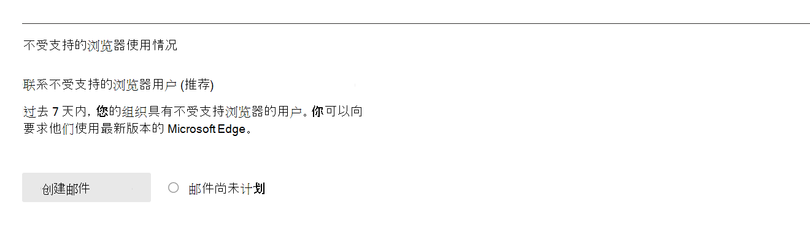

# Microsoft 365管理中心中的报告 - Microsoft 浏览器使用情况Microsoft 365 Reports in the admin center - Microsoft browser usage

"Microsoft 365 **报表**"仪表板显示组织中各产品的活动概述。The Microsoft 365 **Reports** dashboard shows you an activity overview across the products in your organization. 它使您能够深入了解各个产品级别报告，从而更细致地了解每个产品内的活动。It enables you to drill into individual product level reports to give you more granular insight about the activities within each product. 请查看[报表概述主题](activity-reports.md)。Check out [the Reports overview topic](activity-reports.md). 在 Microsoft 浏览器使用情况报告中，你可以深入了解Internet Explorer、Microsoft Edge 旧版和新的Microsoft Edge使用情况。In the Microsoft browser usage report, you can gain insights on Internet Explorer, Microsoft Edge Legacy, and new Microsoft Edge usage. 使用率报告基于Microsoft 365 Microsoft 浏览器访问的联机服务。Usage reporting is based on Microsoft 365 online services accessed by using a Microsoft browser.

 > [!NOTE]
 > 您必须是全局管理员、全局读取者或 Microsoft 365 或 Exchange、SharePoint 或 Skype for Business 管理员才能查看报告。You must be a global administrator, global reader or reports reader in Microsoft 365 or an Exchange, SharePoint, or Skype for Business administrator to see reports.

## 如何访问 Microsoft 浏览器使用情况报告How to get to the Microsoft browser usage report

1. 在管理中心，转到“**报表**”\> <a href="https://go.microsoft.com/fwlink/p/?linkid=2074756" target="_blank">使用情况</a>页面。In the admin center, go to the **Reports** \> <a href="https://go.microsoft.com/fwlink/p/?linkid=2074756" target="_blank">Usage</a> page. 
2. 在仪表板主页上，单击 Microsoft浏览器使用卡上的"查看更多"按钮。From the dashboard homepage, click on the **View more** button on the Microsoft browser usage card.

## 如何通知用户升级其浏览器How to notify users to upgrade their browser

全局管理员可以选择使用 Edge 旧版不支持的 ( (上的 Microsoft 365) 服务向用户Internet Explorer (，Internet Explorer (即将不受支持) 。Global admins can opt-in to sending messages to users using Microsoft 365 services on Edge Legacy (unsupported) and Internet Explorer (soon to be unsupported). 此目标消息通知用户，这些浏览器支持即将结束，并链接到包含有关 Microsoft Edge 的信息以及切换浏览器需要遵循的简单步骤的支持文章。This targeted message notifies users that support for these browsers will end soon, and it links to a support article with information on Microsoft Edge and simple steps to follow to switch browsers. 

您可以在报告页上找到此功能。You can find this feature on the report page. 创建邮件后，会以指定的频率通知用户，直到 2021 年 8 月 17 日。Once the message is created, users are notified at the frequency specified until August 17, 2021. 你随时可以关闭此功能以停止向用户发送通知。You can turn off this feature at any time to stop sending notifications to users. 若要再次开始发送通知，请重新启用该功能。To begin sending notifications again, turn the feature back on.

有关详细信息，请参阅Microsoft Edge[帮助&学习](https://support.microsoft.com/microsoft-edge)。For more information, see [Microsoft Edge help & learning](https://support.microsoft.com/microsoft-edge).

## 解释 Microsoft 浏览器使用情况报告Interpret the Microsoft browser usage report

|项目Item|说明Description|
 |:-----|:-----|
 |1.1.   |可查看 **Microsoft 浏览器使用情况** 报告，了解过去 7 天、30 天、90 天或 180 天的趋势。The **Microsoft browser usage** report can be viewed for trends over the last 7 days, 30 days, 90 days, or 180 days.    |
 |2.2.   |每个报告中的数据通常涵盖最近七天。The data in each report usually covers up to the last seven days.   |
 |3.3.   |"**每日活动用户** 数"图显示Microsoft Edge、Microsoft Edge 旧版Internet Explorer访问服务时Microsoft 365用户数。The **Daily active users** chart shows you the daily user count for Microsoft Edge, Microsoft Edge Legacy and Internet Explorer when used to access to Microsoft 365 services.   |
 |4.4. |"**活动用户**"图显示在选定时段内Microsoft Edge、Microsoft Edge 旧版 和 Internet Explorer 访问 Microsoft 365 服务的用户总数。The **Active Users** chart shows you the total number of users using Microsoft Edge, Microsoft Edge Legacy and Internet Explorer when used to access to Microsoft 365 services over the selected time period. |
 |5.5. |下表详细显示了每个用户的数据。可在表格中添加或删除列。  The table shows you a breakdown of data at the per-user level. You can add or remove columns from the table.   **Username** 是使用 Microsoft 浏览器连接到 Microsoft 365服务的用户的电子邮件地址。**Username** is the email address of the user who connected to Microsoft 365 services using Microsoft browsers.  **Used Microsoft Edge** 显示一个刻度线（如果用户Microsoft Edge连接到 Microsoft 365 服务）。**Used Microsoft Edge** shows a tick mark if the user used Microsoft Edge to connect to Microsoft 365 services.  **Used Microsoft Edge 旧版** 显示一个刻度线（如果用户Microsoft Edge 旧版连接到 Microsoft 365 服务）。**Used Microsoft Edge Legacy** shows a tick mark if the user used Microsoft Edge Legacy to connect to Microsoft 365 services.  **Used Internet Explorer** 显示一个刻度线（如果用户Internet Explorer连接到 Microsoft 365 服务）。**Used Internet Explorer** shows a tick mark if the user used Internet Explorer to connect to Microsoft 365 services. |
 |6.6. |选择" **选择列** "图标以在报表中添加或删除列。Select the **Choose columns** icon to add or remove columns from the report.|
 |7.7. |您还可以通过选择"导出"链接将报告数据导出到Excel .csv文件。 You can also export the report data into an Excel .csv file by selecting the **Export** link. 这将导出所有用户的数据，并使您能够执行简单的聚合、排序和筛选以进一步分析。This exports data for all users and enables you to do simple aggregation, sorting, and filtering for further analysis. 如果您的用户数少于 100，您可以在报表本身的表中进行排序和筛选。If you have less than 100 users, you can sort and filter within the table in the report itself. 如果用户数超过 100，则需要导出数据才能进行筛选和排序。If you have more than 100 users, in order to filter and sort, you will need to export the data.|
