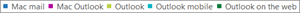
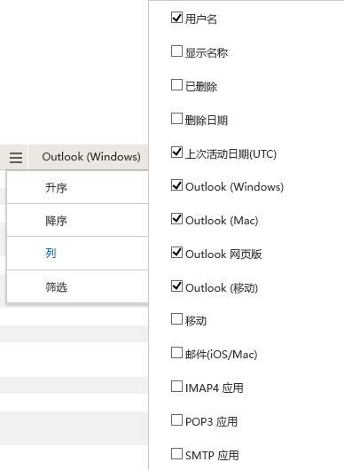

# 管理中心中的 Microsoft 365 报表-电子邮件应用程序使用情况Microsoft 365 Reports in the admin center - Email apps usage

Microsoft 365 " **报告** " 仪表板显示组织中各产品的活动概述。The Microsoft 365 **Reports** dashboard shows you the activity overview across the products in your organization. 它让你能够深入研究各产品级报表，以便更细致地了解每个产品内的活动。It enables you to drill in to individual product level reports to give you more granular insight about the activities within each product. 请查看[报表概述主题](activity-reports.md)。Check out [the Reports overview topic](activity-reports.md). 在电子邮件应用使用情况报告中，可以看到有多少电子邮件应用程序连接到 Exchange Online。In the email apps usage report, you can see how many email apps are connecting to Exchange Online. 还可以查看用户当前使用的 Outlook 应用的版本信息，这样便可跟进使用不受支持的版本安装支持版本的 Outlook 的用户。You can also see the version information of Outlook apps that users are using, which will allow you to follow up with those who are using unsupported versions to install supported versions of Outlook.
  
> [!NOTE]
> 您必须是 Microsoft 365 或 Exchange、SharePoint、团队服务、团队通信或 Skype for Business 管理员中的全局管理员、全局读取器或报告阅读器才能查看报告。You must be a global administrator, global reader or reports reader in Microsoft 365 or an Exchange, SharePoint, Teams Service, Teams Communications, or Skype for Business administrator to see reports.  
 
## 如何访问电子邮件应用报告How to get to the email apps report

1. 在管理中心，转到“**报表**”\> <a href="https://go.microsoft.com/fwlink/p/?linkid=2074756" target="_blank">使用情况</a>页面。In the admin center, go to the **Reports** \> <a href="https://go.microsoft.com/fwlink/p/?linkid=2074756" target="_blank">Usage</a> page.

    
2. 从 " **选择报告** " 下拉下，选择 " **Exchange** \> **电子邮件应用程序使用情况**"。From the **Select a report** drop-down, select **Exchange** \> **Email app usage**.
  
## 解释电子邮件应用程序报告Interpret the email apps report

可以通过查看 " **用户** " 和 " **客户端** " 图表来获取电子邮件应用活动的视图。You can get a view into email apps activity by looking at the **Users** and **Clients** charts. 
  

  
|ItemItem|说明Description|
|:-----|:-----|
|1.1.    |可以查看 " **电子邮件应用使用情况** " 报表，了解过去7天、30天、90天或180天的趋势。The **Email apps usage** report can be viewed for trends over the last 7 days, 30 days, 90 days, or 180 days. 但是，如果您在报告中选择某一天，则表 (7) 将显示从当前日期起的最长28天的数据 (而不是生成报告的日期) 。However, if you select a particular day in the report, the table (7) will show data for up to 28 days from the current date (not the date the report was generated).    |
|2.2.    |每个报告中的数据通常最长为过去24到48小时。The data in each report usually covers up to the last 24 to 48 hours.    |
|3.3.    |" **用户**"视图显示使用任意电子邮件应用连接到 Exchange Online 的独特用户数。The **Users** view shows you the number of unique users that connected to Exchange Online using any email app.    |
|4.4.    |" **应用**"视图显示选定时间段内各应用的不同用户数。The **Apps** view shows you the number of unique users by app over the selected time period.    |
|5.5.    |" **版本** " 视图显示 Windows 中每个版本的 Outlook 的唯一用户数。The **Versions** view shows you the number of unique users for each version of Outlook in Windows.    |
|6.6.    | 在" **用户**"图表中，Y 轴表示在报告时段内的任意一天连接到应用的独特用户总数。On the **Users** chart, the Y axis is the total count of unique users that connected to an app on any day of the reporting period.     在" **用户**"图表中，X 轴表示在报告时段内使用应用的独特用户数。On the **Users** chart, the X axis is number of unique users that used the app for that reporting period.     在" **应用**"图表中，Y 轴表示在报告时段内使用特定应用的不同用户总数。On the **Apps** chart, the Y axis is the total count of unique users who used a specific app during the reporting period.     在" **应用**"图表中，X 轴表示所在组织使用的应用列表。On the **Apps** chart, the X axis is the list of apps in your organization.     在" **版本**"图表中，Y 轴表示使用特定版本的 Outlook 桌面应用的独特用户总数。On the **Versions** chart, the Y axis is the total count of unique users using a specific version of Outlook desktop. 如果报表无法解析 Outlook 的版本号，则数量将显示为 "不 **确定**"。If the report can't resolve the version number of Outlook, the quantity will show as **Undetermined**.     在" **版本**"图表中，X 轴表示所在组织使用的应用列表。On the **Versions** chart, the X axis is the list of apps in your organization.    |
|7.7.    |您可以通过选择图例中的项目来筛选您在图表上看到的系列。You can filter the series you see on the chart by selecting an item in the legend. 例如，在 " **用户** " 图表上，选择 " **Mac 邮件** " 或 " **Outlook** Select the email client to get more reporting data on that client.](../../media/19b9da1b-7b69-4a04-8527-38349f859e84.png) 仅查看与各项相关的信息。to see only the info related to each one. 更改选择不会更改网格表中的信息。Changing this selection doesn't change the info in the grid table. Mac 邮件、Outlook for Mac、Outlook for Mac、Outlook mobile、Outlook 桌面和 Outlook 网页版都是您的组织中可能存在的电子邮件应用程序的示例。Mac mail, Outlook for Mac, Outlook mobile, Outlook desktop, and Outlook on the web are examples of email apps you may have in your organization.    |
|8.8.    | 添加所有项之后，才能在下表的列中看到这些项。You might not see all the items in the list below in the columns until you add them.  **Username** 是电子邮件应用所有者的名称。**Username** is the name of the email app's owner.    "**上次活动日期**" 是用户阅读或发送电子邮件的最晚日期。**Last activity date** is the latest date the user read or sent an email message.    " **Mac 邮件**"、" **Mac Outlook**"、" **Outlook**"、" **Outlook 移动版**"、" **Outlook 网页版**"是所在组织可能使用的电子邮件应用示例。**Mac mail**, **Mac Outlook** and **Outlook**, **Outlook mobile** and **Outlook on the web** are examples of email apps you may have in your organization.     如果组织的策略阻止你查看显示了可识别用户信息的报表，可更改所有这些报表的隐私设置。If your organization's policies prevents you from viewing reports where user information is identifiable, you can change the privacy setting for all these reports. 请查看[Microsoft 365 管理中心的活动报告](activity-reports.md)中的 "**如何隐藏用户级别详细信息？** " 一节。Check out the **How do I hide user level details?** section in the [Activity Reports in the Microsoft 365 admin center](activity-reports.md).    |
|9.9.    |选择 " **管理列** " 可在报表中添加或删除列。Select **Manage columns** to add or remove columns from the report.    |
|10.10.    |您还可以通过选择 " **导出** " 链接将报告数据导出到 Excel .csv 文件中。You can also export the report data into an Excel .csv file, by selecting the **Export** link. 此操作可导出所有用户的数据，使你能够对数据进行简单的排序和筛选，以进一步分析数据。This exports data of all users and enables you to do simple sorting and filtering for further analysis. 如果用户数量不足 2000，则可在报表中的表格内进行排序和筛选。If you have less than 2000 users, you can sort and filter within the table in the report itself. 如果用户数超过 2000，则需要导出数据才能进行排序和筛选。If you have more than 2000 users, in order to filter and sort, you will need to export the data.    |
|||
   
