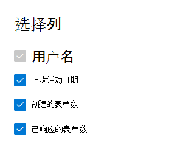

# Microsoft 365管理中心中的报表 - 表单活动

"Microsoft 365 **报表**"仪表板显示组织中各产品的活动概述。 让用户深入研究各产品级报表，以便更细致地了解每个产品内的活动。 请查看[报表概述主题](activity-reports.md)。
  
例如，可以通过查看每个授权使用 Microsoft Forms 的用户与表单的交互来了解他们的活动。 它还通过查看用户所回复的表单和表单的数量，帮助您了解进行协作的级别。
  
> [!NOTE]
> 您必须是 Microsoft 365 中的全局管理员、全局读取者或报告读者，或者 Exchange、SharePoint、Teams Service、Teams Communications 或 Skype for Business 管理员才能查看报告。  
 
## 如何访问 Forms 活动报表

1. 在管理中心，转到“**报表**”\> <a href="https://go.microsoft.com/fwlink/p/?linkid=2074756" target="_blank">使用情况</a>页面。 
2. 在仪表板主页上，单击窗体 **卡片上的** "查看更多"按钮。
  
## 解释窗体活动报表

You can view the activities in the Forms report by choosing the **Activity** tab. 

选择 **"选择要在** 报表中添加或删除列的列"。    

您还可以通过选择"导出"链接将报告数据导出到Excel .csv文件。  此操作可导出所有用户的数据，使你能够对数据进行简单的排序和筛选，以进一步分析数据。 如果用户数量不足 2000，则可在报表中的表格内进行排序和筛选。 如果用户数超过 2000，则需要导出数据才能进行排序和筛选。 
  
|项目|说明|
|:-----|:-----|
|**跃点数**|**定义**|
|用户名    |在 Microsoft Forms 上执行活动的用户的电子邮件地址。    |
|上次活动日期 (UTC)     |用户对所选日期范围执行表单活动的最新日期。 要查看指定日期发生的活动，请直接在图表中选择该日期。  这将筛选该表，以仅显示特定天执行活动的用户的文件活动数据。    |
|创建的表单数    |用户创建的表单数。     |
|已回复的表单数    |用户已提交回复的表单数量。|
|||
