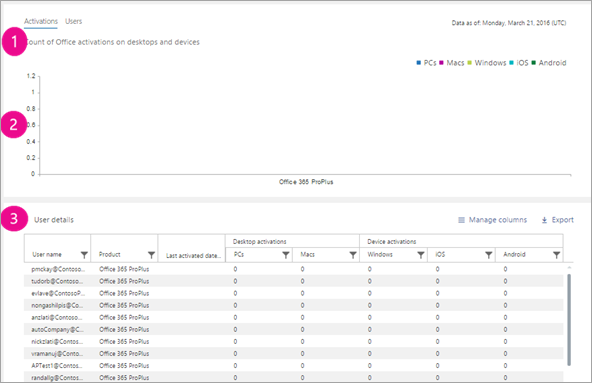

# 管理中心中的 Microsoft 365 报告 - Microsoft Office激活Microsoft 365 Reports in the admin center - Microsoft Office activations

Microsoft 365 **报表** 仪表板显示组织中产品的活动概述。The Microsoft 365 **Reports** dashboard shows you the activity overview across the products in your organization. 它让你能够深入研究各产品级报表，以便更细致地了解每个产品内的活动。It enables you to drill in to individual product level reports to give you more granular insight about the activities within each product. 请查看[报表概述主题](activity-reports.md)。Check out [the Reports overview topic](activity-reports.md).
  
Office 激活报表将显示在至少一个设备上激活了其 Office 订阅的用户。The Office Activation report gives you a view of which users have activated their Office subscription on at least one device. 它提供 Microsoft 365 企业应用版、Project 和 Visio Pro for Office 365 订阅激活的细目，以及跨桌面和设备激活的细分。It provides a breakdown of the Microsoft 365 Apps for enterprise, Project, and Visio Pro for Office 365 subscription activations, as well as the breakdown of activations across desktop and devices. 此报表对于帮助你识别可能需要更多帮助和支持才能激活其 Office 订阅的用户非常有用。This report could be useful in helping you identify users that might need additional help and support to activate their Office subscription.
  
> [!NOTE]
> 你必须是 Microsoft 365 中的全局管理员、全局读者或报告读者，或者是 Exchange、SharePoint、Teams 服务、Teams 通信或 Skype for Business 管理员才能查看报告。You must be a global administrator, global reader or reports reader in Microsoft 365 or an Exchange, SharePoint, Teams Service, Teams Communications, or Skype for Business administrator to see reports.  
  
## 如何使用 Office 激活报表How to get to the Office activations report

1. 在管理中心，转到“**报表**”\> <a href="https://admin.microsoft.com/Adminportal/Home?source=applauncher#/reportsUsage" target="_blank">使用情况</a>页面。In the admin center, go to the **Reports** \> <a href="https://admin.microsoft.com/Adminportal/Home?source=applauncher#/reportsUsage" target="_blank">Usage</a> page.

    
2. 从 **"选择报告"** 下拉列表中选择 **"Office 365** \> **激活"。**From the **Select a report** drop-down, select **Office 365** \> **Activations**. 
  
## 解读 Office 激活报表Interpret the Office activations report

可以通过查看" **激活**"和" **用户**"图表，了解组织的 Office 激活。You can get a view into your organization's Office activations by looking at the **Activations** and **Users** charts. 
  

  
|ItemItem|说明Description|
|:-----|:-----|
|11    |Office 激活报表提供自报表数据显示在图表右上角起，Office 许可证激活数据的当前状态。The Office Activations report presents the current state of the office license activations data [as of the date of the report presented on the top right of the chart].    |
|2 2    |每个报告中的数据通常涵盖过去 24 到 48 小时的数据。The data in each report usually covers up to the last 24 to 48 hours.    |
|3 3    |" **激活**"图表显示台式计算机和其他设备上的 Office 激活次数。The **Activations** chart shows you the count of Office activations on desktops and devices.    |
|4 4    |" **用户**"图表显示在台式计算机或其他设备上有权激活和已激活 Office 订阅的用户数。The **Users** chart shows you the count of users that are enabled, and users that have activated the Office subscription on desktop or devices..    |
|5 5    | 在" **激活**"图表上，Y 轴是 Office 激活次数。On the **Activations** chart, the Y axis is the count of Office activations.     在" **用户**"图表上，Y 轴是用户所执行的激活 Office 的操作。On the **Users** chart, the Y axis is the user's performing activity of activating Office.     这两个图表的 X 轴都表示此特定报表的所选日期范围。The X axis on both charts is the selected date range for this specific report.    |
|6 6    |通过选择图例中的项目，可以筛选所看到的图表。You can filter charts you see by selecting an item in the legend. 例如，在"激活"图表上，选择 **Windows OS、Mac** **OS、Windows** **10 移动** 版 **、iOS** 或 **Android，** 以仅查看与每个操作系统有关的信息。For example, on the **Activations** chart, select **Windows OS**, **Mac OS**, **Windows 10 mobile**, **iOS** or **Android** to see only the info related to each one. 更改选择不会更改网格表中的信息。Changing this selection doesn't change the info in the grid table.       |
|7 7    | 下表显示了用户级 Office 激活的详细介绍。这是所有用户及向其分配的 Office 产品的列表。你可以向表中添加其他列。  The table shows you a breakdown of Office activations at the user level. This is the list of all user's with the Office product assigned to them. You can add the additional columns to the table.      " **用户名**"是用户的电子邮件地址。**Username** is the email address of the user.    **显示姓名** 是用户的全名。**Display name** is the full name of the user.    **产品** 许可证是分配给此用户的产品。**Product licenses** is the products that are assigned to this user.    " **上次激活日期**"表示用户在台式计算机或其他设备上激活 Office 的日期。**Last activated date** refers to the date the user activated Office on a desktop or a device.    **如果用户通过** 共享计算机激活使用 Office，则使用共享计算机激活为 true。**Used Shared Computer Activation** is true if the user used Office through shared computer activation.   **Windows** 是指用户激活 Office 的 Windows 桌面的数量。**Windows** refers to the number of Windows desktops a user activated Office on.    **Mac** 是指用户激活 Office 的 Mac 桌面设备的数量。**Mac** refers to the number of Mac desktops a user activated Office on.    **Windows 10 移动** 版是指用户激活 Office 的 Windows 10 移动设备的数量。**Windows 10 mobile** refers to the number of Windows 10 mobile devices a user activated Office on.    **iOS** 是指用户激活 Office 的 iOS 设备的数量。**iOS** refers to the number of iOS devices a user activated Office on.    **Android** 是指用户激活 Office 的 Android 设备的数量。**Android** refers to the number of Android devices a user activated Office on.     如果组织的策略阻止你查看显示了可识别用户信息的报表，可更改所有这些报表的隐私设置。If your organization's policies prevents you from viewing reports where user information is identifiable, you can change the privacy setting for all these reports. 在 Microsoft  [365](activity-reports.md)管理中心的"活动报告"的"报告"部分中查看"隐藏用户详细信息"部分。Check out the **Hide user details in the reports** section in the [Activity Reports in the Microsoft 365 admin center](activity-reports.md).    |
|||
   

