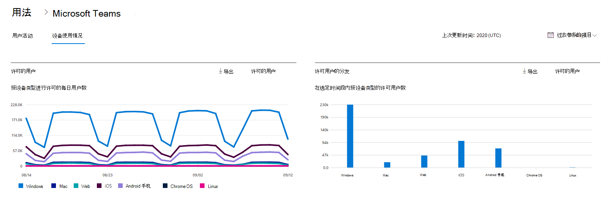
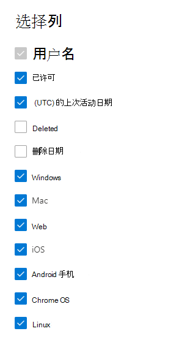

# Microsoft 365管理中心中的报表 - Microsoft Teams设备使用情况

Microsoft 365报表仪表板显示组织中各产品的活动概述。 它让你能够深入研究各产品级报表，以便更细致地了解每个产品内的活动。 请查看[报表概述主题](activity-reports.md)。 在 Microsoft Teams 应用使用情况报表中，可深入了解组织中使用的 Microsoft Teams 应用。
  
## 如何获取 Microsoft Teams 应用使用情况报表

1. 在管理中心，转到“**报表**”\> <a href="https://go.microsoft.com/fwlink/p/?linkid=2074756" target="_blank">使用情况</a>页面。 
2. 在仪表板主页上，单击Microsoft Teams活动卡上的 **“查看更多**”按钮。
  
## 解读 Microsoft Teams 应用使用情况报表

可以通过选择“设备使用情况”选项卡来查看Teams报表中的 **设备使用** 情况。 

选择 **要** 从报表中添加或删除列的列。    

还可以通过选择“**导** 出”链接将报表数据导出到Excel .csv文件中。 此操作可导出所有用户的数据，使你能够对数据进行简单的排序和筛选，以进一步分析数据。 如果用户数量不足 2000，则可在报表中的表格内进行排序和筛选。 如果用户数超过 2000，则需要导出数据才能进行排序和筛选。 

可查看" **Microsoft Teams 设备使用情况**"报表，了解过去 7 天、30 天、90 天或 180 天的趋势。 但是，如果在报表中选择特定日期，表将显示自当前日期（而不是生成报 (表) 日期）最多 28 天的数据。
  
|Item|说明|
|:-----|:-----|
|**跃点数**|**定义**|
|用户名    |用户的显示名称。    |
|Windows    |如果用户在基于Windows的计算机上的Teams桌面客户端中处于活动状态，则选中此选项。    |
|Mac    |如果用户在 macOS 计算机上的Teams桌面客户端中处于活动状态，则选中此选项。    |
|iOS    |如果用户在 iOS 的Teams移动客户端上处于活动状态，则选中此选项。    |
|Android 手机    | 如果用户在适用于 Android 的Teams移动客户端上处于活动状态，则选中此选项。    |
|Chrome OS    |如果用户在 ChromeOS 计算机上的Teams桌面客户端中处于活动状态，则选中此选项。|
|Linux    | 如果用户在 Linux 计算机上的Teams桌面客户端中处于活动状态，则选中此选项。    |
|Web    |如果用户在设备上的Teams Web 客户端中处于活动状态，则选择此选项。|
|上次活动日期 (UTC)     |用户参与Teams活动的最后一个日期 (UTC) 。    |
|已获得许可|如果用户获得使用Teams的许可，则选中此选项。|

## 另请参阅
[Microsoft Teams 用户活动报告](../activity-reports/microsoft-teams-user-activity-preview.md) 

[Microsoft Teams使用情况活动报告](../activity-reports/microsoft-teams-usage-activity.md) 
