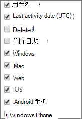

# Microsoft 365管理中心中的报告 - Microsoft Teams使用情况

"Microsoft 365报表"仪表板显示组织中各产品的活动概述。 它让你能够深入研究各产品级报表，以便更细致地了解每个产品内的活动。 请查看[报表概述主题](activity-reports.md)。 在 Microsoft Teams 应用使用情况报表中，可深入了解组织中使用的 Microsoft Teams 应用。
 
## 如何获取 Microsoft Teams 应用使用情况报表

1. 在管理中心，转到“**报表**”\> <a href="https://go.microsoft.com/fwlink/p/?linkid=2074756" target="_blank">使用情况</a>页面。

    
2. 从 **"选择报告"** 下拉列表中，选择 **"Microsoft Teams** \> **设备使用情况"。**
  
## 解读 Microsoft Teams 应用使用情况报表

通过查看" **用户**"和" **分布**"图表，可了解 Microsoft Teams 应用使用情况。 
  

  
|Item|说明|
|:-----|:-----|
|1.    |可查看" **Microsoft Teams 设备使用情况**"报表，了解过去 7 天、30 天、90 天或 180 天的趋势。 但是，如果您选择报告中的特定日期，则表 (7) 将显示自当前日期起最多 28 天的数据 (而不是报告生成日期) 。    |
|2.    |每个报告中的数据通常涵盖过去 24 至 48 小时的数据。    |
|3.    |" **用户**"视图显示各应用的每日不同用户数。    |
|4.    |" **分布**"视图显示选定时间段内各应用的不同用户数。    |
|5.    | 在" **用户**"图表上，Y 轴表示每个应用的用户数。     在" **分布**"图表上，Y 轴表示使用特定应用的用户数。     图表的 X 轴都表示为此特定报表选定的日期范围。    |
|6.    |通过选择图例中的项目，可以筛选在图表上看到的系列。 例如，在"用户"图表上，**选择**"Windows、Mac、**通话****、Web、Android****手机****或 Windows 手机**"，以便仅查看与每一个手机有关的信息。  更改选择不会更改网格表中的信息。    |
|7.    | 显示的组列表由最大（180 天）报表时间范围内存在的（未删除）所有组确定。活动计数会因日期选择不同而有所变化。    注意：在添加以下列表中的所有项目之前，可能不会在列中看到这些项目。  " **用户名**"是用户的电子邮件地址。 可以显示实际的电子邮件地址或采用匿名字段。    " **上次活动日期 (UTC)**"表示用户通过应用参与 Microsoft Teams 活动的最近日期。    " **已删除**"指示团队是否已被删除。如果团队被删除，但在报告时段中有活动，则将显示在"已删除"设置为 true 的网格中。    " **删除日期**"是指删除团队的日期。    " **Windows**"将被选中，前提是指定时间段内用户在 Windows 应用中处于活动状态。    " **Mac**"将被选中，前提是指定时间段内用户在 Mac 应用中处于活动状态。    " **Web**"将被选中，前提是指定时间段内用户在 Web 应用中处于活动状态。    " **iOS**"将被选中，前提是指定时间段内用户在 iOS 应用中处于活动状态。    " **Android 手机**"将被选中，前提是指定时间段内用户在 Android 手机应用中处于活动状态。    " **Windows 手机**"将被选中，前提是指定时间段内用户在 Windows Phone 应用中处于活动状态。     如果组织的策略阻止你查看显示了可识别用户信息的报表，可更改所有这些报表的隐私设置。 请查看活动报告中的如何 **隐藏用户级别详细信息Microsoft 365 管理中心。**     |
|8.    |选择 **"列** "以在报表中添加或删除列。    |
|9.    |您还可以通过选择"导出"链接将报告数据导出到Excel .csv文件。  此操作可导出所有用户的数据，使你能够对数据进行简单的排序和筛选，以进一步分析数据。 如果用户数量不足 2000，则可在报表中的表格内进行排序和筛选。 如果用户数超过 2000，则需要导出数据才能进行排序和筛选。    |
|||
   
  

