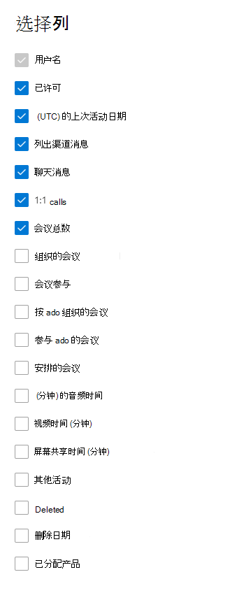

# Microsoft 团队用户活动中的 microsoft 365 报告

Microsoft 365 " **报告** " 仪表板显示组织中各产品的活动概述。 它让你能够深入研究各产品级报表，以便更细致地了解每个产品内的活动。 请查看[报表概述主题](activity-reports.md)。 在 Microsoft Teams 用户活动报表中，可深入了解组织中的 Microsoft Teams 活动。
  
> [!NOTE]
> 您必须是 Microsoft 365 或 Exchange、SharePoint、团队服务、团队通信或 Skype for Business 管理员中的全局管理员、全局读取器或报告阅读器才能查看报告。  
 
## 如何获取 Microsoft Teams 用户活动报表

1. 在管理中心，转到“**报表**”\> <a href="https://go.microsoft.com/fwlink/p/?linkid=2074756" target="_blank">使用情况</a>页面。
2. 在仪表板主页中，单击 Microsoft 团队活动卡片上的 " **查看更多** " 按钮。
  
## 解读 Microsoft Teams 用户活动报表

您可以通过选择 " **用户活动** " 选项卡来查看团队报告中的用户活动。  

选择 " **选择列** " 可在报告中添加或删除列。    

您还可以通过选择 " **导出** " 链接将报告数据导出到 Excel .csv 文件中。 此操作可导出所有用户的数据，使你能够对数据进行简单的排序和筛选，以进一步分析数据。 如果用户数量不足 2000，则可在报表中的表格内进行排序和筛选。 如果用户数超过 2000，则需要导出数据才能进行排序和筛选。 **音频时间**、**视频时间**和**屏幕共享时间**的导出格式遵循 ISO8601 日期格式。

|Item|说明|
|:-----|:-----|
|**跃点数**|**定义**|
|用户名    |用户的电子邮件地址。 可以显示实际的电子邮件地址或采用匿名字段。     |
|通道邮件     |在指定时间段内用户在团队聊天中发布的唯一消息数。    |
|聊天消息     |在指定时间段内，用户在私人聊天中发布的唯一邮件数。    |
|会议总数     |用户在指定时间段内参与的联机会议的数量。    |
|1:1 调用     | 用户在指定时间段内参与的1:1 呼叫数。    |
| (UTC) 的上次活动日期    |用户参与 Microsoft 团队活动的最后日期。  |
|会议是临时参与的     | 在指定时间段内用户参与的日历上未计划的会议数。    |
|以即席方式组织的会议   |在指定时间段内，用户组织的日历上未计划的会议数。  |
|安排的会议    |用户在指定时间段内组织的已安排会议数。    |
|已许可 |如果用户已被授权使用团队，则选择此选项。|
|其他活动|用户被视为处于活动状态，但其值为零：聊天消息、1:1 呼叫、频道消息、会议总数和会议组织的指标值。 示例操作是当用户打开频道消息 post 但不进行回复，或者当收到专用邮件且未响应时，将对其进行读取。 |
|||