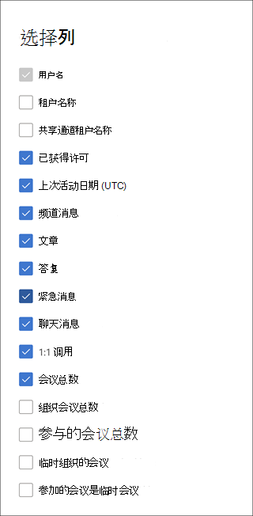

# 管理中心中的 Microsoft 365 报表 - Microsoft Teams 用户活动

Microsoft 365报表仪表板显示组织中各产品的活动概述。 它让你能够深入研究各产品级报表，以便更细致地了解每个产品内的活动。 请查看[报表概述主题](activity-reports.md)。 在 Microsoft Teams 用户活动报表中，可深入了解组织中的 Microsoft Teams 活动。
 
## 如何获取 Microsoft Teams 用户活动报表

1. 在管理中心，转到“**报表**”\> <a href="https://go.microsoft.com/fwlink/p/?linkid=2074756" target="_blank">使用情况</a>页面。
2. 在仪表板主页上，单击Microsoft Teams活动卡上的 **“查看更多**”按钮。

## 解读 Microsoft Teams 用户活动报表

可以通过选择“用户活动”选项卡来查看Teams报表中的 **用户活动**。  

选择 **要** 从报表中添加或删除列的列。    

还可以通过选择“**导** 出”链接将报表数据导出到Excel .csv文件中。 此操作可导出所有用户的数据，使你能够对数据进行简单的排序和筛选，以进一步分析数据。 如果用户数量不足 2000，则可在报表中的表格内进行排序和筛选。 如果用户数超过 2000，则需要导出数据才能进行排序和筛选。 **音频时间**、**视频时间** 和 **屏幕共享时间** 的导出格式遵循 ISO8601 持续时间格式。

可查看" **Microsoft Teams 用户活动**"报表，了解过去 7 天、30 天、90 天或 180 天的趋势。 但是，如果在报表中选择特定日期，表将显示自当前日期（而不是生成报 (表) 日期）最多 28 天的数据。

为了确保数据质量，我们执行过去三天的每日数据验证检查，并将填补检测到的任何空白。 在此过程中，你可能会注意到历史数据的差异。

|Item|说明|
|:-----|:-----|
|**跃点数**|**定义**|
|用户名    |用户的电子邮件地址。 可以显示实际的电子邮件地址或采用匿名字段。     |
|租户名称    |用户所属的内部或外部租户的名称。       如果用户属于外部租户，则根据用户在管理员租户的共享通道中的交互计算相应的数据指标 (例如，发布消息、回复消息等) 。 对于给定租户的管理员使用情况报告，不考虑用户在其自己的租户 (在给定租户) 的共享通道之外进行的交互。  |
|共享通道租户名称     |用户参与的共享通道的内部或外部租户的名称。     |
|频道消息     |用户在指定时间段内在团队聊天中发布的唯一消息数。    |
|帖子     |指定时间段内所有通道中的帖子邮件数   |
|回复     |指定时间段内所有通道中的回复消息数。   |
|紧急消息      |指定时间段内的紧急消息数。   |
|聊天消息     |用户在指定时间段内在私人聊天中发布的唯一消息数。    |
|会议总数     |用户在指定时间段内参与的联机会议数。    |
|1：1 呼叫     | 用户在指定时间段内参与的 1：1 呼叫数。    |
|上次活动日期 (UTC)     |用户参与Microsoft Teams活动的最后一个日期。  |
|参加的会议是临时会议     | 用户在指定时间段内参与的临时会议数。    |
|临时组织的会议   |用户在指定时间段内组织的临时会议数。  |
|组织会议总数    |用户在指定时间段内组织的一次性计划会议、定期会议、临时会议和未分类会议的总和。    |
|参与的会议总数    |用户在指定时间段内参与的一次性计划会议、定期会议、临时会议和未分类会议的总和。    |
|安排的会议安排一次性    |用户在指定时间段内组织的一次性计划会议数。    |
|组织计划的定期会议    |用户在指定时间段内组织的定期会议数。    |
|会议参与计划一次性    |用户在指定时间段内参与的一次性计划会议数。    |
|参加的会议定期安排    |用户在指定时间段内参与的定期会议数。    |
|已获得许可    |如果用户获得使用Teams的许可，则选中此选项。  |
|其他活动   |用户处于活动状态，但已执行其他活动，而不是在报表中提供的公开操作类型， (发送或答复频道消息和聊天消息、安排或参与 1：1 呼叫和会议) 。 示例操作是当用户更改Teams状态或Teams状态消息或打开频道消息帖子但不回复时。   |
|未分类的会议  |不能归类为计划或定期或临时的。 这些数据数量不足，并且由于遥测信息被篡改而无法识别。 |

## 使用户特定的数据匿名

若要使Teams用户活动报表中的数据匿名，必须是全局管理员。 这会使用 MD5 哈希) （例如报表中的显示名称、电子邮件和Azure Active Directory对象 ID 及其导出）隐藏 (可识别信息。

1. 在Microsoft 365 管理中心中，转到 **设置** > **Org 设置**，然后在 **“服务”** 选项卡下选择 **“报表**”。

2. 选择 **“报** 表”，然后选择 **“显示匿名标识符**”。 此设置同时应用于Microsoft 365 管理中心和Teams管理中心的使用情况报告。

3. 选择“**保存更改**”。

## 另请参阅
[Microsoft Teams 设备使用情况报告](../activity-reports/microsoft-teams-device-usage-preview.md)

[Microsoft Teams使用情况活动报告](../activity-reports/microsoft-teams-usage-activity.md) 
