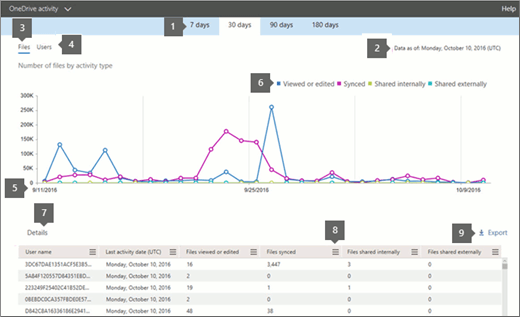

# 管理员中心的 Microsoft 365 报告-OneDrive for Business 活动Microsoft 365 Reports in the admin center - OneDrive for Business activity

Microsoft 365 "**报告**" 仪表板显示组织中各产品的活动概述。The Microsoft 365 **Reports** dashboard shows you the activity overview across the products in your organization. 让用户深入研究各产品级报表，以便更细致地了解每个产品内的活动。It lets you drill in to individual product level reports to give you more granular insight about the activities within each product. 请查看[报表概述主题](activity-reports.md)。Check out [the Reports overview topic](activity-reports.md).
  
例如，可通过查看有权使用 OneDrive 的用户与 OneDrive 上文件之间的交互情况，了解每个用户的活动。用户还可使用它查看共享的文件数，从而了解正在进行的协作的级别。For example, you can understand the activity of every user licensed to use OneDrive by looking at their interaction with files on OneDrive. It also helps you to understand the level of collaboration going on by looking at the number of files shared.
  
> [!NOTE]
> 将逐步引进一些功能。这意味着你可能不会看到此功能，或者此功能可能看起来不同于帮助文章中的描述。不用担心 - 它们即将推出！Some functionality is introduced gradually. This means that you may not yet see this feature or it may look different than what is described in the help articles. But don't worry - it's coming soon! 
  
如果想要了解每个 OneDrive 帐户中正在进行的活动量和存储使用情况，可以查看 [OneDrive 使用情况报表](onedrive-for-business-usage.md)If you want to understand the amount of activity happening against each OneDrive account and the storage utilization, you can view the [OneDrive usage report](onedrive-for-business-usage.md).
  
> [!NOTE]
> 您必须是 Microsoft 365 或 Exchange、SharePoint、团队服务、团队通信或 Skype for Business 管理员中的全局管理员、全局读取器或报告阅读器才能查看报告。You must be a global administrator, global reader or reports reader in Microsoft 365 or an Exchange, SharePoint, Teams Service, Teams Communications, or Skype for Business administrator to see reports.  
 
## 如何获取 OneDrive 活动报表？How do I get to the OneDrive Activity report?

1. 在管理中心，转到“**报表**”\> <a href="https://go.microsoft.com/fwlink/p/?linkid=2074756" target="_blank">使用情况</a>页面。In the admin center, go to the **Reports** \> <a href="https://go.microsoft.com/fwlink/p/?linkid=2074756" target="_blank">Usage</a> page.

    
2. 从 "**选择报告**" 下拉下，选择 " **OneDrive** \> **活动**"。From the **Select a report** drop-down, select **OneDrive** \> **Activity**.
  
## 解读 OneDrive for Business 活动报表Interpret the OneDrive for Business activity report

可通过查看" **文件** "和" **用户** "视图获取有关 OneDrive for Business 活动的信息。You can get a view into OneDrive for Business activity by looking at the **Files** and **Users** views. 
  

  
|||
|:-----|:-----|
|1.1.    |可查看" **OneDrive for Business 使用情况**"报表以了解过去 7 天、30 天、90 天或 180 天的趋势。The **OneDrive for Business activity** report can be viewed for trends over the last 7 days, 30 days, 90 days, or 180 days. 但是，如果您在报告中选择某一天，该表（7）将显示从当前日期起的最长28天的数据（而不是报告生成的日期）。However, if you select a particular day in the report, the table (7) will show data for up to 28 days from the current date (not the date the report was generated).    |
|2.2.    |每个报告中的数据通常最长为过去24到48小时。The data in each report usually covers up to the last 24 to 48 hours.  |
|3.3.    |" **文件**"视图可帮助了解针对任意 OneDrive 帐户执行了文件交互的已授权用户的唯一编号。The **Files** view helps you to understand the unique number of licensed users that performed file interactions against any OneDrive account.    |
|4.4.    |" **用户**"视图可帮助了解活跃 OneDrive 用户数的变化趋势。如果用户在特定期间执行了文件活动（如保存、同步、修改或共享），则视该用户为活跃用户。  The **Users** view helps you to understand the trend in the number of active OneDrive users. A user is considered active if he or she has executed a file activity (save, sync, modify, or share) within the specified time period.    注意：一个文件活动可能会对单个文件发生多次，但只会计为一个活动文件。NOTE: A file activity can occur multiple times for a single file, but will only count as one active file. 例如，用户可在指定期间多次保存和同步同一文件，但在数据中此文件仅计为一个活跃文件和一个同步文件。For example, you can save and sync the same file multiple times over a specified time period, but it will only count as one single active file and one single synced file in the data.           |
|5.5.    | 在" **文件**"图表中，Y 轴表示用户保存、同步、修改或共享过的唯一文件数。On the **Files** chart, the Y axis is the number of unique files that any user either saved, synced, modified, or shared.     在" **用户**"图表中，Y 轴表示在任意 OneDrive 帐户上执行文件交互（保存、同步、修改或共享）的唯一用户数。On the **Users** chart, the Y axis is the number of unique users that performed file interactions (save, sync, modify, or share) on any OneDrive account.     所有图表的 X 轴都表示为此特定报表选定的日期范围。The X axis on all charts is the selected date range for this specific report.    |
|6.6.    |您可以通过选择图例中的项目来筛选您在图表上看到的系列。You can filter the series you see on the chart by selecting an item in the legend. 例如，在 "**文件**" 图表上，选择 "**查看或编辑**或**同步**" 以仅查看与每个相关的信息。For example, on the **Files** chart, select **Viewed or edited** or **Synced** to see only the information related to each one. 更改选择不会更改网格表中的信息。Changing this selection doesn't change the information in the grid table.    |
|7.7.    | 下表详细显示了每个用户的数据。The table shows you a breakdown of data at the per-user level. 可在表格中添加或删除列。You can add or remove columns from the table.      **Username**是 OneDrive 帐户所有者的用户名。**Username** is the user name of the owner of the OneDrive account.    " **上次活动日期 (UTC)**"表示选定日期范围内在 OneDrive 帐户上最近执行文件活动的日期。若要查看特定日期发生的活动，请直接在图表中选择该日期。  **Last activity date (UTC)** is the latest date a file activity was performed on the OneDrive account for the selected date range. To see activity that occurred on a specific date, select the date directly in the chart.         此操作将筛选表，以便仅为在特定日期执行活动的用户显示文件活动数据。This will filter the table to display file activity data only for users who performed the activity on that specific day.    " **已查看或已编辑文件数** "表示用户上传、下载、修改或查看的文件数。**Files viewed or edited** is the number of files that the user uploaded, downloaded, modified, or viewed.    " **已同步文件数**"表示已从用户本地设备同步到 OneDrive 帐户的文件数。**Files synced** is the number of files that have been synced from a user's local device to the OneDrive account.    **内部共享文件**是指与组织内的用户或组中的用户共享的文件数（可能包含外部用户）。**Files shared internally** is the number of files that have been shared with users within the organization, or with users within groups (that might include external users).    " **外部共享文件数**"表示与组织外用户共享的文件数。**Files shared externally** is the number of files that have been shared with users outside of the organization.    " **已删除**"表示用户许可证已删除。**Deleted** indicates that the user's license was removed.    注意：只要已删除用户的活动在所选时间段的某一时刻获得许可，该用户的活动仍将显示在报告中。NOTE: Activity for a deleted user will still display in a report as long as he or she was licensed at some time during the selected time period. " **已删除** "列有助于提示你，用户可能不再活跃，但其活动已计入报表数据。The **Deleted** column helps you to note that the user may no longer be active, but contributed to the data in the report. " **删除日期**"表示用户许可证删除的日期。**Deleted date** is the date on which the user's license was removed.    **已分配的产品**是授权给用户的 Microsoft 365 产品。**Product assigned** are the Microsoft 365 products that are licensed to the user.     如果组织的策略阻止你查看可识别其中用户信息的报表，你可以更改所有这些报表的隐私设置。If your organization's policies prevent you from viewing reports where user information is identifiable, you can change the privacy setting for all these reports. 请查看[Microsoft 365 管理中心的活动报告](activity-reports.md)中的 "**如何隐藏用户级别详细信息？** " 一节。Check out the **How do I hide user level details?** section in the [Activity Reports in the Microsoft 365 admin center](activity-reports.md).    |
|8.8.    |选择 "**管理列**" 图标  以在报告中添加或删除列。Select the **Manage columns** icon  to add or remove columns from the report.    |
|9.9.    |您还可以通过选择 "**导出**" 链接将报告数据导出到 Excel .csv 文件中。You can also export the report data into an Excel .csv file, by selecting the **Export** link. 此操作可导出所有用户的数据，使你能够对数据进行简单的排序和筛选，以进一步分析数据。This exports data of all users and enables you to do simple sorting and filtering for further analysis. 如果用户数量不足 2000，则可在报表中的表格内进行排序和筛选。If you have less than 2000 users, you can sort and filter within the table in the report itself. 如果用户数超过 2000，则需要导出数据才能进行排序和筛选。If you have more than 2000 users, in order to filter and sort, you will need to export the data.    |
|||
   

