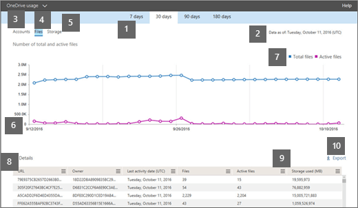

# 管理员中心的 Microsoft 365 报告-OneDrive for business 使用率Microsoft 365 Reports in the admin center - OneDrive for Business usage

Microsoft 365 "**报告**" 仪表板显示组织中各产品的活动概述。The Microsoft 365 **Reports** dashboard shows you the activity overview across the products in your organization. 它让你能够深入研究各产品级报表，以便更细致地了解每个产品内的活动。It enables you to drill in to individual product level reports to give you more granular insight about the activities within each product. 请查看[报表概述主题](activity-reports.md)。Check out [the Reports overview topic](activity-reports.md).
  
例如，仪表板上的 OneDrive 卡提供从 OneDrive for Business 中获取的值的高级视图，可显示组织中所有文件总数和所用存储。可深入研究，了解活跃 OneDrive 帐户的趋势、用户与之交互的文件数，以及使用的存储量。它还提供每个用户的 OneDrive 的详细信息。For example, the OneDrive card on the dashboard gives you a high-level view of the value you are getting from OneDrive for Business in terms of the total number of files and storage used across your organization. You can then drill into it to understand the trends of active OneDrive accounts, how many files are users interacting with as well as the storage used. It also gives you details for each user's OneDrive.
  
> [!NOTE]
> 您必须是 Microsoft 365 或 Exchange、SharePoint、团队服务、团队通信或 Skype for Business 管理员中的全局管理员、全局读取器或报告阅读器才能查看报告。You must be a global administrator, global reader or reports reader in Microsoft 365 or an Exchange, SharePoint, Teams Service, Teams Communications, or Skype for Business administrator to see reports.  
 
## 如何获取 OneDrive 使用情况报表？How do I get to the OneDrive Usage Report?

1. 在管理中心，转到“**报表**”\> <a href="https://go.microsoft.com/fwlink/p/?linkid=2074756" target="_blank">使用情况</a>页面。In the admin center, go to the **Reports** \> <a href="https://go.microsoft.com/fwlink/p/?linkid=2074756" target="_blank">Usage</a> page.

    
2. 从 "**选择报告**" 下拉下，选择 " **OneDrive** \> **使用情况**"。From the **Select a report** drop-down, select **OneDrive** \> **Usage**. 
  
## OneDrive 使用情况报表说明Interpret the OneDrive usage report

可以通过查看" **帐户** "、" **文件** "和" **存储空间** "视图来了解 OneDrive for Business 使用情况。You can get a view into OneDrive for Business usage by looking at the **Accounts**, **Files**, and **Storage** views. 
  

  
|||
|:-----|:-----|
|1.1.    |" **OneDrive 使用情况**"报表显示过去 7 天、30 天、90 天或 180 天的变化趋势。The **OneDrive usage** report shows trends over the last 7 days, 30 days, 90 days, or 180 days. 但是，如果您在报告中选择某一天，该表（7）将显示从当前日期起的最长28天的数据（而不是报告生成的日期）。However, if you select a particular day in the report, the table (7) will show data for up to 28 days from the current date (not the date the report was generated).    |
|2.2.    |每个报告中的数据通常最长为过去24到48小时。The data in each report usually covers up to the last 24 to 48 hours.  |
|3.3.    |" **帐户**"视图显示 OneDrive 总帐户和活跃帐户数的变化趋势。"活跃帐户"指其中用户会查看、修改、上传、下载、共享或同步文件。  The **Accounts** view shows the trend in the number of total and active OneDrive accounts. "Active accounts" are any in which users view, modify, upload, download, share, or sync files.    |
|4.4.    |" **文件**"视图显示总文件数和活跃文件数。在指定时间内，如果存储、同步、修改或共享了文件，则该文件被视为活跃文件。  The **Files** view shows the number of number of total and active files. A file is considered active if it has been saved, synced, modified or shared within the specific time period.    注意：一个文件活动可能会发生多次，但只计为一个活动文件。NOTE: A file activity can occur multiple times for a single file, but will count only as one active file. 例如，用户可在指定期间多次保存和同步同一文件，但在数据中此文件仅计为一个活跃文件和一个同步文件。For example, you can save and sync the same file multiple times over a specified time period, but it will count only as one single active file and one single synced file in the data.           |
|5.5.    |" **存储空间**"视图将显示使用中的 OneDrive 的存储空间量的变化趋势。The **Storage** view shows the trend in the amount of OneDrive storage you're using.    > 注意：此大小包括与文件关联的任何版本和元数据。> NOTE: The size includes any versions and metadata associated with the files.           |
|6.6.    | 在" **帐户**"图表上，Y 轴表示 OneDrive 帐户数。On the **Accounts** chart, the Y axis is the number of OneDrive accounts.     在" **文件**"图表上，Y 轴表示 OneDrive 中存储的文件数。On the **Files** chart, the Y axis is the number of files stored in OneDrive.     在" **存储空间**"图表上，Y 轴表示已使用的 OneDrive 存储空间量。On the **Storage** chart, the Y axis is the amount of OneDrive storage used.     所有图表的 X 轴都表示此特定报表的所选日期范围。The X axis on all charts is the selected date range for this specific report.    |
|7.7.    |您可以通过选择图例中的项目来筛选您在图表上看到的系列。You can filter the series you see on the chart by selecting an item in the legend. 例如，在 "**文件**" 图表上，选择 "**文件总数**" 或 "**活动文件**数"。For example, on the **Files** chart, select **Total files** or **Active files**. 在 "**帐户**" 图表上，选择 "**帐户总数**" 或 "**活动帐户**"。On the **Accounts** chart, select **Total accounts** or **Active accounts**. 或在 "**存储**" 图表上，选择 "**使用的存储**"。Or on the **Storage** chart, select **Storage used**. 更改此选项不会更改表格中的信息。Changing your selection doesn't change the information in the table.    |
|8.8.    | 该表显示每个用户的 OneDrive 数据细目。如需在表格中显示，需为用户分配包含 OneDrive 的产品许可证，并将 SharePoint Online 设置为开。用户还需登录到 OneDrive 同步客户端，或者使用 web 浏览器访问其 OneDrive。  The table shows you a breakdown of data for each user's OneDrive. To appear in the table, a user needs to have been assigned a product license that includes OneDrive, and they need to have SharePoint Online turned on. The user also needed to either sign in to the OneDrive sync client, or browse to their OneDrive using a web browser.     如果 OneDrive 已有文件活动，则该帐户具有执行文件活动的最新日期。表中行根据" **上次活动日期**"排序，因此具有最新文件活动的 OneDrive 会显示在列表顶部。  If the OneDrive has had file activity, it will have the latest date that the file activity was performed. The rows in the table are sorted by **Last activity date** so the OneDrive with the most recent file activity appears at the top of the list.     可以添加或删除表中的列。You can add or remove columns from the table.        **URL**是用户的 OneDrive 的 web 地址。**URL** is the web address for the user's OneDrive.    " **已删除**"是 OneDrive 的删除状态。需要至少 7 天时间，帐户才会被标记为"已删除"。  **Deleted** is the deletion status of the OneDrive. It takes at least 7 days for accounts to be marked as deleted.    " **所有者**"表示 OneDrive 的主要管理员的用户名。**Owner** is the username of the primary administrator of the OneDrive.    **所有者主体名称**是 OneDrive 所有者的电子邮件地址。**Owner principal name** is the email address of the owner of the OneDrive.    " **上次活动日期 (UTC)**" 表示 OneDrive 中最近执行的文件活动日期。如果 OneDrive 不曾有文件活动，其值将为空。  **Last activity date (UTC)** is the latest date a file activity was performed in the OneDrive. If the OneDrive has had no file activity, the value will be blank.    " **文件**"表示 OneDrive 中的文件数。**Files** is the number of files in the OneDrive.    " **活跃文件**"表示一段时间内的活跃文件数。在选定时间内如果存储、同步、修改或共享了文件，则该文件被视为活跃文件。  **Active files** is the number of active files within the time period. A file is considered active if it has been saved, synced, modified or shared within the selected time period.    注意：一个文件活动可能会发生多次，但只计为一个活动文件。NOTE: A file activity can occur multiple times for a single file, but will count only as one active file. 例如，用户可在指定期间多次保存和同步同一文件，但在数据中此文件仅计为一个活跃文件和一个同步文件。For example, you can save and sync the same file multiple times over a specified time period, but it will count only as one single active file and one single synced file in the data. >  如果在指定期间删除了报表上的文件，则报表中显示的活跃文件数可能会超过 OneDrive 中的当前文件数。>  If files were removed during the specified time period for the report, the number of active files shown in the report may be larger than the current number of files in the OneDrive. >  删除的用户会继续显示在报表中，为期 180 天。>  Deleted users will continue to appear in reports for 180 days. " **已使用的存储 (MB)**"表示 OneDrive 使用的存储量大小，以 MB 计算。**Storage used (MB)** is the amount of storage the OneDrive uses in MB. 这包括与文件关联的任何版本和元数据。This includes any versions and metadata associated with the files.     如果组织的策略阻止你查看可识别其中用户信息的报表，你可以更改所有这些报表的隐私设置。If your organization's policies prevent you from viewing reports where user information is identifiable, you can change the privacy setting for all these reports. 请参阅[Microsoft 365 管理中心预览版中的活动报告](activity-reports.md)中的 "**如何隐藏用户级别详细信息？** " 一节。Check out the **How do I hide user level details?** section in the [Activity Reports in the Microsoft 365 admin center Preview](activity-reports.md).    |
|9.9.    |选择 "**管理列**" 图标  以在报告中添加或删除列。Select the **Manage columns** icon  to add or remove columns from the report.    |
|10.10.    |您还可以通过选择 "**导出**" 链接将报告数据导出到 Excel .csv 文件中。You can also export the report data into an Excel .csv file, by selecting the **Export** link. 此操作可导出每个 OneDrive 的日期，可方便用户进行简单的排序和筛选，以执行进一步分析。This exports the date for each OneDrive and allows you to do simple sorting and filtering for further analysis. 如果 OneDrive 帐户数量不足 2000，则可在报表中的表格内进行排序和筛选。If you have less than 2000 OneDrive accounts, you can sort and filter within the table in the report itself. 如果 OneDrive 帐户数量超过 2000，则需要导出数据才能进行筛选和排序。If you have more than 2000 OneDrive accounts, you need to export the data to filter and sort.    注意：将数据导出到 Excel 文件时，请注意，生成内容报告的日期会反映在 "**数据的**依据" 列中的文件中。NOTE: When the data is exported to an Excel file, note that the date the content report was generated is reflected in the file in the **Data as of** column.    |
|||
   

