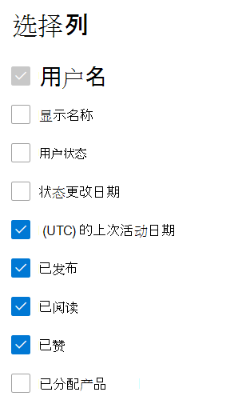

# Microsoft 365管理中心中的报表 - Yammer活动报告

作为Microsoft 365管理员，"报告"仪表板将显示有关组织中产品使用情况的数据。 查看 [管理中心中的活动报告](activity-reports.md)。 使用" **Yammer 活动报表** "，可以通过查看使用 Yammer 发布、点赞或阅读消息的唯一用户数以及组织中生成的活动数来了解使用 Yammer 的组织的参与级别。 
  
> [!NOTE]
> 您必须是 Microsoft 365 中的全局管理员、全局读取者或报告读者，或者 Exchange、SharePoint、Teams Service、Teams Communications 或 Skype for Business 管理员才能查看报告。  
 
## 如何访问活动Yammer报告？

1. 在管理中心，转到“**报表**”\> <a href="https://go.microsoft.com/fwlink/p/?linkid=2074756" target="_blank">使用情况</a>页面。 
2. 在仪表板主页上，单击"浏览 **"** 卡片上的"查看更多Yammer按钮。

  
## Yammer 活动报表说明

You can view the activities in the Yammer by choosing the **Activity** tab. 

选择 **"选择要在** 报表中添加或删除列的列"。    

您还可以通过选择"导出"链接将报告数据导出到Excel .csv文件。  此操作可导出所有用户的数据，使你能够对数据进行简单的排序和筛选，以进一步分析数据。 如果用户数量不足 2000，则可在报表中的表格内进行排序和筛选。 如果用户数超过 2000，则需要导出数据才能进行排序和筛选。 
  
|项目|说明|
|:-----|:-----|
|**跃点数**|**定义**|
|用户名    |用户的电子邮件地址。 可以显示实际的电子邮件地址或采用匿名字段。 此网格显示使用 Yammer 登录Microsoft 365或使用单一登录登录网络的用户。   |
|显示名称    |用户的全名。 可以显示实际的电子邮件地址或采用匿名字段。    |
|用户状态    |三个值之一：Activated、Deleted 或 Suspended。 这些报表显示已激活、已挂起和已删除用户的数据。 报表并不反映待定用户，因为待定用户无法发布、阅读或点赞消息。    |
|状态更改日期 (UTC)     |用户状态在更改日期Yammer。    |
|上次活动日期 (UTC)     | 用户发布、阅读或点帖消息的最后日期。    |
|已发布    |用户指定的时间段内发布的消息数。  |
|读取    |用户指定的时间段读取的对话数。    |
|已赞    |用户指定的时间段内喜欢的消息数。   |
|分配的产品    |分配给此用户的产品。|
|||