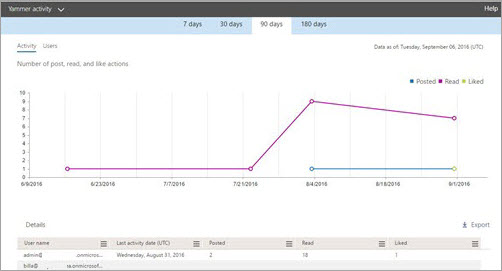

# 管理中心中的 Microsoft 365 报表 - Yammer 活动报告Microsoft 365 Reports in the admin center - Yammer activity report

作为 Microsoft 365管理员，"报告"仪表板将显示有关组织中产品使用情况的数据。As Microsoft 365 admin, the **Reports** dashboard shows you data on the usage of the products within your organization. 查看 [管理中心中的活动报告](activity-reports.md)。Check out [activity reports in the admin center](activity-reports.md). 使用" **Yammer 活动报表** "，可以通过查看使用 Yammer 发布、点赞或阅读消息的唯一用户数以及组织中生成的活动数来了解使用 Yammer 的组织的参与级别。With the **Yammer Activity report**, you can understand the level of engagement of your organization with Yammer by looking at the number of unique users using Yammer to post, like or read a message and the amount of activity generated across the organization. 
  
> [!NOTE]
> 你必须是 Microsoft 365 中的全局管理员、全局读者或报告读者，或者 Exchange、SharePoint、Teams 服务、Teams 通信或 Skype for Business 管理员才能查看报告。You must be a global administrator, global reader or reports reader in Microsoft 365 or an Exchange, SharePoint, Teams Service, Teams Communications, or Skype for Business administrator to see reports. 
 
## 如何获取 Yammer 活动报表How to get to the Yammer activity report

1. 在管理中心，转到“**报表**”\> <a href="https://go.microsoft.com/fwlink/p/?linkid=2074756" target="_blank">使用情况</a>页面。In the admin center, go to the **Reports** \> <a href="https://go.microsoft.com/fwlink/p/?linkid=2074756" target="_blank">Usage</a> page.

    
2. 从"**选择报表"** 下拉列表中，选择 **"Yammer** \> **活动"。**From the **Select a report** drop-down, select **Yammer** \> **Activity**.
  
## Yammer 活动报表说明Interpret the Yammer activity report

可通过查看"活动"和"用户"图表，了解用户的 Yammer 活动。You can get a view into your user's Yammer activity by looking at the Activity and Users charts.
  

  
活动报表包含以下信息。The activity report contains the following information.
  
- 使用天数选项卡来查看最近 7 天、30 天、90 天或 180 天的" **Yammer 活动** "报表趋势。Use the day tabs to view the **Yammer activity** report trends over the last 7 days, 30 days, 90 days, or 180 days. 但是，如果您选择报告中的某一天，则该表将显示自当前日期起最多 28 天的数据 (而不是报告生成日期) 。However, if you select a particular day in the report, the table will show data for up to 28 days from the current date (not the date the report was generated). 
    
- 每个报表包含此报表的生成日期。报表通常反映活动时间的 24 至 48 小时延迟。Each report has a date for when the report was generated. The reports usually reflect a 24 to 48 hour latency from time of activity.
    
- 可以查看" **活动** "图表以了解组织内进行的 Yammer 活动的数量变化趋势。可以分别了解已发布、已读或已点赞的消息。You can view the **Activity** chart to understand the trend of the amount of Yammer activity going on in your organization. You can understand the split of messages posted, read, or liked. 
    
    
  
  - 在" **活动** "图表上，Y 轴表示已发布消息、已读消息或已点赞消息的活动数。On the **Activity** chart, the Y axis is the count of activity of the messages posted, read, or liked. 
    
- 可以查看" **用户** "图表以了解生成 Yammer 活动的唯一用户数的变化趋势。可以查看发布、阅读或点赞 Yammer 消息的用户的变化趋势。You can view the **User** chart to understand the trend of the amount of unique users who are generating the Yammer activities. You can look at the trend of users posting, reading, or liking Yammer messages. 
    
    
  
  - 在" **用户** "活动图表上，Y 轴表示用户发布、阅读或点赞 Yammer 消息。On the **Users** activity chart, the Y axis is the user posting, reading, or liking Yammer messages. 
    
  - 这两个图表的 X 轴都表示此特定报表的所选日期范围。The X axis on both charts is the selected date range for this specific report.
    
- 通过选择图例中的项目，可以筛选在图表上看到的系列。You can filter the series you see on the chart by selecting an item in the legend. 例如，在"**活动"** 图表上，选择"**已** 发布"、"已读"或"已点帖"，以仅查看与每个活动相关的信息。  For example, on the **Activity** chart, select **Posted**, **Read**, or **Liked** to see only the info related to each one. 
    
    
  
    选择此选项不会更改网格表中的信息。Changing this selection doesn't change the info in the grid table.
    
- 该图标下的表格显示了每个用户级别的 Yammer 活动的细目。The table under the graph shows you a breakdown of the Yammer activities at the per-user level.
    
    可以使用此菜单对数据进行筛选和排序。You can use the menu to filter and sort the data.
    
    
  
    也可以添加和删除列。You can also add and remove columns. 可用列是：The available columns are:
    
  - " **用户名**"是用户的电子邮件地址。**Username** is the email address of the user. 可以显示实际的电子邮件地址或采用匿名字段。You can display the actual email address or make this field anonymous. 
    
    此网格显示使用 Microsoft 365 帐户登录 Yammer 的用户，或者使用单一登录登录网络的用户。This grid shows users who logged into Yammer using the Microsoft 365 account or who logged into the network using single sign-on.
    
  - **显示姓名** 是用户的全名。可以显示实际的电子邮件地址或采用匿名字段。**Display name** is the full name of the user. You can display the actual email address or make this field anonymous. 
    
  - **用户状态** 是以下三个值之一：已激活、已删除或已挂起。**User state** is one of three values: Activated, Deleted, or Suspended. 
    
    这些报表显示已激活、已挂起和已删除用户的数据。报表并不反映待定用户，因为待定用户无法发布、阅读或点赞消息。These reports show data for active, suspended, and deleted users. They do not reflect pending users, because pending users cannot post, read, or like a message.
    
  - **状态更改日期 (UTC)** 表示 Yammer 中对用户状态进行更改的日期。**State change date (UTC)** is the date on which the user's state was changed in Yammer. 
    
  - **上次活动日期 (UTC)** 表示用户发布、阅读或点赞消息的最近日期。**Last activity date (UTC)** refers to the last date that the user posted, read, or liked a message. 
    
  - **已发布** 表示指定时间段中用户发布的消息数。**Posted** is the number of messages the user posted during the time period you specified. 
    
  - **已读** 表示指定时间段中用户阅读的对话数。**Read** is the number of conversations that the user read during the time period you specified. 
    
  - **已点赞** 表示指定时间段中用户点赞的消息数。**Liked** is the number of messages that the user liked during the time period you specified. 
    
  - **分配的产品** 是分配给此用户的产品。**Product assigned** is the products that are assigned to this user. 
    
    如果组织的策略阻止你查看显示了可识别用户信息的报表，可更改所有这些报表的隐私设置。If your organization's policies prevents you from viewing reports where user information is identifiable, you can change the privacy setting for all these reports. 请查看 Microsoft  [365](activity-reports.md)管理中心的活动报告中的如何隐藏用户级别详细信息部分。Check out the **How do I hide user level details?** section in [Activity reports in the Microsoft 365 admin center](activity-reports.md).
    
- 您还可以通过选择"导出"链接，将报告数据导出到 Excel .csv **文件中。**You can also export the report data into an Excel .csv file, by selecting the **Export** link. 此操作可导出所有用户的数据，使你能够对数据进行简单的排序和筛选，以进一步分析数据。This exports data of all users and enables you to do simple sorting and filtering for further analysis. 如果用户数量不足 2000，则可在报表中的表格内进行排序和筛选。If you have less than 2000 users, you can sort and filter within the table in the report itself. 如果用户数超过 2000，则需要导出数据才能进行排序和筛选。If you have more than 2000 users, in order to filter and sort, you will need to export the data. 
    
## 这些报表中有哪些数据？What data is in these reports?

- **所有客户端** 这些报表将聚合所有客户端中的数据，包括浏览器中或 iOS 或 Android 应用上使用 Yammer 的情况。**All clients** These reports aggregate data across all clients, including using Yammer in a browser or on an iOS or Android app. 
    
- **无外部网络数据** 这些报表中不包括外部网络数据。**No external network data** External network data is not included in these reports. 
    
- **激活的网络** 这些报告显示属于 Microsoft 365 订阅的 Yammer 网络的数据。**Activated networks** These reports show data for the Yammer network that is part of your Microsoft 365 subscription. 此图汇总了登录到 Yammer 网络的所有用户的使用情况，而不考虑他们是使用 Microsoft 365 还是 Yammer 登录。The chart aggregates usage of all users who logged into the Yammer network, irrespective of whether they used Microsoft 365 or Yammer to log in. 
    

