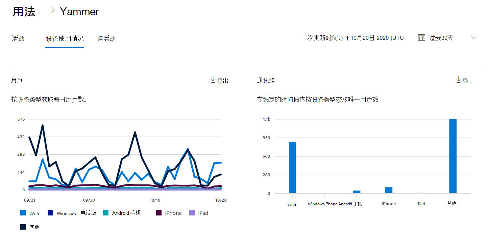
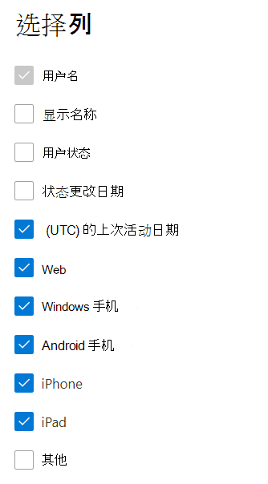

# Microsoft 365管理中心中的报表 - Yammer设备使用情况报告

Microsoft 365报表仪表板显示组织中各产品的活动概述。 它让你能够深入研究各产品级报表，以便更细致地了解每个产品内的活动。 请查看[报表概述主题](activity-reports.md)。
  
利用 Yammer 设备使用情况报表，了解你的用户正在哪些设备上使用 Yammer。可按设备类型查看每日用户数并按设备类型查看用户数。可查看所选时间段内的这两方面情况。也可查看每个用户的详细信息。
 
## 如何获取 Yammer 设备使用情况报表？

1. 在管理中心，转到“**报表**”\> <a href="https://go.microsoft.com/fwlink/p/?linkid=2074756" target="_blank">使用情况</a>页面。 
2. 在仪表板主页上，单击Yammer卡上的 **“查看更多**”按钮。
  
## 解释Yammer设备使用情况报告

可以通过选择“设备使用情况”选项卡来查看OneDrive报表中的 **使用情况**。 

选择 **要** 从报表中添加或删除列的列。    

还可以通过选择“**导** 出”链接将报表数据导出到Excel .csv文件中。 此操作可导出所有用户的数据，使你能够对数据进行简单的排序和筛选，以进一步分析数据。 如果用户数量不足 2000，则可在报表中的表格内进行排序和筛选。 如果用户数超过 2000，则需要导出数据才能进行排序和筛选。 

可以查看 **Yammer设备使用** 情况报告，了解过去 7 天、30 天、90 天或 180 天的趋势。 但是，如果在报表中选择特定日期，表将显示自当前日期（而不是生成报 (表) 日期）最多 28 天的数据。
  
|Item|说明|
|:-----|:-----|
|**跃点数**|**定义**|
|用户名    |用户的电子邮件地址。 可以显示实际的电子邮件地址或采用匿名字段。 此网格显示使用Microsoft 365帐户登录Yammer或使用单一登录登录到网络的用户。   |
|显示名称    |用户的全名。 可以显示实际的电子邮件地址或采用匿名字段。    |
|用户状态    |三个值之一：活动、已删除或已挂起。 这些报表显示已激活、已挂起和已删除用户的数据。 报表并不反映待定用户，因为待定用户无法发布、阅读或点赞消息。     |
|UTC)  (状态更改日期    |在Yammer中更改用户状态的日期。    |
|上次活动日期 (UTC)     |用户参与Yammer活动的最后一个日期 (UTC) 。    |
|Web    |指示用户是否已在 Web 上使用Yammer。    |
|Windows手机    | 指示用户是否在Windows手机上使用了Yammer。    |
|Android 手机    |指示用户是否在 Android 手机上使用了Yammer。  |
|Iphone   | 指示用户是否在iPhone上使用了Yammer。    |
|Ipad    |指示用户是否在iPad上使用了Yammer。  |
|其他    |指示用户是否在另一台设备上使用了Yammer，但以前未列出。  |
|||