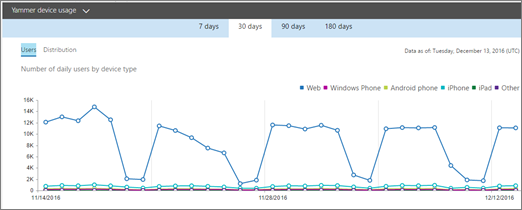
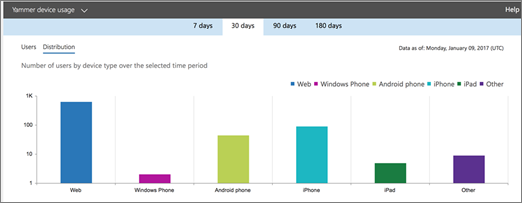

# 管理中心中的 Microsoft 365 报表 - Yammer 设备使用情况报告Microsoft 365 Reports in the admin center - Yammer device usage report

Microsoft 365 **报表** 仪表板显示组织中各产品的活动概述。The Microsoft 365 **Reports** dashboard shows you the activity overview across the products in your organization. 它让你能够深入研究各产品级报表，以便更细致地了解每个产品内的活动。It enables you to drill in to individual product level reports to give you more granular insight about the activities within each product. 请查看[报表概述主题](activity-reports.md)。Check out [the Reports overview topic](activity-reports.md).
  
利用 Yammer 设备使用情况报表，了解你的用户正在哪些设备上使用 Yammer。可按设备类型查看每日用户数并按设备类型查看用户数。可查看所选时间段内的这两方面情况。也可查看每个用户的详细信息。The Yammer device usage reports give you information about which devices your users are using Yammer on. You can view the number of daily users by device type, and number of users by device type. You can view both over a selected time period. You can also view details per user.
  
> [!NOTE]
> 你必须是 Microsoft 365 中的全局管理员、全局读者或报告读者，或者 Exchange、SharePoint、Teams 服务、Teams 通信或 Skype for Business 管理员才能查看报告。You must be a global administrator, global reader or reports reader in Microsoft 365 or an Exchange, SharePoint, Teams Service, Teams Communications, or Skype for Business administrator to see reports. 
  
## 如何获取 Yammer 设备使用情况报表？How do I get to the Yammer device usage report?

1. 在管理中心，转到“**报表**”\> <a href="https://go.microsoft.com/fwlink/p/?linkid=2074756" target="_blank">使用情况</a>页面。In the admin center, go to the **Reports** \> <a href="https://go.microsoft.com/fwlink/p/?linkid=2074756" target="_blank">Usage</a> page.

    
2. 从"**选择报告"** 下拉列表中，选择 **"Yammer** \> **设备使用情况"。**From the **Select a report** drop-down, select **Yammer** \> **Device usage**.
  
## Yammer 活动报表说明Interpret the Yammer activity report

通过查看" **用户**"和" **分布**"图表，可了解用户的 Yammer 设备使用情况。You can get a view into your users' Yammer device usage by looking at the **Users** and **Distribution** charts. 
  
设备使用情况报表包含以下信息。The device usage report contains the following information.
  
- 使用日期选项卡查看过去 7 天、30 天、90 天或 180 天的 **Yammer** 设备使用情况活动报告趋势。Use the day tabs to view the **Yammer device usage** activity report trends over the last 7 days, 30 days, 90 days, or 180 days. 但是，如果您选择报告中的某一天，则该表将显示自当前日期起最多 28 天的数据 (而不是报告生成日期) 。However, if you select a particular day in the report, the table will show data for up to 28 days from the current date (not the date the report was generated). 
    
- 每个报表包含此报表的生成日期。报表通常反映活动时间的 24 至 48 小时延迟。Each report has a date for when the report was generated. The reports usually reflect a 24 to 48 hour latency from time of activity.
    
- 可浏览" **用户**"图表，按设备类型查看每日用户数。You can view the **Users** chart to see the number of daily users by device type.  
  
- 可浏览" **分布**"图表，按设备类型查看用户数。You can view the **Distribution** chart to see the number of users by device type.  
  
- 通过该图表下的" **详细信息**"表格，可详细了解每个用户级别的 Yammer 设备使用情况。The **Details** table under the graph shows you a breakdown of the Yammer device usage at the per-user level. 
    
    也可以添加和删除列。可用列是：You can also add and remove columns. The available columns are:
    
  - " **用户名**"是用户的电子邮件地址。**Username** is the email address of the user. 可以显示实际的电子邮件地址或采用匿名字段。You can display the actual email address or make this field anonymous. 
    
    此网格显示使用 Microsoft 365 帐户登录 Yammer 的用户，或者使用单一登录登录网络的用户。This grid shows users who logged into Yammer using the Microsoft 365 account or who logged into the network using single sign-on.
    
  - **显示姓名** 是用户的全名。可以显示实际的电子邮件地址或采用匿名字段。**Display name** is the full name of the user. You can display the actual email address or make this field anonymous. 
    
  - **用户状态** 是以下 3 个值之一：已激活、已删除或已挂起。**User state** is one of three values: Active, Deleted, or Suspended. 
    
    这些报表显示已激活、已挂起和已删除用户的数据。报表并不反映待定用户，因为待定用户无法发布、阅读或点赞消息。These reports show data for active, suspended, and deleted users. They do not reflect pending users, because pending users cannot post, read, or like a message.
    
  - " **Web**"指示用户是否已在 Web 上使用过 Yammer。**Web** indicates if the user has used Yammer on the web. 
    
  - " **Windows 手机**"指示用户是否已在 Windows 手机上使用过 Yammer**Windows phone** indicates if the user has used Yammer on a Windows phone 
    
  - " **Android 手机**"指示用户是否已在 Android 手机上使用过 Yammer。**Android phone** indicates if the user has used Yammer on an Android phone. 
    
  - " **iPhone**"指示用户是否已在 iPhone 上使用过 Yammer。**iPhone** indicates if the user has used Yammer on an iPhone. 
    
  - " **iPad**"指示用户是否已在 iPad 上使用过 Yammer。**iPad** indicates if the user has used Yammer on an iPad. 
    
  - " **其他**"指示用户是否已在前面未列出的其他设备上使用过 Yammer。**Other** indicates if the user has used Yammer on another device, not listed previously. 
    
    如果组织的策略阻止你查看显示了可识别用户信息的报表，可更改所有这些报表的隐私设置。If your organization's policies prevents you from viewing reports where user information is identifiable, you can change the privacy setting for all these reports. 请查看 Microsoft  [365](activity-reports.md)管理中心的活动报告中的如何隐藏用户级别详细信息？部分。Check out the **How do I hide user level details?** section in the [Activity Reports in the Microsoft 365 admin center](activity-reports.md).
    
- 您还可以通过选择"导出"链接，将报告数据导出到 Excel .csv **文件中。**You can also export the report data into an Excel .csv file, by selecting the **Export** link. 此操作可导出所有用户的数据，使你能够对数据进行简单的排序和筛选，以进一步分析数据。This exports data of all users and enables you to do simple sorting and filtering for further analysis. 如果用户数量不足 2000，则可在报表中的表格内进行排序和筛选。If you have less than 2000 users, you can sort and filter within the table in the report itself. 如果用户数超过 2000，则需要导出数据才能进行排序和筛选。If you have more than 2000 users, in order to filter and sort, you will need to export the data. 
    

