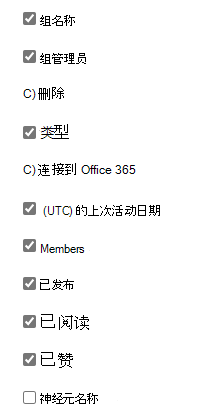

# 管理中心中的 Microsoft 365 报表 - Yammer 组活动报告Microsoft 365 Reports in the admin center - Yammer groups activity report

Microsoft 365 **报表** 仪表板显示组织中各产品的活动概述。The Microsoft 365 **Reports** dashboard shows you the activity overview across the products in your organization. 它让你能够深入研究各产品级报表，以便更细致地了解每个产品内的活动。It enables you to drill in to individual product level reports to give you more granular insight about the activities within each product. 请查看 [报表概述主题](activity-reports.md)。Check out [the Reports overview topic](activity-reports.md). 在 Yammer 组活动报表中，可深入了解组织中 Yammer 组的活动并查看创建和使用了多少个 Yammer 组。In the Yammer groups activity report, you can gain insights into the activity of Yammer groups in your organization and see how many Yammer groups are being created and used.
  
> [!NOTE]
> 你必须是 Microsoft 365 中的全局管理员、全局读者或报告读者，或者 Exchange、SharePoint、Teams 服务、Teams 通信或 Skype for Business 管理员才能查看报告。You must be a global administrator, global reader or reports reader in Microsoft 365 or an Exchange, SharePoint, Teams Service, Teams Communications, or Skype for Business administrator to see reports.  

## 如何获取 Yammer 组活动报表How to get to the Yammer groups activity report

1. 在管理中心，转到“**报表**”\> <a href="https://go.microsoft.com/fwlink/p/?linkid=2074756" target="_blank">使用情况</a>页面。In the admin center, go to the **Reports** \> <a href="https://go.microsoft.com/fwlink/p/?linkid=2074756" target="_blank">Usage</a> page.

    
2. 从"**选择报告"** 下拉列表中，选择 **"Yammer** \> **组活动"。**From the **Select a report** drop-down, select **Yammer** \> **Groups activity**.
  
## Yammer 组活动报表说明Interpret the Yammer groups activity report

可通过查看" **组** "和" **活动** "图表，了解 Yammer 组活动。You can get a view into Yammer groups activity by looking at the **Groups** and **Activity** charts. 
  
|项目Item|说明Description|
|:-----|:-----|
|1.1.    |可查看" **Yammer 组活动** "报表，了解过去 7 天、30 天、90 天或 180 天的趋势。The **Yammer groups activity** report can be viewed for trends over the last 7 days, 30 days, 90 days, or 180 days. 但是，如果您选择报告中的特定日期，则表 (7) 将显示自当前日期起最多 28 天的数据 (而不是报告生成日期) 。However, if you select a particular day in the report, the table (7) will show data for up to 28 days from the current date (not the date the report was generated).    |
|2.2.    |每个报告中的数据通常涵盖过去 24 至 48 小时的数据。The data in each report usually covers up to the last 24 to 48 hours.   |
|3.3.    |" **组** "视图显示已存在的总组数以及执行了组会话活动的组数。The **Groups** view shows a total number of groups that existed , and how many performed group conversation activity.    |
|4.4.    |" **活动** "视图显示在组中发布、阅读及点赞的 Yammer 消息数。The **Activity** view shows you the number Yammer messages posted, read, and liked in groups.    |
|5.5.    | 在" **组** "图表中，Y 轴表示总组数或活动组数。On the **Groups** chart, the Y axis is the count of total or active groups.     在" **活动** "图表，Y 轴表示 Yammer 组的特定活动数。On the **Activity** chart, the Y axis is the count of specified activity for Yammer groups.     三个图表的 X 轴都表示为此特定报表选定的日期范围。The X axis on all three charts is the selected date range for the specific report.    |
|6.6.    |通过选择图例中的项目，可以筛选在图表上看到的系列。You can filter the series you see on the chart by selecting an item in the legend. 例如，在"组 **"** 图表上，选择"总计"或"**活动** 总计"和"活动图标"，以仅  查看与每个图标有关的信息。  For example, on the **Groups** chart, select **Total** or **Active**   to see only the info related to each one. 更改选择不会更改网格表中的信息。Changing this selection doesn't change the info in the grid table.    |
|7.7.    | 显示的组列表由最大（180天）报表时间范围内存在的（未删除）所有组来确定。 活动计数（已收到的邮件）可能因日期选择不同而有所变化。  The list of groups to show is determined by the set of all groups that existed (weren't deleted) across the widest (180-day) reporting time frame. The activity count (messages received) will vary according to the date selection.    注意：在添加以下列表中的所有项目之前，可能不会在列中看到这些项目。NOTE: You might not see all the items in the list below in the columns until you add them. " **组名** "表示组的名称。**Group name** is the name of the group.    " **组管理员** "表示组管理员或所有者的姓名。**Group admin** is the name of the group administrator, or owner.    " **已删除** "表示已删除的 Yammer 组数。如果该组被删除，但在报告时间段中有活动，它将显示在网格中，并显示设置为 true 的标记。  **Deleted** is the number of deleted Yammer groups. If the group is deleted, but had activity in the reporting period it will show up in the grid with this flag set to true.    " **类型** "表示组的类型：公共类或专用类**Type** is the type of group, public or private.    **连接到 Office 365** 指示 Yammer 组是否也是 Microsoft 365 组。**Connected to Office 365** indicates whether the Yammer group is also an Microsoft 365 group.    **"上次活动** 日期"是组阅读、发布或点帖邮件的最近日期。**Last activity date** is the latest date a message was read, posted or liked by the group.    " **成员** "表示组中的成员人数。**Members** is the number of members in the group.    " **已发布** "表示报告时间段内 Yammer 组中发布的消息数。**Posted** is the number of messages posted in the Yammer group over the reporting period.    " **已读** "表示报告时间段内 Yammer 组中的已读消息数。**Read** is the number of conversations read in the Yammer group over the reporting period.    " **已赞** "表示报告时间段内 Yammer 组中的已赞消息数。**Liked** is the number of messages liked in the Yammer group over the reporting period.   **网络** 名称是组所属的网络的完整名称。**Network name** is the full name of the network that the group belongs to.    如果组织的策略阻止你查看显示了可识别用户信息的报表，可更改所有这些报表的隐私设置。If your organization's policies prevents you from viewing reports where user information is identifiable, you can change the privacy setting for all these reports. 请查看 Microsoft  [365](activity-reports.md)管理中心的活动报告中的如何隐藏用户级别详细信息部分。Check out the **How do I hide user level details?** section in [Activity reports in the Microsoft 365 admin center](activity-reports.md).    |
|8.8.    |选择 **"列** "以在报表中添加或删除列。Select **Columns** to add or remove columns from the report.    |
|9.9.    |您还可以通过选择"导出"链接，将报告数据导出到 Excel .csv **文件中。**You can also export the report data into an Excel .csv file, by selecting the **Export** link. 此操作可导出所有用户的数据，使你能够对数据进行简单的排序和筛选，以进一步分析数据。This exports data of all users and enables you to do simple sorting and filtering for further analysis. 如果用户数量不足 2000，则可在报表中的表格内进行排序和筛选。If you have less than 2000 users, you can sort and filter within the table in the report itself. 如果用户数超过 2000，则需要导出数据才能进行排序和筛选。If you have more than 2000 users, in order to filter and sort, you will need to export the data.    |
|||
   

