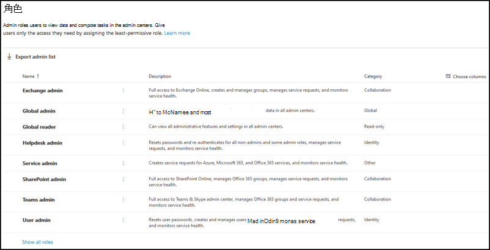
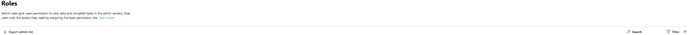
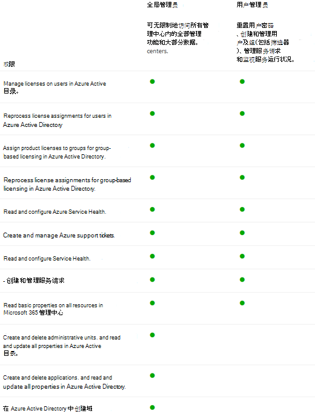

# 角色页面入门

在"角色"页上，您可以授予用户在管理中心执行任务的权限。 这有助于组织将任务分配给相应的人员，并保护数据安全。

> [!TIP]
> 是否在查找详细的角色说明？ 请查看[Azure AD角色和](/azure/active-directory/roles/permissions-reference)关于[管理员角色](/microsoft-365/admin/add-users/about-admin-roles)。

## 关于管理员角色页面

你可以导出管理员列表以及按角色搜索和筛选。

- 使用"导出管理员列表"获取组织中所有管理员用户的完整列表。 该列表存储在一个Excel .csv文件中。

- 使用"搜索"搜索管理员角色，并查看分配到该角色的用户。

- 使用筛选器更改显示的管理员角色的视图。

## 发挥角色的最多作用

阅读以下内容，了解不同的管理员角色以及这些角色可以在组织中执行的任务。

> [!NOTE]
这不是这些角色拥有的所有权限的详尽列表。 选择" **了解详细信息** "链接，了解有关每个角色详细信息。

### Exchange 管理员

将Exchange管理员角色分配给需要查看和管理用户的电子邮件邮箱、Microsoft 365组Exchange Online。 他们还可以打开和管理向 Microsoft 支持人员提出的支持请求。 [了解详细信息](/microsoft-365/admin/add-users/about-exchange-online-admin-role)

### 全局管理员

为需要全局访问 Microsoft 在线服务中的大多数管理功能和数据的用户分配全局管理员角色。 为太多的用户提供全局访问权限会带来安全风险，我们建议你设置 2 至 4 名全局管理员。 只有全局管理员可以重置每个用户的密码，并添加和管理域。 他们还可以打开和管理向 Microsoft 支持人员提出的支持请求。 注册 Microsoft 联机服务的人将自动成为全局 [管理员。了解更多信息](/microsoft-365/admin/add-users/about-admin-roles#roles-available-in-the-microsoft-365-admin-center)

### 全局读取者

将全局读者管理员角色分配给需要查看全局管理员可查看的所有管理中心中的管理员功能和设置的用户。 全局读者管理员角色无法编辑任何设置。 [了解详细信息](/microsoft-365/admin/add-users/about-admin-roles#roles-available-in-the-microsoft-365-admin-center)

### 支持管理员

将支持管理员角色分配给想要重置密码的用户，强制用户注销任何安全问题。 他们还可以打开和管理向 Microsoft 支持人员提出的支持请求。 支持人员管理员只能帮助非管理员用户和分配了这些角色的用户：目录读取者、来宾邀请者、支持人员管理员、消息中心读者和报告阅读器。 [了解详细信息](/microsoft-365/admin/add-users/about-admin-roles#roles-available-in-the-microsoft-365-admin-center)

### 服务管理员

将服务管理员角色分配给需要为 Azure、Microsoft 365 和 Office 365 服务创建支持请求的用户。 [了解详细信息](/microsoft-365/admin/add-users/about-admin-roles#roles-available-in-the-microsoft-365-admin-center)

### SharePoint 管理员

购买订阅Microsoft 365，将自动创建团队网站，全局管理员设置为网站集主管理员。 将SharePoint管理员角色分配给要访问管理中心SharePoint<a href="https://go.microsoft.com/fwlink/?linkid=2185219" target="_blank">用户</a>。 具有管理SharePoint用户可以创建和管理网站集、指定网站集管理员和管理用户配置文件。 具有管理员SharePoint用户还可以管理Microsoft 365组，并通过 Microsoft 支持打开支持请求。 [了解详细信息](/sharepoint/sharepoint-admin-role)

### Teams 服务管理员

向Teams管理中心的用户分配 Teams & Skype 管理员角色。 具有 Teams 管理员角色的用户还可以管理Microsoft 365组，并通过 Microsoft 支持打开支持请求。 [了解详细信息](/MicrosoftTeams/using-admin-roles)

### 用户管理员

向要访问和管理用户密码重置和管理用户和组的用户分配用户管理员角色。 他们还可以打开和管理向 Microsoft 支持人员提出的支持请求。 [了解详细信息](/microsoft-365/admin/add-users/about-admin-roles#roles-available-in-the-microsoft-365-admin-center)

## 比较角色

现在可以一次最多比较 3 个角色的权限，以便找到要分配的权限最少的角色。

在管理中心：

- 选择最多 3 个角色，然后选择" **比较** 角色"以查看每个角色具有的权限。

## 相关内容

[关于 Microsoft 365 管理员角色](about-admin-roles.md)（文章）\
[分配管理员角色](assign-admin-roles.md)（文章）
