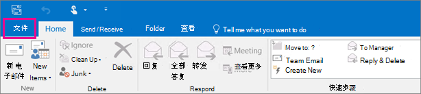
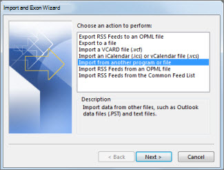

# 步骤 4 - 向另一名员工授予OneDrive和Outlook权限

当员工离开组织时，你将希望访问其OneDrive Outlook数据，备份数据，并选择是否将该数据授予其他员工。
  
## 访问以前用户的OneDrive文档

如果您删除用户的许可证但不删除帐户，您可以授予自己访问用户许可证中的内容OneDrive。 如果删除用户帐户，则默认情况下你有 30 天的时间访问前用户OneDrive数据。 [了解如何为已删除OneDrive设置保留时间](/onedrive/set-retention)。 如果您在此时间内[没有还原用户帐户，则](/office365/admin/add-users/restore-user)其OneDrive内容将被删除。

若要保留以前用户OneDrive文件，请首先向自己授予OneDrive访问权限，然后移动要保留的文件。

1. 在管理中心，转到“**用户**\><a href="https://go.microsoft.com/fwlink/p/?linkid=834822" target="_blank">活动用户</a>”页面。  

2. 选择用户。

3. 在用户属性页上，选择 **"OneDrive"。** 在 **"获取对文件的访问权限"下**，**选择"创建指向文件的链接"。**

4. 选择链接以打开文件位置。 将文件下载到计算机，或选择"移动到"或"复制"以将这些文件移动或复制到您自己的OneDrive或共享库。

> [!NOTE]
> 一次可以移动或复制多达 500 MB 的文件和文件夹。 
> 在移动或复制具有版本历史记录的文档时，只会移动最新版本。  

还可以向其他用户授予访问前员工OneDrive。

1. 以全局<a href="https://go.microsoft.com/fwlink/p/?linkid=2024339" target="_blank">管理员或管理员</a>管理员SharePoint管理中心。

    如果您收到一条消息，指出您无权访问管理中心，则表明您组织中没有管理员权限。

2. 在左窗格中，选择"管理 **中心** \> **SharePoint"。** （你可能需要选择“**全部显示**”以查看管理中心列表）。

3. 如果显示经典SharePoint管理中心，请选择页面顶部的"现在打开它"以打开SharePoint管理中心。

4. 在左窗格中，选择"**更多功能"。**

5. 在 **"用户配置文件"下**，选择"打开 **"。**

6. 在 **"人员**"下，选择 **"管理用户配置文件"。**

7. 输入前员工的姓名，然后选择"查找 **"。**

8. 右键单击用户，然后选择"管理 **网站集所有者"。**

9. 将用户添加到 **网站集管理员，然后选择****确定。**

10. 用户现在将能够使用 OneDrive URL 访问前OneDrive的用户。 

### 撤销管理员对用户权限OneDrive

您可以向自己授予对用户网站中OneDrive的访问权限，但您可能想要在不再需要该内容时删除您的访问权限。

1. 以全局<a href="https://go.microsoft.com/fwlink/p/?linkid=2024339" target="_blank">管理员或管理员</a>管理员SharePoint管理中心。

    如果您收到一条消息，指出您无权访问管理中心，则表明您组织中没有管理员权限。

2. 在左窗格中，选择"管理 **中心** \> **SharePoint"。** （你可能需要选择“**全部显示**”以查看管理中心列表）。

3. 如果显示经典SharePoint管理中心，请选择页面顶部的"现在打开它"以打开SharePoint管理中心。

4. 在左窗格中，选择"**更多功能"。**

5. 在 **"用户配置文件"下**，选择"打开 **"。**

6. 在 **"人员**"下，选择 **"管理用户配置文件"。**

7. 输入用户的名称，然后选择"查找 **"。**

8. 右键单击用户，然后选择"管理 **网站集所有者"。**

9. 删除不再需要访问用户数据的用户，然后选择"确定 **"。**

## 访问Outlook用户的数据

若要保存以前员工的电子邮件、日历、任务和联系人，将信息导出到 Outlook 数据文件 (.pst) 。
  
1. [将前员工的电子邮件添加到](https://support.microsoft.com/office/6e27792a-9267-4aa4-8bb6-c84ef146101b)你的邮箱Outlook (如果你重置用户密码，你可以将其设置为仅你知道) 

2. 在Outlook中，选择"文件 **"。**

    
  
3. 选择 **"打开 &amp; 导出** \> **导入/导出"。**

    
  
4. 选择 **"导出到文件"，** 然后选择"下一 **步"。**

    
  
5. 选择 **Outlook数据文件 (.pst) "，** 然后选择"下一 **步"。**

6. 通过选择名称或电子邮件地址（如 Mailbox - Anne Weiler 或 anne@contoso.com）选择要导出的帐户。 如果要导出帐户中的所有内容，包括邮件、日历、联系人、任务和便笺，请确保选中了" **包括** 子文件夹"复选框。

    > [!NOTE]
    > 可以一次导出一个帐户。 如果要导出多个帐户，在导出一个帐户后，重复这些步骤。
  
    
  
7. 选择 **下一步**。

8. 选择 **"浏览**"以选择保存Outlook文件 (.pst) 。 键入  *文件名，* 然后选择" **确定"** 继续。

    > [!NOTE]
    > 如果之前使用过导出，则显示上一个文件夹位置和文件名。 在选择  *"确定"之前，*  键入其他 **文件名**。
  
9. 如果要导出到现有 Outlook 数据文件 (.pst)，请在" **选项**"下指定文件中已存在导出项目时要执行的操作。

10. 选择“完成”。

Outlook，除非已创建新的 Outlook Data File (.pst) 或使用了密码保护的文件，否则将立即开始导出。
  
- 如果要创建一个Outlook.pst (.pst) ，则可选密码可以帮助保护文件。 当"**创建Outlook文件**"对话框出现时，在"密码"和"验证密码"框中键入密码，然后选择"确定 **"。** 在 **"Outlook数据文件密码**"对话框中，键入 *密码*，然后选择"确定 **"。**

- 如果要导出到受密码保护的现有 Outlook 数据文件 (.pst) ，请在 **"Outlook** 数据文件密码"对话框中，键入密码，然后选择"确定 **"。** 

请参阅如何在 Outlook 2010 中将电子邮件、联系人和日历导出或备份Outlook [.pst](https://support.microsoft.com/office/14252b52-3075-4e9b-be4e-ff9ef1068f91)文件。

  > [!NOTE]
  > 默认情况下，您的电子邮件在 12 个月内脱机可用。 如果需要，请参阅如何 [增加脱机可用的数据](/outlook/troubleshoot/mailboxes/only-subset-items-synchronized)。

### 向其他用户授予对以前用户的电子邮件的访问权限

若要向另一名员工授予对前员工的电子邮件、日历、任务和联系人的访问权限，将信息导入另一个员工的Outlook收件箱。

> [!NOTE]
> 还可以将 [以前用户的邮箱转换为](/office365/admin/email/convert-user-mailbox-to-shared-mailbox) 共享邮箱，或将以前员工的电子邮件转发 [给另一名员工](/office365/admin/add-users/remove-former-employee#forward-a-former-employees-email-to-another-employee-or-convert-to-a-shared-mailbox)。

1. In Outlook， go to **File** \> **Open Export &amp; 导入/导出** \> .

    这将启动导入和导出向导。

2. 选择 **"从另一个程序或文件导入**"，然后选择"下一 **步"。**

    
  
3. 选择 **Outlook数据文件 (.pst) "，** 然后选择"下一 **步"。**

4. 浏览到要导入的 .pst 文件。

5. 在 **"选项**"下，选择如何处理重复项

6. 选择 **下一步**。

7. 如果密码已分配给 Outlook.pst (.pst) ，请输入密码，然后选择"确定 **"。**

8. 设置用于导入项目的选项。 默认设置通常不需要更改。

9. 选择“完成”。

> [!NOTE]
> 访问现有用户的邮箱和电子邮件数据的步骤OneDrive相同。

> [!TIP]
> 如果您想要导入或还原仅几个项目从 Outlook 数据文件 (.pst) ，您可以打开 Outlook 数据文件。 然后，在导航窗格中，将项目从Outlook数据文件文件夹拖动到现有Outlook文件夹中。

## 相关内容

[在帐户帐户上添加OneDrive (管理员) ](/sharepoint/manage-user-profiles#add-and-remove-admins-for-a-users-onedrive)

[Restore a deleted OneDrive (](/onedrive/restore-deleted-onedrive) article) 

[OneDrive保留和删除 (](/onedrive/retention-and-deletion)文章) 

[共享 OneDrive 文件和文件夹](https://support.microsoft.com/office/share-onedrive-files-and-folders-9fcc2f7d-de0c-4cec-93b0-a82024800c07)
