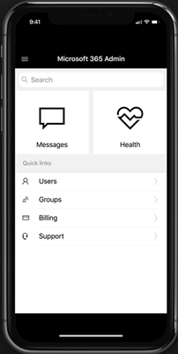

# 关于 Microsoft 365 管理员移动应用About the Microsoft 365 admin mobile app

你是经常在外访问的管理员吗？Are you an admin who's usually on the go? 然后查看 [Microsoft 365 管理应用](https://go.microsoft.com/fwlink/?LinkID=627216)。Then check out the [Microsoft 365 Admin app](https://go.microsoft.com/fwlink/?LinkID=627216). 可以使用该应用从手机或平板电脑管理联机组织。You can use the app to manage your online organization from your phone or tablet. 你可以从 Apple Store 和 Google Play 获取应用。You can get the app from the Apple Store, and from Google Play.   

管理应用是一个功能丰富的应用，具有 80 多个功能，可帮助你在无法到达计算机时管理组织。The admin app is a feature-rich app that has over 80 features to help you manage your org when you can't get to a computer. 下面是你可以从应用执行的任务的一些列表：Here's a list of just a few of the tasks you can do from the app:

- 获取服务运行状况和更改通知Get service health and change notifications
- 创建服务请求Create a service request
- 重置用户密码Reset a user's password
- 分配许可证Assign licenses
- 添加或删除组成员身份Add or remove group memberships
- 添加用户Add users 

如果你是负责多个联机组织的人，可以登录到多个组织并快速切换。And if you're someone who is responsible for more than one online organization, you sign in to multiple orgs and quickly switch between them. 
  
> [!IMPORTANT]
> 如果你在 iOS 或 Android 上使用管理移动应用时遇到问题，请发送电子邮件到feedback365@microsoft.com告诉我们。If you're having trouble using the Admin mobile app on iOS or Android, email us at [feedback365@microsoft.com](mailto:feedback365@microsoft.com) to let us know. 
  
## 下载移动管理应用Download the admin mobile app

[Microsoft 365 管理移动应用](https://go.microsoft.com/fwlink/?LinkID=627216)。[Microsoft 365 Admin mobile app](https://go.microsoft.com/fwlink/?LinkID=627216).
  
观看有关安装管理移动应用的简短视频。Watch a short video about installing the admin mobile app.  

> [!VIDEO https://www.microsoft.com/videoplayer/embed/05c1d439-9ec2-415f-9178-250f64dec64c] 

如果你发现此视频有帮助，请查看[适用于小型企业和 Microsoft 365 新用户的完整培训系列](https://support.microsoft.com/office/6ab4bbcd-79cf-4000-a0bd-d42ce4d12816)。If you found this video helpful, check out the [complete training series for small businesses and those new to Microsoft 365](https://support.microsoft.com/office/6ab4bbcd-79cf-4000-a0bd-d42ce4d12816).

 
## 常见问题解答Frequently asked questions

以下是一些有关应用的常见问题的解答。Below are answers to some frequently asked questions people ask about the app.
  
### 要使用该应用，我需要做什么？What do I need to do to be able to use the app?

你需要具有有效的 Microsoft 365 商业应用版或 Microsoft 365 商业高级版订阅，并拥有登录和使用应用的管理员权限。You need to have a valid Microsoft 365 Apps for business or Microsoft 365 Business Premium subscription with admin privileges to sign in and use the app. 管理移动应用不是电子邮件客户端。The Admin mobile app isn't an email client. 它是一款丰富的管理应用，具有 80 多个功能，可帮助你在一路时支持组织。It's a rich administrative app with over 80 features to help you support your org while your on the go.
  
### 能否将应用与 Microsoft 365 家庭版订阅一同使用？Can I use the app with my Microsoft 365 Family subscription?

否，该应用仅适用于 Microsoft 365 商业应用版和 Microsoft 365 商业高级版订阅。No, the app only works with Microsoft 365 Apps for business and Microsoft 365 Business Premium subscriptions. 
  
### 如果我的组织启用了目录同步，是否可使用该应用？Will the app work if my organization has directory synchronization enabled?

是，但功能已缩减。Yes, but with reduced functionality. 你将能够登录和查看服务信息，但大多数用户管理功能都是只读的。You'll be able to sign in and view service information, but most of the user management functions will be read-only. 无法添加、编辑或删除用户。You won't be able to add, edit, or delete users. 但是，你将能够向组织中用户分配许可证，并获取通知。However, you'll be able to assign licenses to users in your organization, and get notifications.
  
### 该应用支持什么语言？What languages are supported by the app?

该应用支持基于 Web 的 Microsoft 365 管理中心支持的所有 39 种语言。The app supports all 39 languages that the web-based Microsoft 365 admin center supports. 若要更改语言，请选择上栏中的应用启动图标，然后选择"**设置**  >  **语言"。**To change the language, select the app launch icon in the upper bar and choose **Settings** > **Language**.
  
### 为什么在我已读取了新邮件后，主屏幕上的邮件磁贴仍会显示数量？Why does the Messages tile on the Home screen show numbers even after I've read the new messages?

该数量为上周收到的邮件总数，而不是未读邮件的数量。The numbers are the total messages from the last week, not unread messages.
  
### 我如何与组织的其余用户共享服务事件和邮件？How can I share the Service Incidents and Messages with the rest of my organization?

如果选择特定服务事件或消息，共享选项将位于右上角。If you select a specific service incident or a message, the share option will be in the top right corner. 我们当前支持电子邮件共享。We currently support email sharing.
  
### 我能否将此应用程序与多个帐户或租户一同使用？Can I use this app with multiple accounts or tenants?

可以，可以设置多个帐户或租户。Yes, you can setup multiple accounts or tenants.
  
### 我的应用有些异常。My app is acting funny. 我应该如何解决异常的应用行为？What can I do to troubleshoot weird app behavior?

你可以尝试一些常见的移动应用疑难解答步骤：You can try some common mobile app troubleshooting steps:
  
1. 关闭并重新打开应用。Close and reopen the app.
    
2. 卸载并重新安装应用。Uninstall and reinstall the app.

3. 如果不起作用，可以通过电子邮件 [联系我们feedback365@microsoft.com告知](mailto:feedback365@microsoft.com) 我们。If that doesn't work, you can email us at [feedback365@microsoft.com](mailto:feedback365@microsoft.com) to let us know.
    
### 如果我的问题未获得答复怎么办？What do I do if my question isn't answered?

电子邮件 [feedback365@microsoft.com](mailto:feedback365@microsoft.com) 报告应用问题。Email [feedback365@microsoft.com](mailto:feedback365@microsoft.com) to report an issue with the app. 或者，您可以在本文底部提供反馈。Or you can give feedback at the bottom of this article. 
  
## 另请参阅See also

[Microsoft 365 商业版培训视频Microsoft 365 for business training videos](https://support.microsoft.com/office/6ab4bbcd-79cf-4000-a0bd-d42ce4d12816)
