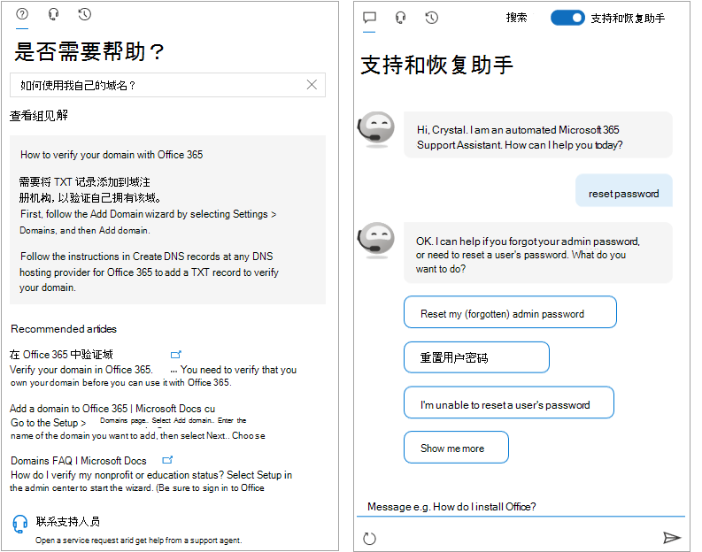

<!-- The following is just placeholder text from Madhura's mail. We need to add images/examples of each -->

# 如何获取帮助Microsoft 365 管理中心

如果你是管理员，可以继续管理和充分利用你的Microsoft 365 <a href="https://go.microsoft.com/fwlink/p/?linkid=2024339" target="_blank">https://admin.microsoft.com</a> 订阅。 有时，你可能无法找到正确的任务，在启动任务流之前需要更多上下文，或者只是不确定作为管理员的操作的范围和影响。为了涵盖这些情况，我们在整个过程中通过以下方式<a href="https://go.microsoft.com/fwlink/p/?linkid=2166757" target="_blank">Microsoft 365 管理中心新式帮助</a>和智能帮助：

* **集成帮助** - 管理中心中的帮助

* **智能协助** - 由 AI 自助支持

* **指南和文章** - 全面的 Web 内容

## 集成帮助

帮助已在整个 <a href="https://go.microsoft.com/fwlink/p/?linkid=2166757" target="_blank">管理中心内集成</a>，因此，当你需要它时，它就位于那里。 在很多页面的顶部，你将找到内联帮助文本，该文本提供当前任务的信息概述，以及指向文章的链接，这些文章可让你快速找到官方文档，进行更深入的学习。

## 由 AI 提供现代自助功能

若要打开由人工智能支持的现代自助体验，请选择"需要帮助"按钮。Microsoft 365 管理中心。  例如，如果您搜索"验证我的域"，您将获得这些步骤以及一些我们认为会有所帮助的文章。 我们使用机器学习来显示最接近的解决方案，该解决方案已帮助其他已输入类似查询的管理员。

或者，对于你不太知道如何在你的特定情况下完成某些操作的情况，请使用支持助理。 目前，此体验仅提供英语版本。 若要打开支持助理，只需使用"需要帮助" **窗格顶部的开关** 。 支持助理提供了一个对话界面来帮助你。 输入查询后，聊天机器人会询问阐明问题，以针对您的特定情况获得正确的答案。 将它视为发现解决方案和完成任务的虚拟帮助程序。

当然，有时问题最好由人回答。 如果我们的新式自助没有答案，你始终可以选择联系我们的支持代理。

## 指南和文章

此外，如果你正在寻找全面的部署指南、快速分步过程或 PowerShell cmdlet，请通过 Web 查找我们。 我们频繁更新内容，并尝试向您提供最新信息。 请查看我们的文章和指南，Microsoft 365[文档](../../index.yml)网站。