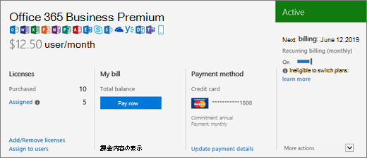

# 我有什么订阅？

如果您是管理员，则可以通过转到管理中心来验证您的组织拥有哪些订阅。
  
 **不是管理员？** 查看 [我有什么 Microsoft 365 的商业产品或许可证？](https://support.microsoft.com/office/f8ab5e25-bf3f-4a47-b264-174b1ee925fd)

::: moniker range="o365-worldwide"

1. 在管理中心中，转到“**计费**”\>“<a href="https://go.microsoft.com/fwlink/p/?linkid=842054" target="_blank">你的产品</a>”页面。
2. 在 " **产品** " 选项卡上，您将看到所有订阅。 每个订阅行都包含有关许可证、订阅状态和帐单的信息。
3. 如果要更改列表中显示的列，请选择 " **选择列**"。 更改列的选定内容，然后选择 " **保存**"。
4. 若要查看单个订阅的更多详细信息，请选择该订阅。

::: moniker-end
  
::: moniker range="o365-germany"

1. 在管理中心中，转到 "**记帐** \> <a href="https://go.microsoft.com/fwlink/p/?linkid=847745" target="_blank">订阅</a>" 页。  

2. 如果只有一个订阅，它将显示在" **订阅**"页上，随之还有订阅名、订阅的相关信息及状态。 在下面的屏幕截图中，你可以看到我有 Microsoft 365 Apps for business 订阅。

    
  
3. 如果有多个订阅，将在详细的订阅信息旁边看到一个列，列出了已购买订阅及全部试用版订阅。默认情况下，位于列表顶部的订阅已自动选中，并显示该订阅的详细信息。

    如果有多个订阅，请选择要查看其详细信息的订阅。 订阅卡会随着该订阅信息的更新而更新。

    
  
    > [!NOTE]
    > 如果你有已过期或禁用的订阅，它们将根据当前状态列出。

::: moniker-end

::: moniker range="o365-21vianet"

1. 在管理中心中，转到 "**记帐** \> <a href="https://go.microsoft.com/fwlink/p/?linkid=850626" target="_blank">订阅</a>" 页。  

2. 如果只有一个订阅，它将显示在" **订阅**"页上，随之还有订阅名、订阅的相关信息及状态。 在下面的屏幕截图中，你可以看到我有 Microsoft 365 Apps for business 订阅。

    
  
3. 如果有多个订阅，将在详细的订阅信息旁边看到一个列，列出了已购买订阅及全部试用版订阅。默认情况下，位于列表顶部的订阅已自动选中，并显示该订阅的详细信息。

    如果有多个订阅，请选择要查看其详细信息的订阅。 订阅卡会随着该订阅信息的更新而更新。

    
  
    > [!NOTE]
    > 如果你有已过期或禁用的订阅，它们将根据当前状态列出。

::: moniker-end

## 相关文章
  
[订阅和计费](../../commerce/index.yml)