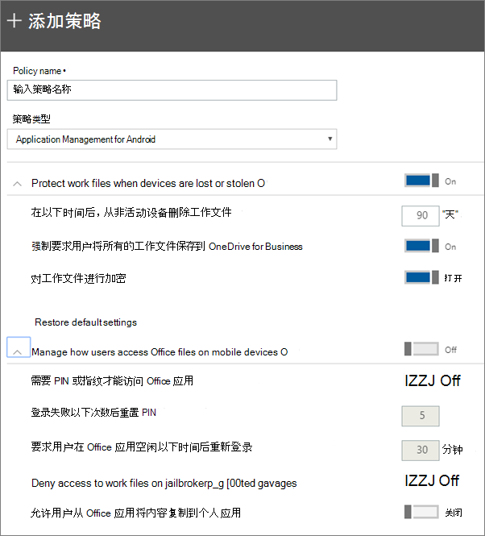

# 设置 Android 或 iOS 设备的应用保护设置

本文适用于Microsoft 365 商业高级版。

## 创建应用管理策略

1. 转到位于 <a href="https://go.microsoft.com/fwlink/p/?linkid=837890" target="_blank">https://admin.microsoft.com</a> 的管理中心。 
    
2. 在左侧导航中，选择 **"设备策略** \>  \> **""添加"。**
  
3. 在" **添加策略**"窗格中，输入此策略的唯一名称。 
    
4. 在 **"策略类型**"下，选择 **"Android** 应用程序管理"或" **适用于 iOS** 的应用程序管理"，具体取决于要创建的策略集。 
    
5. Expand **Protect work files when devices are lost or stolen** and Manage how users access Office files on mobile **devices**. 配置您喜欢的设置。 **管理用户在移动设备上Office** 访问文件方式默认为"关闭"，但我们建议你将其打开并接受默认值。  有关详细信息，请参阅可用 [设置](#available-settings)。 
    
    始终可使用" **重置默认设置**"链接返回到默认设置。 
    
    
  
6. Next decide **Who will get these settings?** 如果你不希望使用默认的所有用户安全组，请选择"更改"，选择获取这些设置的安全组" \> **选择"。**
    
7. 最后，选择" **完成**"以保存该策略，并将其分配到设备。 
    
## 编辑应用管理策略

1. 在"**策略"** 卡上，选择"**编辑策略"。**
    
2. 在" **编辑策略**"窗格中，选择要更改的策略 
    
3. 选择每个设置旁边的" **编辑**"来更改策略中的值。 更改值时，它会自动保存在策略中。
    
4. 完成后，关闭"编辑 **策略"** 窗格。 
    
## 删除应用管理策略

1. 在"**策略"** 页上，选择一个策略，然后选择"**删除"。**
    
2. 在" **删除策略"** 窗格中，选择" **确认** "以删除你选择的策略。 
    
## 可用设置

下表详细介绍了可用于保护设备上工作文件的设置，以及控制用户如何从Office访问工作文件的设置。
  
 有关详细信息，请参阅如何将保护[功能Microsoft 365 商业高级版映射到 Intune 设置](map-protection-features-to-intune-settings.md)。 
  
### 用户保护工作文件的设置

如果用户的设备丢失或被盗，以下设置可用于保护工作文件：

|设置    |说明    |
|:-----|:-----|
|在以下天数后，从非活动的设备删除工作文件    |如果设备不用于你在此处指定的天数，则将自动删除设备上存储的任何工作文件。    |
|强制要求用户将所有的工作文件保存到 OneDrive for Business    |如果此设置为 **"打开"，** 则工作文件的唯一可用保存位置OneDrive for Business。    |
|对工作文件进行加密    |将此设置保持为" **打开**"，可通过加密保护工作文件。 即使设备丢失或被盗，也没有人可以读取你的公司数据。    |
   
### 用于控制用户如何在移动设备上访问 Office 文件的设置

以下设置可用于管理用户访问 Office 工作文件的方式：

|设置    |说明    |
|:-----|:-----|
|需要 PIN 或指纹才能访问 Office 应用    |如果此设置为 **"打开**"，则除了用户名和密码外，用户还必须提供另一种形式的身份验证，然后才能在移动设备上Office应用。  |
|登录失败以下次数后重置 PIN    |若要防止未经授权的用户随机猜测 PIN，PIN 将在达到指定的错误输入次数后重置。    |
|要求用户在 Office 应用空闲以下时间后重新登录    |此设置确定用户在系统提示重新登录之前可以处于空闲状态的时间。    |
|在已越狱或取得 root 权限的设备上拒绝对工作文件的访问    |一些聪明的用户的设备可能已越狱或取得 root 权限。这意味着用户可以修改操作系统，从而导致设备更易受到恶意软件的攻击。如果此设置为" **打开**"，会阻止这些设备。    |
|不允许用户将内容从应用Office个人应用中    |默认允许此设置，但如果设置为" **开**"，用户可将工作文件中的信息复制到个人文件。 如果设置为" **关** "，用户无法将工作帐户中的信息复制到个人应用或个人帐户。    |
