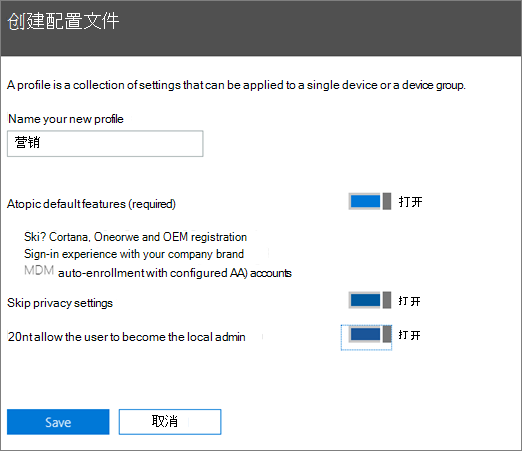
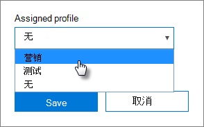

# 创建和编辑 AutoPilot 配置文件

> [!NOTE]
> 从 2022 年 3 月 1 Microsoft 365 商业高级版 Microsoft Defender for Business 将推出给客户。 此产品/服务为设备提供其他安全功能。 [详细了解 Defender for Business](../../security/defender-business/mdb-overview.md)。

## 创建配置文件

配置文件适用于单个设备或一组设备，
  
1. In the Microsoft 365 管理中心， choose **Devices** \> **AutoPilot**.
  
2. 在 **AutoPilot 页面上**，**选择配置文件选项卡** 创建\>**配置文件**。
    
3. 在 **"创建配置文件** "页上，输入可帮助您标识该配置文件的名称，例如 Marketing。 打开您想要的设置，然后选择"保存 **"**。 有关 AutoPilot 配置文件设置详细信息，请参阅关于 [AutoPilot 配置文件设置](autopilot-profile-settings.md)。
    
    
  
### 对设备应用配置文件

创建配置文件后，你可以将配置文件应用于设备或一组设备。 可以在分步指南中选取现有配置文件并将其应用到新设备，或者替换设备或设备组的现有配置文件。 
  
1. 在" **准备 Windows**"页面上，选择" **设备**"选项卡。 
    
2. 选中设备名称旁边的复选框，在"设备"面板中，从"已分配配置文件"下拉列表"保存"**中选择配置文件。**\>
    
    
  
## 编辑、删除或移除配置文件

将配置文件分配给一个设备后，便可以更新该文件，即使已将该设备提供给一个用户。如果设备连接了 internet，系统会在设置过程中下载最新版本的配置文件。如果用户将其设备恢复为出厂默认设置，设备将再次下载配置文件的最新更新。 
  
### 编辑配置文件

1. 在" **准备 Windows**"页面上，选择" **配置文件**"选项卡。 
    
2. 选中设备名称旁边的复选框，在"配置文件"面板中更新任何可用的设置\>"保存 **"**。
    
    如果在用户将设备连接到 internet 之前执行此操作，配置文件会应用于设置过程。
    
### 删除配置文件

1. 在" **准备 Windows**"页面上，选择" **配置文件**"选项卡。 
    
2. 选中设备名称旁边的复选框，在"配置文件"面板中，选择"删除配置文件""**保存** \> **"**。
    
    如果删除了配置文件，该文件会从之前分配到的一个或一组设备中移除。
    
### 移除配置文件

1. 在" **准备 Windows**"页面上，选择" **设备**"选项卡。 
    
2. 选中设备名称旁边的复选框，在"设备"面板中，从"已分配配置文件"下拉列表中选择"无""保存\>**"**。
    
## 另请参阅

[保护业务Microsoft 365的十大方法](../security-and-compliance/secure-your-business-data.md)