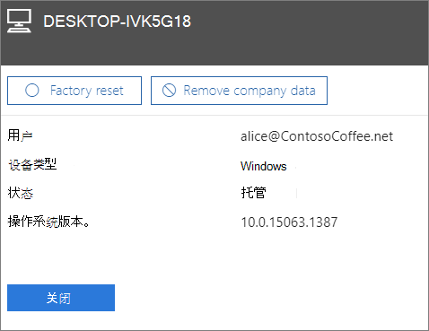

# 从设备中删除公司数据

本文适用于Microsoft 365 商业高级版。

## 删除公司数据

可以使用适用于Microsoft 365来删除用户具有的设备或受 Windows 保护的 PC 上的公司Microsoft 365。  **从设备中删除公司数据后，该数据不可恢复** 。 
  
1. 转到位于 <a href="https://go.microsoft.com/fwlink/p/?linkid=837890" target="_blank">https://admin.microsoft.com</a> 的管理中心。
    
2. 在左侧导航中，选择 **"设备管理** \> **"。**  
  
3. 在 **"管理** "页上，选择或搜索要删除的数据的用户，然后选择该名称。 
    
4. 在下一个窗格中，从"设备"列表中选择 **一个或多个** 设备。 在打开的设备窗格中，你可以选择将设备重置为出厂设置或删除公司数据，具体取决于设备类型。 
    
    
  
5. 在确认窗格中，选择确认 \> **关闭**。
    

