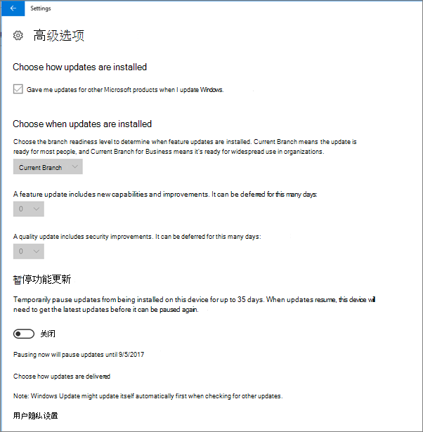

# 验证电脑的设备Windows 10设置

> [!NOTE]
> 从 2022 年 3 月 1 Microsoft 365 商业高级版 Microsoft Defender for Business 将推出给客户。 此产品/服务为设备提供其他安全功能。 [详细了解 Defender for Business](../../security/defender-business/mdb-overview.md)。

## 验证Windows 10策略是否设置

设置 [设备策略后](protection-settings-for-windows-10-pcs.md)，策略可能需要几个小时才能在用户的设备上生效。 通过查看用户设备上的各个Windows 设置，可以确认策略是否生效。 由于用户无法修改 Windows 更新和Microsoft Defender 防病毒上的 Windows 10 设置，因此许多选项将灰显。
  
1. Go to **设置** \> **Update &amp; security** \> **Windows Update** \> **Restart options** and confirm that all settings are grayed out. 
    
    
  
2. Go to **设置** \> **Update &amp; security Windows** \> **Update** \> **Advanced options** and confirm that all settings are grayed out. 
    
    
  
3. Go to **设置** \> **Update security &amp;** \> **Windows Update** \> **Advanced options** \> **Choose how updates are delivered**.
    
    确认你能看到红色 (显示) 某些设置被组织隐藏或管理，并且所有选项都显示为灰色。
    
    
  
4. 若要打开Windows Defender安全中心， \>  \> **&amp;** \>请转到设置更新Windows Defender打开Windows Defender **病毒**\>线程保护 **病毒&amp;** \> **&amp;威胁防护设置"** 。 
    
5. 验证所有选项是否灰显。 
    
    
  
## 相关内容

[Microsoft 365文档和资源](/admin)\
[为 PCsTop](protection-settings-for-windows-10-pcs.md)
 [10 Windows 10设置](../security-and-compliance/secure-your-business-data.md)设备配置，以确保Microsoft 365计划的安全