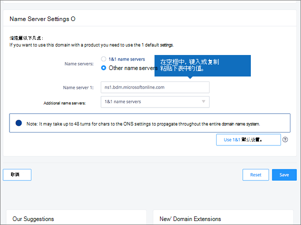
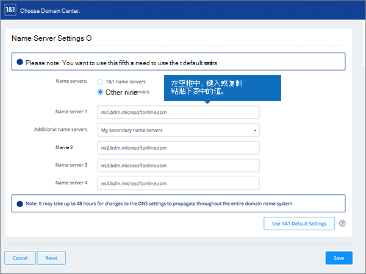

# 更改名称服务器以使用 1&1 IONOS 设置 Microsoft 365

 如果找不到要查找的内容，请**[查看域常见问题解答](../setup/domains-faq.md)**。 
  
如果你希望 Microsoft 365 为你管理 Microsoft 365 DNS 记录，请按照以下说明操作。 （如果你愿意，可以[在 1&1 IONOS 管理所有 Microsoft 365 DNS 记录](create-dns-records-at-1-1-internet.md)。） 
  

    
## 添加 TXT 记录进行验证

在将域用于 Microsoft 365 之前，必须确保你拥有该域。如果你能够在域注册机构处登录到你的帐户并创建 DNS 记录，便可向 Microsoft 365 证明你是域所有者。
  
> [!NOTE]
> 此记录仅用于验证您是否拥有自己的域；它不会影响其他任何内容。 如果需要，您可以以后将其删除。 
  
请按下列步骤操作或[观看视频（从 0:42 开始）](https://support.office.com/article/Video-Change-nameservers-to-set-up-Office-365-with-1-1-Internet-0ef1b3b5-d27a-4004-8ca1-fbe0453a0ea3?ui=en-US&amp;rs=en-US&amp;ad=US)。
  
1. 若要开始，请转到域页面 1&1 IONOS 通过[此链接](https://account.1and1.com/?redirect_url=https%3A%2F%2Fmy.1and1.com%2F)。 You'll be prompted to log in. 
    
2. 在 **"我的域**" 下，选择 "**管理域**"。
    
3. 在 "**域中心**" 页上，找到要更新的域;然后，选择该域的 **"面板"** （ **v**）控件。
    
4. 在 "**域设置**" 区域中，选择 "**编辑 DNS 设置**"。
    
5. 在 " **TXT 和 SRV 记录**" 部分中，选择 "**添加记录**"。
    
    (You may have to scroll down.) 
    
6. In the **Add Record** area, in the boxes for the new record, type or copy and paste the values from the following table. 
    
||||
|:-----|:-----|:-----|
|**类型**   |**前缀**   |**名称值**   |
|TXT    |(Leave this field empty.)    |MS=ms *XXXXXXXX*   **注意**：这是一个示例。 在这里使用来自 Microsoft 365 中的表的具体“**目标地址或指向的地址**”值。 [如何查找此项？](../get-help-with-domains/information-for-dns-records.md)   |

   
7. 选择 "**保存**"，然后重新**保存**。 
    
8. 在 "**编辑 DNS 设置**" 对话框中，选择 **"是"**。
    
9. 请在继续之前等待数分钟，以便您刚刚创建的记录可以通过 Internet 完成更新。
    
在域注册机构网站添加了记录后，你将返回到 Microsoft 365 并请求 Microsoft 365 查找记录。
  
Microsoft 365 找到正确的 TXT 记录表明域已通过验证。
  
1. 在管理中心，转到“**设置**”\>“<a href="https://go.microsoft.com/fwlink/p/?linkid=834818" target="_blank">域</a>”页面。
    
2. 在“**域**”页面上，选择要验证的域。 
    
3. 在“**设置**”页面上，选择“**开始设置**”。
    
4. 在“**验证域**”页面上，选择“**验证**”。
    
> [!NOTE]
> Typically it takes about 15 minutes for DNS changes to take effect. 但是，有时可能需要更长时间，您所做的更改才会在 Internet 的 DNS 系统中更新。 如果添加 DNS 记录后遇到邮件流问题或其他问题，请参阅[在 Microsoft 365 中添加域或 DNS 记录后，查找并修复问题](../get-help-with-domains/find-and-fix-issues.md)。 
  
## 更改域的名称服务器 (NS) 记录

若要使用 Microsoft 365 完成域的设置，请在域注册机构更改域的 NS 记录以指向 Microsoft 365 主要和辅助名称服务器。 这会将 Microsoft 365 设置为你为你更新域的 DNS 记录。 我们将添加所有记录，以便电子邮件、Skype for Business Online 和你的公共网站全部设置为使用你的域。
  
> [!CAUTION]
> 当您将您的域的 NS 记录更改为指向 Microsoft 365 的名称服务器时，当前与您的域相关联的所有服务都会受到影响。 例如，在进行此更改后，发送到您的域的所有电子邮件（如 rob@ *your_domain* .com）都将启动到 Microsoft 365。 
  
准备好更改你的 NS 记录，以便 Microsoft 365 能够设置你的域了吗？ 请按下列步骤操作或[观看视频（从 2:47 开始）](https://support.office.com/article/Video-Change-nameservers-to-set-up-Office-365-with-1-1-Internet-0ef1b3b5-d27a-4004-8ca1-fbe0453a0ea3?ui=en-US&amp;rs=en-US&amp;ad=US)。
  
> [!IMPORTANT]
>  下面的过程将向您介绍如何从列表中删除任何其他不需要的名称服务器，以及如何添加正确的名称服务器（如果尚未列出）。 > 完成本节中的步骤后，应列出的唯一名称服务器为以下四个： > ns1.bdm.microsoftonline.com > ns2.bdm.microsoftonline.com > ns3.bdm.microsoftonline.com > ns4.bdm.microsoftonline.com 
  
1. 若要开始，请使用[此链接](https://account.1and1.com/?redirect_url=https%3A%2F%2Fmy.1and1.com%2F)转到域页面 1&1 IONOS。 You'll be prompted to log in. 
    
2. 在 **"我的域**" 下，选择 "**管理域**"。
    
3. 在 "**域中心**" 页上，找到要更新的域，然后选择该域的 **"面板"** （ **v**）控制。
    
4. 在 "**域设置**" 区域中，选择 "**编辑 DNS 设置**"。
    
5. 在" **名称服务器设置**"部分中，选择" **其他名称服务器**"。
    
    （您可能需要向下滚动。）
    
6. 根据现在显示的页面上是否已列出名称服务器，继续执行以下两个过程之一：
    
  - 如果 **未** 列出名称服务器，则 [如果未列出名称服务器](#if-there-are-no-nameservers-already-listed)。
    
  - 如果 **已** 列出名称服务器，则 [如果已列出名称服务器](#if-there-are-nameservers-already-listed)。
    
### 如果未列出名称服务器

1. 在" **名称服务器 1**"框内，键入或复制并粘贴下表中的值。 
    
|||
|:-----|:-----|
|**名称服务器 1**   |ns1.bdm.microsoftonline.com    |
   
   
  
2. 在" **其他名称服务器**"下拉列表中，选择" **我的辅助名称服务器**"。
    
    
  
3. 在" **名称服务器 2、3 和 4**"框内，键入或复制并粘贴下表中的值。 
    
|||
|:-----|:-----|
|**名称服务器 2**   |ns2.bdm.microsoftonline.com    |
|**名称服务器 3**   |ns3.bdm.microsoftonline.com    |
|**名称服务器 4**   |ns4.bdm.microsoftonline.com    |
   

  
4. 选择“**保存**”。
    
    
  
5. 在 "**编辑 DNS 设置**" 对话框中，选择 **"是"**。
    
    
  
> [!NOTE]
> Your nameserver record updates may take up to several hours to update across the Internet's DNS system. 然后，你的 Microsoft 电子邮件和其他服务将全部设置为与你的域一起使用。 
  
### 如果已列出名称服务器

> [!CAUTION]
> *仅*  当具有这四个  *正确*  的名称服务器以外的现有名称服务器时，执行以下步骤。（即，  *仅*  删除名称  *不是* **ns1.bdm.microsoftonline.com** 、 **ns2.bdm.microsoftonline.com** 、 **ns3.bdm.microsoftonline.com** 或 **ns4.bdm.microsoftonline.com** 的任何当前名称服务器。） 
  
1. 如果" **名称服务器**"框中已列有名称服务器，通过选择每一项，然后按键盘上的 **Delete** 键，将其删除。 
    
    
  
2. 在" **名称服务器 1、2、3 和 4**"框内，键入或复制并粘贴下表中的值。 
    
|||
|:-----|:-----|
|**名称服务器 1**   |ns1.bdm.microsoftonline.com    |
|**名称服务器 2**   |ns2.bdm.microsoftonline.com    |
|**名称服务器 3**   |ns3.bdm.microsoftonline.com    |
|**名称服务器 4**   |ns4.bdm.microsoftonline.com    |
   
   
  
3. 选择“**保存**”。
    
    
  
4. 在 "**编辑 DNS 设置**" 对话框中，选择 **"是"**。
    
    
  
> [!NOTE]
> Your nameserver record updates may take up to several hours to update across the Internet's DNS system. 然后，你的 Microsoft 电子邮件和其他服务将全部设置为与你的域一起使用。 
  

