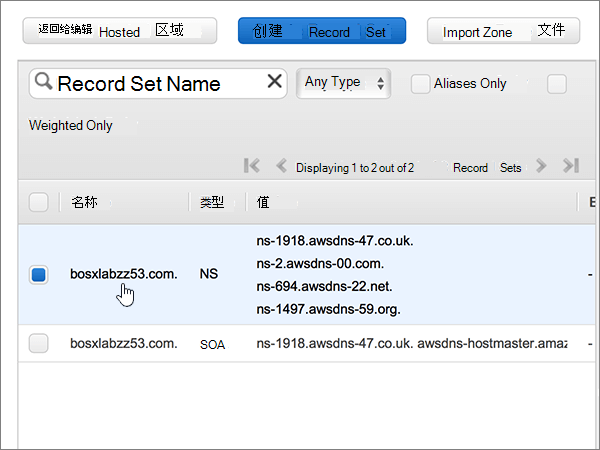
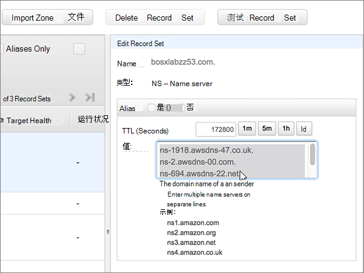

# 使用 Amazon Web Services (AWS) 更改名称服务器以设置 Office 365

 **如果找不到要查找的内容，请[查看域常见问题解答](../setup/domains-faq.md)** 。 
  
如果希望 Office 365 管理你的 Office 365 DNS 记录，请按照以下说明操作。 （如果愿意，你可以[在 AWS 中管理所有 Office 365 DNS 记录](create-dns-records-at-aws.md)。）
  
    
## 添加 TXT 记录进行验证

在将域用于 Office 365 之前，必须确保你拥有该域。如果你能够在域注册机构处登录到你的帐户并创建 DNS 记录，便可向 Office 365 证明你是所有者。
  
> [!NOTE]
> 此记录仅用于验证您是否拥有自己的域；它不会影响其他任何内容。 如果需要，您可以以后将其删除。 
  
1. 要开始，请使用[此链接](https://console.aws.amazon.com/route53/home)转到你在 AWS 上的域页面。 系统将会提示您先登录。
    
2. 在 "**资源**" 页上，选择 "**托管区域**"。
    
3. 在 "**托管区域**" 页上的 "**域名**" 列中，选择要编辑的域的名称。 
    
4. 选择 "**创建记录集**"。
    
5. In the **Create Record Set** area, in the boxes for the new record, type or copy and paste the values from the following table. 
    
    (Choose the **Type** and **Routing Policy** values from the drop-down lists.) 
    
    > [!TIP]
    > The quotation marks required by the onscreen instructions are supplied automatically. You don't need to type them manually. 
  
|||||||
|:-----|:-----|:-----|:-----|:-----|:-----|
|**名称**   |**Type**   |**别名**   |**TTL（秒）**   |**值**   |**路由策略**   |
|（将此字段留空）    |TXT - Text    |否    |300    |MS=ms *XXXXXXXX*   **注意：** 此为示例。 在这里使用来自 Office 365 中的表的具体**目标地址或指向的地址**值。 [如何查找此项？](../get-help-with-domains/information-for-dns-records.md)     |简单   |
   
6. 选择“**创建**”。
    
7. 请在继续之前等待数分钟，以便您刚刚创建的记录可以通过 Internet 完成更新。
    
现在你已在域注册机构网站添加了记录，然后将返回到 Office 365 并请求 Office 365 查找记录。
  
Office 365 找到正确的 TXT 记录时，表明你的域已通过验证。
  
1. 在管理中心，转到“**设置**”\> <a href="https://go.microsoft.com/fwlink/p/?linkid=834818" target="_blank">域</a>页面。

    
2. 在“**域**”页面上，选择要验证的域。 
    
3. 在“**设置**”页面上，选择“**开始设置**”。
    
4. 在“**验证域**”页面上，选择“**验证**”。
    
> [!NOTE]
> Typically it takes about 15 minutes for DNS changes to take effect. 但是，有时可能需要更长时间，您所做的更改才会在 Internet 的 DNS 系统中更新。 如果在添加 DNS 记录后遇到邮件流问题或其他问题，请参阅[查找在将域或 DNS 记录添加到 Office 365 后遇到的问题并进行修复](../get-help-with-domains/find-and-fix-issues.md)。 
  
## 更改域的名称服务器 (NS) 记录

要使用 Office 365 完成域的设置，请在域注册机构处将你的域的 NS 记录更改为指向 Office 365 主要名称服务器和次要名称服务器。这将设置 Office 365 以更新域的 DNS 记录。我们将添加所有记录，以便电子邮件、Skype for Business Online 和你的公共网站全部设置为使用你的域。
  
> [!CAUTION]
> 将你的域的 NS 记录更改为指向 Office 365 名称服务器时，当前与你的域相关联的所有服务都会受影响。例如，在你进行此更改之后，发送到你的域（例如 rob@ *your_domain*  .com）的所有电子邮件都将开始传送到 Office 365。 
  
> [!IMPORTANT]
>  下面的过程将向您介绍如何从列表中删除任何其他不需要的名称服务器，以及如何添加正确的名称服务器（如果尚未列出）。 > 完成本节中的步骤后，应列出的唯一名称服务器为以下四个： > ns1.bdm.microsoftonline.com > ns2.bdm.microsoftonline.com > ns3.bdm.microsoftonline.com > ns4.bdm.microsoftonline.com 
  
1. 要开始，请使用[此链接](https://console.aws.amazon.com/route53/home)转到你在 AWS 上的域页面。 系统将会提示您先登录。
    
2. 在 "**资源**" 页上，选择 "**托管区域**"。
    
3. 在 "**托管区域**" 页上的 "**域名**" 列中，选择要编辑的域的名称。 
    
4. 选择" **名称服务器**"记录集。 
    
    
  
5. 在" **值**"框中的" **NS - 名称服务器**"记录集中，通过将它们全部选中并按键盘上的 **Delete** 键来删除所有名称服务器。 
    
    > [!CAUTION]
    > Follow these steps only if you have existing nameservers other than the four correct nameservers. （也就是说，仅删除任何*未*命名为**ns1.bdm.microsoftonline.com**、 **ns2.bdm.microsoftonline.com**、 **ns3.bdm.microsoftonline.com**或**ns4.bdm.microsoftonline.com**的当前名称服务器。） 
  
    
  
6. 在 " **TTL （秒）：** " 区域中，选择**1H** （1小时）。 
    
    
  
7. 仍在" **NS - 名称服务器**"记录集的" **值**"框中，键入或复制粘贴下表" **第一行**"的值，然后按键盘上的 **Enter** 键，键入或复制粘贴" **下一行**"的值。 
    
    > [!IMPORTANT]
    > 每个名称服务器值 *必须*  位于" **值** "框中其自己单独的行上，如下图所示。 
  
|||
|:-----|:-----|
|**第一行**   |ns1.bdm.microsoftonline.com。    **This value MUST end with a period (.)**   |
|**第二行**   |ns2.bdm.microsoftonline.com。    **This value MUST end with a period (.)**   |
|**第三行**   |ns3.bdm.microsoftonline.com。    **此值必须以句点 (.) 结尾。**   |
|**第四行**   |ns4.bdm.microsoftonline.com。    **此值必须以句点 (.) 结尾。**   |
   
   
  
8. 选择 "**保存记录集**"。
    
    
  
> [!NOTE]
> 你的名称服务器记录更新可能需要多达数小时才能在 Internet 的 DNS 系统中更新。然后，你的 Office 365 电子邮件和其他服务将全部设置为使用你的域。 
