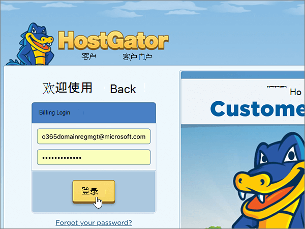
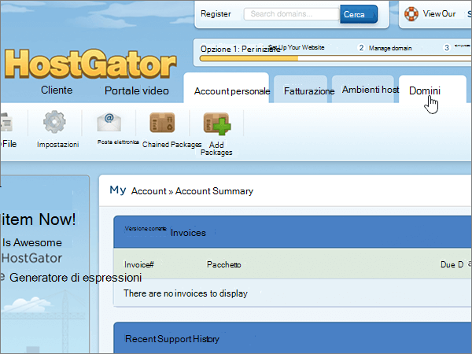
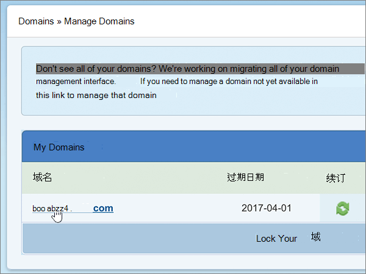

# 更改名称服务器以使用 Hostgator 设置 Microsoft 365

 如果找不到要查找的内容，请**[查看域常见问题解答](../setup/domains-faq.md)**。
  
如果希望 Microsoft 为你管理 DNS 记录，请按照以下说明操作。 （如果愿意，您可以[在 Hostgator 管理所有 MICROSOFT DNS 记录](create-dns-records-at-hostgator.md)。）
  
    
## 将域指向托管帐户。

> [!IMPORTANT]
> 必须先执行此过程，才能执行以下 **添加 TXT 记录进行验证** 部分中的过程。
  
请按以下步骤将域与托管帐户关联。
  
1. 若要开始，请使用[此链接](https://portal.hostgator.com/domain/manage)转到 Hostgator 上的客户门户页面。系统将提示登录。
    
    
  
2. 选择 "**域**" 选项卡。
    
    
  
3. 在 "**管理域**" 页上的 "**我的域**" 区域中，选择要更新的域。
    
    
  
4. 在 "**域概述**" 页上的 "**名称服务器**" 区域中，选择 "**更改**"。
    
    
  
5. 在您的域的 "**名称服务器**" 页上的 "**选择托管帐户**" 下拉列表中，选择与您的域关联的**主机帐户**。
    
    
  
6. 选择 "**保存名称服务器**"。
    
    
  
## 添加 TXT 记录进行验证

> [!IMPORTANT]
> 在执行此过程之前，您必须先执行本文第一节中的过程，[将您的域指向您的托管帐户。](#point-your-domain-to-your-hosting-account)。
  
在将域用于 Microsoft 之前，必须确保你拥有该域。如果你能够在域注册机构处登录到你的帐户并创建 DNS 记录，便可向 Microsoft 证明你是域所有者。
  
> [!NOTE]
> 此记录仅用于验证您是否拥有自己的域；它不会影响其他任何内容。 如果需要，您可以以后将其删除。
  
1. 若要开始，请转到您在 Hostgator 上的 cPanel 页面。 系统将会提示您先登录。
    
    （Hostgator 上的每个托管帐户都分配有一个唯一的 cPanel 地址。 您的 cPanel 地址应如下所示：https://YourSiteAddress:secure-port-number。 由您从 Hostgator 收到的注册电子邮件地址指定该地址。）
    
    > [!IMPORTANT]
    > To have a cPanel associated with your domain, you need a hosting account with Hostgator. 若要开始，可以从 Hostgator 购买托管帐户，或[将您的域的名称服务器（NS）记录更改](#change-your-domains-nameserver-ns-records)为指向 Microsoft。 
  
2. 在 "**控制面板**" 页上的 "**域**" 区域中，选择 "**高级 DNS 区域编辑器**"。
    
    (You may have to scroll down.) 
    
3. On the **Advanced DNS Zone Editor** page, in the **Add a Record** area, in the boxes for the new record, type or copy and paste the values from the following table. 
    
    （从下拉列表中选择" **类型**"值。） 
    
|||||
|:-----|:-----|:-----|:-----|
|**名称**   |**TTL**   |**类型**   |**TXT 数据**   |
|使用您的*domain_name* 。 （例如，fourthcoffee.com.)。    **此值必须以句点 (.) 结尾。**   |1     |TXT    |MS=ms *XXXXXXXX*    **注意：** 这是一个示例。 在这里使用表中的特定“**目标地址或指向的地址**”值。 [如何查找此项？](../get-help-with-domains/information-for-dns-records.md)        |
   
4. 选择 "**添加记录**"。
    
5. 请在继续之前等待数分钟，以便您刚刚创建的记录可以通过 Internet 完成更新。
    
现在您已在域注册机构的网站上添加了记录，您将返回到 Microsoft 并请求搜索该记录。
  
Microsof 找到正确的 TXT 记录表明域已通过验证。
  
1. 在管理中心，转到“**设置**”\>“<a href="https://go.microsoft.com/fwlink/p/?linkid=834818" target="_blank">域</a>”页面。

    
2. 在“**域**”页面上，选择要验证的域。 
    
3. 在“**设置**”页面上，选择“**开始设置**”。
    
4. 在“**验证域**”页面上，选择“**验证**”。
    
> [!NOTE]
> Typically it takes about 15 minutes for DNS changes to take effect. 但是，有时可能需要更长时间，您所做的更改才会在 Internet 的 DNS 系统中更新。 如果在添加 DNS 记录后遇到邮件流问题或其他问题，请参阅[查找在添加域或 DNS 记录后遇到的问题并进行修复](../get-help-with-domains/find-and-fix-issues.md)。 
  
## 更改域的名称服务器 (NS) 记录

若要使用 Microsoft 完成域的设置，请在域注册机构更改您的域的 NS 记录以指向 Microsoft 主名称服务器和辅助名称服务器。 这将设置 Microsoft 为您更新域的 DNS 记录。 我们将添加所有记录，以便电子邮件、Skype for Business Online 和你的公共网站全部设置为使用你的域。
  
> [!CAUTION]
> 当您将您的域的 NS 记录更改为指向 Microsoft 名称服务器时，当前与您的域相关联的所有服务都将受到影响。 例如，在进行此更改后，发送到您的域的所有电子邮件（如 rob@ *your_domain* .com）都将启动到 Microsoft。
  
> [!IMPORTANT]
> 下面的过程将向您介绍如何从列表中删除任何其他不需要的名称服务器，以及如何添加正确的名称服务器（如果尚未列出）。 完成本节中的步骤后，应列出的唯一名称服务器为以下四个： **ns1.bdm.microsoftonline.com**、 **ns2.bdm.microsoftonline.com**、 **ns3.bdm.microsoftonline.com**和**ns4.bdm.microsoftonline.com**。
  
1. 若要开始，请使用[此链接](https://portal.hostgator.com/domain/manage)转到 Hostgator 上的客户门户页面。系统将提示登录。
    
    
  
2. 选择 "**域**" 选项卡。 
    
    
  
3. 在 "**管理域**" 页上的 "**我的域**" 区域中，选择要更新的域。 
    
    
  
4. 在 "**域概述**" 页上的 "**名称服务器**" 区域中，选择 "**更改**"。
    
    
  
5. 在您的域的 "**名称服务器**" 页上的 "**选择托管帐户**" 下拉列表中，选择与您的域关联的**主机帐户**。 
    
    
  
6. 选择 **"手动设置我的名称服务器"**。
    
    
  
7.   **警告**：仅当现有名称服务器不是四个正确的名称服务器时，才执行这些步骤。 （也就是说，仅删除任何*未*命名为**ns1.bdm.microsoftonline.com**、 **ns2.bdm.microsoftonline.com**、 **ns3.bdm.microsoftonline.com**或**ns4.bdm.microsoftonline.com**的当前名称服务器。）
  
        在域的" **名称服务器**"页面的名称服务器列表中，删除列表中的每个名称服务器，具体方法是将其选中，然后按键盘上的 **Delete** 键。 
    
   
  
8. 在名称服务器列表中，键入或复制并粘贴下表中的前两个值。
    
|||
|:-----|:-----|
|**名称服务器 1：**   |ns1.bdm.microsoftonline.com    |
|**名称服务器 2：**   |ns2.bdm.microsoftonline.com    |
|**名称服务器 3：**   |ns3.bdm.microsoftonline.com    |
|**名称服务器 4：**   |ns4.bdm.microsoftonline.com    |
   
   
  
9. 添加其他名称服务器值。
    
    选择 " **（+）** 添加"，然后将表中下一行的值键入或复制并粘贴到该记录的框中。 
    
    重复该过程，直到创建完全部 4 条名称服务器记录。
    
    
  
10. 选择 "**保存名称服务器**"。
    
    
  
> [!NOTE]
> 你的名称服务器记录更新可能需要多达数小时才能在 Internet 的 DNS 系统中更新。 然后，你的 Microsoft 电子邮件和其他服务将全部设置为与你的域一起使用。
