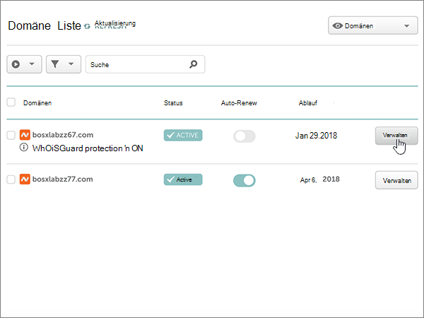
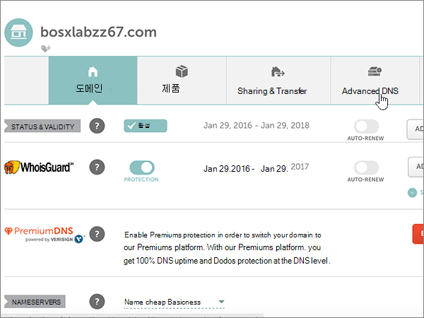
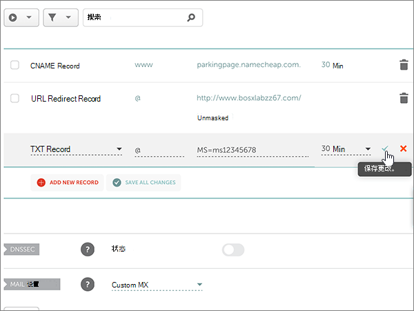
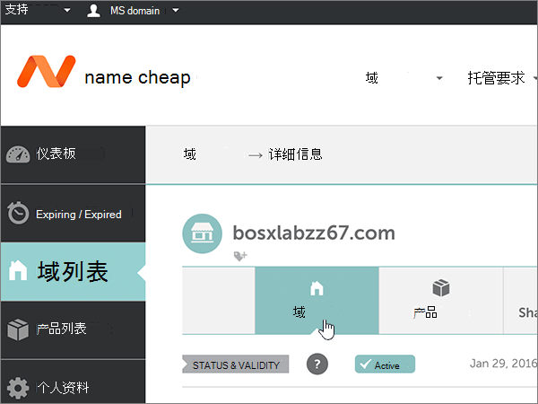

# 更改名称服务器以使用 Namecheap 设置 Microsoft

 如果找不到要查找的内容，请**[查看域常见问题解答](../setup/domains-faq.md)**。
  
如果希望 Microsoft 为你管理 DNS 记录，请按照以下说明操作。 （如果愿意，您可以[在 Namecheap 管理所有 MICROSOFT DNS 记录](create-dns-records-at-namecheap.md)。）
  
    
## 添加 TXT 记录进行验证

1. 若要开始，请使用[此链接](https://www.namecheap.com/myaccount/login.aspx?ReturnUrl=%2f)转到 Namecheap 上的 "域" 页面。 系统将提示您登录并继续。
    
    
  
2. 在 "**登录**" 页面上的 "**帐户**" 下，从下拉列表中选择 "**域列表**"。 
    
    
  
3. 在 "**域列表**" 页上，找到要编辑的域的名称，然后选择 "**管理**"。
    
    
  
4. 选择 "**高级 DNS**"。
    
    
  
5. 在 "**主机记录**" 部分，选择 "**添加新记录**"。
    
    
  
6. 在 "**类型**" 下拉中，选择 " **TXT 记录**"。
    
    > [!NOTE]
    > 当您选择 "**添加新记录**" 时，"类型" 下拉**类型**将自动显示。
  
    
  
7. 在新记录的框中，键入或复制并粘贴下表中的值。
    
    （从下拉列表中选择 " **TTL** " 值。） 
    
|**类型**|**主机**|**值**|**TTL**|
|:-----|:-----|:-----|:-----|
|TXT    |@    |MS=ms *XXXXXXXX*    **注意**：这是一个示例。 从表中使用您的特定**目标或指向 "地址**" 值。           [如何查找此项？](../get-help-with-domains/information-for-dns-records.md)          |30分钟    |
   
   
  
8. 选择 "**保存更改**" （复选标记）控件。 
    
    
  
9. 请在继续之前等待数分钟，以便您刚刚创建的记录可以通过 Internet 完成更新。
    
现在您已在域注册机构的网站上添加了记录，您将返回到 Microsoft 并请求搜索该记录。
  
当 Microsoft 找到正确的 TXT 记录时，您的域将会得到验证。
  
1. 在管理中心，转到“**设置**”\> <a href="https://go.microsoft.com/fwlink/p/?linkid=834818" target="_blank">域</a>页面。

    
2. 在“**域**”页面上，选择要验证的域。 
    
    
  
3. 在“**设置**”页面上，选择“**开始设置**”。
    
    
  
4. 在“**验证域**”页面上，选择“**验证**”。
    
    
  
> [!NOTE]
>  DNS 更改通常需要 15 分钟左右才能生效。 但是，有时可能需要更长时间，您所做的更改才会在 Internet 的 DNS 系统中更新。 如果添加 DNS 记录后遇到邮件流问题或其他问题，请参阅 [更改域名或 DNS 记录后出现的问题的疑难解答](../get-help-with-domains/find-and-fix-issues.md)。 
  
## 更改域的名称服务器 (NS) 记录

若要使用 Microsoft 完成域的设置，请在域注册机构更改您的域的 NS 记录以指向 Microsoft 主名称服务器和辅助名称服务器。 这将设置 Microsoft 为您更新域的 DNS 记录。 我们将添加所有记录，以便电子邮件、Skype for Business Online 和你的公共网站全部设置为使用你的域。
  
> [!CAUTION]
> 当您将您的域的 NS 记录更改为指向 Microsoft 名称服务器时，当前与您的域相关联的所有服务都将受到影响。 例如，在进行此更改后，发送到您的域的所有电子邮件（如 rob@ *your_domain* .com）都将启动到 Microsoft。 
  
> [!IMPORTANT]
>  完成本部分中的步骤后，应  *仅*  列出以下四个名称服务器： >  ns1.bdm.microsoftonline.com >  ns2.bdm.microsoftonline.com >  ns3.bdm.microsoftonline.com >  ns4.bdm.microsoftonline.com >  以下过程将演示如何从列表中删除任何其他不需要的名称服务器，以及如何添加  *正确*  的名称服务器（如果它们尚未显示在列表中）。 
  
1. 若要开始，请使用[此链接](https://www.namecheap.com/myaccount/login.aspx?ReturnUrl=%2f)转到 Namecheap 上的 "域" 页面。 系统将提示您登录并继续。
    
    
  
2. 在 "**登录**" 页面上的 "**帐户**" 下，从下拉列表中选择 "**域列表**"。 
    
    
  
3. 在 "**域列表**" 页上，找到要编辑的域的名称，然后选择 "**管理**"。
    
    
  
4. 选择 "**域**"。
    
    
  
5. 找到 "**名称服务器**" 部分，然后从 " **Namecheap 默认**" 下拉列表中选择 "**自定义**"。 
    
    
  
6. 根据现在显示的页面上是否已列出名称服务器，继续执行以下两个过程之一。
    
### 如果未列出名称服务器

1. 选择 "**添加**名称服务器" 两次，添加两个新行。
    
    
  
2. 在 "名称服务器 **" 框中**，键入或复制并粘贴下表中的值。
    
|||
|:-----|:-----|
|**名称服务器 1**   |ns1.bdm.microsoftonline.com    |
|**名称服务器 2**   |ns2.bdm.microsoftonline.com    |
|**名称服务器 3**   |ns3.bdm.microsoftonline.com    |
|**名称服务器 4**   |ns4.bdm.microsoftonline.com    |
   
   
  
3. 选择 "**保存**" （复选标记）控件。 
    
    
  
> [!NOTE]
> Your nameserver record updates may take up to several hours to update across the Internet's DNS system. 然后，你的 Microsoft 电子邮件和其他服务将全部设置为与你的域一起使用。 
  
### 如果已列出名称服务器

> [!CAUTION]
> *仅*  当具有这四个  *正确*  的名称服务器以外的现有名称服务器时，执行以下步骤。（即，  *仅*  删除名称  *不是* **ns1.bdm.microsoftonline.com** 、 **ns2.bdm.microsoftonline.com** 、 **ns3.bdm.microsoftonline.com** 或 **ns4.bdm.microsoftonline.com** 的任何当前名称服务器。） 
  
1. 如果在**Nameserver**框中列出了任何其他名称服务器，则通过选择它并按键盘上的**delete**键来删除每个。 
    
    
  
2. 选择 "**添加**名称服务器" 两次，添加两个新行。 
    
    
  
3. 在 "名称服务器 **" 框中**，键入或复制并粘贴下表中的值。
 
    
|||
|:-----|:-----|
|**名称服务器 1**   |ns1.bdm.microsoftonline.com    |
|**名称服务器 2**   |ns2.bdm.microsoftonline.com    |
|**名称服务器 3**   |ns3.bdm.microsoftonline.com    |
|**名称服务器 4**   |ns4.bdm.microsoftonline.com    |
   
   
  
4. 选择 "**保存**" （复选标记）控件。 
    
    
  
> [!NOTE]
> Your nameserver record updates may take up to several hours to update across the Internet's DNS system. 然后，你的 Microsoft 电子邮件和其他服务将全部设置为与你的域一起使用。
