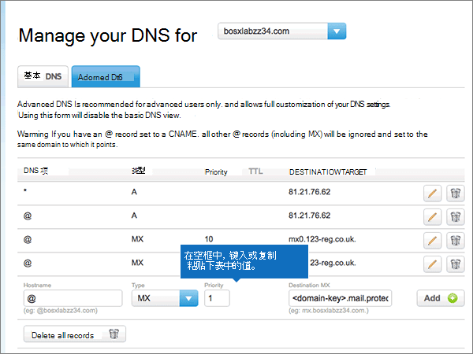
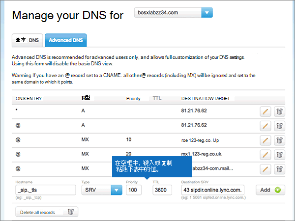

# 在123-reg.co.uk 处为 Microsoft 创建 DNS 记录Create DNS records at 123-reg.co.uk for Microsoft

 **如果找不到要查找的内容，请[查看域常见问题解答](../setup/domains-faq.md)** 。**[Check the Domains FAQ](../setup/domains-faq.md)** if you don't find what you're looking for. 
  
如果 DNS 托管提供者是 123-reg.co.uk，请按本文中的步骤验证域并为电子邮件、Skype for Business Online 等设置 DNS 记录。If 123-reg.co.uk is your DNS hosting provider, follow the steps in this article to verify your domain and set up DNS records for email, Skype for Business Online, and so on.
  
在123-reg.co.uk 中添加这些记录后，您的域将设置为与 Microsoft 服务一起使用。After you add these records at 123-reg.co.uk, your domain will be set up to work with Microsoft services.
  
  
> [!NOTE]
> Typically it takes about 15 minutes for DNS changes to take effect.Typically it takes about 15 minutes for DNS changes to take effect. 但是，有时可能需要更长时间，您所做的更改才会在 Internet 的 DNS 系统中更新。However, it can occasionally take longer for a change you've made to update across the Internet's DNS system. 如果在添加 DNS 记录后遇到邮件流问题或其他问题，请参阅[查找在添加域或 DNS 记录后遇到的问题并进行修复](../get-help-with-domains/find-and-fix-issues.md)。If you're having trouble with mail flow or other issues after adding DNS records, see [Find and fix issues after adding your domain or DNS records](../get-help-with-domains/find-and-fix-issues.md). 
  
## 添加 TXT 记录进行验证Add a TXT record for verification

在将域用于 Microsoft 之前，必须确保你拥有该域。如果你能够在域注册机构处登录到你的帐户并创建 DNS 记录，便可向 Microsoft 证明你是域所有者。Before you use your domain with Microsoft, we have to make sure that you own it. Your ability to log in to your account at your domain registrar and create the DNS record proves to Microsoft that you own the domain.
  
> [!NOTE]
> 此记录仅用于验证您是否拥有自己的域；它不会影响其他任何内容。 如果需要，您可以以后将其删除。This record is used only to verify that you own your domain; it doesn't affect anything else. You can delete it later, if you like. 
  
1. 要开始，请使用[此链接](https://www.123-reg.co.uk/secure/cpanel/domain/overview)转到您在 123-reg.co.uk 上的域页面。 系统将会提示您先登录。To get started, go to your domains page at 123-reg.co.uk by using [this link](https://www.123-reg.co.uk/secure/cpanel/domain/overview). You'll be prompted to log in first.
    
2. On the **Domain name overview** page, select the name of the domain that you want to edit.On the **Domain name overview** page, select the name of the domain that you want to edit. 
    
3. Choose **DNS** from the **Select action** drop-down list.Choose **DNS** from the **Select action** drop-down list. 
    
4. 在 "**管理 DNS** " 页面上，选择 "**高级 DNS** " 选项卡。On the **Manage your DNS** page, select the **Advanced DNS** tab. 
    
5. In the **Advanced DNS** section, in the boxes for the new record, type or copy and paste the values from the following table.In the **Advanced DNS** section, in the boxes for the new record, type or copy and paste the values from the following table. 
    
    (Choose the **Type** value from the drop-down list.)(Choose the **Type** value from the drop-down list.) 
    
    ||||
    |:-----|:-----|:-----|
    |**主机名****Hostname**   |**类型****Type**   |**Destination TXT/SPF****Destination TXT/SPF**   |
    |@    |TXT/SPFTXT/SPF    |MS=ms *XXXXXXXX*MS=ms *XXXXXXXX*    **注意：** 这是一个示例。**Note:** This is an example. 在这里使用表中的特定“**目标地址或指向的地址**”值。Use your specific **Destination or Points to Address** value here, from the table. [如何查找此项？How do I find this?](../get-help-with-domains/information-for-dns-records.md)          |
   
6. 选择“**添加**”。Select **Add**.
    
7. 请在继续之前等待数分钟，以便您刚刚创建的记录可以通过 Internet 完成更新。Wait a few minutes before you continue, so that the record you just created can update across the Internet.
    
现在您已在域注册机构的网站上添加了记录，您将返回到 Microsoft 并请求搜索该记录。Now that you've added the record at your domain registrar's site, you'll go back to Microsoft and request a search for the record.
  
Microsof 找到正确的 TXT 记录表明域已通过验证。When Microsoft finds the correct TXT record, your domain is verified.
  
1. 在 Microsoft 管理中心，转到“**设置**”\>“<a href="https://go.microsoft.com/fwlink/p/?linkid=834818" target="_blank">域</a>”页面。In the Microsoft admin center, go to the **Settings** \> <a href="https://go.microsoft.com/fwlink/p/?linkid=834818" target="_blank">Domains</a> page.

    
2. 在“**域**”页面上，选择要验证的域。On the **Domains** page, select the domain that you are verifying. 
    
3. 在“**设置**”页面上，选择“**开始设置**”。On the **Setup** page, select **Start setup**.
    
4. 在“**验证域**”页面上，选择“**验证**”。On the **Verify domain** page, select **Verify**.
    
> [!NOTE]
> Typically it takes about 15 minutes for DNS changes to take effect.Typically it takes about 15 minutes for DNS changes to take effect. 但是，有时可能需要更长时间，您所做的更改才会在 Internet 的 DNS 系统中更新。However, it can occasionally take longer for a change you've made to update across the Internet's DNS system. 如果在添加 DNS 记录后遇到邮件流问题或其他问题，请参阅[查找在添加域或 DNS 记录后遇到的问题并进行修复](../get-help-with-domains/find-and-fix-issues.md)。If you're having trouble with mail flow or other issues after adding DNS records, see [Find and fix issues after adding your domain or DNS records](../get-help-with-domains/find-and-fix-issues.md). 
  
## 添加一条 MX 记录，确保发往你的域的电子邮件将会发送到 MicrosoftAdd an MX record so email for your domain will come to Microsoft

1. 要开始，请使用[此链接](https://www.123-reg.co.uk/secure/cpanel/domain/overview)转到您在 123-reg.co.uk 上的域页面。To get started, go to your domains page at 123-reg.co.uk by using [this link](https://www.123-reg.co.uk/secure/cpanel/domain/overview). 系统将会提示您先登录。You'll be prompted to log in first.
    
2. On the **Domain name overview** page, select the name of the domain that you want to edit.On the **Domain name overview** page, select the name of the domain that you want to edit. 
    
3. Choose **DNS** from the **Select action** drop-down list.Choose **DNS** from the **Select action** drop-down list. 
    
4. 在 "**管理 DNS** " 页面上，选择 "**高级 DNS** " 选项卡。On the **Manage your DNS** page, select the **Advanced DNS** tab. 
    
5. In the **Advanced DNS** section, in the boxes for the new record, type or copy and paste the values from the following table.In the **Advanced DNS** section, in the boxes for the new record, type or copy and paste the values from the following table. 
    
    (Choose the **Type** value from the drop-down list.)(Choose the **Type** value from the drop-down list.) 
    
    |**主机名****Hostname**|**类型****Type**|**优先级****Priority**|**目标 MX****Destination MX**|
    |:-----|:-----|:-----|:-----|
    |@    |MXMX    |11    有关优先级的详细信息，请参阅[什么是 MX 优先级？](https://docs.microsoft.com/microsoft-365/admin/setup/domains-faq)For more information about priority, see [What is MX priority?](https://docs.microsoft.com/microsoft-365/admin/setup/domains-faq)   | *\<域密钥\>*  .mail.protection.outlook.com。*\<domain-key\>*  .mail.protection.outlook.com.    **This value MUST end with a period (.)****This value MUST end with a period (.)**   **注意：** 从 Microsoft 帐户获取\<域密钥\>。**Note:** Get your \<domain-key\> from your Microsoft account. [如何查找此项？How do I find this?](../get-help-with-domains/information-for-dns-records.md)          |
   
    
  
6. 选择“添加”\*\*\*\*。Select **Add**.
    
    
  
7. 如果有任何其他 MX 记录，通过选择每条记录的" **删除(回收站)**"图标将其删除。If there are any other MX records, remove each one by choosing the **Delete (trash can)** icon for that record. 
    
    
  
## 添加 Microsoft 所需的六条 CNAME 记录Add the six CNAME records that are required for Microsoft

1. 要开始，请使用[此链接](https://www.123-reg.co.uk/secure/cpanel/domain/overview)转到您在 123-reg.co.uk 上的域页面。To get started, go to your domains page at 123-reg.co.uk by using [this link](https://www.123-reg.co.uk/secure/cpanel/domain/overview). 系统将会提示您先登录。You'll be prompted to log in first.
    
2. On the **Domain name overview** page, select the name of the domain that you want to edit.On the **Domain name overview** page, select the name of the domain that you want to edit. 
    
3. Choose **DNS** from the **Select action** drop-down list.Choose **DNS** from the **Select action** drop-down list. 
    
4. 在 "**管理 DNS** " 页面上，选择 "**高级 DNS** " 选项卡。On the **Manage your DNS** page, select the **Advanced DNS** tab. 
    
5. 添加第一条 CNAME 记录（共 6 条）。Add the first of the six CNAME records.
    
    In the **Advanced DNS** section, in the boxes for the new record, type or copy and paste the values from the following table.In the **Advanced DNS** section, in the boxes for the new record, type or copy and paste the values from the following table. 
    
    (Choose the **Type** value from the drop-down list.)(Choose the **Type** value from the drop-down list.) 
    
    |**主机名****Hostname**|**类型****Type**|**目标 CNAME****Destination CNAME**|
    |:-----|:-----|:-----|
    |autodiscoverautodiscover    |CNAMECNAME    |autodiscover.outlook.com。autodiscover.outlook.com.    **This value MUST end with a period (.)****This value MUST end with a period (.)**   |
    |sipsip    |CNAMECNAME    |sipdir.online.lync.com。sipdir.online.lync.com.    **This value MUST end with a period (.)****This value MUST end with a period (.)**   |
    |lyncdiscoverlyncdiscover    |CNAMECNAME    |webdir.online.lync.com。webdir.online.lync.com.    **This value MUST end with a period (.)****This value MUST end with a period (.)**   |
    |enterpriseregistrationenterpriseregistration    |CNAMECNAME    |enterpriseregistration.windows.net。enterpriseregistration.windows.net.    **此值必须以句点 (.) 结尾。****This value MUST end with a period (.)**   |
    |enterpriseenrollmententerpriseenrollment    |CNAMECNAME    |enterpriseenrollment-s.manage.microsoft.com。enterpriseenrollment-s.manage.microsoft.com.    **此值必须以句点 (.) 结尾。****This value MUST end with a period (.)**   |
   
    
  
6. 选择“添加”\*\*\*\*。Select **Add**.
    
    
  
7. 添加其他 5 条 CNAME 记录。Add the other five CNAME records.
    
    在 "**高级 DNS** " 部分，使用表中下一行的值创建记录，然后再次选择 "**添加**" 以完成该记录。In the **Advanced DNS** section, create a record using the values from the next row in the table, and then again select **Add** to complete that record. 
    
    重复该过程，直到创建完全部 6 条 CNAME 记录。Repeat this process until you have created all six CNAME records.
    
## 为 SPF 添加 TXT 记录以帮助防止垃圾邮件Add a TXT record for SPF to help prevent email spam

> [!IMPORTANT]
> 一个域所拥有的 SPF 的 TXT 记录不能超过一个。You cannot have more than one TXT record for SPF for a domain. 如果域具有多个 SPF 记录，你将收到电子邮件错误，其中随附发送和垃圾邮件分类问题。If your domain has more than one SPF record, you'll get email errors, as well as delivery and spam classification issues. 如果你已有域的 SPF 记录，请勿为 Microsfot 创建新的。If you already have an SPF record for your domain, don't create a new one for Microsfot. 改为将所需的 Microsoft 值添加到当前记录，以便您具有包含两组值的*单个*SPF 记录。Instead, add the required Microsoft values to the current record so that you have a  *single*  SPF record that includes both sets of values. 需要示例吗？Need examples? 请查看 [Microsoft 的外部域名系统记录](https://docs.microsoft.com/office365/enterprise/external-domain-name-system-records#bkmk_spfrecords)。Check out these [External Domain Name System records for Microsoft](https://docs.microsoft.com/office365/enterprise/external-domain-name-system-records#bkmk_spfrecords). 若要验证 SPF 记录，可使用以下任一 [SPF 验证工具](../setup/domains-faq.md)。To validate your SPF record, you can use one of these [SPF validation tools](../setup/domains-faq.md). 
  
1. 要开始，请使用[此链接](https://www.123-reg.co.uk/secure/cpanel/domain/overview)转到您在 123-reg.co.uk 上的域页面。To get started, go to your domains page at 123-reg.co.uk by using [this link](https://www.123-reg.co.uk/secure/cpanel/domain/overview). 系统将会提示您先登录。You'll be prompted to log in first.
    
2. On the **Domain name overview** page, select the name of the domain that you want to edit.On the **Domain name overview** page, select the name of the domain that you want to edit. 
    
3. Choose **DNS** from the **Select action** drop-down list.Choose **DNS** from the **Select action** drop-down list. 
    
4. 在 "**管理 DNS** " 页面上，选择 "**高级 DNS** " 选项卡。On the **Manage your DNS** page, select the **Advanced DNS** tab. 
    
5. In the **Advanced DNS** section, in the boxes for the new record, type or copy and paste the values from the following table.In the **Advanced DNS** section, in the boxes for the new record, type or copy and paste the values from the following table. 
    
    (Choose the **Type** value from the drop-down list.)(Choose the **Type** value from the drop-down list.) 
    
    |**主机名****Hostname**|**类型****Type**|**Destination TXT/SPF****Destination TXT/SPF**|
    |:-----|:-----|:-----|
    |@    |TXT/SPFTXT/SPF    |v=spf1 include:spf.protection.outlook.com -allv=spf1 include:spf.protection.outlook.com -all    **注意：** 我们建议您复制并粘贴此条目，以保证正确保留所有空格。**Note:** We recommend copying and pasting this entry, so that all of the spacing stays correct.           |
   
    
  
6. 选择“添加”\*\*\*\*。Select **Add**.
    
    
  
## 添加 Microsoft 所需的两条 SRV 记录Add the two SRV records that are required for Microsoft

1. 要开始，请使用[此链接](https://www.123-reg.co.uk/secure/cpanel/domain/overview)转到您在 123-reg.co.uk 上的域页面。To get started, go to your domains page at 123-reg.co.uk by using [this link](https://www.123-reg.co.uk/secure/cpanel/domain/overview). 系统将会提示您先登录。You'll be prompted to log in first.
    
2. On the **Domain name overview** page, select the name of the domain that you want to edit.On the **Domain name overview** page, select the name of the domain that you want to edit. 
    
3. Choose **DNS** from the **Select action** drop-down list.Choose **DNS** from the **Select action** drop-down list. 
    
4. 在 "**管理 DNS** " 页面上，选择 "**高级 DNS** " 选项卡。On the **Manage your DNS** page, select the **Advanced DNS** tab. 
    
5. 添加两条 SRV 记录中的第一个：Add the first of the two SRV records:
    
    In the **Advanced DNS** section, in the boxes for the new record, type or copy and paste the values from the following table.In the **Advanced DNS** section, in the boxes for the new record, type or copy and paste the values from the following table. 
    
    (Choose the **Type** value from the drop-down list.)(Choose the **Type** value from the drop-down list.) 
    
    ||||||
    |:-----|:-----|:-----|:-----|:-----|
    |主机名Hostname|类型Type|优先级Priority|TTLTTL|目标 SRVDestination SRV|
    |_sip _tls_sip._tls|SRVSRV|100100|36003600|1 443 sipdir.online.lync.com。1 443 sipdir.online.lync.com. **This value MUST end with a period (.)****This value MUST end with a period (.)**  **注意：** 我们建议您复制并粘贴此条目，以保证正确保留所有空格。**Note:** We recommend copying and pasting this entry, so that all of the spacing stays correct.           |
    |_sipfederationtls _tcp_sipfederationtls._tcp|SRVSRV|100100|36003600|1 5061 sipfed.online.lync.com。1 5061 sipfed.online.lync.com. **This value MUST end with a period (.)****This value MUST end with a period (.)**   **注意：** 我们建议您复制并粘贴此条目，以保证正确保留所有空格。**Note:** We recommend copying and pasting this entry, so that all of the spacing stays correct.           |
   
    
  
6. 选择“添加”\*\*\*\*。Select **Add**.
    
    
  
7. 添加其他 SRV 记录：To add the other SRV record:
    
    在 "**高级 DNS** " 部分，使用表中第二行的值创建记录，然后再次选择 "**添加**" 以完成该记录。In the **Advanced DNS** section, create a record by using the values from the second row in the table, and then again select **Add** to complete that record. 
    
> [!NOTE]
> Typically it takes about 15 minutes for DNS changes to take effect.Typically it takes about 15 minutes for DNS changes to take effect. 但是，有时可能需要更长时间，您所做的更改才会在 Internet 的 DNS 系统中更新。However, it can occasionally take longer for a change you've made to update across the Internet's DNS system. 如果在添加 DNS 记录后遇到邮件流问题或其他问题，请参阅[查找在添加域或 DNS 记录后遇到的问题并进行修复](../get-help-with-domains/find-and-fix-issues.md)。If you're having trouble with mail flow or other issues after adding DNS records, see [Find and fix issues after adding your domain or DNS records](../get-help-with-domains/find-and-fix-issues.md). 
  
