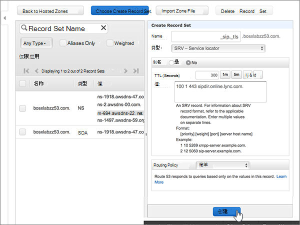

# 在 Amazon Web Services （AWS）上为 Microsoft 创建 DNS 记录Create DNS records at Amazon Web Services (AWS) for Microsoft

 如果找不到要查找的内容，请**[查看域常见问题解答](../setup/domains-faq.md)**。**[Check the Domains FAQ](../setup/domains-faq.md)** if you don't find what you're looking for. 
  
如果 AWS 是您的 DNS 托管提供商，请按照本文中的步骤验证您的域并为电子邮件、Skype Online for Business 等设置 DNS 记录。If AWS is your DNS hosting provider, follow the steps in this article to verify your domain and set up DNS records for email, Skype Online for Business, and so on.
  
在 AWS 中添加这些记录后，您的域将设置为与 Microsoft 服务一起使用。After you add these records at AWS, your domain will be set up to work with Microsoft services.
  

  
> [!NOTE]
> Typically it takes about 15 minutes for DNS changes to take effect.Typically it takes about 15 minutes for DNS changes to take effect. 但是，有时可能需要更长时间，您所做的更改才会在 Internet 的 DNS 系统中更新。However, it can occasionally take longer for a change you've made to update across the Internet's DNS system. 如果在添加 DNS 记录后遇到邮件流问题或其他问题，请参阅[查找在添加域或 DNS 记录后遇到的问题并进行修复](../get-help-with-domains/find-and-fix-issues.md)。If you're having trouble with mail flow or other issues after adding DNS records, see [Find and fix issues after adding your domain or DNS records](../get-help-with-domains/find-and-fix-issues.md). 
  
## 添加 TXT 记录进行验证Add a TXT record for verification

在将域用于 Microsoft 之前，必须确保你拥有该域。如果你能够在域注册机构处登录到你的帐户并创建 DNS 记录，便可向 Microsoft 证明你是域所有者。Before you use your domain with Microsoft, we have to make sure that you own it. Your ability to log in to your account at your domain registrar and create the DNS record proves to Microsoft that you own the domain.
  
> [!NOTE]
> 此记录仅用于验证您是否拥有自己的域；它不会影响其他任何内容。 如果需要，您可以以后将其删除。This record is used only to verify that you own your domain; it doesn't affect anything else. You can delete it later, if you like. 
  
1. 要开始，请使用[此链接](https://console.aws.amazon.com/route53/home)转到你在 AWS 上的域页面。 系统将会提示您先登录。To get started, go to your domains page at AWS by using [this link](https://console.aws.amazon.com/route53/home). You'll be prompted to log in first.
    
2. 在 "**资源**" 页上，选择 "**托管区域**"。On the **Resources** page, select **Hosted Zones**.
    
3. 在 "**托管区域**" 页上的 "**域名**" 列中，选择要编辑的域的名称。On the **Hosted Zones** page, in the **Domain Name** column, select the name of the domain that you want to edit. 
    
4. 选择 "**创建记录集**"。Select **Create Record Set**.
    
5. In the **Create Record Set** area, in the boxes for the new record, type or copy and paste the values from the following table.In the **Create Record Set** area, in the boxes for the new record, type or copy and paste the values from the following table. 
    
    (Choose the **Type** and **Routing Policy** values from the drop-down lists.)(Choose the **Type** and **Routing Policy** values from the drop-down lists.) 
    
    > [!TIP]
    > The quotation marks required by the onscreen instructions are supplied automatically. You don't need to type them manually.The quotation marks required by the onscreen instructions are supplied automatically. You don't need to type them manually. 
  
    |||||||
    |:-----|:-----|:-----|:-----|:-----|:-----|
    |**名称****Name**   |**Type****Type**   |**别名****Alias**   |**TTL（秒）****TTL (Seconds)**   |**值****Value**   |**路由策略****Routing Policy**   |
    |(Leave this field empty.)(Leave this field empty.)    |TXT - TextTXT - Text    |否No    |300300    |MS=ms *XXXXXXXX*MS=ms *XXXXXXXX*   **注意：** 这是一个示例。**Note:** This is an example. 在这里使用来自 Microsoft 365 中的表的具体“**目标地址或指向的地址**”值。Use your specific **Destination or Points to Address** value here, from the table in Microsoft 365. [如何查找此项？How do I find this?](../get-help-with-domains/information-for-dns-records.md)          |简单Simple    |
   
6. 选择“创建”\*\*\*\*。Select **Create**.
    
7. 请在继续之前等待数分钟，以便您刚刚创建的记录可以通过 Internet 完成更新。Wait a few minutes before you continue, so that the record you just created can update across the Internet.
    
现在您已在域注册机构的网站上添加了记录，您将返回到 Microsoft 并请求搜索该记录。Now that you've added the record at your domain registrar's site, you'll go back to Microsoft and request a search for the record.
  
Microsof 找到正确的 TXT 记录表明域已通过验证。When Microsoft finds the correct TXT record, your domain is verified.
  
1. 在 Microsoft 管理中心，转到“**设置**”\>“<a href="https://go.microsoft.com/fwlink/p/?linkid=834818" target="_blank">域</a>”页面。In the Microsoft admin center, go to the **Settings** \> <a href="https://go.microsoft.com/fwlink/p/?linkid=834818" target="_blank">Domains</a> page.

    
2. 在“**域**”页面上，选择要验证的域。On the **Domains** page, select the domain that you are verifying. 
    
3. 在“**设置**”页面上，选择“**开始设置**”。On the **Setup** page, select **Start setup**.
    
4. 在“**验证域**”页面上，选择“**验证**”。On the **Verify domain** page, select **Verify**.
    
> [!NOTE]
> Typically it takes about 15 minutes for DNS changes to take effect.Typically it takes about 15 minutes for DNS changes to take effect. 但是，有时可能需要更长时间，您所做的更改才会在 Internet 的 DNS 系统中更新。However, it can occasionally take longer for a change you've made to update across the Internet's DNS system. 如果在添加 DNS 记录后遇到邮件流问题或其他问题，请参阅[查找在添加域或 DNS 记录后遇到的问题并进行修复](../get-help-with-domains/find-and-fix-issues.md)。If you're having trouble with mail flow or other issues after adding DNS records, see [Find and fix issues after adding your domain or DNS records](../get-help-with-domains/find-and-fix-issues.md). 
  
## 添加 MX 记录，以便你的域的电子邮件将发送到 Microsoft 365Add an MX record so email for your domain will come to Microsoft 365

1. 要开始，请使用[此链接](https://console.aws.amazon.com/route53/home)转到你在 AWS 上的域页面。To get started, go to your domains page at AWS by using [this link](https://console.aws.amazon.com/route53/home). 系统将会提示您先登录。You'll be prompted to log in first.
    
2. 在 "**资源**" 页上，选择 "**托管区域**"。On the **Resources** page, select **Hosted Zones**.
    
3. 在 "**托管区域**" 页上的 "**域名**" 列中，选择要编辑的域的名称。On the **Hosted Zones** page, in the **Domain Name** column, select the name of the domain that you want to edit. 
    
4. 选择 "**创建记录集**"。Select **Create Record Set**.
    
5. In the **Create Record Set** area, in the boxes for the new record, type or copy and paste the values from the following table.In the **Create Record Set** area, in the boxes for the new record, type or copy and paste the values from the following table. 
    
    (Choose the **Type** and **Routing Policy** values from the drop-down lists.)(Choose the **Type** and **Routing Policy** values from the drop-down lists.) 
    
    |**名称****Name**|**Type****Type**|**别名****Alias**|**TTL（秒）****TTL (Seconds)**|**值****Value**|**路由策略****Routing Policy**|
    |:-----|:-----|:-----|:-----|:-----|:-----|
    |（将此字段留空。）(Leave this field empty.)    |MX - 邮件交换MX - Mail exchange    |否No    |300300    |0 *\<domain-key\>* . mail.protection.outlook.com。0  *\<domain-key\>*  .mail.protection.outlook.com.    0 是 MX 优先级值。 将其添加到 MX 值的开头，使用一个空格将其与其余部分隔开。  The 0 is the MX priority value. Add it to the beginning of the MX value, separated from the remainder of the value by a space.    **此值必须以句点 (.) 结尾。****This value MUST end with a period (.)**   **注意：**\<*domain-key*\>从 Microsoft 365 帐户获取。**Note:** Get your \<*domain-key*\> from your Microsoft 365 account. [如何查找此内容？How do I find this?](../get-help-with-domains/information-for-dns-records.md)          |简单Simple    |
       
    
  
6. 选择“创建”\*\*\*\*。Select **Create**.
    
    
  
7. 如果有任何其他 MX 记录，请删除它们。If there are any other MX records, remove them.
    
    > [!IMPORTANT]
    > AWS 将 MX 记录存储为可能包含多个记录的集合。AWS stores MX records as a set that may contain multiple records. **请勿**选择 "**删除记录集**"，因为这将删除所有 MX 记录，包括刚刚添加的记录。**DO NOT** select **Delete Record Set**, as this will delete all of your MX records, including the one you just added. 请使用下面的说明。Use the following instructions instead. 
  
    首先，选择 MX 记录集。First, select the MX record set.
    
    
  
    接下来，在" **编辑记录集**"区域中，通过选择" **值**"框中的条目并按键盘上的 **Delete** 键来删除每个已过时 MX 记录。Next, in the **Edit Record Set** area, delete each obsolete MX record by selecting the entry in the **Value** box and then pressing the **Delete** key on your keyboard. 
    
    
  
8. 选择 "**保存记录集**"。Select **Save Record Set**.
    
    
  
## 添加 Microsoft 365 所需的五个 CNAME 记录Add the five CNAME records that are required for Microsoft 365

1. 要开始，请使用[此链接](https://console.aws.amazon.com/route53/home)转到你在 AWS 上的域页面。To get started, go to your domains page at AWS by using [this link](https://console.aws.amazon.com/route53/home). 系统将会提示您先登录。You'll be prompted to log in first.
    
2. 在 "**资源**" 页上，选择 "**托管区域**"。On the **Resources** page, select **Hosted Zones**.
    
3. 在 "**托管区域**" 页上的 "**域名**" 列中，选择要编辑的域的名称。On the **Hosted Zones** page, in the **Domain Name** column, select the name of the domain that you want to edit. 
    
4. 选择 "**创建记录集**"。Select **Create Record Set**.
    
5. 添加第一条 CNAME 记录。Add the first CNAME record.
    
    在" **创建记录集**"区域中新记录的框内，键入或复制并粘贴下表第一行中的值。In the **Create Record Set** area, in the boxes for the new record, type or copy and paste the values from the first row in the following table. 
    
    （从下拉列表中选择" **类型**"和" **路由策略**"值。）(Choose the **Type** and **Routing Policy** values from the drop-down lists.) 
    
    |**名称****Name**|**Type****Type**|**别名****Alias**|**TTL（秒）****TTL (Seconds)**|**值****Value**|**路由策略****Routing Policy**|
    |:-----|:-----|:-----|:-----|:-----|:-----|
    |autodiscoverautodiscover    |CNAME - 规范名称CNAME - Canonical name    |否No    |300300    |autodiscover.outlook.com。autodiscover.outlook.com.    **此值必须以句点 (.) 结尾。****This value MUST end with a period (.)**   |简单Simple    |
    |sipsip    |CNAME - 规范名称CNAME - Canonical name    |否No    |300300    |sipdir.online.lync.com。sipdir.online.lync.com.    **此值必须以句点 (.) 结尾。****This value MUST end with a period (.)**   |简单Simple    |
    |lyncdiscoverlyncdiscover    |CNAME - 规范名称CNAME - Canonical name    |否No    |300300    |webdir.online.lync.com。webdir.online.lync.com.    **此值必须以句点 (.) 结尾。****This value MUST end with a period (.)**   |简单Simple    |
    |enterpriseregistrationenterpriseregistration    |CNAME - 规范名称CNAME - Canonical name    |否No    |300300    |enterpriseregistration.windows.net。enterpriseregistration.windows.net.    **此值必须以句点 (.) 结尾。****This value MUST end with a period (.)**   |简单Simple    |
    |EnterpriseEnrollmententerpriseenrollment    |CNAME - 规范名称CNAME - Canonical name    |否No    |300300    |enterpriseenrollment-s.manage.microsoft.com。enterpriseenrollment-s.manage.microsoft.com.    **此值必须以句点 (.) 结尾。****This value MUST end with a period (.)**   |简单Simple    |
   
    
  
6. 选择“创建”\*\*\*\*。Select **Create**.
    
    
  
7. 添加其他 4 条 CNAME 记录。Add the other four CNAME records.
    
    在 "**托管区域**" 页上，选择 "**创建记录集**"，使用表中下一行的值创建记录，然后再次选择 "**创建**" 以完成该记录。In the **Hosted Zones** page, select **Create Record Set**, create a record using the values from the next row in the table, and then again select **Create** to complete that record. 
    
    重复此过程，直到创建完所有五个 CNAME 记录。Repeat this process until you have created all five CNAME records.
    
## 为 SPF 添加 TXT 记录以帮助防止垃圾邮件Add a TXT record for SPF to help prevent email spam

> [!IMPORTANT]
> 一个域所拥有的 SPF 的 TXT 记录不能超过一个。You cannot have more than one TXT record for SPF for a domain. 如果域具有多个 SPF 记录，你将收到电子邮件错误，其中随附发送和垃圾邮件分类问题。If your domain has more than one SPF record, you'll get email errors, as well as delivery and spam classification issues. 如果你的域已有 SPF 记录，请不要为 Microsoft 创建新记录。If you already have an SPF record for your domain, don't create a new one for Microsoft. 改为将所需的 Microsoft 值添加到当前记录，以便您具有包含两组值的*单个*SPF 记录。Instead, add the required Microsoft values to the current record so that you have a  *single*  SPF record that includes both sets of values. 需要示例吗？Need examples? 请查看 [Microsoft 的外部域名系统记录](https://docs.microsoft.com/office365/enterprise/external-domain-name-system-records)。Check out these [External Domain Name System records for Microsoft](https://docs.microsoft.com/office365/enterprise/external-domain-name-system-records). 若要验证您的 SPF 记录，您可以使用其中一种[SPF 验证工具](../setup/domains-faq.md)。To validate your SPF record, you can use one of these[SPF validation tools](../setup/domains-faq.md). 
  
1. 要开始，请使用[此链接](https://console.aws.amazon.com/route53/home)转到你在 AWS 上的域页面。To get started, go to your domains page at AWS by using [this link](https://console.aws.amazon.com/route53/home). 系统将会提示您先登录。You'll be prompted to log in first.
    
2. 在 "**资源**" 页上，选择 "**托管区域**"。On the **Resources** page, select **Hosted Zones**.
    
3. 在 "**托管区域**" 页上的 "**域名**" 列中，选择要编辑的域的名称。On the **Hosted Zones** page, in the **Domain Name** column, select the name of the domain that you want to edit. 
    
4. 选择**TXT**记录集。Select the **TXT** record set. 
    
    
  
5. 在" **编辑记录集**"区域中，找到现有记录的" **值:**"框，在当前条目的末尾按 Enter 键（键盘上）创建新行；然后在该新行（现有值下方）上，键入或复制粘贴下表中的值。（可查看该表下方说明中的示例。）In the **Edit Record Set** area, at the end of the current entry in the **Value:** box for the existing record, press Enter on your keyboard to create a new line; and then, on that new line (under the existing value), type or copy and paste the value from the following table. (You can see an example in the illustration below the table.) 
    
    |**值:****Value:**|
    |:-----|
    |v=spf1 include:outlook.com -allv=spf1 include:spf.protection.outlook.com -all    （系统会自动提供屏幕说明所需的引号。无需手动键入。）  (The quotation marks required by the onscreen instructions are supplied automatically. You don't need to type them manually.)    **注意：** 我们建议您复制并粘贴此条目，以保证正确保留所有空格。**Note:** We recommend copying and pasting this entry, so that all of the spacing stays correct.           |
   
    
  
6. 选择 "**保存记录集**"。Select **Save Record Set**.
    
    
  
## 添加 Microsoft 365 所需的两条 SRV 记录Add the two SRV records that are required for Microsoft 365

1. 要开始，请使用[此链接](https://console.aws.amazon.com/route53/home)转到你在 AWS 上的域页面。To get started, go to your domains page at AWS by using [this link](https://console.aws.amazon.com/route53/home). 系统将会提示您先登录。You'll be prompted to log in first.
    
2. 在 "**资源**" 页上，选择 "**托管区域**"。On the **Resources** page, select **Hosted Zones**.
    
3. 在 "**托管区域**" 页上的 "**域名**" 列中，选择要编辑的域的名称。On the **Hosted Zones** page, in the **Domain Name** column, select the name of the domain that you want to edit. 
    
4. 选择 "**创建记录集**"。Select **Create Record Set**.
    
5. 添加第一条 SRV 记录：Add the first SRV record:
    
    在" **创建记录集**"区域中新记录的框内，键入或复制并粘贴下表第一行中的值。In the **Create Record Set** area, in the boxes for the new record, type or copy and paste the values from the first row in the following table. 
    
    （从下拉列表中选择" **类型**"和" **路由策略**"值。）(Choose the **Type** and **Routing Policy** values from the drop-down lists.) 
    
    |**名称****Name**|**Type****Type**|**别名****Alias**|**TTL（秒）****TTL (Seconds)**|**值****Value**|**路由策略****Routing Policy**|
    |:-----|:-----|:-----|:-----|:-----|:-----|
    |_sip _tls_sip._tls|SRV - 服务定位器SRV - Service locator|否No|300300|100 1 443 sipdir.online.lync.com。100 1 443 sipdir.online.lync.com. **此值必须以句点（.）结尾**>**This value MUST end with a period (.)**>  **注意：** 我们建议您复制并粘贴此条目，以保证正确保留所有空格。**Note:** We recommend copying and pasting this entry, so that all of the spacing stays correct.           |简单Simple|
    |_sipfederationtls _tcp_sipfederationtls._tcp|SRV - 服务定位器SRV - Service locator|否No|300300|100 1 5061 sipfed.online.lync.com。100 1 5061 sipfed.online.lync.com. **This value MUST end with a period (.)****This value MUST end with a period (.)**  **注意：** 我们建议您复制并粘贴此条目，以保证正确保留所有空格。**Note:** We recommend copying and pasting this entry, so that all of the spacing stays correct.           |简单Simple|
   
    
  
6. 选择“创建”\*\*\*\*。Select **Create**.
    
    
  
7. 添加其他 SRV 记录：To add the other SRV record:
    
    在 "**托管区域**" 页上，选择 "**创建记录集**"，使用表中下一行的值创建记录，然后再次选择 "**创建**" 以完成该记录。In the **Hosted Zones** page, select **Create Record Set**, create a record using the values from the next row in the table, and then again select **Create** to complete that record. 
    
> [!NOTE]
> Typically it takes about 15 minutes for DNS changes to take effect.Typically it takes about 15 minutes for DNS changes to take effect. 但是，有时可能需要更长时间，您所做的更改才会在 Internet 的 DNS 系统中更新。However, it can occasionally take longer for a change you've made to update across the Internet's DNS system. 如果在添加 DNS 记录后遇到邮件流问题或其他问题，请参阅[查找在添加域或 DNS 记录后遇到的问题并进行修复](../get-help-with-domains/find-and-fix-issues.md)。If you're having trouble with mail flow or other issues after adding DNS records, see [Find and fix issues after adding your domain or DNS records](../get-help-with-domains/find-and-fix-issues.md). 
  
