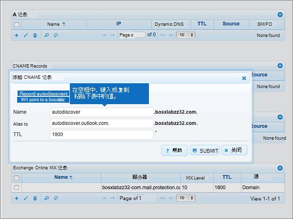
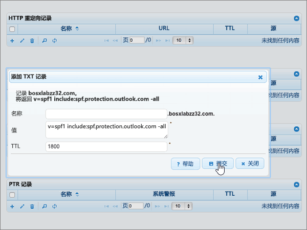

# 在 DNSMadeEasy 为 Microsoft 创建 DNS 记录

 如果找不到要查找的内容，请 **[查看域常见问题解答](../setup/domains-faq.yml)**。 
  
如果 DNSMadeEasy 是 DNS 托管提供商，请按照本文中的步骤验证域并设置电子邮件、Skype for Business Online 等的 DNS 记录。
  
在 DNSMadeEasy 添加这些记录后，你的域将设置为使用 Microsoft 服务。
  

  
> [!NOTE]
> Typically it takes about 15 minutes for DNS changes to take effect. 但是，有时可能需要更长时间，您所做的更改才会在 Internet 的 DNS 系统中更新。 如果在添加 DNS 记录后遇到邮件流问题或其他问题，请参阅[查找在添加域或 DNS 记录后遇到的问题并进行修复](../get-help-with-domains/find-and-fix-issues.md)。 
  
## 添加 TXT 记录进行验证

在将域用于 Microsoft 之前，必须确保你拥有该域。如果你能够在域注册机构处登录到你的帐户并创建 DNS 记录，便可向 Microsoft 证明你是域所有者。
  
> [!NOTE]
> 此记录仅用于验证您是否拥有自己的域；它不会影响其他任何内容。 如果需要，您可以以后将其删除。 
  
> [!IMPORTANT]
> 对于 DNSMadeEasy 帐户，添加的域是从单独的域注册机构购买的。 DNSMadeEasy 不提供域注册服务。 在 DNSMadeEasy 登录并创建 DNS 记录的能力足以证明所有权。 
  
1. 要开始，请使用[此链接](https://cp.dnsmadeeasy.com/)转到您在 DNSMadeEasy 上的域页面。 系统将会提示您首先登录。
    
2. 在" **管理控制台** "页上的 **"最近** 更新的域"区域中，选择要更新的域。 
    
3. 在"**托管 DNS"** 页上 **的"TXT** 记录"区域中，选择 () **+** 控件 (**添加新) 。**
    
    （您可能需要向下滚动。）
    
4. In the **Add TXT Records** area, in the boxes for the new record, type or copy and paste the values from the following table. 
    
    ||||
    |:-----|:-----|:-----|
    |**名称**   |**值**   |**TTL**   |
    |（将此字段留空。）    |MS=ms *XXXXXXXX*    **注意：** 这是一个示例。 在这里使用表中的特定“**目标地址或指向的地址**”值。 [如何查找此项？](../get-help-with-domains/information-for-dns-records.md)          |1800    |
   
5. 选择“**提交**”。
    
6. 请在继续之前等待数分钟，以便您刚刚创建的记录可以通过 Internet 完成更新。
    
在在域注册机构网站添加了记录后，你将返回到 Microsoft 并请求记录。
  
Microsof 找到正确的 TXT 记录表明域已通过验证。
  
1. 在 Microsoft 管理中心，转到“**设置**”\>“<a href="https://go.microsoft.com/fwlink/p/?linkid=834818" target="_blank">域</a>”页面。

    
2. 在“**域**”页面上，选择要验证的域。 
    
3. 在“**设置**”页面上，选择“**开始设置**”。
    
4. 在“**验证域**”页面上，选择“**验证**”。
    
> [!NOTE]
> Typically it takes about 15 minutes for DNS changes to take effect. 但是，有时可能需要更长时间，您所做的更改才会在 Internet 的 DNS 系统中更新。 如果在添加 DNS 记录后遇到邮件流问题或其他问题，请参阅[查找在添加域或 DNS 记录后遇到的问题并进行修复](../get-help-with-domains/find-and-fix-issues.md)。 
  
## 添加一条 MX 记录，确保发往你的域的电子邮件将会发送到 Microsoft

1. 要开始，请使用[此链接](https://cp.dnsmadeeasy.com/)转到您在 DNSMadeEasy 上的域页面。 系统将会提示您首先登录。
    
2. 在" **管理控制台** "页上的 **"最近** 更新的域"区域中，选择要更新的域。 
    
    在" **管理控制台** "页上的 **"最近** 更新的域"区域中，选择要更新的域。 
    
    
  
3. 在"**托管 DNS"** 页上的 **"MX** 记录"区域中，选择 (**+**) 控件 (**添加新) 。**
    
    （您可能需要向下滚动。）
    
    
  
4. 在 **"添加 MX 记录** "区域中新记录的框中，键入或复制并粘贴下表中的值。 
    
    （您可能需要向下滚动。）
    
    |**名称**|**服务器**|**MX 级别**|**TTL**|
    |:-----|:-----|:-----|:-----|
    |（将此字段留空。）    | *\<domain-key\>*  .mail.protection.outlook.com    **此值必须以句点 (.) 结尾。**   **注意：** 从 Microsoft 帐户获取 \<*domain-key*\>。 [如何查找此项？](../get-help-with-domains/information-for-dns-records.md)          |10     有关优先级的详细信息，请参阅[什么是 MX 优先级？](https://docs.microsoft.com/microsoft-365/admin/setup/domains-faq)   |1800    |
   
    
  
5. 选择“**提交**”。
    
    
  
6. 如果 **"MX** 记录"部分列出了任何其他 MX 记录，则通过选择每条记录来删除所有 MX 记录。 
    
    
  
7. 选择所有记录后，选择"**删除所选"。**
    
    
  
8. 在 **"删除 MX 记录** "对话框中，选择 **"删除** "以确认所做的更改。 
    
    
  
## 添加 Microsoft 所需的 5 条 CNAME 记录

1. 要开始，请使用[此链接](https://cp.dnsmadeeasy.com/)转到您在 DNSMadeEasy 上的域页面。 系统将会提示您首先登录。
    
2. 在" **管理控制台** "页上的 **"最近** 更新的域"区域中，选择要更新的域。 
    
3. 在"**托管 DNS"** 页上 **的"CNAME** 记录"区域中，选择 (**+**) 控件 (**添加新) 。**
    
    （您可能需要向下滚动。）
    
    
  
4. 添加五条 CNAME 记录中的第一条。
    
    在 **"添加 CNAME 记录** "区域中新记录的框中，键入或复制粘贴下表中第一行的值。 
    
    |**名称**|**别名**|**TTL**|
    |:-----|:-----|:-----|
    |autodiscover    |autodiscover.outlook.com.    **此值必须以句点 (.) 结尾。**   |1800    |
    |sip    |sipdir.online.lync.com.    **此值必须以句点 (.) 结尾。**   |1800    |
    |lyncdiscover    |webdir.online.lync.com.    **此值必须以句点 (.) 结尾。**   |1800    |
    |enterpriseregistration    |enterpriseregistration.windows.net.    **此值必须以句点 (.) 结尾。**   |1800    |
    |enterpriseenrollment    |enterpriseenrollment-s.manage.microsoft.com.    **此值必须以句点 (.) 结尾。**   |1800    |
   
    
  
5. 选择“**提交**”。
    
    
  
6. 添加其他四条 CNAME 记录。
    
    在 **"CNAME** 记录"部分，选择 **(+)** 控件 (添加新 **) ，** 使用表中下一行的值创建记录，然后再次选择"提交"以完成该记录。  
    
    重复此过程，直到创建所有五条 CNAME 记录。
    
## 为 SPF 添加 TXT 记录以帮助防止垃圾邮件

> [!IMPORTANT]
> 一个域所拥有的 SPF 的 TXT 记录不能超过一个。 如果域具有多个 SPF 记录，你将收到电子邮件错误，其中随附发送和垃圾邮件分类问题。 如果你的域已有 SPF 记录，请不要为 Microsoft 创建新记录。 相反，将所需的 Microsoft 值添加到当前记录，以便具有一个  *包含这*  两组值的 SPF 记录。 需要示例吗？ 请查看 [Microsoft 的外部域名系统记录](https://docs.microsoft.com/microsoft-365/enterprise/external-domain-name-system-records)。 若要验证 SPF 记录，可以使用以下[SPF 验证工具之一](../setup/domains-faq.yml)。 
  
1. 要开始，请使用[此链接](https://cp.dnsmadeeasy.com/)转到您在 DNSMadeEasy 上的域页面。 系统将会提示您首先登录。
    
2. 在" **管理控制台** "页上的 **"最近** 更新的域"区域中，选择要更新的域。 
    
3. 在"**托管 DNS"** 页上 **的"TXT** 记录"区域中，选择 (**+**) 控件 (**添加新) 。**
    
    （您可能需要向下滚动。）
    
    
  
4. In the **Add TXT Records** area, in the boxes for the new record, type or copy and paste the values from the following table. 
    
    |**名称**|**值**|**TTL**|
    |:-----|:-----|:-----|
    |（将此字段留空。）    |v=spf1 include:spf.protection.outlook.com -all    **注意：** 建议复制粘贴此条目，以保证正确保留所有空格。           |1800    |
   
    
  
5. 选择“**提交**”。
    
    
  
## 添加 Microsoft 所需的两条 SRV 记录

1. 要开始，请使用[此链接](https://cp.dnsmadeeasy.com/)转到您在 DNSMadeEasy 上的域页面。 系统将会提示您首先登录。
    
2. 在" **管理控制台** "页上的 **"最近** 更新的域"区域中，选择要更新的域。 
    
3. 在"**托管 DNS"** 页上 **的"SRV** 记录"区域中，选择 (**+**) 控件 (**添加新) 。**
    
     (可能需要向下滚动) 
    
    
  
4. 添加两条 SRV 记录中的第一条记录。
    
    在 **"添加 SRV 记录** "区域中新记录的框中，键入或复制粘贴下表中第一行的值。 
    
    |**名称**|**优先级**|**权重**|**端口**|**主机**|**TTL**|
    |:-----|:-----|:-----|:-----|:-----|:-----|
    |_sip._tls    |100    |1     |443    |sipdir.online.lync.com.    **此值必须以句点 (.) 结尾。**   |1800    |
    |_sipfederationtls._tcp    |100    |1     |5061    |sipfed.online.lync.com。    **此值必须以句点 (.) 结尾。**   |1800    |
   
    
  
5. 选择“**提交**”。
    
    
  
6. 添加另一条 SRV 记录。
    
    在 **"SRV** 记录"部分，选择 **(+)** 控件 (添加新 **) ，** 使用表中下一行的值创建记录，然后再次选择"提交"以完成该记录。  
    
> [!NOTE]
> Typically it takes about 15 minutes for DNS changes to take effect. 但是，有时可能需要更长时间，您所做的更改才会在 Internet 的 DNS 系统中更新。 如果在添加 DNS 记录后遇到邮件流问题或其他问题，请参阅[查找在添加域或 DNS 记录后遇到的问题并进行修复](../get-help-with-domains/find-and-fix-issues.md)。 
  

