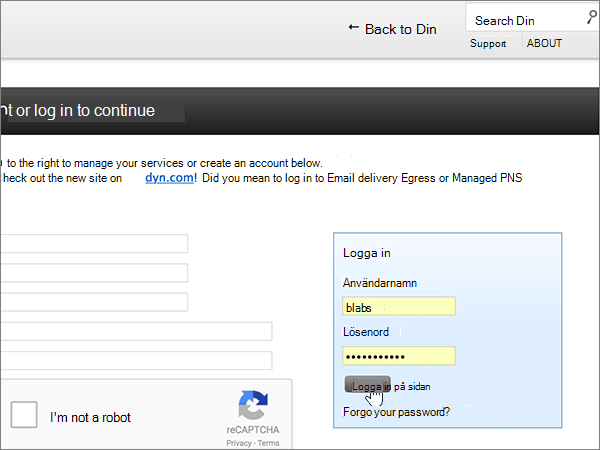
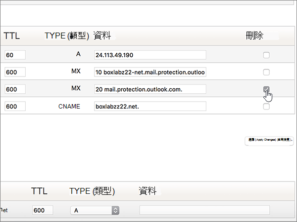

# 在 Microsoft Dyn.com 创建 DNS 记录Create DNS records at Dyn.com for Microsoft

 **如果找不到要查找的内容，请 [查看域常见问题解答](../setup/domains-faq.yml)** 。**[Check the Domains FAQ](../setup/domains-faq.yml)** if you don't find what you're looking for. 
  
如果 DNS 托管提供者是 Dyn.com，请按本文中的步骤验证域并为电子邮件、Skype for Business Online 等设置 DNS 记录。If Dyn.com is your DNS hosting provider, follow the steps in this article to verify your domain and set up DNS records for email, Skype for Business Online, and so on.
 

  
> [!NOTE]
>  DNS 更改通常需要 15 分钟左右才能生效。 但是，有时可能需要更长时间，您所做的更改才会在 Internet 的 DNS 系统中更新。 如果添加 DNS 记录后遇到邮件流问题或其他问题，请参阅 [更改域名或 DNS 记录后出现的问题的疑难解答](../get-help-with-domains/find-and-fix-issues.md)。Typically it takes about 15 minutes for DNS changes to take effect. However, it can occasionally take longer for a change you've made to update across the Internet's DNS system. If you're having trouble with mail flow or other issues after adding DNS records, see [Troubleshoot issues after changing your domain name or DNS records](../get-help-with-domains/find-and-fix-issues.md). 
  
## 添加 TXT 记录进行验证Add a TXT record for verification

1. 若要开始，请使用[此链接](https://account.dyn.com/dns/)转到你在 Dyn.com 上的域页面。系统会提示你先进行登录。To get started, go to your domains page at Dyn.com by using [this link](https://account.dyn.com/dns/). You'll be prompted to login first.
    
    
  
2. 在" **区域级别服务** "页上，为要编辑的域选择 **"Dyn** 标准 DNS 服务"。On the **Zone Level Services** page, select **Dyn Standard DNS Service** for the domain that you want to edit. 
    
3. 在域 **的"DNS"** 页面上，选择 **"首选项"。**On the **DNS** page for your domain, select **Preferences**.
    
4. 选择 **启用专家接口**。Select **Enable Expert Interface**.
    
5. In the **Add DNS Record** section, in the boxes for the new record, type or copy and paste the values from the following table.In the **Add DNS Record** section, in the boxes for the new record, type or copy and paste the values from the following table. 
    
    (Choose the **Type** value from the drop-down list.)(Choose the **Type** value from the drop-down list.) 
    
    |**主机****Host**|**TTL****TTL**|**类型****Type**|**数据****Data**|
    |:-----|:-----|:-----|:-----|
    |(Leave this field empty.)(Leave this field empty.)    |600600    |TXTTXT    |MS=ms *XXXXXXXX*MS=ms *XXXXXXXX*    **注意：** 这是一个示例。**Note:** This is an example. 在这里使用表中的特定“**目标地址或指向的地址**”值。Use your specific **Destination or Points to Address** value here, from the table.           [如何查找此项？How do I find this?](../get-help-with-domains/information-for-dns-records.md)          |
       
   
  
6. 选择 **"创建记录"。**Select **Create Record**.
    
    
  
7. 请在继续之前等待数分钟，以便您刚刚创建的记录可以通过 Internet 完成更新。Wait a few minutes before you continue, so that the record you just created can update across the Internet.
    
在在域注册机构网站添加了记录后，你将返回到 Microsoft 并请求记录。Now that you've added the record at your domain registrar's site, you'll go back to Microsoft and request the record.
  
Microsof 找到正确的 TXT 记录表明域已通过验证。When Microsoft finds the correct TXT record, your domain is verified.
  
1. 在 Microsoft 管理中心，转到“**设置**”\>“<a href="https://go.microsoft.com/fwlink/p/?linkid=834818" target="_blank">域</a>”页面。In the Microsoft admin center, go to the **Settings** \> <a href="https://go.microsoft.com/fwlink/p/?linkid=834818" target="_blank">Domains</a> page.

    
2. 在“**域**”页面上，选择要验证的域。On the **Domains** page, select the domain that you are verifying. 
    
    
  
3. 在“**设置**”页面上，选择“**开始设置**”。On the **Setup** page, select **Start setup**.
    
    
  
4. 在“**验证域**”页面上，选择“**验证**”。On the **Verify domain** page, select **Verify**.
    
    
  
> [!NOTE]
>  DNS 更改通常需要 15 分钟左右才能生效。 但是，有时可能需要更长时间，您所做的更改才会在 Internet 的 DNS 系统中更新。 如果添加 DNS 记录后遇到邮件流问题或其他问题，请参阅 [更改域名或 DNS 记录后出现的问题的疑难解答](../get-help-with-domains/find-and-fix-issues.md)。Typically it takes about 15 minutes for DNS changes to take effect. However, it can occasionally take longer for a change you've made to update across the Internet's DNS system. If you're having trouble with mail flow or other issues after adding DNS records, see [Troubleshoot issues after changing your domain name or DNS records](../get-help-with-domains/find-and-fix-issues.md). 
  
## 添加一条 MX 记录，确保发往你的域的电子邮件将会发送到 MicrosoftAdd an MX record so email for your domain will come to Microsoft

1. 若要开始，请使用[此链接](https://account.dyn.com/dns/)转到你在 Dyn.com 上的域页面。系统会提示你先进行登录。To get started, go to your domains page at Dyn.com by using [this link](https://account.dyn.com/dns/). You'll be prompted to login first.
    
    
  
2. 在" **区域级别服务** "页上，为要编辑的域选择 **"Dyn** 标准 DNS 服务"。On the **Zone Level Services** page, select **Dyn Standard DNS Service** for the domain that you want to edit. 
    
3. 在域的"DNS"页面上，选择 **"首选项"。**On the DNS page for your domain, select **Preferences**.
    
4. 选择 **启用专家接口**。Select **Enable Expert Interface**.
    
5. In the **Add DNS Record** section, in the boxes for the new record, type or copy and paste the values from the following table.In the **Add DNS Record** section, in the boxes for the new record, type or copy and paste the values from the following table. 
    
    (Choose the **Type** value from the drop-down list.)(Choose the **Type** value from the drop-down list.) 
    
    |**主机****Host**|**TTL****TTL**|**类型****Type**|**数据****Data**|
    |:-----|:-----|:-----|:-----|
    |(Leave this field empty.)(Leave this field empty.)    |600600    |MXMX    |10  *\<domain-key\>*  .mail.protection.outlook.com。10  *\<domain-key\>*  .mail.protection.outlook.com.    **此值必须以句点 (.) 结尾。****This value MUST end with a period (.)**   **10** 是 MX 优先级值。将其添加到 MX 值的开头，使用一个空格将其与其余部分隔开。  The **10** is the MX priority value. Add it to the beginning of the MX value, separated from the remainder of the value by a space.    **注意：** 从  *\<domain-key\>*  Microsoft 帐户获取你的信息。**Note:** Get your  *\<domain-key\>*  from your Microsoft account.           [如何查找此项？How do I find this?](../get-help-with-domains/information-for-dns-records.md)           有关优先级的详细信息，请参阅[什么是 MX 优先级？](../setup/domains-faq.yml)For more information about priority, see [What is MX priority?](../setup/domains-faq.yml)   |
   
    
  
6. 选择 **"创建记录"。**Select **Create Record**.
    
    
  
7. 如果存在任何其他 MX 记录，通过选中" **删除**"列中这些记录的复选框将其删除。If there are any other MX records, remove them by selecting the check box for each one in the **Delete** column. 
    
    
  
8. 选择 **"应用更改"。**Select **Apply Changes**.
    
    
  
## 添加 Microsoft 所需的六条 CNAME 记录Add the six CNAME records that are required for Microsoft

1. 若要开始，请使用[此链接](https://account.dyn.com/dns/)转到你在 Dyn.com 上的域页面。系统会提示你先进行登录。To get started, go to your domains page at Dyn.com by using [this link](https://account.dyn.com/dns/). You'll be prompted to login first.
    
    
  
2. 在" **区域级别服务** "页上，为要编辑的域选择 **"Dyn** 标准 DNS 服务"。On the **Zone Level Services** page, select **Dyn Standard DNS Service** for the domain that you want to edit. 
    
3. 在域 **的"DNS"** 页面上，选择 **"首选项"。**On the **DNS** page for your domain, select **Preferences**.
    
4. 选择 **启用专家接口**。Select **Enable Expert Interface**.
    
5. 添加第一条 CNAME 记录（共 6 条）。Add the first of the six CNAME records.
    
    在" **添加 DNS 记录**"部分中新记录的框内，键入或复制并粘贴下表中第一行的值。In the **Add DNS Record** section, in the boxes for the new record, type or copy and paste the values from the first row of the following table. 
    
    （从下拉列表中选择" **类型**"值。）(Choose the **Type** value from the drop-down list.) 
    
    |**主机****Host**|**TTL****TTL**|**类型****Type**|**数据****Data**|
    |:-----|:-----|:-----|:-----|
    |自动发现autodiscover    |600600    |CNAMECNAME    |autodiscover.outlook.com.autodiscover.outlook.com.    **此值必须以句点 (.) 结尾。****This value MUST end with a period (.)**   |
    |sipsip    |600600    |CNAMECNAME    |sipdir.online.lync.com.sipdir.online.lync.com.    **此值必须以句点 (.) 结尾。****This value MUST end with a period (.)**   |
    |lyncdiscoverlyncdiscover    |600600    |CNAMECNAME    |webdir.online.lync.com.webdir.online.lync.com.    **此值必须以句点 (.) 结尾。****This value MUST end with a period (.)**   |
    |enterpriseregistrationenterpriseregistration    |600600    |CNAMECNAME    |enterpriseregistration.windows.net.enterpriseregistration.windows.net.    **此值必须以句点 (.) 结尾。****This value MUST end with a period (.)**   |
    |enterpriseenrollmententerpriseenrollment    |600600    |CNAMECNAME    |enterpriseenrollment-s.manage.microsoft.com.enterpriseenrollment-s.manage.microsoft.com.    **此值必须以句点 (.) 结尾。****This value MUST end with a period (.)**   |
   
    
  
6. 选择 **"创建记录"。**Select **Create Record**.
    
    
  
7. 添加其他五条 CNAME 记录。Add the remaining five CNAME records.
    
    在" **添加 DNS 记录** "部分，使用表中下一行的值创建记录，然后再次选择" **创建记录** "以完成该记录。In the **Add DNS Record** section, create a record by using the values from the next row in the table, and then again select **Create Record** to complete that record. 
    
    重复该过程，直到创建完全部 6 条 CNAME 记录。Repeat this process until you have created all six CNAME records.
    
## 为 SPF 添加 TXT 记录以帮助防止垃圾邮件Add a TXT record for SPF to help prevent email spam

> [!IMPORTANT]
> 一个域所拥有的 SPF 的 TXT 记录不能超过一个。You cannot have more than one TXT record for SPF for a domain. 如果域具有多个 SPF 记录，你将收到电子邮件错误，其中随附发送和垃圾邮件分类问题。If your domain has more than one SPF record, you'll get email errors, as well as delivery and spam classification issues. 如果你的域已有 SPF 记录，请不要为 Microsoft 创建新记录。If you already have an SPF record for your domain, don't create a new one for Microsoft. 相反，将所需的 Microsoft 值添加到当前记录，以便你有一个  *包含这*  两组值的 SPF 记录。Instead, add the required Microsoft values to the current record so that you have a  *single*  SPF record that includes both sets of values.
  
1. 若要开始，请使用[此链接](https://account.dyn.com/dns/)转到你在 Dyn.com 上的域页面。系统会提示你先进行登录。To get started, go to your domains page at Dyn.com by using [this link](https://account.dyn.com/dns/). You'll be prompted to login first.
    
    
  
2. 在" **区域级别服务** "页上，为要编辑的域选择 **"Dyn** 标准 DNS 服务"。On the **Zone Level Services** page, select **Dyn Standard DNS Service** for the domain that you want to edit. 
    
3. 在域 **的"DNS"** 页面上，选择 **"首选项"。**On the **DNS** page for your domain, select **Preferences**.
    
4. 选择 **启用专家接口**。Select **Enable Expert Interface**.
    
5. In the **Add DNS Record** section, in the boxes for the new record, type or copy and paste the values from the following table.In the **Add DNS Record** section, in the boxes for the new record, type or copy and paste the values from the following table. 
    
    (Choose the **Type** value from the drop-down list.)(Choose the **Type** value from the drop-down list.) 
    
    |**主机****Host**|**TTL****TTL**|**类型****Type**|**数据****Data**|
    |:-----|:-----|:-----|:-----|
    |(Leave this field empty.)(Leave this field empty.)    |600600    |TXTTXT    |v=spf1 include:spf.protection.outlook.com -allv=spf1 include:spf.protection.outlook.com -all    **注意：** 建议复制粘贴此条目，以保证正确保留所有空格。**Note:** We recommend copying and pasting this entry, so that all of the spacing stays correct.           |
   
    
  
6. 选择 **"创建记录"。**Select **Create Record**.
    
    
  
## 添加 Microsoft 所需的两条 SRV 记录Add the two SRV records that are required for Microsoft

1. 若要开始，请使用[此链接](https://account.dyn.com/dns/)转到你在 Dyn.com 上的域页面。To get started, go to your domains page at Dyn.com by using [this link](https://account.dyn.com/dns/). 系统将提示你先登录You'll be prompted to login first 
    
    
  
2. 在" **区域级别服务** "页上，为要编辑的域选择 **"Dyn** 标准 DNS 服务"。On the **Zone Level Services** page, select **Dyn Standard DNS Service** for the domain that you want to edit. 
    
3. 在域 **的"DNS"** 页面上，选择 **"首选项"。**On the **DNS** page for your domain, select **Preferences**.
    
4. 选择 **启用专家接口**。Select **Enable Expert Interface**.
    
5. 添加两条 SRV 记录中的第一条。Add the first of the two SRV records.
    
    在" **添加 DNS 记录**"部分中新记录的框内，键入或复制并粘贴下表中第一行的值。In the **Add DNS Record** section, in the boxes for the new record, type or copy and paste the values from the first row of the following table. 
    
    （从下拉列表中选择" **类型**"值。）(Choose the **Type** value from the drop-down list.) 
    
    |**主机****Host**|**TTL****TTL**|**类型****Type**|**数据****Data**|
    |:-----|:-----|:-----|:-----|
    |_sip._tls_sip._tls|600600|SRVSRV|100 1 443 sipdir.online.lync.com.100 1 443 sipdir.online.lync.com. **此值必须以句点 (.) 结尾。****This value MUST end with a period (.)** **注意：** 建议复制粘贴此条目，以保证正确保留所有空格。**Note:** We recommend copying and pasting this entry, so that all of the spacing stays correct.           |
    |_sipfederationtls._tcp_sipfederationtls._tcp|600600|SRVSRV|100 1 5061 sipfed.online.lync.com.100 1 5061 sipfed.online.lync.com. **此值必须以句点 (.) 结尾。****This value MUST end with a period (.)**  **注意：** 建议复制粘贴此条目，以保证正确保留所有空格。**Note:** We recommend copying and pasting this entry, so that all of the spacing stays correct.           |
   
    
  
6. 选择 **"创建记录"。**Select **Create Record**.
    
    
  
7. 添加另一条 SRV 记录。Add the other SRV record.
    
    在" **添加 DNS 记录** "部分，使用表中第二行的值创建记录，然后再次选择"创建 **记录** "以完成该记录。In the **Add DNS Record** section, create a record by using the values from the second row in the table, and then again select **Create Record** to complete that record. 
    
> [!NOTE]
>  DNS 更改通常需要 15 分钟左右才能生效。 但是，有时可能需要更长时间，您所做的更改才会在 Internet 的 DNS 系统中更新。 如果添加 DNS 记录后遇到邮件流问题或其他问题，请参阅 [更改域名或 DNS 记录后出现的问题的疑难解答](../get-help-with-domains/find-and-fix-issues.md)。Typically it takes about 15 minutes for DNS changes to take effect. However, it can occasionally take longer for a change you've made to update across the Internet's DNS system. If you're having trouble with mail flow or other issues after adding DNS records, see [Troubleshoot issues after changing your domain name or DNS records](../get-help-with-domains/find-and-fix-issues.md). 
