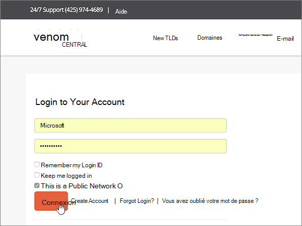
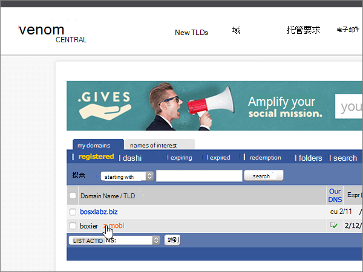
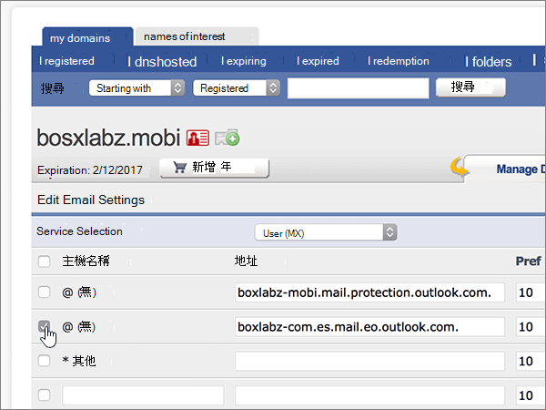
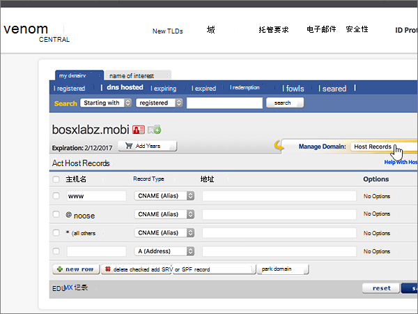

# 在 eNomCentral 处为 Microsoft 创建 DNS 记录

 如果找不到要查找的内容，请**[查看域常见问题解答](../setup/domains-faq.md)**。 
  
如果 eNomCentral 是您的 DNS 托管提供商，请按照本文中的步骤验证您的域并为电子邮件、Skype for Business Online 等设置 DNS 记录。
  
在 eNomCentral 中添加这些记录后，您的域将设置为与 Microsoft 服务一起使用。

  
> [!NOTE]
>  DNS 更改通常需要 15 分钟左右才能生效。 但是，有时可能需要更长时间，您所做的更改才会在 Internet 的 DNS 系统中更新。 如果添加 DNS 记录后遇到邮件流问题或其他问题，请参阅 [更改域名或 DNS 记录后出现的问题的疑难解答](../get-help-with-domains/find-and-fix-issues.md)。 
  
## 添加 TXT 记录进行验证

在将域用于 Microsoft 之前，必须确保你拥有该域。如果你能够在域注册机构处登录到你的帐户并创建 DNS 记录，便可向 Microsoft 证明你是域所有者。
  
> [!NOTE]
> 此记录仅用于验证您是否拥有自己的域；它不会影响其他任何内容。 如果需要，您可以以后将其删除。 
  
请按下列步骤操作或[观看视频（从 0:46 开始）](https://support.office.com/article/Video-Create-DNS-records-at-eNomCentral-for-Office-365-3766a9e8-77dd-4a42-908d-89b076143e7d?ui=en-US&amp;rs=en-US&amp;ad=US)。
  
1. 若要开始，请使用[此链接](https://www.enomcentral.com/domains/Domain-Manager.aspx?tab=registered)转到 eNom Central 上您的域页面。系统将会提示您登录。
    
    
  
2. 在 **"我的域**" 下，选择要编辑的域的名称。
    
    
  
3. 在" **管理域**"下拉列表中，选择" **主机记录**"。
    
    
  
4. 在新记录的框中，键入或复制并粘贴下表中的值。
    
    从下拉列表中选择 "**记录类型**" 值。
    
    ||||
    |:-----|:-----|:-----|
    |**Host Name**   |**Record Type**   |**地址**   |
    |@    |TXT    |MS=ms *XXXXXXXX*    **注意：** 这是一个示例。 在这里使用表中的特定“**目标地址或指向的地址**”值。           [如何查找此项？](../get-help-with-domains/information-for-dns-records.md)          |
       
   
  
5. 选择 "**保存**"。
    
    
  
6. 请在继续之前等待数分钟，以便您刚刚创建的记录可以通过 Internet 完成更新。
    
在域注册机构网站添加了记录后，你将返回到 Microsoft 365 并请求 Microsoft 365 查找记录。
  
Microsof 找到正确的 TXT 记录表明域已通过验证。
  
1. 在 Microsoft 管理中心，转到“**设置**”\>“<a href="https://go.microsoft.com/fwlink/p/?linkid=834818" target="_blank">域</a>”页面。

    
2. 在“**域**”页面上，选择要验证的域。 
    
    
  
3. 在“**设置**”页面上，选择“**开始设置**”。
    
    
  
4. 在“**验证域**”页面上，选择“**验证**”。
    
    
  
> [!NOTE]
>  DNS 更改通常需要 15 分钟左右才能生效。 但是，有时可能需要更长时间，您所做的更改才会在 Internet 的 DNS 系统中更新。 如果添加 DNS 记录后遇到邮件流问题或其他问题，请参阅 [更改域名或 DNS 记录后出现的问题的疑难解答](../get-help-with-domains/find-and-fix-issues.md)。 
  
## 添加一条 MX 记录，确保发往你的域的电子邮件将会发送到 Microsoft

请执行以下步骤或[观看视频（从3:40 开始）](https://support.office.com/article/Video-Create-DNS-records-at-eNomCentral-for-Office-365-3766a9e8-77dd-4a42-908d-89b076143e7d?ui=en-US&amp;rs=en-US&amp;ad=US)。
  
1. 若要开始，请使用[此链接](https://www.enomcentral.com/domains/Domain-Manager.aspx?tab=registered)转到 eNom Central 上您的域页面。系统将会提示您登录。
    
    
  
2. 在 **"我的域**" 下，选择要编辑的域的名称。
    
    
  
3. 在 "**管理域**" 下拉列表中，选择 "**电子邮件设置**"。
    
    
  
4. 在 "**服务选择**" 下拉列表中，选择 "**用户" （MX）**。
    
    
  
5. In the boxes for the new record, type or copy and paste the values from the following table.
    
    |**Host Name**|**Address**|**Pref**|
    |:-----|:-----|:-----|
    |@    | *\<domain-key\>*. mail.protection.outlook.com。    **This value MUST end with a period (.)**   **注意：***\<domain-key\>* 从你的 Microsoft 帐户获取你的。           如何查找此内容？          |10      有关优先级的详细信息，请参阅[什么是 MX 优先级？](https://docs.microsoft.com/microsoft-365/admin/setup/domains-faq)   |
       
   
  
6. 选择 "**保存**"。
    
    
  
7. 如果存在任何其他现有 MX 记录，请选中这些记录的复选框以将其选中。
    
    
  
8. 选择 "**删除已选中**"。
    
    
  
## 添加 Microsoft 所需的 CNAME 记录 

请执行以下步骤或[观看视频（从4:24 开始）](https://support.office.com/article/Video-Create-DNS-records-at-eNomCentral-for-Office-365-3766a9e8-77dd-4a42-908d-89b076143e7d?ui=en-US&amp;rs=en-US&amp;ad=US)。
  
1. 若要开始，请使用[此链接](https://www.enomcentral.com/domains/Domain-Manager.aspx?tab=registered)转到 eNom Central 上您的域页面。系统将会提示您登录。
    
    
  
2. 在 **"我的域**" 下，选择要编辑的域的名称。
    
    
  
3. 在" **管理域**"下拉列表中，选择" **主机记录**"。
    
    
  
4. 选择 "**新建行**"。
    
    
  
5. 在六个新记录的框中，键入或复制并粘贴以下值。
    
从下拉列表中选择 "**记录类型**" 值。
        
    |**Host Name**|**Record Type**|**地址**|
    |:-----|:-----|:-----|
    |自动发现    |CNAME（别名）    |autodiscover.outlook.com。    **This value MUST end with a period (.)**   |
    |sip    |CNAME（别名）    |sipdir.online.lync.com。    **This value MUST end with a period (.)**   |
    |lyncdiscover    |CNAME（别名）    |webdir.online.lync.com。    **This value MUST end with a period (.)**   |
    |enterpriseregistration    |CNAME（别名）    |enterpriseregistration.windows.net。    **此值必须以句点 (.) 结尾。**   |
    |enterpriseenrollment    |CNAME（别名）    |enterpriseenrollment-s.manage.microsoft.com。    **此值必须以句点 (.) 结尾。**   |
   
    
  
6. 选择 "**保存**"。
    
    
  
## 为 SPF 添加 TXT 记录以帮助防止垃圾邮件

> [!IMPORTANT]
> 一个域所拥有的 SPF 的 TXT 记录不能超过一个。 如果域具有多个 SPF 记录，你将收到电子邮件错误，其中随附发送和垃圾邮件分类问题。 如果你的域已有 SPF 记录，请不要为 Microsoft 创建新记录。 改为将所需的 Microsoft 值添加到当前记录，以便您具有包含两组值的*单个*SPF 记录。
  
请执行以下步骤或[观看视频（从5:12 开始）](https://support.office.com/article/Video-Create-DNS-records-at-eNomCentral-for-Office-365-3766a9e8-77dd-4a42-908d-89b076143e7d?ui=en-US&amp;rs=en-US&amp;ad=US)。
  
1. 若要开始，请使用[此链接](https://www.enomcentral.com/domains/Domain-Manager.aspx?tab=registered)转到 eNom Central 上您的域页面。系统将会提示您登录。
    
    
  
2. 在 **"我的域**" 下，选择要编辑的域的名称。
    
    
  
3. 在" **管理域**"下拉列表中，选择" **主机记录**"。
    
    
  
4. 在新记录的框中，键入或复制并粘贴下表中的值。
    
从下拉列表中选择 "**记录类型**" 值。
    
    |**Host Name**|**Record Type**|**地址**|
    |:-----|:-----|:-----|
    |@    |TXT    |v=spf1 include:spf.protection.outlook.com -all   **注意：** 我们建议您复制并粘贴此条目，以保证正确保留所有空格。           |
   
   
  
5. 选择 "**保存**"。
    
    
  
## 添加 Microsoft 所需的两条 SRV 记录

请执行以下步骤或[观看视频（从5:50 开始）](https://support.office.com/article/Video-Create-DNS-records-at-eNomCentral-for-Office-365-3766a9e8-77dd-4a42-908d-89b076143e7d?ui=en-US&amp;rs=en-US&amp;ad=US)。
  
1. 若要开始，请使用[此链接](https://www.enomcentral.com/domains/Domain-Manager.aspx?tab=registered)转到 eNom Central 上您的域页面。系统将会提示您登录。
    
    
  
2. 在 **"我的域**" 下，选择要编辑的域的名称。
    
    
  
3. 在" **管理域**"下拉列表中，选择" **主机记录**"。
    
    
  
4. 在 "**新行**" 的右侧，选择 "**添加 SRV 或 SPF 记录**"。
    
    
  
5. 在两个新记录的框中，键入或复制并粘贴下表中的值。
    
    |**服务**|**协议**|**优先级**|**权重**|**端口**|**目标（主机名）**|
    |:-----|:-----|:-----|:-----|:-----|:-----|
    |_sip    |_tls    |100    |1     |443    |sipdir.online.lync.com。    **This value MUST end with a period (.)**   |
    |_sipfederationtls    |_tcp    |100    |1     |5061    |sipfed.online.lync.com。    **此值必须以句点 (.) 结尾。**   |
   
    
  
6. 选择 "**保存**"
    
    
  
> [!NOTE]
>  DNS 更改通常需要 15 分钟左右才能生效。 但是，有时可能需要更长时间，您所做的更改才会在 Internet 的 DNS 系统中更新。 如果添加 DNS 记录后遇到邮件流问题或其他问题，请参阅 [更改域名或 DNS 记录后出现的问题的疑难解答](../get-help-with-domains/find-and-fix-issues.md)。 
  

