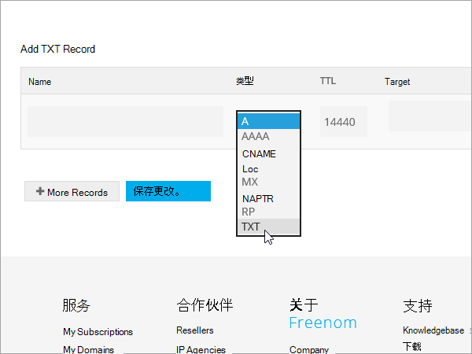
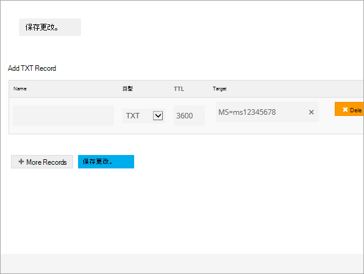
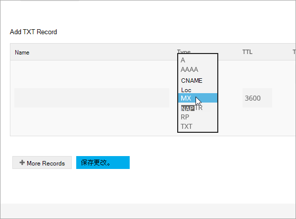
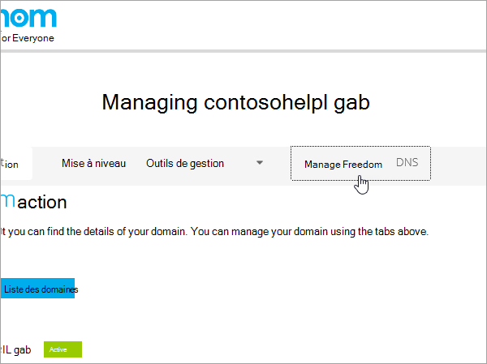
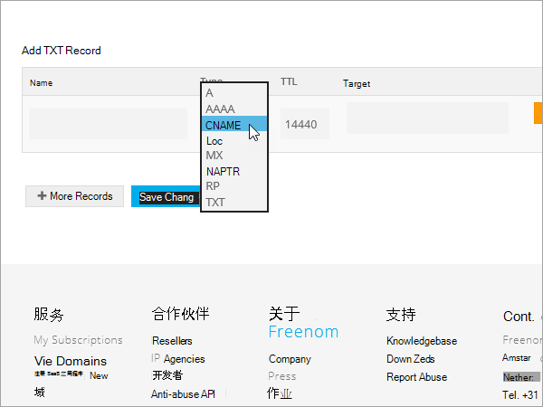

# 在 Freenom 上为 Office 365 创建 DNS 记录Create DNS records at Freenom for Office 365

如果找不到您要查找的内容，[请检查域 FAQ](../setup/domains-faq.md) 。[Check the Domains FAQ ](../setup/domains-faq.md) if you don't find what you're looking for. 
  
> [!CAUTION]
> Freenom 网站不支持 SRV 记录，这意味着多个 Skype for Business Online 和 Outlook Web App 功能将不起作用。The Freenom website doesn't support SRV records, which means that several Skype for Business Online and Outlook Web App features won't work. 无论使用哪种 Office 365 计划，都有显著的服务限制，您可能想要切换到其他 DNS 承载提供程序。No matter which Office 365 plan you use, there are significant service limitations, and you may want to switch to a different DNS hosting provider. 
  
如果考虑到服务限制，您可以选择在 Freenom 管理您自己的 Office 365 DNS 记录，请按照本文中的步骤验证您的域并为电子邮件和其他服务设置 DNS 记录。If despite the service limitations, you choose to manage your own Office 365 DNS records at Freenom, follow the steps in this article to verify your domain and set up DNS records for email and other services.
  
若要了解如何与 Office 365 结合使用网站的 Web 宿主和 DNS，请参阅[配合使用公共网站与 Office 365](https://support.office.com/article/a8178510-501d-4bd8-9921-b04f2e9517a5.aspx)。To learn about webhosting and DNS for websites with Office 365, see [Use a public website with Office 365](https://support.office.com/article/a8178510-501d-4bd8-9921-b04f2e9517a5.aspx).
  
> [!NOTE]
> DNS 更改通常需要 15 分钟左右才能生效。 但是，有时可能需要更长时间，您所做的更改才会在 Internet 的 DNS 系统中更新。 如果添加 DNS 记录后遇到邮件流问题或其他问题，请参阅 [更改域名或 DNS 记录后出现的问题的疑难解答](../get-help-with-domains/find-and-fix-issues.md)。Typically it takes about 15 minutes for DNS changes to take effect. However, it can occasionally take longer for a change you've made to update across the Internet's DNS system. If you're having trouble with mail flow or other issues after adding DNS records, see [Troubleshoot issues after changing your domain name or DNS records](../get-help-with-domains/find-and-fix-issues.md). 
  
## 添加 TXT 记录进行验证Add a TXT record for verification

在将域用于 Office 365 之前，必须确保你拥有该域。如果你能够在域注册机构处登录到你的帐户并创建 DNS 记录，便可向 Office 365 证明你是所有者。Before you use your domain with Office 365, we have to make sure that you own it. Your ability to log in to your account at your domain registrar and create the DNS record proves to Office 365 that you own the domain.
  
> [!NOTE]
> 此记录仅用于验证您是否拥有自己的域；它不会影响其他任何内容。 如果需要，您可以以后将其删除。This record is used only to verify that you own your domain; it doesn't affect anything else. You can delete it later, if you like. 
  
1. 若要开始，请使用[此链接](https://my.freenom.com/)转到 Freenom 中的 "域" 页面。To get started, go to your domains page in Freenom by using [this link](https://my.freenom.com/). You'll be prompted to log in.You'll be prompted to log in.
    
    
  
2. 选择 "**服务**"，然后选择 **"我的域**"。Select **Services**, and then select **My Domains**.
    
    
  
3. 对于要编辑的域，选择 "**管理域**"。For the domain that you want to edit, select **Manage Domain**.
    
    
  
4. 选择 "**管理 FREENOM DNS**"。Select **Manage Freenom DNS**.
    
    
  
5. 在 "**添加记录**" 下的 "**类型**" 列中，从菜单中选择 " **TXT** "。Under **Add Record**, in the **Type** column, choose **TXT** from the menu. 
    
    
  
6. 在新记录的框中，键入或复制并粘贴下表中的值。In the boxes for the new record, type or copy and paste the values from the following table. 
    
    |**名称****Name**|**Type****Type**|**TTL****TTL**|**目标****Target**|
    |:-----|:-----|:-----|:-----|
    |（保留为空白）(leave blank)    |TXTTXT    |3600（秒）3600 (seconds)    |MS = msXXXXXXXXMS=msXXXXXXXX    **注意：** 此为示例。**Note:** This is an example. 在这里使用来自 Office 365 中的表的具体**目标地址或指向的地址**值。Use your specific **Destination or Points to Address** value here, from the table in Office 365.           [如何查找此项？How do I find this?](../get-help-with-domains/information-for-dns-records.md)          |
   
    
  
7. 选择 "**保存更改**"。Select **Save Changes**.
    
    
  
8. 请在继续之前等待数分钟，以便您刚刚创建的记录可以通过 Internet 完成更新。Wait a few minutes before you continue, so that the record you just created can update across the Internet.
    
现在你已在域注册机构网站添加了记录，然后将返回到 Office 365 并请求 Office 365 查找记录。Now that you've added the record at your domain registrar's site, you'll go back to Office 365 and request Office 365 to look for the record.
  
Office 365 找到正确的 TXT 记录时，表明你的域已通过验证。When Office 365 finds the correct TXT record, your domain is verified.
  
1. 在管理中心，转到“**设置**”\> <a href="https://go.microsoft.com/fwlink/p/?linkid=834818" target="_blank">域</a>页面。In the admin center, go to the **Settings** \> <a href="https://go.microsoft.com/fwlink/p/?linkid=834818" target="_blank">Domains</a> page.

    
2. 在“**域**”页面上，选择要验证的域。On the **Domains** page, select the domain that you are verifying. 
    
    
  
3. 在“**设置**”页面上，选择“**开始设置**”。On the **Setup** page, select **Start setup**.
    
    
  
4. 在“**验证域**”页面上，选择“**验证**”。On the **Verify domain** page, select **Verify**.
    
    
  
> [!NOTE]
>  DNS 更改通常需要 15 分钟左右才能生效。 但是，有时可能需要更长时间，您所做的更改才会在 Internet 的 DNS 系统中更新。 如果添加 DNS 记录后遇到邮件流问题或其他问题，请参阅 [更改域名或 DNS 记录后出现的问题的疑难解答](../get-help-with-domains/find-and-fix-issues.md)。Typically it takes about 15 minutes for DNS changes to take effect. However, it can occasionally take longer for a change you've made to update across the Internet's DNS system. If you're having trouble with mail flow or other issues after adding DNS records, see [Troubleshoot issues after changing your domain name or DNS records](../get-help-with-domains/find-and-fix-issues.md). 
  
## 添加一条 MX 记录，确保发往你的域的电子邮件发送到 Office 365Add an MX record so email for your domain will come to Office 365

1. 若要开始，请使用[此链接](https://my.freenom.com/)转到 Freenom 中的 "域" 页面。To get started, go to your domains page in Freenom by using [this link](https://my.freenom.com/). You'll be prompted to log in.You'll be prompted to log in.
    
    
  
2. 选择 "**服务**"，然后选择 **"我的域**"。Select **Services**, and then select **My Domains**.
    
    
  
3. 对于要编辑的域，选择 "**管理域**"。For the domain that you want to edit, select **Manage Domain**.
    
    
  
4. 将您的域的名称设置为默认的 Freenom 名称服务器。Set the name serves for your domain to the default Freenom name servers. 选择 "**管理工具**"，然后选择 "**名称服务器**"。Select **Management Tools**, and then select **Nameservers**.
    
    
  
5. 请确保已选择 "**使用默认名称服务器**"，然后选择 "**更改名称服务器**"。Make sure **Use default nameservers** is selected, and then select **Change Nameservers**.
    
    
  
6. 选择 "**管理 FREENOM DNS**"。Select **Manage Freenom DNS**.
    
    
  
7. 在 "**添加记录**" 下的 "**类型**" 列中，从菜单中选择 " **MX** "。Under **Add Record**, in the **Type** column, choose **MX** from the menu. 
    
    
  
8. 在新记录的框中，键入或复制并粘贴下表中第一行的值。In the boxes for the new record, type or copy and paste the values from the first row of the following table. 
    
    |**名称****Name**|**Type****Type**|**TTL****TTL**|**目标****Target**|**优先级****Priority**|
    |:-----|:-----|:-----|:-----|:-----|
    |（保留为空白）(leave blank)    |MX （邮件交换器）MX (Mail Exchanger)    |3600（秒）3600 (seconds)    |\<域密钥\>. mail.protection.outlook.com\<domain-key\>.mail.protection.outlook.com    **注意：** 从 Office 365 帐户中获取你\* \<的域密钥\> \* 。**Note:** Get your  *\<domain-key\>*  from your Office 365 account.   如何查找此内容？[How do I find this?](../get-help-with-domains/information-for-dns-records.md)          |10 10    有关优先级的详细信息，请参阅[什么是 MX 优先级？](https://support.office.com/article/17d415c1-067e-4974-84d5-aaeaf3a0c0a9)For more information about priority, see [What is MX priority?](https://support.office.com/article/17d415c1-067e-4974-84d5-aaeaf3a0c0a9)   |
   
   
  
9. 选择 "**保存更改**"。Select **Save Changes**.
    
    
  
10. 如果有任何其他 MX 记录，请将它们全部删除。If there are any other MX records, delete them all. 对于每个记录，选择 "**删除**"。For each record, select **Delete**. 当**您确实要删除此条目时？** 出现时，选择 **"确定"**。When the message **Do you really want to remove this entry?** appears, select **OK**.
    
## 添加 Office 365 所需的 CNAME 记录Add the CNAME records that are required for Office 365

1. 若要开始，请使用[此链接](https://my.freenom.com/)转到 Freenom 中的 "域" 页面。To get started, go to your domains page in Freenom by using [this link](https://my.freenom.com/). You'll be prompted to log in.You'll be prompted to log in.
    
    
  
2. 选择 "**服务**"，然后选择 **"我的域**"。Select **Services**, and then select **My Domains**.
    
    
  
3. 对于要编辑的域，选择 "**管理域**"。For the domain that you want to edit, select **Manage Domain**.
    
    
  
4. 选择 "**管理 FREENOM DNS**"。Select **Manage Freenom DNS**.
    
    
  
5. 在 "**添加记录**" 下的 "**类型**" 列中，从菜单中选择 " **CNAME** "。Under **Add Record**, in the **Type** column, choose **CNAME** from the menu. 
    
    
  
6. 创建第一个 CNAME 记录。Create the first CNAME record. 在新记录的框中，键入或复制并粘贴下表中第一行的值。In the boxes for the new record, type or copy and paste the values from the first row of the following table. 
    
    |**名称****Name**|**记录类型****Record type**|**TTL****TTL**|**目标****Target**|
    |:-----|:-----|:-----|:-----|
    |autodiscoverautodiscover    |CNAMECNAME    |3600（秒）3600 (seconds)    |autodiscover.outlook.comautodiscover.outlook.com    |
    |sipsip    |CNAMECNAME    |3600（秒）3600 (seconds)    |sipdir.online.lync.comsipdir.online.lync.com    |
    |lyncdiscoverlyncdiscover    |CNAMECNAME    |3600（秒）3600 (seconds)    |webdir.online.lync.comwebdir.online.lync.com    |
    |enterpriseregistrationenterpriseregistration    |CNAMECNAME    |3600（秒）3600 (seconds)    |enterpriseregistration.windows.netenterpriseregistration.windows.net    |
    |enterpriseenrollmententerpriseenrollment    |CNAMECNAME    |3600（秒）3600 (seconds)    |enterpriseenrollment-s.manage.microsoft.comenterpriseenrollment-s.manage.microsoft.com    |
   
    
  
7. 选择 "**保存更改**"。Select **Save Changes**.
    
    
  
8. 重复前面的步骤以创建其他五个 CNAME 记录。Repeat the previous steps to create the other five CNAME records. 
    
    对于每个记录，键入或复制并将上表中下一行的值粘贴到该记录的框中。For each record, type or copy and paste the values from the next row of the table above into the boxes for that record.
    
## 为 SPF 添加 TXT 记录以帮助防止垃圾邮件Add a TXT record for SPF to help prevent email spam

> [!IMPORTANT]
> 一个域所拥有的 SPF 的 TXT 记录不能超过一个。You cannot have more than one TXT record for SPF for a domain. 如果域具有多个 SPF 记录，你将收到电子邮件错误，其中随附发送和垃圾邮件分类问题。If your domain has more than one SPF record, you'll get email errors, as well as delivery and spam classification issues. If you already have an SPF record for your domain, don't create a new one for Office 365.If you already have an SPF record for your domain, don't create a new one for Office 365. 可以将所需的 Office 365 添加到当前记录，这样就拥有包含两组值的*单个*SPF 记录。Instead, add the required Office 365 values to the current record so that you have a  *single*  SPF record that includes both sets of values. 

1. 若要开始，请使用[此链接](https://my.freenom.com/)转到 Freenom 中的 "域" 页面。To get started, go to your domains page in Freenom by using [this link](https://my.freenom.com/). You'll be prompted to log in.You'll be prompted to log in.
    
    
  
2. 选择 "**服务**"，然后选择 **"我的域**"。Select **Services**, and then select **My Domains**.
    
    
  
3. 对于要编辑的域，选择 "**管理域**"。For the domain that you want to edit, select **Manage Domain**.
    
    
  
4. 选择 "**管理 FREENOM DNS**"。Select **Manage Freenom DNS**.
    
    
  
5. 在 "**添加记录**" 下的 "**类型**" 列中，从菜单中选择 " **TXT** "。Under **Add Record**, in the **Type** column, choose **TXT** from the menu. 
    
    
  
6. In the boxes for the new record, type or copy and paste the following values.In the boxes for the new record, type or copy and paste the following values. 
    
    |**名称****Name**|**记录类型****Record type**|**TTL****TTL**|**目标****Target**|
    |:-----|:-----|:-----|:-----|
    |（保留为空白）(leave blank)    |TXTTXT    |3600（秒）3600 (seconds)    |v=spf1 include:spf.protection.outlook.com -allv=spf1 include:spf.protection.outlook.com -all   **注意：** 建议复制粘贴此条目，以保证正确保留所有空格。**Note:** We recommend copying and pasting this entry, so that all of the spacing stays correct.           |
   
    
  
7. 选择 "**保存更改**"。Select **Save Changes**.
    
    
  

