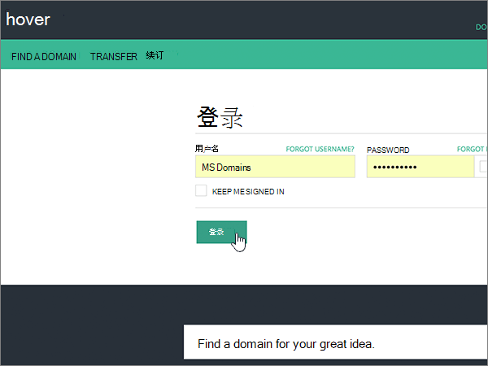
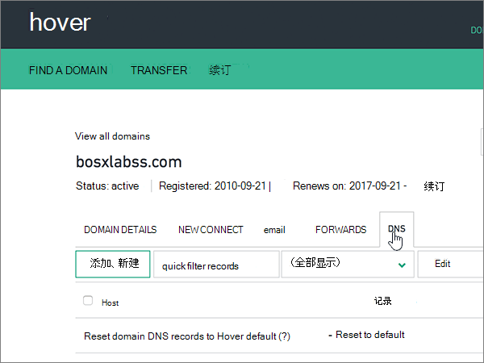
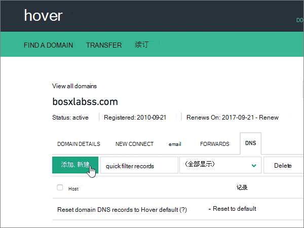

# 在 Microsoft 悬停时创建 DNS 记录

 如果找不到要查找的内容，请**[查看域常见问题解答](../setup/domains-faq.md)**。 
  
如果悬停是您的 DNS 托管提供商，请按照本文中的步骤验证您的域并为电子邮件、Skype for Business Online 等设置 DNS 记录。
     
在悬停时添加这些记录后，您的域将设置为与 Microsoft 服务配合使用。
  

  
> [!NOTE]
>  DNS 更改通常需要 15 分钟左右才能生效。 但是，有时可能需要更长时间，您所做的更改才会在 Internet 的 DNS 系统中更新。 如果添加 DNS 记录后遇到邮件流问题或其他问题，请参阅 [更改域名或 DNS 记录后出现的问题的疑难解答](../get-help-with-domains/find-and-fix-issues.md)。 
  
## 添加 TXT 记录进行验证

在将域用于 Microsoft 之前，必须确保你拥有该域。如果你能够在域注册机构处登录到你的帐户并创建 DNS 记录，便可向 Microsoft 证明你是域所有者。
  
> [!NOTE]
> 此记录仅用于验证您是否拥有自己的域；它不会影响其他任何内容。 如果需要，您可以以后将其删除。 
  
请按下列步骤操作或[观看视频](https://support.office.com/article/Video-Create-DNS-records-at-Hover-for-Office-365-182bd58e-8fe4-4717-9233-3a3546b72ad2?ui=en-US&amp;rs=en-US&amp;ad=US)。
  
1. 若要开始，请使用[此链接](https://www.hover.com/domains)转到 Hover 上您的域页面。系统将会提示您首先登录。
    
    
  
2. 在 "**管理您的域**" 下，选择要编辑的域的名称。
    
    
  
3. 选择 " **DNS** " 选项卡。 
    
    
  
4. 选择 "**添加新**"。
    
    
  
5. In the boxes for the new record, select **TXT** for the **Record Type**, and then type or copy and paste the values from the following table.
    
    ||||
    |:-----|:-----|:-----|
    |主机名    |记录类型    |值    |
    |@    |TXT    |MS=ms *XXXXXXXX*    **注意：** 这是一个示例。 在这里使用表中的特定“**目标地址或指向的地址**”值。           [如何查找此项？](../get-help-with-domains/information-for-dns-records.md)          |
   
    
  
6. 选择“保存”****。
    
    
  
7. 请在继续之前等待数分钟，以便您刚刚创建的记录可以通过 Internet 完成更新。
    
在域注册机构网站添加了记录后，你将返回到 Microsoft 365 并请求 Microsoft 365 查找记录。
  
Microsof 找到正确的 TXT 记录表明域已通过验证。
  
1. 在 Microsoft 管理中心，转到“**设置**”\>“<a href="https://go.microsoft.com/fwlink/p/?linkid=834818" target="_blank">域</a>”页面。
    
2. 在“**域**”页面上，选择要验证的域。 
    
    
  
3. 在“**设置**”页面上，选择“**开始设置**”。
    
    
  
4. 在“**验证域**”页面上，选择“**验证**”。
    
    
  
> [!NOTE]
>  DNS 更改通常需要 15 分钟左右才能生效。 但是，有时可能需要更长时间，您所做的更改才会在 Internet 的 DNS 系统中更新。 如果添加 DNS 记录后遇到邮件流问题或其他问题，请参阅 [更改域名或 DNS 记录后出现的问题的疑难解答](../get-help-with-domains/find-and-fix-issues.md)。 
  
## 添加一条 MX 记录，确保发往你的域的电子邮件将会发送到 Microsoft

请按下列步骤操作或[观看视频](https://support.office.com/article/Video-Create-DNS-records-at-Hover-for-Office-365-182bd58e-8fe4-4717-9233-3a3546b72ad2?ui=en-US&amp;rs=en-US&amp;ad=US)。
  
1. 若要开始，请使用[此链接](https://www.hover.com/domains)转到 Hover 上您的域页面。系统将会提示您首先登录。
    
    
  
2. 在 "**管理您的域**" 下，选择要编辑的域的名称。
    
    
  
3. 选择 " **DNS** " 选项卡。 
    
    
  
4. 选择 "**添加新**"。
    
    
  
5. 在新记录的框中，选择**记录类型**的 " **MX** "，然后键入或复制并粘贴下表中的值。
    
    |**主机名**|**记录类型**|**优先级**|**主机名**|
    |:-----|:-----|:-----|:-----|
    |@    |MX    |0    有关优先级的详细信息，请参阅[什么是 MX 优先级？](https://docs.microsoft.com/microsoft-365/admin/setup/domains-faq)   | *\<域密钥\>*  .mail.protection.outlook.com    **注意：** 从你的 Microsoft 帐户中获取你* \<的域密钥\> * 。           [如何查找此项？](../get-help-with-domains/information-for-dns-records.md)          |
   
    
  
6. 选择“保存”****。
    
    
  
7. 如果有任何其他 MX 记录，请使用以下两步过程删除每个：
    
    首先，鼠标移要删除的记录，选择 "**删除**"。
    
    
  
    其次，选择 **"是"** 以确认每次删除。 
    
    
  
    重复此过程，直到删除了之前在此过程中添加的 MX 记录之外的所有 MX 记录。
    
## 添加 Microsoft 所需的 CNAME 记录

请按下列步骤操作或[观看视频](https://support.office.com/article/Video-Create-DNS-records-at-Hover-for-Office-365-182bd58e-8fe4-4717-9233-3a3546b72ad2?ui=en-US&amp;rs=en-US&amp;ad=US)。
  
1. 若要开始，请使用[此链接](https://www.hover.com/domains)转到 Hover 上您的域页面。系统将会提示您首先登录。
    
    
  
2. 在 "**管理您的域**" 下，选择要编辑的域的名称。
    
    
  
3. 选择 " **DNS** " 选项卡。 
    
    
  
4. 添加第一条 CNAME 记录（共 6 条）。
    
    选择 "**添加新**"。
    
    
  
5. 在新记录的空框中，为**记录类型**选择 " **CNAME** "，然后键入或复制并粘贴下表中第一行的值。
    
    |**主机名**|**记录类型**|**目标主机**|
    |:-----|:-----|:-----|
    |autodiscover    |CNAME    |autodiscover.outlook.com    |
    |sip    |CNAME    |sipdir.online.lync.com    |
    |lyncdiscover    |CNAME    |webdir.online.lync.com    |
    |enterpriseregistration    |CNAME    |enterpriseregistration.windows.net    |
    |enterpriseenrollment    |CNAME    |enterpriseenrollment-s.manage.microsoft.com    |
   
    
  
6. 选择“保存”****。
    
    
  
7. 使用前面的三个步骤和表中其他五行中的值，添加其他五个 CNAME 记录中的每个。
    
## 为 SPF 添加 TXT 记录以帮助防止垃圾邮件

> [!IMPORTANT]
> 一个域所拥有的 SPF 的 TXT 记录不能超过一个。 如果域具有多个 SPF 记录，你将收到电子邮件错误，其中随附发送和垃圾邮件分类问题。 如果你的域已有 SPF 记录，请不要为 Microsoft 创建新记录。 改为将所需的 Microsoft 值添加到当前记录，以便您具有包含两组值的*单个*SPF 记录。 
  
请按下列步骤操作或[观看视频](https://support.office.com/article/Video-Create-DNS-records-at-Hover-for-Office-365-182bd58e-8fe4-4717-9233-3a3546b72ad2?ui=en-US&amp;rs=en-US&amp;ad=US)。
  
1. 若要开始，请使用[此链接](https://www.hover.com/domains)转到 Hover 上您的域页面。系统将会提示您首先登录。
    
    
  
2. 在 "**管理您的域**" 下，选择要编辑的域的名称。
    
    
  
3. 选择 " **DNS** " 选项卡。 
    
    
  
4. 选择 "**添加新**"。
    
    
  
5. In the boxes for the new record, select **TXT** for the **Record Type**, and then type or copy and paste the values from the following table.
    
    |**主机名**|**记录类型**|**值**|
    |:-----|:-----|:-----|
    |@    |TXT    |v=spf1 include:spf.protection.outlook.com -all   **注意：** 我们建议您复制并粘贴此条目，以保证正确保留所有空格。           |
   
    
  
6. 选择“保存”****。
    
    
  
## 添加 Microsoft 所需的两条 SRV 记录

请按下列步骤操作或[观看视频](https://support.office.com/article/Video-Create-DNS-records-at-Hover-for-Office-365-182bd58e-8fe4-4717-9233-3a3546b72ad2?ui=en-US&amp;rs=en-US&amp;ad=US)。
  
1. 若要开始，请使用[此链接](https://www.hover.com/domains)转到 Hover 上您的域页面。系统将会提示您首先登录。
    
    
  
2. 在 "**管理您的域**" 下，选择要编辑的域的名称。
    
    
  
3. 选择 " **DNS** " 选项卡。 
    
    
  
4. 添加两条 SRV 记录中的第一条记录。
    
    选择 "**添加新**"。
    
    
  
5. 在新记录的空框中，为**记录类型**选择 " **SRV** "，然后键入或复制并粘贴下表中第一行的值。
    
    |**主机名**|**记录类型**|**优先级**|**权重**|**端口**|**目标**|
    |:-----|:-----|:-----|:-----|:-----|:-----|
    |_sip _tls    |SRV    |100    |1    |443    |sipdir.online.lync.com    |
    |_sipfederationtls _tcp    |SRV    |100    |1    |5061    |sipfed.online.lync.com    |
   
    
  
6. 选择“保存”****。
    
    
  
7. 使用前面的三个步骤和表中第二行的值，添加另一条 SRV 记录。
    
> [!NOTE]
> DNS 更改通常需要 15 分钟左右才能生效。 但是，有时可能需要更长时间，您所做的更改才会在 Internet 的 DNS 系统中更新。 如果添加 DNS 记录后遇到邮件流问题或其他问题，请参阅 [更改域名或 DNS 记录后出现的问题的疑难解答](../get-help-with-domains/find-and-fix-issues.md)。 
  
