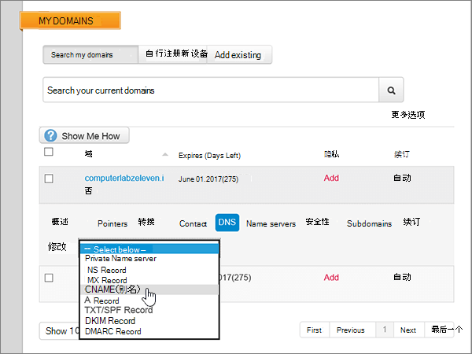

# 在 MyDomain 处为 Microsoft 创建 DNS 记录

  
 如果找不到要查找的内容，请**[查看域常见问题解答](../setup/domains-faq.md)**。 
  
> [!CAUTION]
> MyDomain 网站不支持 SRV 记录，这意味着多个 Skype for Business Online 和 Outlook Web App 功能将不起作用。无论使用哪个 Microsoft 计划，如果在 MyDomain 处管理 DNS 记录，则有[较大的服务限制](https://support.office.com/article/7ae9a655-041d-4724-aa92-60392ee390c2.aspx)，用户可能会想要切换为其他 DNS 托管提供商。 
  
如果忽略服务限制，选择在 MyDomain 处管理自己的 Microsoft DNS 记录，请按本文中的步骤为电子邮件、Skype for Business Online 等设置 DNS 记录。
    
在 MyDomain 添加这些记录后，你的域将设置为使用 Microsoft 服务。
  
若要了解如何与 Microsoft 结合使用网站的 Web 宿主和 DNS，请参阅[配合使用公共网站与 Microsoft](https://support.office.com/article/choose-a-public-website-3325d50e-d131-403c-a278-7f3296fe33a9)。
  
> [!NOTE]
> Typically it takes about 15 minutes for DNS changes to take effect. 但是，有时可能需要更长时间，您所做的更改才会在 Internet 的 DNS 系统中更新。 如果在添加 DNS 记录后遇到邮件流问题或其他问题，请参阅[查找在添加域或 DNS 记录后遇到的问题并进行修复](../get-help-with-domains/find-and-fix-issues.md)。 
  
## 添加 TXT 记录进行验证

在将域用于 Microsoft 之前，必须确保你拥有该域。如果你能够在域注册机构处登录到你的帐户并创建 DNS 记录，便可向 Microsoft 证明你是域所有者。
  
> [!NOTE]
> 此记录仅用于验证您是否拥有自己的域；它不会影响其他任何内容。 如果需要，您可以以后将其删除。 
  
1. 若要开始，请使用[此链接](https://www.mydomain.com/controlpanel)转到你在 MyDomain 上的域页面。系统将会提示你先登录。
    
2. 在“**我的收藏夹**”部分，选择则“**域中心**”。
    
3. 在“**域**”下，选择要编辑的域名。
    
4. 在“**概述**”行，选择“**DNS**”。
    
5. 在“**修改**”下拉列表中，选择“**TXT/SPF 记录**”。
    
6. 在" **内容**"下方新记录对应的框中，键入或复制并粘贴下表中的值。
    
    ||
    |:-----|
    |**内容**   |
    |MS=ms *XXXXXXXX*    **注意：** 这是一个示例。 在这里使用表中的特定“**目标地址或指向的地址**”值。 [如何查找此项？](../get-help-with-domains/information-for-dns-records.md)          |
   
7. 选择“**添加**”。
    
8. 请在继续之前等待数分钟，以便您刚刚创建的记录可以通过 Internet 完成更新。
    
在在域注册机构网站添加了记录后，你将返回到 Microsoft 并请求记录。
  
Microsof 找到正确的 TXT 记录表明域已通过验证。
  
1. 在 Microsoft 管理中心，转到“**设置**”\>“<a href="https://go.microsoft.com/fwlink/p/?linkid=834818" target="_blank">域</a>”页面。
    
2. 在“**域**”页面上，选择要验证的域。 
    
3. 在“**设置**”页面上，选择“**开始设置**”。
    
4. 在“**验证域**”页面上，选择“**验证**”。
    
> [!NOTE]
> Typically it takes about 15 minutes for DNS changes to take effect. 但是，有时可能需要更长时间，您所做的更改才会在 Internet 的 DNS 系统中更新。 如果在添加 DNS 记录后遇到邮件流问题或其他问题，请参阅[查找在添加域或 DNS 记录后遇到的问题并进行修复](../get-help-with-domains/find-and-fix-issues.md)。 
  
## 添加一条 MX 记录，确保发往你的域的电子邮件将会发送到 Microsoft

1. 若要开始，请使用[此链接](https://www.mydomain.com/controlpanel)转到你在 MyDomain 上的域页面。系统将会提示你先登录。
    
2. 在“**我的收藏夹**”部分，选择则“**域中心**”。
    
3. 在“**域**”下，选择要编辑的域名。
    
4. 在“**概述**”行，选择“**DNS**”。
    
5. 在“**修改**”下拉列表中，选择“**MX 记录**”。
    
    
  
6. 在新记录的框中，键入或复制并粘贴下表中的值。
    
    |**Priority**|**Host**|**指向：**|
    |:-----|:-----|:-----|
    |0    有关优先级的详细信息，请参阅[什么是 MX 优先级？](https://support.office.com/article/2784cc4d-95be-443d-b5f7-bb5dd867ba83.aspx)   |@    | *\<域密钥\>*  .mail.protection.outlook.com    **注意：** 从 Microsoft 帐户获取\<*域密钥*\>。 > [如何查找此项？](../get-help-with-domains/information-for-dns-records.md)          |
   
    
  
7. 选择“**添加**”。
    
    
  
8. 如果存在任何其他现有 MX 记录，请在“**操作**”列中选择“**删除**”以删除每条 MX 记录。 
    
    
  
9. 选择“**确定**”。
    
    
  
## 添加 Microsoft 所需的 CNAME 记录

1. 若要开始，请使用[此链接](https://www.mydomain.com/controlpanel)转到你在 MyDomain 上的域页面。系统将会提示你先登录。
    
2. 在“**我的收藏夹**”部分，选择则“**域中心**”。
    
3. 在“**域**”下，选择要编辑的域名。
    
4. 在“**概述**”行，选择“**DNS**”。
    
5. 在“**修改**”下拉列表中，选择“**CNAME 别名**”。
    
    
  
6. 添加第一条 CNAME 记录。
    
    在新记录的框中，键入或复制并粘贴下表中第一行的值。
    
    |**Host**|**指向：**|
    |:-----|:-----|
    |自动发现    |autodiscover.outlook.com    |
    |sip    |sipdir.online.lync.com    |
    |lyncdiscover    |webdir.online.lync.com    |
    |enterpriseregistration    |enterpriseregistration.windows.net    |
    |enterpriseenrollment    |enterpriseenrollment-s.manage.microsoft.com    |
   
    
  
7. 选择“**添加**”以添加第一条记录。 
    
    
  
8. 添加第二条 CNAME 记录。
    
    使用上表中第二行的值，然后选择“**添加**”以添加第二条记录。 
    
    按同样的方法，使用表中第 3 到 6 行的值添加其余记录。
    
## 为 SPF 添加 TXT 记录以帮助防止垃圾邮件

> [!IMPORTANT]
> 一个域所拥有的 SPF 的 TXT 记录不能超过一个。 如果域具有多个 SPF 记录，你将收到电子邮件错误，其中随附发送和垃圾邮件分类问题。 如果你的域已有 SPF 记录，请不要为 Microsoft 创建新记录。 可以将所需的 Microsoft 值添加到当前记录，这样就拥有包含两组值的单个 SPF 记录。 需要示例吗？ 请查看 [Microsoft 的外部域名系统记录](https://support.office.com/article/c0531a6f-9e25-4f2d-ad0e-a70bfef09ac0#bkmk_spfrecords)。 若要验证 SPF 记录，可使用以下任一 [SPF 验证工具](../setup/domains-faq.md)。 
  
1. 若要开始，请使用[此链接](https://www.mydomain.com/controlpanel)转到你在 MyDomain 上的域页面。系统将会提示你先登录。
    
2. 在“**我的收藏夹**”部分，选择则“**域中心**”。
    
3. 在“**域**”下，选择要编辑的域名。
    
4. 在“**概述**”行，选择“**DNS**”。
    
5. 在“**修改**”下拉列表中，选择“**TXT/SPF 记录**”。
    
    
  
6. 在" **内容**"下方新记录对应的框中，键入或复制并粘贴下表中的值。
    
    |**内容**|
    |:-----|
    |v=spf1 include:spf.protection.outlook.com -all    **注意：** 建议复制粘贴此条目，以保证正确保留所有空格。           |
   
    
  
7. 选择“**添加**”。
    
    
  
## 添加 Microsoft 所需的两条 SRV 记录

> [!CAUTION]
> MyDomain 网站不支持 SRV 记录，这意味着多个 Skype for Business Online 和 Outlook Web App 功能将不起作用。无论使用哪个 Microsoft 计划，如果在 MyDomain 处管理 DNS 记录，则有[较大的服务限制](https://support.office.com/article/7ae9a655-041d-4724-aa92-60392ee390c2.aspx)，用户可能会想要切换为其他 DNS 托管提供商。 
  
> [!NOTE]
> Typically it takes about 15 minutes for DNS changes to take effect. 但是，有时可能需要更长时间，您所做的更改才会在 Internet 的 DNS 系统中更新。 如果在添加 DNS 记录后遇到邮件流问题或其他问题，请参阅[查找在添加域或 DNS 记录后遇到的问题并进行修复](../get-help-with-domains/find-and-fix-issues.md)。 
  
