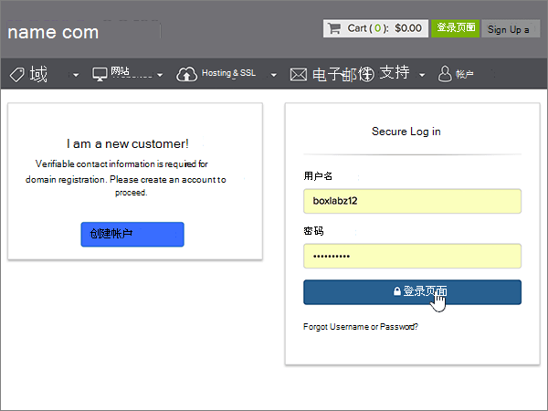
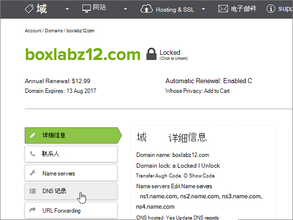

# 在 name.com 处为 Microsoft 创建 DNS 记录Create DNS records at name.com for Microsoft

 **如果找不到要查找的内容，请[查看域常见问题解答](../setup/domains-faq.md)** 。**[Check the Domains FAQ](../setup/domains-faq.md)** if you don't find what you're looking for. 
  
如果 DNS 托管提供者是 name.com，请按本文中的步骤验证域并为电子邮件、Skype for Business Online 等设置 DNS 记录。If name.com is your DNS hosting provider, follow the steps in this article to verify your domain and set up DNS records for email, Skype for Business Online, and so on.
  
在 name.com 中添加这些记录后，您的域将设置为与 Microsoft 服务一起使用。After you add these records at name.com, your domain will be set up to work with Microsoft services.

  
> [!NOTE]
> DNS 更改通常需要 15 分钟左右才能生效。 但是，有时可能需要更长时间，您所做的更改才会在 Internet 的 DNS 系统中更新。 如果添加 DNS 记录后遇到邮件流问题或其他问题，请参阅 [更改域名或 DNS 记录后出现的问题的疑难解答](../get-help-with-domains/find-and-fix-issues.md)。Typically it takes about 15 minutes for DNS changes to take effect. However, it can occasionally take longer for a change you've made to update across the Internet's DNS system. If you're having trouble with mail flow or other issues after adding DNS records, see [Troubleshoot issues after changing your domain name or DNS records](../get-help-with-domains/find-and-fix-issues.md). 
  
## 添加 TXT 记录进行验证Add a TXT record for verification

在将域用于 Microsoft 之前，必须确保你拥有该域。如果你能够在域注册机构处登录到你的帐户并创建 DNS 记录，便可向 Microsoft 证明你是域所有者。Before you use your domain with Microsoft, we have to make sure that you own it. Your ability to log in to your account at your domain registrar and create the DNS record proves to Microsoft that you own the domain.
  
> [!NOTE]
> 此记录仅用于验证您是否拥有自己的域；它不会影响其他任何内容。 如果需要，您可以以后将其删除。This record is used only to verify that you own your domain; it doesn't affect anything else. You can delete it later, if you like. 
  
1. 若要开始，请使用[此链接](https://www.name.com/account/domain)转到 name.com 上你的域页面。系统将会提示你首先登录。To get started, go to your domains page at name.com by using [this link](https://www.name.com/account/domain). You'll be prompted to log in first.
    
    
  
2. 在 **"我的域**" 下，选择要修改的域的名称。Under **My Domains**, select the name of the domain that you want to modify.
    
    
  
3. 在 "**详细信息**" 列中，选择 " **DNS 记录**"。In the **Details** column, select **DNS Records**. 
    
    
  
4. 在新记录的框中，键入或复制并粘贴下表中的值。In the boxes for the new record, type or copy and paste the values from the following table.
    
    (Choose the **Type** value from the drop-down list.)(Choose the **Type** value from the drop-down list.) 
    
    |||||
    |:-----|:-----|:-----|:-----|
    |**类型****Type**   |**主机****Host**   |**应答****Answer**   |**TTL****TTL**   |
    |TXTTXT    |(Leave this field empty.)(Leave this field empty.)    |MS=ms *XXXXXXXX*MS=ms *XXXXXXXX*    **注意：** 这是一个示例。**Note:** This is an example. 在这里使用表中的特定“**目标地址或指向的地址**”值。Use your specific **Destination or Points to Address** value here, from the table.           [如何查找此项？How do I find this?](../get-help-with-domains/information-for-dns-records.md)          |Use the default value (300).Use the default value (300).    |
   
    
  
5. 选择 "**添加记录**"。Select **Add Record**.
    
    
  
6. 请在继续之前等待数分钟，以便您刚刚创建的记录可以通过 Internet 完成更新。Wait a few minutes before you continue, so that the record you just created can update across the Internet.
    
在在域注册机构网站添加了记录后，你将返回到 Microsoft 并请求记录。Now that you've added the record at your domain registrar's site, you'll go back to Microsoft and request the record.
  
Microsof 找到正确的 TXT 记录表明域已通过验证。When Microsoft finds the correct TXT record, your domain is verified.
  
1. 在管理中心，转到“**设置**”\>“<a href="https://go.microsoft.com/fwlink/p/?linkid=834818" target="_blank">域</a>”页面。In the admin center, go to the **Settings** \> <a href="https://go.microsoft.com/fwlink/p/?linkid=834818" target="_blank">Domains</a> page.
    
2. 在“**域**”页面上，选择要验证的域。On the **Domains** page, select the domain that you are verifying. 
    
    
  
3. 在“**设置**”页面上，选择“**开始设置**”。On the **Setup** page, select **Start setup**.
    
    
  
4. 在“**验证域**”页面上，选择“**验证**”。On the **Verify domain** page, select **Verify**.
    
    
  
> [!NOTE]
> DNS 更改通常需要 15 分钟左右才能生效。 但是，有时可能需要更长时间，您所做的更改才会在 Internet 的 DNS 系统中更新。 如果添加 DNS 记录后遇到邮件流问题或其他问题，请参阅 [更改域名或 DNS 记录后出现的问题的疑难解答](../get-help-with-domains/find-and-fix-issues.md)。Typically it takes about 15 minutes for DNS changes to take effect. However, it can occasionally take longer for a change you've made to update across the Internet's DNS system. If you're having trouble with mail flow or other issues after adding DNS records, see [Troubleshoot issues after changing your domain name or DNS records](../get-help-with-domains/find-and-fix-issues.md). 
  
## 添加一条 MX 记录，确保发往你的域的电子邮件将会发送到 MicrosoftAdd an MX record so email for your domain will come to Microsoft

1. 若要开始，请使用[此链接](https://www.name.com/account/domain)转到 name.com 上你的域页面。系统将会提示你首先登录。To get started, go to your domains page at name.com by using [this link](https://www.name.com/account/domain). You'll be prompted to log in first.
    
    
  
2. 在 **"我的域**" 下，选择要修改的域的名称。Under **My Domains**, select the name of the domain that you want to modify.
    
    
  
3. 在 "**详细信息**" 列中，选择 " **DNS 记录**"。In the **Details** column, select **DNS Records**. 
    
    
  
4. 在新记录的框中，键入或复制并粘贴下表中的值。In the boxes for the new record, type or copy and paste the values from the following table.
    
    (Choose the **Type** value from the drop-down list.)(Choose the **Type** value from the drop-down list.) 
    
    |**类型****Type**|**主机****Host**|**应答****Answer**|**TTL****TTL**|**优先级****Prio**|
    |:-----|:-----|:-----|:-----|:-----|
    |MXMX    |（将此字段留空。）(Leave this field empty.)    | *\<域密钥\>*  .mail.protection.outlook.com*\<domain-key\>*  .mail.protection.outlook.com    **注意：** 从你的 Microsoft 帐户中获取你\* \<的域密钥\> \* 。**Note:** Get your  *\<domain-key\>*  from your Microsoft account.           [如何查找此内容？How do I find this?](../get-help-with-domains/information-for-dns-records.md)          |Use the default value (300).Use the default value (300).    |00    有关优先级的详细信息，请参阅[什么是 MX 优先级？](https://docs.microsoft.com/microsoft-365/admin/setup/domains-faq)For more information about priority, see [What is MX priority?](https://docs.microsoft.com/microsoft-365/admin/setup/domains-faq)   |
   
   
  
5. 选择 "**添加记录**"。Select **Add Record**.
    
    
  
6. 如果存在任何其他 MX 记录，请使用以下两步操作删除这些记录：If there are any other MX records, delete each of them by using the following two-step procedure:
    
    对于每个其他 MX 记录，请在 "**操作**" 列中选择 "**删除**"。For each other MX record, select **Delete** in the **Actions** column. 
    
    
  
    若要确认每个删除，请再次选择 "**操作**" 列中的 "**删除**"。To confirm each deletion, select **Delete** in the **Actions** column again. 
    
    
  
    重复此两步操作，直到删除所有其他 MX 记录。Repeat this two-step procedure until you have deleted each of the other MX records.
    
## 添加 Microsoft 所需的 CNAME 记录Add the CNAME records that are required for Microsoft

1. 若要开始，请使用[此链接](https://www.name.com/account/domain)转到 name.com 上你的域页面。系统将会提示你首先登录。To get started, go to your domains page at name.com by using [this link](https://www.name.com/account/domain). You'll be prompted to log in first.
    
    
  
2. 在 **"我的域**" 下，选择要修改的域的名称。Under **My Domains**, select the name of the domain that you want to modify.
    
    
  
3. 在 "**详细信息**" 列中，选择 " **DNS 记录**"。In the **Details** column, select **DNS Records**. 
    
    
  
4. 添加第一条 CNAME 记录。Add the first CNAME record.
    
    在新记录的框中，键入或复制并粘贴下表中第一行的值。In the boxes for the new record, type or copy and paste the values from the first row of the following table.
    
    （从下拉列表中选择" **类型**"值。）(Choose the **Type** value from the drop-down list.) 
    
    |**类型****Type**|**主机****Host**|**应答****Answer**|**TTL****TTL**|
    |:-----|:-----|:-----|:-----|
    |CNAMECNAME    |自动发现autodiscover    |autodiscover.outlook.comautodiscover.outlook.com    |使用默认值 (300)。Use the default value (300).    |
    |CNAMECNAME    |sipsip    |sipdir.online.lync.comsipdir.online.lync.com    |使用默认值 (300)。Use the default value (300).    |
    |CNAMECNAME    |lyncdiscoverlyncdiscover    |webdir.online.lync.comwebdir.online.lync.com    |使用默认值 (300)。Use the default value (300).    |
    |CNAMECNAME    |enterpriseregistrationenterpriseregistration    |EnterpriseRegistration.windows.netenterpriseregistration.windows.net    |使用默认值 (300)。Use the default value (300).    |
    |CNAMECNAME    |enterpriseenrollmententerpriseenrollment    |enterpriseenrollment-s.manage.microsoft.comenterpriseenrollment-s.manage.microsoft.com    |使用默认值 (300)。Use the default value (300).    |
   
   
  
5. 选择 "**添加记录**" 以添加第一条记录。Select **Add Record** to add the first record. 
    
    
  
6. 添加第二条 CNAME 记录。Add the second CNAME record.
    
    使用上表中第二行的值，然后选择 "**添加记录**" 以添加第二条记录。Use the values from the second row of the table above, and then select **Add Record** to add the second record. 
    
    按同样的方法，使用表中第 3 到 6 行的值添加其余记录。Add the remaining records in the same way, using the values from the third, fourth, fifth, and sixth rows of the table.
    
## 为 SPF 添加 TXT 记录以帮助防止垃圾邮件Add a TXT record for SPF to help prevent email spam

> [!IMPORTANT]
> 一个域所拥有的 SPF 的 TXT 记录不能超过一个。You cannot have more than one TXT record for SPF for a domain. 如果域具有多个 SPF 记录，你将收到电子邮件错误，其中随附发送和垃圾邮件分类问题。If your domain has more than one SPF record, you'll get email errors, as well as delivery and spam classification issues. 如果你的域已有 SPF 记录，请不要为 Microsoft 创建新记录。If you already have an SPF record for your domain, don't create a new one for Microsoft. 改为将所需的 Microsoft 值添加到当前记录，以便您具有包含两组值的*单个*SPF 记录。Instead, add the required Microsoft values to the current record so that you have a  *single*  SPF record that includes both sets of values. 
  
1. 若要开始，请使用[此链接](https://www.name.com/account/domain)转到 name.com 上你的域页面。系统将会提示你首先登录。To get started, go to your domains page at name.com by using [this link](https://www.name.com/account/domain). You'll be prompted to log in first.
    
    
  
2. 在 **"我的域**" 下，选择要修改的域的名称。Under **My Domains**, select the name of the domain that you want to modify.

    
  
3. 在 "**详细信息**" 列中，选择 " **DNS 记录**"。In the **Details** column, select **DNS Records**. 
    
    
  
4. 在新记录的框中，键入或复制并粘贴下表中的值。In the boxes for the new record, type or copy and paste the values from the following table.
    
    (Choose the **Type** value from the drop-down list.)(Choose the **Type** value from the drop-down list.) 
    
    |**类型****Type**|**主机****Host**|**应答****Answer**|**TTL****TTL**|
    |:-----|:-----|:-----|:-----|
    |TXTTXT    |(Leave this field empty.)(Leave this field empty.)    |v=spf1 include:spf.protection.outlook.com -allv=spf1 include:spf.protection.outlook.com -all    **注意：** 我们建议您复制并粘贴此条目，以保证正确保留所有空格。**Note:** We recommend copying and pasting this entry, so that all of the spacing stays correct.           |Use the default value (300).Use the default value (300).    |
   
   
  
5. 选择 "**添加记录**"。Select **Add Record**.
    
    
  
## 添加 Microsoft 所需的两条 SRV 记录Add the two SRV records that are required for Microsoft

1. 若要开始，请使用[此链接](https://www.name.com/account/domain)转到 name.com 上你的域页面。系统将会提示你首先登录。To get started, go to your domains page at name.com by using [this link](https://www.name.com/account/domain). You'll be prompted to log in first.
    
    
  
2. 在 **"我的域**" 下，选择要修改的域的名称。Under **My Domains**, select the name of the domain that you want to modify.
    
    
  
3. 在 "**详细信息**" 列中，选择 " **DNS 记录 +**"。In the **Details** column, select **DNS Records+**. 
    
    
  
4. 添加第一条 SRV 记录：Add the first SRV record:
    
    在新记录的框中，键入或复制并粘贴下表中第一行的值。In the boxes for the new record, type or copy and paste the values from the first row of the following table.
    
    （从下拉列表中选择" **类型**"值。）(Choose the **Type** value from the drop-down list.) 
    
    |**类型****Type**|**服务****Service**|**权重****Weight**|**TTL****TTL**|**优先级****Prio**|**协议****Protocol**|**端口****Port**|**目标****Target**|
    |:-----|:-----|:-----|:-----|:-----|:-----|:-----|:-----|
    |SRVSRV|sipsip|11|使用默认值 (300)。Use the default value (300).|100100|tlstls|443443|sipdir.online.lync.comsipdir.online.lync.com   **注意：** 我们建议您复制并粘贴此条目，以保证正确保留所有空格。**Note:** We recommend copying and pasting this entry, so that all of the spacing stays correct.           |
    |SRVSRV|sipfederationtlssipfederationtls|11|使用默认值 (300)。Use the default value (300).|100100|tcptcp|50615061|sipfed.online.lync.comsipfed.online.lync.com  **注意：** 我们建议您复制并粘贴此条目，以保证正确保留所有空格。**Note:** We recommend copying and pasting this entry, so that all of the spacing stays correct.           |
   
   
  
5. 选择 "**添加记录**"。Select **Add Record**.

    
  
6. 添加第二条 SRV 记录：Add the second SRV record:

使用上表中下一行的值，然后选择 "**添加记录**" 以添加第二条记录。Use the values from the next row of the table above, and then select **Add Record** to add the second record.

>[!NOTE]
>DNS 更改通常需要 15 分钟左右才能生效。 但是，有时可能需要更长时间，您所做的更改才会在 Internet 的 DNS 系统中更新。 如果添加 DNS 记录后遇到邮件流问题或其他问题，请参阅 [更改域名或 DNS 记录后出现的问题的疑难解答](../get-help-with-domains/find-and-fix-issues.md)。Typically it takes about 15 minutes for DNS changes to take effect. However, it can occasionally take longer for a change you've made to update across the Internet's DNS system. If you're having trouble with mail flow or other issues after adding DNS records, see [Troubleshoot issues after changing your domain name or DNS records](../get-help-with-domains/find-and-fix-issues.md).
