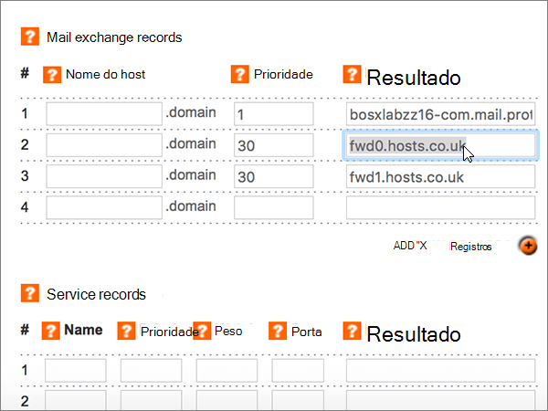
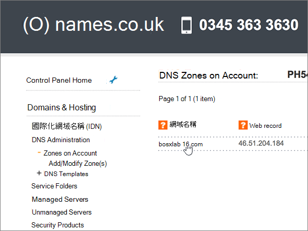

# 在 Names.co.uk 处为 Microsoft 创建 DNS 记录

 如果找不到要查找的内容，请**[查看域常见问题解答](../setup/domains-faq.md)**。 
  
如果 Names.co.uk 是您的 DNS 托管提供商，请按照本文中的步骤验证您的域并为电子邮件、Skype for Business Online 等设置 DNS 记录。
    
在 Names.co.uk 中添加这些记录后，您的域将设置为与 Microsoft 服务一起使用。
  
若要了解 Microsoft 相关网站的托管和 DNS，请参阅[将公共网站与 microsoft 结合使用](https://support.office.com/article/choose-a-public-website-3325d50e-d131-403c-a278-7f3296fe33a9)。
  
> [!NOTE]
>  DNS 更改通常需要 15 分钟左右才能生效。 但是，有时可能需要更长时间，您所做的更改才会在 Internet 的 DNS 系统中更新。 如果添加 DNS 记录后遇到邮件流问题或其他问题，请参阅 [更改域名或 DNS 记录后出现的问题的疑难解答](../get-help-with-domains/find-and-fix-issues.md)。 
  
## 添加 TXT 记录进行验证

在将你的域用于 Microsoft 之前，我们必须确保你拥有此域。 你能够在域注册机构登录到你的帐户，并创建向 Microsoft 证明你拥有该域的 DNS 记录。
  
> [!NOTE]
> 此记录仅用于验证您是否拥有自己的域；它不会影响其他任何内容。 如果需要，您可以以后将其删除。 
  
1. 若要开始使用，请使用[此链接](https://account.names.co.uk/dashboard#/)转到 Names.co.uk 上的域页面。系统将提示你先登录。
    
    
  
2. On the **Dashboard** page, find the name of the domain that you are updating, and then choose **DNS Settings** from the drop-down list. 
    
    (You may have to scroll down.)
    
    
  
3. On the **Add/Modify DNS Zone** page, in the **A, CNAME, AAAA, TXT and NS records** section, in the boxes for the new record, type or copy and paste the values from the following table. 
    
    (Choose the **Type** value from the drop-down list.) 
    
    （如果需要添加行，请选择 "**添加/CNAME 记录（+）**"。
    
    （可能需要向下滚动。）
        
    |**主机名**|**类型**|**结果**|
    |:-----|:-----|:-----|
    |(Leave this field empty.)    |TXT    |MS=ms *XXXXXXXX*    **注意：** 此为示例。 从表中使用您的特定**目标或指向 "地址**" 值。           [如何查找此项？](../get-help-with-domains/information-for-dns-records.md)    |
       
    
  
4. 选择“**保存**”。
    
    （您可能需要向下滚动。）
    
    
  
5. 请在继续之前等待数分钟，以便您刚刚创建的记录可以通过 Internet 完成更新。
    
现在您已在域注册机构的网站上添加了记录，您将返回到 Microsoft 并请求该记录。
  
当 Microsoft 找到正确的 TXT 记录时，您的域将会得到验证。
  
1. 在管理中心，转到“**设置**”\> <a href="https://go.microsoft.com/fwlink/p/?linkid=834818" target="_blank">域</a>页面。
    
2. 在“**域**”页面上，选择要验证的域。 
    
    
  
3. 在“**设置**”页面上，选择“**开始设置**”。
    
    
  
4. 在“**验证域**”页面上，选择“**验证**”。
    
    
  
> [!NOTE]
>  DNS 更改通常需要 15 分钟左右才能生效。 但是，有时可能需要更长时间，您所做的更改才会在 Internet 的 DNS 系统中更新。 如果添加 DNS 记录后遇到邮件流问题或其他问题，请参阅 [更改域名或 DNS 记录后出现的问题的疑难解答](../get-help-with-domains/find-and-fix-issues.md)。 
  
## 添加 MX 记录，以便你的域的电子邮件将发送给 Microsoft

1. 若要开始使用，请使用[此链接](https://account.names.co.uk/dashboard#/)转到 Names.co.uk 上的域页面。系统将提示你先登录。
    
    
  
2. On the **Dashboard** page, find the name of the domain that you are updating, and then choose **DNS Settings** from the drop-down list. 
    
    (You may have to scroll down.)
    
    
  
3. 在 "**添加/修改 DNS 区域**" 页上的 "**邮件交换记录**" 部分中，在新记录的框中，键入或复制并粘贴下表中的值。 
    
    （可能需要向下滚动。）
    
    |**主机名**|**优先级**|**结果**|
    |:-----|:-----|:-----|
    |（将此字段留空。）    |1    有关优先级的详细信息，请参阅[什么是 MX 优先级？](https://support.office.com/article/2784cc4d-95be-443d-b5f7-bb5dd867ba83.aspx)   | *\<域密钥\>*  .mail.protection.outlook.com    > [!NOTE]> 从你的 Microsoft 帐户中获取你* \<的域密钥\> * 。           [如何查找此项？](../get-help-with-domains/information-for-dns-records.md)          |
       
    
  
4. 选择“**保存**”。
    
    (You may have to scroll down.)
    
    
  
5. 如果 "**邮件交换记录**" 部分中列出了任何其他 MX 记录，请通过选择它，然后按键盘上的**delete**键将其删除。 
    
    
  
6. 选择“**保存**”。
    
    (You may have to scroll down.)
    
    
  
## 添加 Microsoft 所需的六条 CNAME 记录

1. 若要开始使用，请使用[此链接](https://account.names.co.uk/dashboard#/)转到 Names.co.uk 上的域页面。系统将提示你先登录。
    
    
  
2. On the **Dashboard** page, find the name of the domain that you are updating, and then choose **DNS Settings** from the drop-down list. 
    
    (You may have to scroll down.)
    
    
  
3. On the **Add/Modify DNS Zone** page, in the **A, CNAME, AAAA, TXT and NS records** section, in the boxes for the new record, type or copy and paste the values from the following table. 
    
    (Choose the **Type** value from the drop-down list.) 
    
    （如果需要添加行，请选择 "**添加/CNAME 记录（+）**"。
    
    (You may have to scroll down.)
    
    |**主机名**|**类型**|**结果**|
    |:-----|:-----|:-----|
    |autodiscover    |CNAME    |autodiscover.outlook.com    |
    |sip    |CNAME    |sipdir.online.lync.com    |
    |lyncdiscover    |CNAME    |webdir.online.lync.com    |
    |enterpriseregistration    |CNAME    |enterpriseregistration.windows.net    |
    |enterpriseenrollment    |CNAME    |enterpriseenrollment-s.manage.microsoft.com    |
       
    
  
4. 选择“**保存**”。
    
    
  
## 为 SPF 添加 TXT 记录以帮助防止垃圾邮件

> [!IMPORTANT]
> 一个域所拥有的 SPF 的 TXT 记录不能超过一个。 如果域具有多个 SPF 记录，你将收到电子邮件错误，其中随附发送和垃圾邮件分类问题。 如果你已有域的 SPF 记录，请不要为 Microsoft 创建一个新的。 改为将所需的 Microsoft 值添加到当前记录，以便您具有包含两组值的*单个*SPF 记录。
  
1. 若要开始使用，请使用[此链接](https://account.names.co.uk/dashboard#/)转到 Names.co.uk 上的域页面。系统将提示你先登录。
    
    
  
2. On the **Dashboard** page, find the name of the domain that you are updating, and then choose **DNS Settings** from the drop-down list. 
    
    (You may have to scroll down.)
    
    
  
3. 在 "**帐户上的 DNS 区域**" 页上的 "**域名**" 列中，选择要更新的域的名称。 
    
    
  
4. On the **Add/Modify DNS Zone** page, in the **A, CNAME, AAAA, TXT and NS records** section, in the boxes for the new record, type or copy and paste the values from the following table. 
    
    (Choose the **Type** value from the drop-down list.) 
    
    （如果需要添加行，请选择 "**添加/CNAME 记录（+）**"。
    
    （可能需要向下滚动。）
    
    |**主机名**|**类型**|**结果**|
    |:-----|:-----|:-----|
    |(Leave this field empty.)    |TXT    |v=spf1 include:spf.protection.outlook.com -all    **注意：** 我们建议您复制并粘贴此条目，以保证正确保留所有空格。           |
       
    
  
5. 选择“**保存**”。
    
    (You may have to scroll down.)
    
    
  
## 添加 Microsoft 所需的两条 SRV 记录

1. 若要开始使用，请使用[此链接](https://account.names.co.uk/dashboard#/)转到 Names.co.uk 上的域页面。系统将提示你先登录。
    
    
  
2. On the **Dashboard** page, find the name of the domain that you are updating, and then choose **DNS Settings** from the drop-down list. 
    
    (You may have to scroll down.)
    
    
  
3. 在 "**添加/修改 DNS 区域**" 页上的 "**服务记录**" 部分中，在新记录的框中，键入或复制并粘贴下表中的值。 
    
    (You may have to scroll down.)
    
    |**名称**|**优先级**|**权重**|**端口**|**结果**|
    |:-----|:-----|:-----|:-----|:-----|
    |_sip _tls    |100    |1    |443    |sipdir.online.lync.com    |
    |_sipfederationtls _tcp    |100    |1    |5061    |sipfed.online.lync.com    |
       
    
  
4. 选择“**保存**”。
    
    (You may have to scroll down.)
    
    
  
> [!NOTE]
>  DNS 更改通常需要 15 分钟左右才能生效。 但是，有时可能需要更长时间，您所做的更改才会在 Internet 的 DNS 系统中更新。 如果添加 DNS 记录后遇到邮件流问题或其他问题，请参阅 [更改域名或 DNS 记录后出现的问题的疑难解答](../get-help-with-domains/find-and-fix-issues.md)。 
  
