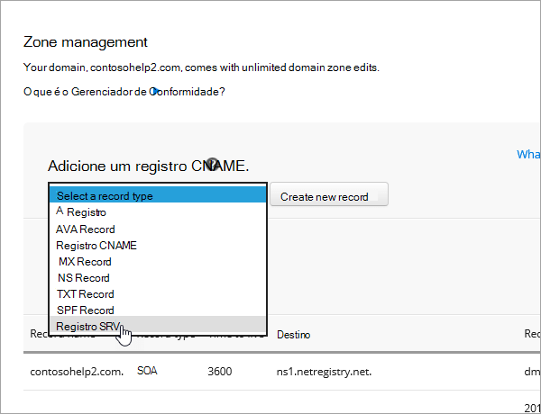

# 在 Netregistry 处为 Microsoft 创建 DNS 记录Create DNS records at Netregistry for Microsoft

如果找不到要查找的内容，请[查看域常见问题解答](../setup/domains-faq.md)。[Check the Domains FAQ](../setup/domains-faq.md) if you don't find what you're looking for. 
  
如果 Netregistry 是您的 DNS 托管提供商，请按照本文中的步骤验证您的域并为电子邮件、Skype for Business Online 等设置 DNS 记录。If Netregistry is your DNS hosting provider, follow the steps in this article to verify your domain and set up DNS records for email, Skype for Business Online, and so on.
  
下面是要添加的主要记录：These are the main records to add.
  
- [添加 TXT 记录进行验证Add a TXT record for verification](#add-a-txt-record-for-verification)
    
- [添加一条 MX 记录，确保发往你的域的电子邮件将会发送到 MicrosoftAdd an MX record so email for your domain will come to Microsoft](#add-an-mx-record-so-email-for-your-domain-will-come-to-microsoft)

- [添加 Microsoft 所需的 CNAME 记录Add the CNAME records that are required for Microsoft](#add-the-cname-records-that-are-required-for-microsoft)
    
- [为 SPF 添加 TXT 记录以帮助防止垃圾邮件Add a TXT record for SPF to help prevent email spam](#add-a-txt-record-for-spf-to-help-prevent-email-spam)
    
- [添加 Microsoft 所需的两条 SRV 记录Add the two SRV records that are required for Microsoft](#add-the-two-srv-records-that-are-required-for-microsoft)
    
在 Netregistry 中添加这些记录后，您的域将设置为与 Microsoft 服务一起使用。After you add these records at Netregistry, your domain will be set up to work with Microsoft services.
  
  
> [!NOTE]
> DNS 更改通常需要 15 分钟左右才能生效。 但是，有时可能需要更长时间，您所做的更改才会在 Internet 的 DNS 系统中更新。 如果添加 DNS 记录后遇到邮件流问题或其他问题，请参阅 [更改域名或 DNS 记录后出现的问题的疑难解答](../get-help-with-domains/find-and-fix-issues.md)。Typically it takes about 15 minutes for DNS changes to take effect. However, it can occasionally take longer for a change you've made to update across the Internet's DNS system. If you're having trouble with mail flow or other issues after adding DNS records, see [Troubleshoot issues after changing your domain name or DNS records](../get-help-with-domains/find-and-fix-issues.md). 
  
## 添加 TXT 记录进行验证Add a TXT record for verification

在将域用于 Microsoft 之前，必须确保你拥有该域。如果你能够在域注册机构处登录到你的帐户并创建 DNS 记录，便可向 Microsoft 证明你是域所有者。Before you use your domain with Microsoft, we have to make sure that you own it. Your ability to log in to your account at your domain registrar and create the DNS record proves to Microsoft that you own the domain.
  
> [!NOTE]
> 此记录仅用于验证您是否拥有自己的域；它不会影响其他任何内容。 如果需要，您可以以后将其删除。This record is used only to verify that you own your domain; it doesn't affect anything else. You can delete it later, if you like. 
  
1. 若要开始，请使用[此链接](https://theconsole.netregistry.com.au/)转到 Netregistry 中的 "域" 页面。To get started, go to your domains page in Netregistry by using [this link](https://theconsole.netregistry.com.au/). You'll be prompted to log in.You'll be prompted to log in.
    
    
  
2. 在要管理的域旁边，选择 "**管理**"。Next to the domain you want to manage, select **Manage**.
    
    
  
3. 选择 "**区域管理器**"。Select **Zone Manager**.
    
    
  
4. 在 "**添加区域记录**" 下，从列表中选择 " **TXT 记录**"，然后选择 "**创建新记录**"。Under **Add a zone record**, choose **TXT Record** from the list, and then select **Create new record**.
    
    
  
    > [!NOTE]
    > 必须在 TXT 框中的条目前后使用引号。You must use quotation marks before and after the entry in the TXT box. 
  
    在 "**新建 TXT 记录**" 表单中，键入或复制并粘贴下表中的值。In the **New TXT Record** form, type or copy and paste the values from the following table. 
    
    |**名称****Name**|**TTL （秒）****TTL (SEC)**|**TXT （指向 "地址" 或 "值"）****TXT (Points to address or value)**|
    |:-----|:-----|:-----|
    |（保留为空白）(leave blank)    |3600（秒）3600 (seconds)    |"MS = msXXXXXXXX""MS=msXXXXXXXX"    **注意：** 这是一个示例。**Note:** This is an example. 在这里使用表中的特定“**目标地址或指向的地址**”值。Use your specific **Destination or Points to Address** value here, from the table. [如何查找此项？How do I find this?](../get-help-with-domains/information-for-dns-records.md)  |
       
    
  
6. 选择 "**添加记录**"。Select **Add record**.
    
在在域注册机构网站添加了记录后，你将返回到 Microsoft 并请求记录。Now that you've added the record at your domain registrar's site, you'll go back to Microsoft and request the record.
  
Microsof 找到正确的 TXT 记录表明域已通过验证。When Microsoft finds the correct TXT record, your domain is verified.
  
1. 在管理中心，转到“**设置**”\>“<a href="https://go.microsoft.com/fwlink/p/?linkid=834818" target="_blank">域</a>”页面。In the admin center, go to the **Settings** \> <a href="https://go.microsoft.com/fwlink/p/?linkid=834818" target="_blank">Domains</a> page.
    
2. 在“**域**”页面上，选择要验证的域。On the **Domains** page, select the domain that you are verifying. 
    
    
  
3. 在“**设置**”页面上，选择“**开始设置**”。On the **Setup** page, select **Start setup**.
    
    
  
4. 在“**验证域**”页面上，选择“**验证**”。On the **Verify domain** page, select **Verify**.
    
    
  
> [!NOTE]
>  DNS 更改通常需要 15 分钟左右才能生效。 但是，有时可能需要更长时间，您所做的更改才会在 Internet 的 DNS 系统中更新。 如果添加 DNS 记录后遇到邮件流问题或其他问题，请参阅 [更改域名或 DNS 记录后出现的问题的疑难解答](../get-help-with-domains/find-and-fix-issues.md)。Typically it takes about 15 minutes for DNS changes to take effect. However, it can occasionally take longer for a change you've made to update across the Internet's DNS system. If you're having trouble with mail flow or other issues after adding DNS records, see [Troubleshoot issues after changing your domain name or DNS records](../get-help-with-domains/find-and-fix-issues.md). 
  
## 添加一条 MX 记录，确保发往你的域的电子邮件将会发送到 MicrosoftAdd an MX record so email for your domain will come to Microsoft

1. 若要开始，请使用[此链接](https://theconsole.netregistry.com.au/)转到 Netregistry 中的 "域" 页面。To get started, go to your domains page in Netregistry by using [this link](https://theconsole.netregistry.com.au/). You'll be prompted to log in.You'll be prompted to log in.
    
    
  
2. 在要管理的域旁边，选择 "**管理**"。Next to the domain you want to manage, select **Manage**.
    
    
  
3. 选择 "**区域管理器**"。Select **Zone Manager**.
    
    
  
4. 在 "**当前区域记录**" 下，选择列表中每条 MX 记录旁边的 "**删除**"，删除默认的 MX 记录。Under **Current zone records**, remove the default MX records by selecting **Remove** next to each MX record in the list. 
    
    
  
5. 在 "**添加区域记录**" 下，从列表中选择 " **MX 记录**"，然后选择 "**创建新记录**"。Under **Add a zone record**, choose **MX Record** from the list, and then select **Create new record**.
    
    
  
6. 在 "**新建 MX 记录**" 表单中，键入或复制并粘贴下表中的值。In the **New MX Record** form, type or copy and paste the values from the following table. 
    
    |**名称****Name**|**TTL （秒）****TTL (SEC)**|**Exchange （指向 "地址" 或 "值"）****Exchange (Points to address or value)**|**主机是否处于完全限定状态？****Is host fully qualified?**|**首选项（优先级）****Preference (Priority)**|
    |:-----|:-----|:-----|:-----|:-----|
    |（保留为空白）(leave blank)    |3600（秒）3600 (seconds)    | *\<域密钥\>*  .mail.protection.outlook.com*\<domain-key\>*  .mail.protection.outlook.com    **注意：** 从你的 Microsoft 帐户中获取你\* \<的域密钥\> \* 。**Note:** Get your  *\<domain-key\>*  from your Microsoft account.  [如何查找此项？How do I find this?](../get-help-with-domains/information-for-dns-records.md)      |（选中 "" 复选框）(select the checkbox)    |10  10    For more information about priority, see What is MX priority?For more information about priority, see What is MX priority?    |
       
    
  
7. 选择 "**添加记录**"。Select **Add Record**.
    
    
  
## 添加 Microsoft 所需的 CNAME 记录Add the CNAME records that are required for Microsoft

1. 若要开始，请使用[此链接](https://theconsole.netregistry.com.au/)转到 Netregistry 中的 "域" 页面。To get started, go to your domains page in Netregistry by using [this link](https://theconsole.netregistry.com.au/). You'll be prompted to log in.You'll be prompted to log in.
    
    
  
2. 在要管理的域旁边，选择 "**管理**"。Next to the domain you want to manage, select **Manage**.
    
    
  
3. 选择 "**区域管理器**"。Select **Zone Manager**.
    
    
  
4. 在 "**添加区域记录**" 下，从列表中选择 " **CNAME 记录**"，然后选择 "**创建新记录**"。Under  **Add a zone record**, choose **CNAME Record** from the list, and then select **Create new record**.
    
    
  
5. 在新记录的框中，键入或复制并粘贴下表中的值。In the boxes for the new record, type or copy and paste the values from the following table.
    
    |**名称****Name**|**Type****Type**|**TTL****TTL**|**主机（指向或地址值）****HOST (Points to or address value)**|
    |:-----|:-----|:-----|:-----|
    |autodiscoverautodiscover    |CNAMECNAME    |3600（秒）3600 (seconds)    |autodiscover.outlook.comautodiscover.outlook.com    |
    |sipsip    |CNAMECNAME    |3600（秒）3600 (seconds)    |sipdir.online.lync.comsipdir.online.lync.com    |
    |lyncdiscoverlyncdiscover    |CNAMECNAME    |3600（秒）3600 (seconds)    |webdir.online.lync.comwebdir.online.lync.com    |
    |enterpriseregistrationenterpriseregistration    |CNAMECNAME    |3600（秒）3600 (seconds)    |enterpriseregistration.windows.netenterpriseregistration.windows.net    |
    |enterpriseenrollmententerpriseenrollment    |CNAMECNAME    |3600（秒）3600 (seconds)    |enterpriseenrollment-s.manage.microsoft.comenterpriseenrollment-s.manage.microsoft.com    |
       
    
      
6. 选择 "**添加记录**"。Select **Add record**.
    
    
  
7. 重复前面的步骤以创建其他五个 CNAME 记录。Repeat the previous steps to create the other five CNAME records.
    
    对于每个记录，键入或复制并将上表中下一行的值粘贴到该记录的框中。For each record, type or copy and paste the values from the next row of the table above into the boxes for that record.
    
## 为 SPF 添加 TXT 记录以帮助防止垃圾邮件Add a TXT record for SPF to help prevent email spam

> [!IMPORTANT]
> 一个域所拥有的 SPF 的 TXT 记录不能超过一个。You cannot have more than one TXT record for SPF for a domain. 如果域具有多个 SPF 记录，你将收到电子邮件错误，其中随附发送和垃圾邮件分类问题。If your domain has more than one SPF record, you'll get email errors, as well as delivery and spam classification issues. 如果你的域已有 SPF 记录，请不要为 Microsoft 创建新记录。If you already have an SPF record for your domain, don't create a new one for Microsoft. 改为将所需的 Microsoft 值添加到当前记录，以便您具有包含两组值的*单个*SPF 记录。Instead, add the required Microsoft values to the current record so that you have a  *single*  SPF record that includes both sets of values.
  
1. 若要开始，请使用[此链接](https://theconsole.netregistry.com.au/)转到 Netregistry 中的 "域" 页面。To get started, go to your domains page in Netregistry by using [this link](https://theconsole.netregistry.com.au/). You'll be prompted to log in.You'll be prompted to log in.
    
    
  
2. 在要管理的域旁边，选择 "**管理**"。Next to the domain you want to manage, select **Manage**.
    
    
  
3. 选择 "**区域管理器**"。Select **Zone Manager**.
    
    
  
4. 在 "**添加区域记录**" 下，从列表中选择 " **TXT 记录**"，然后选择 "**创建新记录**"。Under **Add a zone record**, choose **TXT Record** from the list, and then select **Create new record**.
    
    
  
5. 在新记录的框中，键入或复制并粘贴下表中的值。In the boxes for the new record, type or copy and paste the values from the following table. 
    
    > [!NOTE]
    > 必须在 TXT 框中的条目前后使用引号。You must use quotation marks before and after the entry in the TXT box. 
  
    |**名称****Name**|**Type****Type**|**TTL****TTL**|**TXT 数据（目标）****TXT Data (Target)**|
    |:-----|:-----|:-----|:-----|
    |（保留为空白）(leave blank)    |TXTTXT    |3600（秒）3600 (seconds)    |"v = spf1 包括 include spf.protection.outlook.com-all""v=spf1 include:spf.protection.outlook.com -all"    **注意：** 我们建议您复制并粘贴此条目，以保证正确保留所有空格。**Note:** We recommend copying and pasting this entry, so that all of the spacing stays correct.           |
   
    
  
6. 选择 "**添加记录**"。Select **Add Record**.
    
    
  
## 添加 Microsoft 所需的两条 SRV 记录Add the two SRV records that are required for Microsoft

1. 若要开始，请使用[此链接](https://theconsole.netregistry.com.au/)转到 Netregistry 中的 "域" 页面。To get started, go to your domains page in Netregistry by using [this link](https://theconsole.netregistry.com.au/). You'll be prompted to log in.You'll be prompted to log in.
    
    
  
2. 在要管理的域旁边，选择 "**管理**"。Next to the domain you want to manage, select  **Manage**.
    
    
  
3. 选择 "**区域管理器**"。Select **Zone Manager**.
    
    
  
4. 在 "**添加区域记录**" 下，从列表中选择 " **SRV 记录**"，然后选择 "**创建新记录**"。Under  **Add a zone record**, choose **SRV Record** from the list, and then select **Create new record**.
    
    
  
5. 在新记录的框中，键入或复制并粘贴下表中的值。In the boxes for the new record, type or copy and paste the values from the following table.
    
    > [!NOTE]
    > "名称" 字段是服务（例如，_sip）和协议（例如，_tls）的组合。The Name field is a combination of the service (for example, _sip) and protocol (for example, _tls). 
  
    |**类型****Type**|**名称****Name**|**TTL （秒）****TTL (SEC)**|**优先级****Priority**|**权重****Weight**|**端口****Port**|**目标****Target**|
    |:-----|:-----|:-----|:-----|:-----|:-----|:-----|
    |SRV （服务）SRV (service)    |_sip _tls_sip._tls    |3600（秒）3600 (seconds)    |100100    |11    |443443    |sipdir.online.lync.comsipdir.online.lync.com    |
    |SRV （服务）SRV (service)    |_sipfederationtls _tcp_sipfederationtls._tcp    |3600（秒）3600 (seconds)    |100100    |11    |50615061    |sipfed.online.lync.comsipfed.online.lync.com    |
       
    
  
6. 选择 "**添加记录**"。Select **Add Record**.
    
    
  
7. 重复前面的步骤以创建其他 SRV 记录。Repeat the previous steps to create the other SRV record.
    
    将上表中第二行的值键入或复制并粘贴到第二条记录的框中。Type or copy and paste the values from the second row of the table above into the boxes for the second record.
    
> [!NOTE]
> DNS 更改通常需要 15 分钟左右才能生效。 但是，有时可能需要更长时间，您所做的更改才会在 Internet 的 DNS 系统中更新。 如果添加 DNS 记录后遇到邮件流问题或其他问题，请参阅 [更改域名或 DNS 记录后出现的问题的疑难解答](../get-help-with-domains/find-and-fix-issues.md)。Typically it takes about 15 minutes for DNS changes to take effect. However, it can occasionally take longer for a change you've made to update across the Internet's DNS system. If you're having trouble with mail flow or other issues after adding DNS records, see [Troubleshoot issues after changing your domain name or DNS records](../get-help-with-domains/find-and-fix-issues.md). 
  

