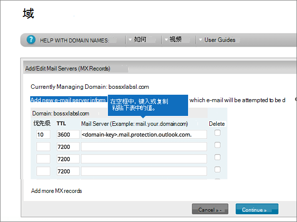
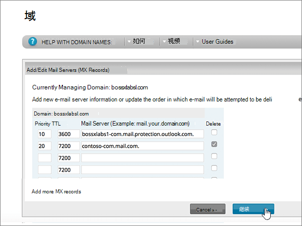
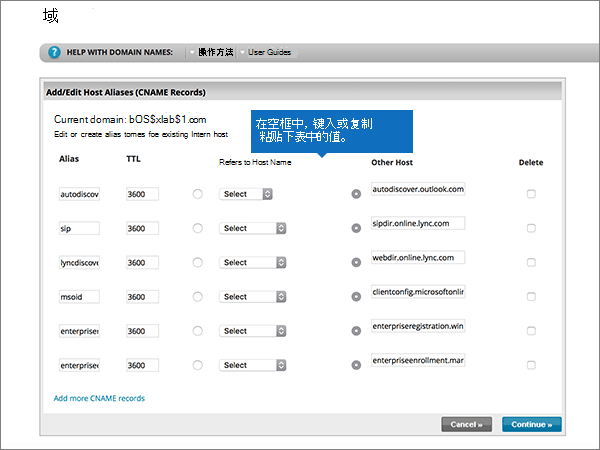
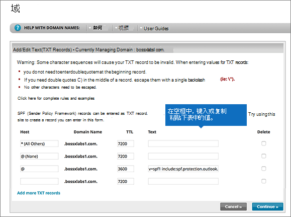
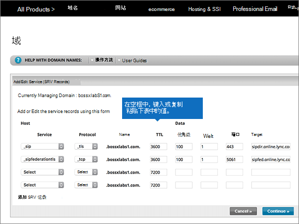

# 在 Network Solutions 处为 Office 365 创建 DNS 记录

 如果找不到要查找的内容，请**[查看域常见问题解答](../setup/domains-faq.md)**。 
  
如果网络解决方案是您的 DNS 托管提供商，请按照本文中的步骤验证您的域并为电子邮件、Skype for Business Online 等设置 DNS 记录。
  
下面是要添加的主要记录。 请按下列步骤操作或[观看视频](https://support.office.com/article/Video-Create-DNS-records-at-Network-Solutions-for-Office-365-c49698c2-6991-47fb-b5ac-18e49a505099?ui=en-US&amp;rs=en-US&amp;ad=US)。 
  
- [添加 TXT 记录进行验证](#add-a-txt-record-for-verification)
    
- [添加一条 MX 记录，确保发往您的域的电子邮件发送到 Office 365](#add-an-mx-record-so-email-for-your-domain-will-come-to-office-365)
    
- [添加 Office 365 所需的 CNAME 记录](#add-the-cname-records-that-are-required-for-office-365)
    
- [为 SPF 添加 TXT 记录以帮助防止垃圾邮件](#add-a-txt-record-for-spf-to-help-prevent-email-spam)
    
- [添加 Office 365 所需的两条 SRV 记录](#add-the-two-srv-records-that-are-required-for-office-365)
    
在网络解决方案中添加这些记录后，您的域将设置为与 Office 365 服务配合使用。
  
若要了解如何与 Office 365 结合使用网站的 Web 宿主和 DNS，请参阅[配合使用公共网站与 Office 365](https://support.office.com/article/choose-a-public-website-3325d50e-d131-403c-a278-7f3296fe33a9)。
  
> [!NOTE]
>  DNS 更改通常需要 15 分钟左右才能生效。 但是，有时可能需要更长时间，您所做的更改才会在 Internet 的 DNS 系统中更新。 如果添加 DNS 记录后遇到邮件流问题或其他问题，请参阅 [更改域名或 DNS 记录后出现的问题的疑难解答](../get-help-with-domains/find-and-fix-issues.md)。 
  
## 添加 TXT 记录进行验证

在将域用于 Office 365 之前，必须确保你拥有该域。如果你能够在域注册机构处登录到你的帐户并创建 DNS 记录，便可向 Office 365 证明你是所有者。
  
> [!NOTE]
> 此记录仅用于验证您是否拥有自己的域；它不会影响其他任何内容。 如果需要，您可以以后将其删除。 
  
请按下列步骤操作或[观看视频（从 0:47 开始）](https://support.office.com/article/Video-Create-DNS-records-at-Network-Solutions-for-Office-365-c49698c2-6991-47fb-b5ac-18e49a505099?ui=en-US&amp;rs=en-US&amp;ad=US)。
  
1. 若要开始，请使用[此链接](https://www.networksolutions.com/manage-it)转到 Network Solutions 上你的域页面。系统将会提示您登录。
    
    > [!IMPORTANT]
    > 在选择 "**登录**" 按钮之前，先在 "**登录到：** " 下拉列表中选择 **"管理我的域名**"。 
  
    
  
2. 选择要修改的域名称旁边的复选框。
    
    
  
3. 选择 "**编辑 DNS**"。
    
    
  
4. 选择 "**管理高级 DNS 记录**"。
    
    (You may have to scroll down.)
    
    
  
5. 向下滚动到 "**文本（TXT 记录）** " 部分，然后选择 "**编辑 TXT 记录**"。
    
    
  
6. 在新记录的框中，键入或复制并粘贴下表中的值。
    
    |**主机**|**TTL**|**文本**|
    |:-----|:-----|:-----|
    |@    (The system will change this value to **@ (None)** when you save the record.)    |3600    |MS=ms *XXXXXXXX*    **注意：** 此为示例。 在这里使用来自 Office 365 中的表的具体**目标地址或指向的地址**值。  [如何查找此项？](../get-help-with-domains/information-for-dns-records.md)   |
       
    
  
7. 选择 "**继续**"。
    
    
  
8. 选择 "**保存更改**"。
    
    
  
9. 请在继续之前等待数分钟，以便您刚刚创建的记录可以通过 Internet 完成更新。
    
现在你已在域注册机构网站添加了记录，然后将返回到 Office 365 并请求 Office 365 查找记录。
  
Office 365 找到正确的 TXT 记录时，表明你的域已通过验证。

1. 在管理中心，转到“**设置**”\> <a href="https://go.microsoft.com/fwlink/p/?linkid=834818" target="_blank">域</a>页面。
    
2. 在“**域**”页面上，选择要验证的域。 
    
    
  
3. 在“**设置**”页面上，选择“**开始设置**”。
    
    
  
4. 在“**验证域**”页面上，选择“**验证**”。
    
    
  
> [!NOTE]
>  DNS 更改通常需要 15 分钟左右才能生效。 但是，有时可能需要更长时间，您所做的更改才会在 Internet 的 DNS 系统中更新。 如果添加 DNS 记录后遇到邮件流问题或其他问题，请参阅 [更改域名或 DNS 记录后出现的问题的疑难解答](../get-help-with-domains/find-and-fix-issues.md)。 
  
## 添加一条 MX 记录，确保发往你的域的电子邮件发送到 Office 365

请执行以下步骤或[观看视频（从3:51 开始）](https://support.office.com/article/Video-Create-DNS-records-at-Network-Solutions-for-Office-365-c49698c2-6991-47fb-b5ac-18e49a505099?ui=en-US&amp;rs=en-US&amp;ad=US)。
  
1. 若要开始，请使用[此链接](https://www.networksolutions.com/manage-it)转到 Network Solutions 上你的域页面。 系统将会提示您登录。
    
    > [!IMPORTANT]
    > 在选择 "**登录**" 按钮之前，先在 "**登录到：** " 下拉列表中选择 **"管理我的域名**"。 
  
    
  
2. 选择要修改的域名称旁边的复选框。
    
    
  
3. 选择 "**编辑 DNS**"。
    
    
  
4. 选择 "**管理高级 DNS 记录**"。
    
    (You may have to scroll down.)
    
    
  
5. 向下滚动到 "**邮件服务器（MX 记录）** " 部分，然后选择 "**编辑 MX 记录**"。
    
    
  
6. 在新记录的框中，键入或复制并粘贴下表中的值。
    
    |**Priority**|**TTL**|**邮件服务器**|
    |:-----|:-----|:-----|
    |10     有关优先级的详细信息，请参阅[什么是 MX 优先级？](https://support.office.com/article/2784cc4d-95be-443d-b5f7-bb5dd867ba83.aspx)   |3600    | *\<域密钥\>*  .mail.protection.outlook.com。    **This value MUST end with a period (.)**   **注意：** 从 Office 365 帐户中获取你* \<的域密钥\> * 。 [如何查找此项？](../get-help-with-domains/information-for-dns-records.md)          |
       
    
  
7. 选择 "**继续**"。
    
    
  
8. 选择 "**保存更改**"。
    
    
  
9. 如果有任何其他 MX 记录，请通过选择每条记录的 "**删除**" 来删除所有这些记录。 
    
    
  
10. 选择所有选项后，选择 "**继续**"。
    
    
  
11. 选择 "**保存更改**"。
    
    
  
## 添加 Office 365 所需的 CNAME 记录

请执行以下步骤或[观看视频（从4:43 开始）](https://support.office.com/article/Video-Create-DNS-records-at-Network-Solutions-for-Office-365-c49698c2-6991-47fb-b5ac-18e49a505099?ui=en-US&amp;rs=en-US&amp;ad=US)。
  
1. 若要开始，请使用[此链接](https://www.networksolutions.com/manage-it)转到 Network Solutions 上你的域页面。 系统将会提示您登录。
    
    > [!IMPORTANT]
    > 在选择 "**登录**" 按钮之前，先在 "**登录到：** " 下拉列表中选择 **"管理我的域名**"。 
  
    
  
2. 选择要修改的域名称旁边的复选框。
    
    
  
3. 选择 "**编辑 DNS**"。
    
    
  
4. 选择 "**管理高级 DNS 记录**"。
    
    (You may have to scroll down.)
    
    
  
5. 向下滚动到 "**主机别名（CNAME 记录）** " 部分，然后选择 "**编辑 CNAME 记录**"。
    
    
  
6. 在四个新记录的框中，键入或复制并粘贴下表中的值。
    
    |**Alias**|**TTL**|**引用主机名**|**其他主机（选择 "**其他主机**" 选项按钮）**|
    |:-----|:-----|:-----|:-----|
    |自动发现    |3600    |（无设置）    |autodiscover.outlook.com。    **This value MUST end with a period (.)**   |
    |sip    |3600    |（无设置）    |sipdir.online.lync.com。    **此值必须以句点 (.) 结尾。**   |
    |lyncdiscover    |3600    |（无设置）    |webdir.online.lync.com。    **This value MUST end with a period (.)**   |
    |enterpriseregistration    |3600    |（无设置）    |enterpriseregistration.windows.net    **此值必须以句点 (.) 结尾。**   |
    |enterpriseenrollment    |3600    |（无设置）    |enterpriseenrollment-s.manage.microsoft.com    **This value MUST end with a period (.)**   |
    
    
  
7. 添加完所需的所有 CNAME 记录后，选择 "**继续**"。
    
    
  
8. 选择 "**保存更改**"。
    
    
  
## 为 SPF 添加 TXT 记录以帮助防止垃圾邮件

> [!IMPORTANT]
> 一个域所拥有的 SPF 的 TXT 记录不能超过一个。 如果域具有多个 SPF 记录，你将收到电子邮件错误，其中随附发送和垃圾邮件分类问题。 If you already have an SPF record for your domain, don't create a new one for Office 365. 可以将所需的 Office 365 添加到当前记录，这样就拥有包含两组值的*单个*SPF 记录。 
  
请执行以下步骤或[观看视频（从5:35 开始）](https://support.office.com/article/Video-Create-DNS-records-at-Network-Solutions-for-Office-365-c49698c2-6991-47fb-b5ac-18e49a505099?ui=en-US&amp;rs=en-US&amp;ad=US)。
  
1. 若要开始，请使用[此链接](https://www.networksolutions.com/manage-it)转到 Network Solutions 上你的域页面。 系统将会提示您登录。
    
    > [!IMPORTANT]
    > 在选择 "**登录**" 按钮之前，先在 "**登录到：** " 下拉列表中选择 **"管理我的域名**"。 
  
    
  
2. 选择要修改的域名称旁边的复选框。
    
    
  
3. 选择 "**编辑 DNS**"。
    
    
  
4. 选择 "**管理高级 DNS 记录**"。
    
    (You may have to scroll down.)
    
    
  
5. 向下滚动到 "**文本（TXT 记录）** " 部分，然后选择 "**编辑 TXT 记录**"。
    
    
  
6. In the boxes for the new record, type or copy and paste the following values.
    
    |**主机**|**TTL**|**文本**|
    |:-----|:-----|:-----|
    |@    (The system will change this value to **@ (None)** when you save the record.)    |3600    |v=spf1 include:spf.protection.outlook.com -all    **注意：** 建议复制粘贴此条目，以保证正确保留所有空格。 |
       
    
  
7. 选择 "**继续**"。
    
    
  
8. 选择 "**保存更改**"。
    
    
  
## 添加 Office 365 所需的两条 SRV 记录

请执行以下步骤或[观看视频（从6:18 开始）](https://support.office.com/article/Video-Create-DNS-records-at-Network-Solutions-for-Office-365-c49698c2-6991-47fb-b5ac-18e49a505099?ui=en-US&amp;rs=en-US&amp;ad=US)。
  
1. 若要开始，请使用[此链接](https://www.networksolutions.com/manage-it)转到 Network Solutions 上你的域页面。 系统将会提示您登录。
    
    > [!IMPORTANT]
    > 在选择 "**登录**" 按钮之前，先在 "**登录到：** " 下拉列表中选择 **"管理我的域名**"。 
  
    
  
2. 选择要修改的域名称旁边的复选框。
    
    
  
3. 选择 "**编辑 DNS**"。
    
    
  
4. 选择 "**管理高级 DNS 记录**"。
    
    (You may have to scroll down.)
    
    
  
5. 向下滚动到 "**服务（SRV 记录）** " 部分，然后选择 "**编辑 SRV 记录**"。
    
    
  
6. 在两个新记录的框中，键入或复制并粘贴下表中的值。
    
    （从下拉列表中选择 "**服务**" 和 "**协议**" 值。） 
    
    |**服务**|**协议**|**TTL**|**优先级**|**权重**|**端口**|**目标**|
    |:-----|:-----|:-----|:-----|:-----|:-----|:-----|
    |_sip    |_tls    |3600    |100    |1    |443    |sipdir.online.lync.com。    **This value MUST end with a period (.)**   |
    |_sipfederationtls    |_tcp    |3600    |100    |1    |5061    |sipfed.online.lync.com。    **此值必须以句点 (.) 结尾。**   |
       
    
  
7. 选择 "**继续**"。
    
    
  
8. 选择 "**保存更改**"。
    
    
  
> [!NOTE]
>  DNS 更改通常需要 15 分钟左右才能生效。 但是，有时可能需要更长时间，您所做的更改才会在 Internet 的 DNS 系统中更新。 如果添加 DNS 记录后遇到邮件流问题或其他问题，请参阅 [更改域名或 DNS 记录后出现的问题的疑难解答](../get-help-with-domains/find-and-fix-issues.md)。 
  
