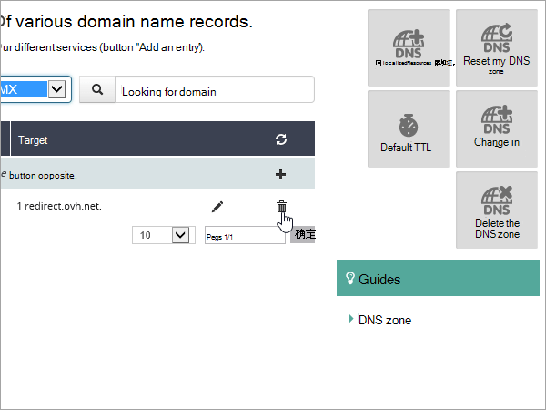

# 连接 OVH 的 DNS 记录，Microsoft 365

如果找不到要查找的内容，请[查看域常见问题解答](../setup/domains-faq.yml)。 
  
如果 OVH 是 DNS 托管提供商，请按照本文中的步骤验证域，并设置电子邮件、Skype for Business Online 等的 DNS 记录。
    
在 OVH 添加这些记录后，域将设置为使用 Microsoft 服务。

> [!NOTE]
>  DNS 更改通常需要 15 分钟左右才能生效。 但是，有时可能需要更长时间，您所做的更改才会在 Internet 的 DNS 系统中更新。 如果添加 DNS 记录后遇到邮件流问题或其他问题，请参阅 [更改域名或 DNS 记录后出现的问题的疑难解答](../get-help-with-domains/find-and-fix-issues.md)。 
  
## 添加 TXT 记录进行验证

在将域用于 Microsoft 之前，必须确保你拥有该域。如果你能够在域注册机构处登录到你的帐户并创建 DNS 记录，便可向 Microsoft 证明你是域所有者。
  
> [!NOTE]
> 此记录仅用于验证您是否拥有自己的域；它不会影响其他任何内容。 如果需要，您可以以后将其删除。 
  
1. To get started， go to your domains page in OVH by using [this link](https://www.ovh.com/manager/). You'll be prompted to log in.

    

1. 在仪表板登录页面上的" **查看所有我的** 活动"下，选择要编辑的域的名称。
  
1. 选择 **"DNS 区域"。**
    
    
  
1. 选择 **"添加条目"。**
    
    
  
1. 选择 **TXT**
    
    
  
1. 在新记录的框中，键入或复制并粘贴下表中的值。 若要分配 TTL 值， **请从** 下拉列表中选择"自定义"，然后在文本框中键入该值。 
    
    |**记录类型**|**子域**|**TTL**|**值**|
    |:-----|:-----|:-----|:-----|
    |TXT    |（保留为空白）    |3600 (秒)     |MS=msxxxxxxxx    **注意：** 这是一个示例。 在这里使用表中的特定“**目标地址或指向的地址**”值。  [如何查找此项？](../get-help-with-domains/information-for-dns-records.md)          |
   
1. 选择“**下一步**”。

1. 选择“**确认**”。 
    
    
  
1. 请在继续之前等待数分钟，以便您刚刚创建的记录可以通过 Internet 完成更新。
    
在在域注册机构网站添加了记录后，你将返回到 Microsoft 并请求记录。 Microsof 找到正确的 TXT 记录表明域已通过验证。
 
若要验证域中的域，Microsoft 365：
 
1. 在管理中心中，转到 **"设置** \> <a href="https://go.microsoft.com/fwlink/p/?linkid=834818" target="_blank">**域"。**</a>
    
2. On the Domains page， select the domain that you're verifying， and select **Start setup**.   
  
3. 在“**验证域**”页面上，选择“**验证**”。
    
> [!NOTE]
>  DNS 更改通常需要 15 分钟左右才能生效。 但是，有时可能需要更长时间，您所做的更改才会在 Internet 的 DNS 系统中更新。 如果添加 DNS 记录后遇到邮件流问题或其他问题，请参阅 [更改域名或 DNS 记录后出现的问题的疑难解答](../get-help-with-domains/find-and-fix-issues.md)。 
  
## 添加一条 MX 记录，确保发往你的域的电子邮件将会发送到 Microsoft

1. To get started， go to your domains page in OVH by using [this link](https://www.ovh.com/manager/). You'll be prompted to log in.
    
    
  
1. 在仪表板登录页面上的" **查看所有我的** 活动"下，选择要编辑的域的名称。
  
1. 选择 **"DNS 区域"。**
    
    
  
1. 选择 **"添加条目"。**
    
    
  
1. 选择 **MX**。
    
    
  
1. 在新记录的框中，键入或复制并粘贴下表中的值。 若要分配 TTL 值， **请从** 下拉列表中选择"自定义"，然后在文本框中键入该值。 
    
    > [!NOTE]
    > 默认情况下，OVH 对目标使用相对表示法，它将域名添加到目标记录的末尾。 若要改为使用绝对表示法，请为目标记录添加一个点，如下表所示。 
  
    |**子域**|**TTL**|**优先级**|**目标**|
    |:-----|:-----|:-----|:-----|
    |（保留为空白）    |3600 (秒)     |0    有关优先级的详细信息，请参阅[什么是 MX 优先级？](../setup/domains-faq.yml)   |\<domain-key\>.mail.protection.outlook.com。    **注意：** 从  *\<domain-key\>*  Microsoft 帐户获取你的帐户。  [如何查找此项？](../get-help-with-domains/information-for-dns-records.md)  |
   
    
  
1. 选择 **下一步**。
    
    
  
1. 选择“**确认**”。
    
    

1. 删除"DNS 区域"页面上列表中任何其他 **MX** 记录。 选择每条记录，在"操作 **"列中，** 选择"回收站可以 **删除"** 图标。 
    
    
  
1. 选择“**确认**”。
    
## 添加 Microsoft 所需的 CNAME 记录

1. To get started， go to your domains page in OVH by using [this link](https://www.ovh.com/manager/). You'll be prompted to log in.
    
    
  
1. 在仪表板登录页面上的" **查看所有我的** 活动"下，选择要编辑的域的名称。
  
1. 选择 **"DNS 区域"。**
    
    
  
1. 选择 **"添加条目"。**
    
    
  
1. 选择 **"CNAME"。**
    
    
    
1. 在新记录的框中，键入或复制并粘贴下表中第一行的值。 若要分配 TTL 值， **请从** 下拉列表中选择"自定义"，然后在文本框中键入该值。 
    
    |**子域**|**TTL**|**目标**|
    |:-----|:-----|:-----|
    |自动发现    |3600 (秒)     |autodiscover.outlook.com.    |
   
    
  
1. 选择 **下一步**。
    
    
  
1. 选择“**确认**”。
    
## 为 SPF 添加 TXT 记录以帮助防止垃圾邮件

> [!IMPORTANT]
> 一个域所拥有的 SPF 的 TXT 记录不能超过一个。 如果域具有多个 SPF 记录，你将收到电子邮件错误，其中随附发送和垃圾邮件分类问题。 如果你的域已有 SPF 记录，请不要为 Microsoft 创建新记录。 相反，将所需的 Microsoft 值添加到当前记录，以便你有一个  *包含这*  两组值的 SPF 记录。 
  
1. To get started， go to your domains page in OVH by using [this link](https://www.ovh.com/manager/). You'll be prompted to log in.
    
    
  
1. 在仪表板登录页面上的" **查看所有我的** 活动"下，选择要编辑的域的名称。
  
1. 选择 **"DNS 区域"。**
    
    
  
1. 选择 **"添加条目"。**
    
    
  
1. 选择 **TXT**。
    
1. In the boxes for the new record, type or copy and paste the following values. 若要分配 TTL 值， **请从** 下拉列表中选择"自定义"，然后在文本框中键入该值。 
    
    |**子域**|**TTL**|**值**|
    |:-----|:-----|:-----|:-----|
    |（保留为空白）    |3600 (秒)     |v=spf1 include：spf.protection.outlook.com -all <br/**注意：** 我们建议复制并粘贴此条目，以便所有空格保持正确。           |
   
    
  
7. 选择 **下一步**。
    
    
  
8. 选择“**确认**”。
    
    
  
## 高级选项：Skype for Business

只有组织将 Skype for Business 用于联机通信服务（如聊天、电话会议和视频呼叫）以及 Microsoft Teams。 Skype 4 条记录：2 条 SRV 记录用于用户到用户的通信，2 条 CNAME 记录用于登录和将用户连接到服务。

### 添加两条必需的 SRV 记录
    
1. To get started， go to your domains page in OVH by using [this link](https://www.ovh.com/manager/). You'll be prompted to log in.
    
    
  
1. 在仪表板登录页面上的" **查看所有我的** 活动"下，选择要编辑的域的名称。
  
1. 选择 **"DNS 区域"。**
    
    
  
1. 选择 **"添加条目"。**
    
    

1. 选择 **SRV**。
    
1. In the boxes for the new record, type or copy and paste the following values. 若要分配 TTL 值， **请从** 下拉列表中选择"自定义"，然后在文本框中键入该值。 
    
    |**子域**|**TTL（秒）**| **优先级** | **权重** | **端口**|**目标**|
    |:-----|:-----|:-----|:-----|:-----|:-----|
    |_sip._tls|3600 (s.)  |100 |  1  | 443 |sipdir.online.lync.com. **此值必须以 (.)**>  **注意：** 建议复制粘贴此条目，以保证正确保留所有空格。 | 
    |_sipfederationtls._tcp| 3600 (s.) |100 | 1 | 5061 | sipfed.online.lync.com。 **此值必须以句点 (.) 结尾。**  **注意：** 建议复制粘贴此条目，以保证正确保留所有空格。    | 
  
7. 若要添加其他 SRV 记录，请选择"添加另一条记录"，使用表中下一行的值创建记录，然后选择"**创建记录"。** 
    
> [!NOTE]
> Typically it takes about 15 minutes for DNS changes to take effect. 但是，有时可能需要更长时间，您所做的更改才会在 Internet 的 DNS 系统中更新。 如果在添加 DNS 记录后遇到邮件流问题或其他问题，请参阅[查找在添加域或 DNS 记录后遇到的问题并进行修复](../get-help-with-domains/find-and-fix-issues.md)。 

### 添加两个必需的 CNAME 记录 
    
1. To get started， go to your domains page in OVH by using [this link](https://www.ovh.com/manager/). You'll be prompted to log in.
    
    
  
1. 在仪表板登录页面上的" **查看所有我的** 活动"下，选择要编辑的域的名称。
  
1. 选择 **"DNS 区域"。**
    
    
  
1. 选择 **"添加条目"。**
    
    

1. 选择 **"CNAME"。**
    
    
    
1. 在新记录的框中，键入或复制并粘贴下表中第一行的值。 若要分配 TTL 值， **请从** 下拉列表中选择"自定义"，然后在文本框中键入该值。 

    |**子域**| **TTL** | **目标** | 
    |:-----|:-----|:-----|
    |sip    | 3600 (s.)     |sipdir.online.lync.com.    **此值必须以句点 (.) 结尾。**   |
    |lyncdiscover    |3600 (s.)  |webdir.online.lync.com.    **此值必须以句点 (.) 结尾。**    |
  
1. 选择 **下一步**。
    
    
  
1. 选择“**确认**”。

1. 添加其他 CNAME 记录。
    
> [!NOTE]
> DNS 更改通常需要 15 分钟左右才能生效。 但是，有时可能需要更长时间，您所做的更改才会在 Internet 的 DNS 系统中更新。 如果添加 DNS 记录后遇到邮件流问题或其他问题，请参阅 [更改域名或 DNS 记录后出现的问题的疑难解答](../get-help-with-domains/find-and-fix-issues.md)。 
  
## 高级选项：Intune 和移动设备管理 for Microsoft 365

此服务可帮助你保护并远程管理连接到域的移动设备。 移动设备管理需要两条 CNAME 记录，以便用户可以将设备注册到服务。

### 添加两个必需的 CNAME 记录

1. To get started， go to your domains page in OVH by using [this link](https://www.ovh.com/manager/). You'll be prompted to log in.
    
    
  
1. 在仪表板登录页面上的" **查看所有我的** 活动"下，选择要编辑的域的名称。
  
1. 选择 **"DNS 区域"。**
    
    
  
1. 选择 **"添加条目"。**
    
    
  
1. 选择 **"CNAME"。**
    
    
    
1. 在新记录的框中，键入或复制并粘贴下表中第一行的值。 若要分配 TTL 值， **请从** 下拉列表中选择"自定义"，然后在文本框中键入该值。 
  
    |**子域**| **TTL** | **目标** | 
    |:-----|:-----|:-----|
    |enterpriseregistration   | 3600 (s.)     |enterpriseregistration.windows.net.    **此值必须以句点 (.) 结尾。**   |
    |enterpriseenrollment     |3600 (s.)  |enterpriseenrollment-s.manage.microsoft.com.    **此值必须以句点 (.) 结尾。**  |

1. 选择 **下一步**。
    
    
  
1. 选择“**确认**”。

1. 添加其他 CNAME 记录。
    
> [!NOTE]
> DNS 更改通常需要 15 分钟左右才能生效。 但是，有时可能需要更长时间，您所做的更改才会在 Internet 的 DNS 系统中更新。 如果添加 DNS 记录后遇到邮件流问题或其他问题，请参阅 [更改域名或 DNS 记录后出现的问题的疑难解答](../get-help-with-domains/find-and-fix-issues.md)。

  
