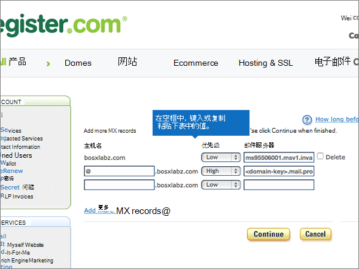

# 在 Register.com 处为 Microsoft 创建 DNS 记录

 **如果找不到要查找的内容，请[查看域常见问题解答](../setup/domains-faq.md)** 。 
  
如果 DNS 托管提供者是 Register.com，请按本文中的步骤验证域并为电子邮件、Skype for Business Online 等设置 DNS 记录。
  
下面是要添加的主要记录。 请按下列步骤操作或[观看视频](https://support.microsoft.com/office/7448dd9e-c0e7-4d5e-a7e9-f0e4715433c4)。
  
- [在 Register.com 添加 TXT 记录以验证您是否拥有该域](#add-a-txt-record-at-registercom-to-verify-that-you-own-the-domain)
    
- [添加一条 MX 记录，确保发往你的域的电子邮件将会发送到 Microsoft](#add-an-mx-record-so-email-for-your-domain-will-come-to-microsoft)
    
- [添加 Microsoft 所需的 CNAME 记录](#add-the-cname-records-that-are-required-for-microsoft)
    
- [为 SPF 添加 TXT 记录以帮助防止垃圾邮件](#add-a-txt-record-for-spf-to-help-prevent-email-spam)

- [添加 Microsoft 所需的两条 SRV 记录](#add-the-two-srv-records-that-are-required-for-microsoft)
    
在 Register.com 中添加这些记录后，您的域将设置为与 Microsoft 服务一起使用。
  

  
> [!NOTE]
> Typically it takes about 15 minutes for DNS changes to take effect. 但是，有时可能需要更长时间，您所做的更改才会在 Internet 的 DNS 系统中更新。 如果在添加 DNS 记录后遇到邮件流问题或其他问题，请参阅[查找在添加域或 DNS 记录后遇到的问题并进行修复](../get-help-with-domains/find-and-fix-issues.md)。 
  
## 在 Register.com 添加 TXT 记录以验证您是否拥有该域

在将域用于 Microsoft 之前，必须确保你拥有该域。如果你能够在域注册机构处登录到你的帐户并创建 DNS 记录，便可向 Microsoft 证明你是域所有者。
  
> [!NOTE]
> 此记录仅用于验证您是否拥有自己的域；它不会影响其他任何内容。 如果需要，您可以以后将其删除。 
  
请执行以下步骤或[观看视频（从0:44 开始）](https://support.microsoft.com/office/7448dd9e-c0e7-4d5e-a7e9-f0e4715433c4)。
  
1. 若要开始，请使用[此链接](https://www.register.com/myaccount/)转到 Register.com 上您的域页面。 系统将会提示您登录。
    
2. 选择" **域**"。
    
3. 选择 "**管理**"。
    
4. 查找包含要修改的域的名称的行;然后，在该行中，选择 "**管理**"。
    
5. 向下滚动到 "**高级技术设置**" 部分，然后选择 "**编辑 TXT 记录（SPF）**"。
    
6. In the boxes for the new record, type or copy and paste the values from the following table.
    
    |||
    |:-----|:-----|
    |**Host Name**   |**TXT Record**   |
    |@    |MS=ms *XXXXXXXX*    **注意：** 这是一个示例。 在这里使用表中的特定“**目标地址或指向的地址**”值。 [如何查找此项？](../get-help-with-domains/information-for-dns-records.md)          |
   
7. 选择 "**继续**"。
    
8. 在下一页上，再次选择 "**继续**" 以确认更改。 
    
9. 请在继续之前等待数分钟，以便您刚刚创建的记录可以通过 Internet 完成更新。
    
在在域注册机构网站添加了记录后，你将返回到 Microsoft 并请求记录。
  
Microsof 找到正确的 TXT 记录表明域已通过验证。
  
1. 在管理中心，转到“**设置**”\>“<a href="https://go.microsoft.com/fwlink/p/?linkid=834818" target="_blank">域</a>”页面。
    
2. 在“**域**”页面上，选择要验证的域。 
    
3. 在“**设置**”页面上，选择“**开始设置**”。
    
4. 在“**验证域**”页面上，选择“**验证**”。
    
> [!NOTE]
> Typically it takes about 15 minutes for DNS changes to take effect. 但是，有时可能需要更长时间，您所做的更改才会在 Internet 的 DNS 系统中更新。 如果在添加 DNS 记录后遇到邮件流问题或其他问题，请参阅[查找在添加域或 DNS 记录后遇到的问题并进行修复](../get-help-with-domains/find-and-fix-issues.md)。 
  
## 添加一条 MX 记录，确保发往你的域的电子邮件将会发送到 Microsoft

请执行以下步骤或[观看视频（从3:32 开始）](https://support.microsoft.com/office/7448dd9e-c0e7-4d5e-a7e9-f0e4715433c4)。
  
1. 若要开始，请使用[此链接](https://www.register.com/myaccount/)转到 Register.com 上您的域页面。 系统将会提示您登录。
    
2. 选择" **域**"。
    
3. 选择 "**管理**"。
    
4. 查找包含要修改的域的名称的行;然后，在该行中，选择 "**管理**"。
    
5. 滚动到 "**高级技术设置**" 部分，然后选择 "**编辑邮件交换器记录**"。
    
    
  
6. 在新记录的框中，键入或复制并粘贴下表中的值。
    
    （从下拉列表中选择 "**优先级**" 值。） 
    
    |****主机名****|优先级 * * * *|邮件服务器 * * * *|
    |:-----|:-----|:-----|
    |@    |高    有关优先级的详细信息，请参阅[什么是 MX 优先级？](https://docs.microsoft.com/microsoft-365/admin/setup/domains-faq)   | *\<domain-key\>*。 mail.protection.outlook.com      **注意：**\<*domain-key*\>从你的 Microsoft 帐户获取你的。   [如何查找此项？](../get-help-with-domains/information-for-dns-records.md)          |
   
    
  
7. 如果已列出任何其他 MX 记录，请选择要删除的每条记录。
    
    
  
8. 选择 "**继续**"。
    
    
  
9. 在下一页上，再次选择 "**继续**" 以确认并保存所做的更改。 
    
    
  
## 添加 Microsoft 所需的 CNAME 记录

请执行以下步骤或[观看视频（从4:23 开始）](https://support.microsoft.com/office/7448dd9e-c0e7-4d5e-a7e9-f0e4715433c4)。
  
1. 若要开始，请使用[此链接](https://www.register.com/myaccount/)转到 Register.com 上您的域页面。 系统将会提示您登录。
    
2. 选择" **域**"。
    
3. 选择 "**管理**"。
    
4. 查找包含要修改的域的名称的行;然后，在该行中，选择 "**管理**"。
    
5. 滚动到 "**高级技术设置**" 部分，然后选择 "**编辑域别名记录**"。
    
    
  
6. 选择 "**添加更多域别名**"。
    
    
  
7. 添加所需的 CNAME 记录。
    
    在新记录的框中，键入或复制并粘贴下表中第一行的值。
    
    |第一个字段（未标记） * * * *|指向 * * * *|
    |:-----|:-----|
    |自动发现    |autodiscover.outlook.com       |
    |sip    |sipdir.online.lync.com       |
    |lyncdiscover    |webdir.online.lync.com      |
    |enterpriseregistration    |enterpriseregistration.windows.net       |
    |enterpriseenrollment    |enterpriseenrollment-s.manage.microsoft.com       |
   
     
  
8. 添加完所需的所有 CNAME 记录后，选择 "**继续**"。
    
    
  
9. 在下一页上，再次选择 "**继续**" 以确认并保存所做的更改。 
    
    
  
## 为 SPF 添加 TXT 记录以帮助防止垃圾邮件

> [!IMPORTANT]
> 一个域所拥有的 SPF 的 TXT 记录不能超过一个。 如果域具有多个 SPF 记录，你将收到电子邮件错误，其中随附发送和垃圾邮件分类问题。 如果你的域已有 SPF 记录，请不要为 Microsoft 创建新记录。 可以将所需的 Microsoft 值添加到当前记录，这样就拥有包含两组值的单个 SPF 记录。  
  
请执行以下步骤或[观看视频（从5:12 开始）](https://support.microsoft.com/office/7448dd9e-c0e7-4d5e-a7e9-f0e4715433c4)。
  
1. 若要开始，请使用[此链接](https://www.register.com/myaccount/)转到 Register.com 上您的域页面。 系统将会提示您登录。
    
2. 选择" **域**"。
    
3. 选择 "**管理**"。
    
4. 查找包含要修改的域的名称的行;然后，在该行中，选择 "**管理**"。
    
5. 滚动到 "**高级技术设置**" 部分，然后选择 "**编辑 TXT 记录（SPF）**"。
    
    
  
6. 在新记录的框中，键入或复制并粘贴下表中的值。
    
    |****主机名****|****TXT 记录****|
    |:-----|:-----|
    |@    |v=spf1 include:spf.protection.outlook.com -all    **注意：** 我们建议您复制并粘贴此条目，以保证正确保留所有空格。  |
   
     
  
7. 选择 "**继续**"。
    
    
  
8. 在下一页上，再次选择 "**继续**" 以确认并保存所做的更改。 
    
    
  
## 添加 Microsoft 所需的两条 SRV 记录

请执行以下步骤或[观看视频（从5:55 开始）](https://support.microsoft.com/office/7448dd9e-c0e7-4d5e-a7e9-f0e4715433c4)。
  
1. 若要开始，请使用[此链接](https://www.register.com/myaccount/)转到 Register.com 上您的域页面。 系统将会提示您登录。
    
2. 选择" **域**"。
    
3. 选择 "**管理**"。
    
4. 查找包含要修改的域的名称的行;然后，在该行中，选择 "**管理**"。
    
5. 滚动到 "**高级技术设置**" 部分，然后选择 "**编辑 SRV 记录**"。
    
    
  
6. 添加两条 SRV 记录中的第一个：
    
    在新记录的框中，键入或复制并粘贴下表中第一行的值。
    
    （从下拉列表中选择 "**优先级**" 值。） 
    
    |服务 * * * *|Proto * * * *|****名称****|优先级 * * * *|体重 * * * *|端口 * * * *|目标 * * * *|
    |:-----|:-----|:-----|:-----|:-----|:-----|:-----|
    |_sip    |_tls    |@    |高    |1     |443    |sipdir.online.lync.com       |
    |_sipfederationtls    |_tcp    |@    |高    |1     |5061    |sipfed.online.lync.com       |
   
    
  
7. 选择 "**添加更多 SRV 记录**"。
    
    
  
8. 添加第二条 SRV 记录：
    
    将上表中第二行的值键入或复制并粘贴到第二条记录的框中。
    
9. 在添加这两个 SRV 记录后，请选择 "**继续**"。
    
    
  
10. 在下一页上，再次选择 "**继续**" 以确认并保存所做的更改。 
    
    
  
> [!NOTE]
> Typically it takes about 15 minutes for DNS changes to take effect. 但是，有时可能需要更长时间，您所做的更改才会在 Internet 的 DNS 系统中更新。 如果在添加 DNS 记录后遇到邮件流问题或其他问题，请参阅[查找在添加域或 DNS 记录后遇到的问题并进行修复](../get-help-with-domains/find-and-fix-issues.md)。 
  
