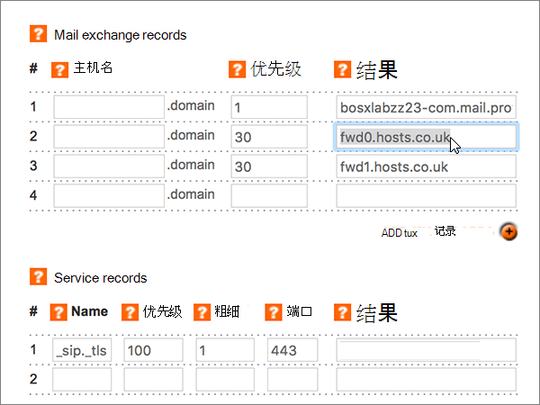

# 在 Register365 处为 Microsoft 创建 DNS 记录

 如果找不到要查找的内容，请**[查看域常见问题解答](../setup/domains-faq.md)**。 
  
如果 Register365 是您的 DNS 托管提供商，请按照本文中的步骤验证您的域并为电子邮件、Skype for Business Online 等设置 DNS 记录。 
  
下面是要添加的主要记录：  
  
- [添加 TXT 记录进行验证](#add-a-txt-record-for-verification)
    
- [添加一条 MX 记录，确保发往你的域的电子邮件将会发送到 Microsoft](#add-an-mx-record-so-email-for-your-domain-will-come-to-microsoft)
    
- [添加 Microsoft 所需的六条 CNAME 记录](#add-the-six-cname-records-that-are-required-for-microsoft)
    
- [为 SPF 添加 TXT 记录以帮助防止垃圾邮件](#add-a-txt-record-for-spf-to-help-prevent-email-spam)
    
- [添加 Microsoft 所需的两条 SRV 记录](#add-the-two-srv-records-that-are-required-for-microsoft)
    
在 Microsoft 中添加这些记录后，您的域将设置为使用 Microsoft 服务。
  
> [!NOTE]
>  DNS 更改通常需要 15 分钟左右才能生效。 但是，有时可能需要更长时间，您所做的更改才会在 Internet 的 DNS 系统中更新。 如果添加 DNS 记录后遇到邮件流问题或其他问题，请参阅 [更改域名或 DNS 记录后出现的问题的疑难解答](../get-help-with-domains/find-and-fix-issues.md)。 
  
## 添加 TXT 记录进行验证

在将域用于 Microsoft 之前，必须确保你拥有该域。如果你能够在域注册机构处登录到你的帐户并创建 DNS 记录，便可向 Microsoft 证明你是域所有者。
  
> [!NOTE]
> 此记录仅用于验证您是否拥有自己的域；它不会影响其他任何内容。 如果需要，您可以以后将其删除。 
  
1. 要开始，请使用[此链接](https://admin.register365.com/dns/)转到您在 Register365 上的域页面。 系统将会提示您先登录。
    
    
  
2. 在" **仪表板**"页面上，找到要更新的域的名称，然后从下拉列表中选择" **DNS 设置**"。 
    
    （可能需要向下滚动。）
    
    
  
3. On the **Add/Modify DNS Zone** page, in the **A, CNAME, AAAA, TXT and NS records** section, in the boxes for the new record, type or copy and paste the values from the following table. 
    
    (Choose the **Type** value from the drop-down list.) 
    
    （如果需要添加行，请选择 "**添加/CNAME 记录（+）**"。
    
    （可能需要向下滚动。）
    
    |**主机名**|**类型**|**结果**|
    |:-----|:-----|:-----|
    |(Leave this field empty.)    |TXT    |MS=ms *XXXXXXXX*    **注意：** 这是一个示例。 在这里使用表中的特定“**目标地址或指向的地址**”值。           [如何查找此项？](../get-help-with-domains/information-for-dns-records.md)          |
   
    
  
4. 选择“保存”****。
    
    (You may have to scroll down.)
    
    
  
5. 请在继续之前等待数分钟，以便您刚刚创建的记录可以通过 Internet 完成更新。
    
在在域注册机构网站添加了记录后，你将返回到 Microsoft 并请求记录。
  
Microsof 找到正确的 TXT 记录表明域已通过验证。
  
1. 在管理中心，转到“**设置**”\>“<a href="https://go.microsoft.com/fwlink/p/?linkid=834818" target="_blank">域</a>”页面。
    
2. 在“**域**”页面上，选择要验证的域。 
    
    
  
3. 在“**设置**”页面上，选择“**开始设置**”。
    
    
  
4. 在“**验证域**”页面上，选择“**验证**”。
    
    
  
> [!NOTE]
>  DNS 更改通常需要 15 分钟左右才能生效。 但是，有时可能需要更长时间，您所做的更改才会在 Internet 的 DNS 系统中更新。 如果添加 DNS 记录后遇到邮件流问题或其他问题，请参阅 [更改域名或 DNS 记录后出现的问题的疑难解答](../get-help-with-domains/find-and-fix-issues.md)。 
  
## 添加一条 MX 记录，确保发往你的域的电子邮件将会发送到 Microsoft

1. 要开始，请使用[此链接](https://admin.register365.com/dns/)转到您在 Register365 上的域页面。 系统将会提示您先登录。
    
    
  
2. 在" **仪表板**"页面上，找到要更新的域的名称，然后从下拉列表中选择" **DNS 设置**"。 
    
    （可能需要向下滚动。）
    
    
  
3. 在 "**添加/修改 DNS 区域**" 页上的 "**邮件交换记录**" 部分中，在新记录的框中，键入或复制并粘贴下表中的值。 
    
    （可能需要向下滚动。）
    
    |**主机名**|**Priority**|**结果**|
    |:-----|:-----|:-----|
    |（将此字段留空。）    |1     有关优先级的详细信息，请参阅[什么是 MX 优先级？](https://docs.microsoft.com/microsoft-365/admin/setup/domains-faq)   | *\<domain-key\>*。 mail.protection.outlook.com    **注意：***\<domain-key\>* 从你的 Microsoft 帐户获取你的。  [如何查找此项？](../get-help-with-domains/information-for-dns-records.md)     |
   
    
  
4. 选择“保存”****。
    
    (You may have to scroll down.)
    
    
  
5. 如果 "**邮件交换记录**" 部分中有任何其他 MX 记录，请选择该记录，然后按键盘上的**delete**键将其删除。 
    
    
  
6. 选择“保存”****。
    
    (You may have to scroll down.)
    
    
  
## 添加 Microsoft 所需的六条 CNAME 记录

1. 要开始，请使用[此链接](https://admin.register365.com/dns/)转到您在 Register365 上的域页面。 系统将会提示您先登录。
    
    
  
2. 在" **仪表板**"页面上，找到要更新的域的名称，然后从下拉列表中选择" **DNS 设置**"。 
    
    （可能需要向下滚动。）
    
    
  
3. 在 "**添加/修改 DNS 区域**" 页上的 " **A，CNAME，AAAA，TXT，NS 记录**" 部分中，在新记录的框中，键入或复制并粘贴下表中的值。 
    
    (Choose the **Type** value from the drop-down list.) 
    
    （如果需要添加行，请选择 "**添加/CNAME 记录（+）**"。
    
    (You may have to scroll down.)
    
    |主机名 * * * * *|键入 * * * *|结果 * * * *|
    |:-----|:-----|:-----|
    |autodiscover    |CNAME    |autodiscover.outlook.com    |
    |sip    |CNAME    |sipdir.online.lync.com    |
    |lyncdiscover    |CNAME    |webdir.online.lync.com    |
    |enterpriseregistration    |CNAME    |enterpriseregistration.windows.net    |
    |enterpriseenrollment    |CNAME    |enterpriseenrollment-s.manage.microsoft.com    |
   
    
  
4. 选择“保存”****。
    
    
  
## 为 SPF 添加 TXT 记录以帮助防止垃圾邮件

> [!IMPORTANT]
> 一个域所拥有的 SPF 的 TXT 记录不能超过一个。 如果域具有多个 SPF 记录，你将收到电子邮件错误，其中随附发送和垃圾邮件分类问题。 如果你的域已有 SPF 记录，请不要为 Microsoft 创建新记录。 改为将所需的 Microsoft 值添加到当前记录，以便您具有包含两组值的*单个*SPF 记录。 
  
1. 要开始，请使用[此链接](https://admin.register365.com/dns/)转到您在 Register365 上的域页面。 系统将会提示您先登录。
    
    
  
2. 在" **仪表板**"页面上，找到要更新的域的名称，然后从下拉列表中选择" **DNS 设置**"。 
    
    （可能需要向下滚动。）
    
    
  
3. On the **Add/Modify DNS Zone** page, in the **A, CNAME, AAAA, TXT and NS records** section, in the boxes for the new record, type or copy and paste the values from the following table. 
    
    (Choose the **Type** value from the drop-down list.) 
    
    （如果需要添加行，请选择 "**添加/CNAME 记录（+）**"。
    
    （可能需要向下滚动。）
    
    |**主机名**|**类型**|**结果**|
    |:-----|:-----|:-----|
    |(Leave this field empty.)    |TXT    |v=spf1 include:spf.protection.outlook.com -all   **注意：** 我们建议您复制并粘贴此条目，以保证正确保留所有空格。           |
   
    
  
4. 选择“保存”****。
    
    (You may have to scroll down.)
    
    
  
## 添加 Microsoft 所需的两条 SRV 记录

1. 要开始，请使用[此链接](https://admin.register365.com/dns/)转到您在 Register365 上的域页面。 系统将会提示您先登录。
    
    
  
2. 在" **仪表板**"页面上，找到要更新的域的名称，然后从下拉列表中选择" **DNS 设置**"。 
    
    （可能需要向下滚动。）
    
    
  
3. 在 "**添加/修改 DNS 区域**" 页上的 "**服务记录**" 部分中，在新记录的框中，键入或复制并粘贴下表中的值。 
    
    (You may have to scroll down.)
    
    |**名称**|**优先级**|**权重**|**端口**|**结果**|
    |:-----|:-----|:-----|:-----|:-----|
    |_sip _tls    |100    |1     |443    |sipdir.online.lync.com    |
    |_sipfederationtls _tcp    |100    |1     |5061    |sipfed.online.lync.com    |
   
    
  
4. 选择“保存”****。
    
    (You may have to scroll down.)
    
    
  
> [!NOTE]
>  DNS 更改通常需要 15 分钟左右才能生效。 但是，有时可能需要更长时间，您所做的更改才会在 Internet 的 DNS 系统中更新。 如果添加 DNS 记录后遇到邮件流问题或其他问题，请参阅 [更改域名或 DNS 记录后出现的问题的疑难解答](../get-help-with-domains/find-and-fix-issues.md)。 
  
