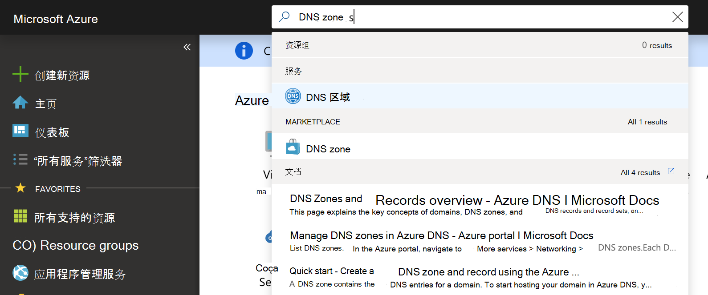
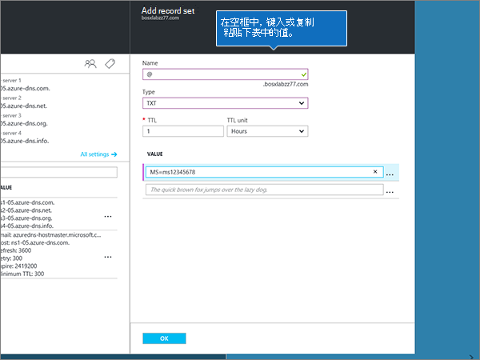
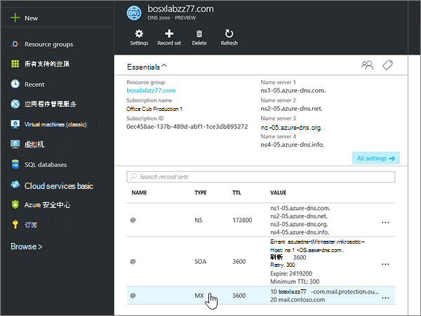
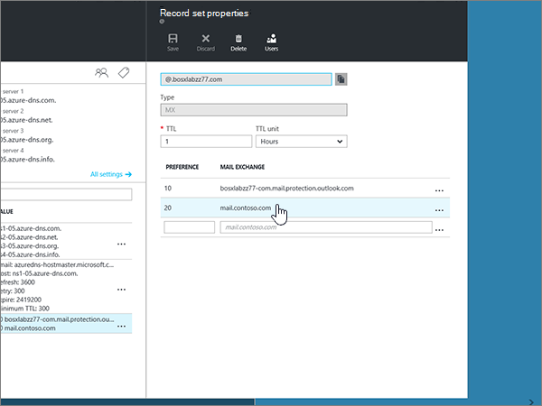
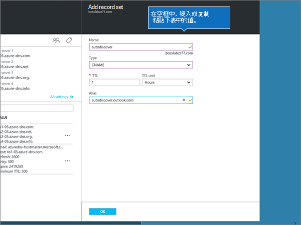
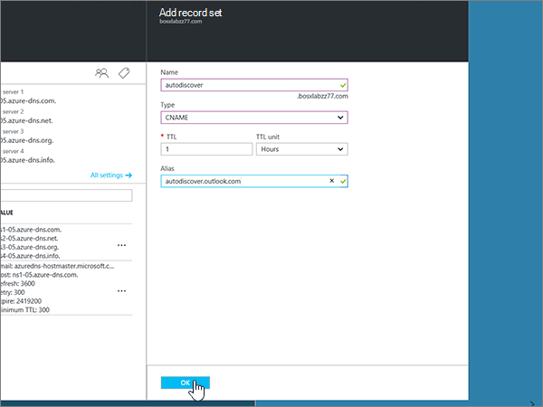
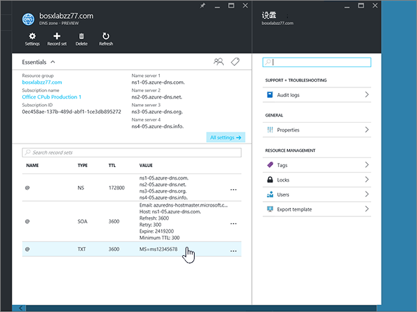
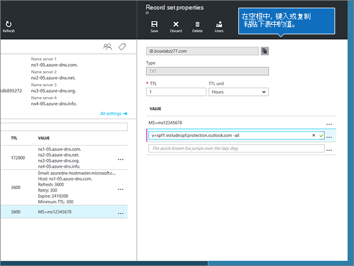
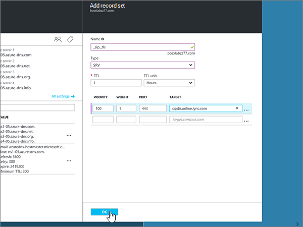

# 为 Azure DNS 区域创建 DNS 记录Create DNS records for Azure DNS zones

 如果找不到要查找的内容，请**[查看域常见问题解答](../setup/domains-faq.md)**。**[Check the Domains FAQ](../setup/domains-faq.md)** if you don't find what you're looking for. 
  
如果 Azure 是你的 DNS 托管提供商，请按照本文中的步骤验证你的域并为电子邮件、Skype for Business Online 等设置 DNS 记录。If Azure is your DNS hosting provider, follow the steps in this article to verify your domain and set up DNS records for email, Skype for Business Online, and so on.
  
下面是要添加的主要记录。These are the main records to add. 
  
- [更改域的名称服务器 (NS) 记录Change your domain's nameserver (NS) records](#change-your-domains-nameserver-ns-records)
    
- [添加 TXT 记录进行验证Add a TXT record for verification](#add-a-txt-record-for-verification)

- [添加 MX 记录，以便你的域的电子邮件将发送给 MicrosoftAdd an MX record so email for your domain will come to Microsoft](#add-an-mx-record-so-email-for-your-domain-will-come-to-microsoft)
    
- [添加 Microsoft 所需的四个 CNAME 记录Add the four CNAME records that are required for Microsoft](#add-the-four-cname-records-that-are-required-for-microsoft)
    
- [为 SPF 添加 TXT 记录以帮助防止垃圾邮件Add a TXT record for SPF to help prevent email spam](#add-a-txt-record-for-spf-to-help-prevent-email-spam)
    
- [添加 Microsoft 所需的两条 SRV 记录Add the two SRV records that are required for Microsoft](#add-the-two-srv-records-that-are-required-for-microsoft)
    
在 Azure 中添加这些记录后，您的域将设置为与 Microsoft 服务配合使用。After you add these records at Azure, your domain will be set up to work with Microsoft services.
  
> [!NOTE]
> DNS 更改通常需要 15 分钟左右才能生效。 但是，有时可能需要更长时间，您所做的更改才会在 Internet 的 DNS 系统中更新。 如果添加 DNS 记录后遇到邮件流问题或其他问题，请参阅 [更改域名或 DNS 记录后出现的问题的疑难解答](../get-help-with-domains/find-and-fix-issues.md)。Typically it takes about 15 minutes for DNS changes to take effect. However, it can occasionally take longer for a change you've made to update across the Internet's DNS system. If you're having trouble with mail flow or other issues after adding DNS records, see [Troubleshoot issues after changing your domain name or DNS records](../get-help-with-domains/find-and-fix-issues.md). 
  
## 更改域的名称服务器 (NS) 记录Change your domain's nameserver (NS) records

> [!IMPORTANT]
> 必须在购买和注册域的域注册机构中执行此过程。You must perform this procedure at the domain registrar where you purchased and registered your domain. 
  
注册 Azure 时，您在 DNS 区域中创建了一个资源组，然后将您的域名分配给该资源组。When you signed up for Azure, you created a resource group within a DNS zone, and then assigned your domain name to that resource group. 该域名注册到外部域注册机构;Azure 不提供域注册服务。That domain name is registered to an external domain registrar; Azure does not offer domain registration services.
  
若要在 Microsoft 中验证和创建域的 DNS 记录，首先需要更改域注册机构中的名称服务器，以便它们使用分配给资源组的 Azure 名称服务器。To verify and create DNS records for your domain in Microsoft, you first need to change the nameservers at your domain registrar so that they use the Azure nameservers assigned to your resource group.
  
若要在域注册机构的网站上更改域的名称服务器，请执行以下步骤。To change your domain's name servers at your domain registrar's website yourself, follow these steps.
  
1. 在域注册机构的网站上查找您可以在其中编辑您的域的名称服务器的区域。Find the area on the domain registrar's website where you can edit the nameservers for your domain.
    
2. 通过使用下表中的值创建两个名称服务器记录，或编辑现有的名称服务器记录以使其与这些值匹配。Either create two nameserver records by using the values in the following table, or edit the existing nameserver records so that they match these values. 下面显示了 Azure 分配的名称服务器的示例。An example of Azure assigned nameservers is shown below.
    

**第一个**名称服务器：使用 Azure 分配的名称服务器值。**First nameserver:** Use the name server value assigned by Azure.  
**第二个 nameserver：** 使用 Azure 分配的名称服务器值。**Second nameserver:** Use the name server value assigned by Azure.  

  
> [!TIP]
> You should use at least two name server records.You should use at least two name server records. 如果在域注册机构的网站上列出了任何其他名称服务器，则应将其删除。If there are any other name servers listed at your domain registrar's website, you should delete them. 
  
3. 保存所做的更改。Save your changes.
    
> [!NOTE]
> Your nameserver record updates may take up to several hours to update across the Internet's DNS system.Your nameserver record updates may take up to several hours to update across the Internet's DNS system. 然后，你的 Microsoft 电子邮件和其他服务将全部设置为与你的域一起使用。Then your Microsoft email and other services will be all set to work with your domain. 
  
## 添加 TXT 记录进行验证Add a TXT record for verification

在将你的域用于 Microsoft 之前，我们必须确保你拥有此域。Before you use your domain with Microsoft, we have to make sure that you own it. 你能够在域注册机构登录到你的帐户，并创建向 Microsoft 证明你拥有该域的 DNS 记录。Your ability to log in to your account at your domain registrar and create the DNS record proves to Microsoft that you own the domain.
  
> [!NOTE]
> 此记录仅用于验证您是否拥有自己的域；它不会影响其他任何内容。 如果需要，您可以以后将其删除。This record is used only to verify that you own your domain; it doesn't affect anything else. You can delete it later, if you like. 
  
1. 若要开始，请使用[此链接](https://portal.azure.com )转到 Azure 上的 "域" 页面。To get started, go to your domains page at Azure by using [this link](https://portal.azure.com ). 系统将会提示您先登录。You'll be prompted to log in first.
    
    
  
2. 在**仪表板**页面上使用**搜索栏**，在 " **DNS 区域**" 中键入。Using the **search bar** on the **Dashboard** page, type in **DNS zones**. 在 "结果显示" 中，选择 "**服务**" 部分下的 " **DNS 区域**"。In the results display, select **DNS zones** under the **Services** portion. 重定向后，选择要更新的域。Once you've been redirected, select the domain that you want to update.
    
    
  
3. 在您的域的 "**设置**" 页上的 " **DNS 区域**" 区域中，选择 " **+ 记录集**"。On the **Settings** page for your domain, in the **DNS zone** area, select **+ Record set**.
    
    
  
4. 在 "**添加记录集**" 区域中新记录集对应的框中，选择下表中的值。In the **Add record set** area, in the boxes for the new record set, select the values from the following table. 
    
    （从下拉列表中选择 "**类型**" 和 " **TTL 单位**" 值。）(Choose the **Type** and **TTL unit** values from the drop-down lists.) 
    
    |**名称****Name**|**Type****Type**|**TTL****TTL**|**TTL 单位****TTL unit**|**值****Value**|
    |:-----|:-----|:-----|:-----|:-----|
    |@    |TXTTXT    |11    |工作时间Hours    |MS=ms *XXXXXXXX*MS=ms *XXXXXXXX*    **注意：** 此为示例。**Note:** This is an example. 从表中使用您的特定**目标或指向 "地址**" 值。Use your specific **Destination or Points to Address** value here, from the table.           [如何查找此项？How do I find this?](../get-help-with-domains/information-for-dns-records.md)          |
   
    
  
5. 选择“确定”\*\*\*\*。Select **OK**.
  
6. 请在继续之前等待数分钟，以便您刚刚创建的记录可以通过 Internet 完成更新。Wait a few minutes before you continue, so that the record you just created can update across the Internet.
    
现在您已在域注册机构的网站上添加了记录，您将返回到 Microsoft 并请求该记录。Now that you've added the record at your domain registrar's site, you'll go back to Microsoft and request the record.
  
当 Microsoft 找到正确的 TXT 记录时，您的域将会得到验证。When Microsoft finds the correct TXT record, your domain is verified.
  
1. 在管理中心，转到“**设置**”\> <a href="https://go.microsoft.com/fwlink/p/?linkid=834818" target="_blank">域</a>页面。In the admin center, go to the **Settings** \> <a href="https://go.microsoft.com/fwlink/p/?linkid=834818" target="_blank">Domains</a> page.
    
2. 在“**域**”页面上，选择要验证的域。On the **Domains** page, select the domain that you are verifying. 
    
    
  
3. 在“**设置**”页面上，选择“**开始设置**”。On the **Setup** page, select **Start setup**.
    
    
  
4. 在“**验证域**”页面上，选择“**验证**”。On the **Verify domain** page, select **Verify**.
    
    
  
> [!NOTE]
>  DNS 更改通常需要 15 分钟左右才能生效。 但是，有时可能需要更长时间，您所做的更改才会在 Internet 的 DNS 系统中更新。 如果添加 DNS 记录后遇到邮件流问题或其他问题，请参阅 [更改域名或 DNS 记录后出现的问题的疑难解答](../get-help-with-domains/find-and-fix-issues.md)。Typically it takes about 15 minutes for DNS changes to take effect. However, it can occasionally take longer for a change you've made to update across the Internet's DNS system. If you're having trouble with mail flow or other issues after adding DNS records, see [Troubleshoot issues after changing your domain name or DNS records](../get-help-with-domains/find-and-fix-issues.md). 
  
## 添加 MX 记录，以便你的域的电子邮件将发送给 MicrosoftAdd an MX record so email for your domain will come to Microsoft

1. 若要开始，请使用[此链接](https://portal.azure.com )转到 Azure 上的 "域" 页面。To get started, go to your domains page at Azure by using [this link](https://portal.azure.com ). 系统将会提示您先登录。You'll be prompted to log in first.
    
    
  
2. 在 "**仪表板**" 页上的 "**所有资源**" 区域中，选择要更新的域。On the **Dashboard** page, in the **All resources** area, select the domain that you want to update. 
    
    
  
3. 在您的域的 "**设置**" 页上的 " **DNS 区域**" 区域中，选择 " **+ 记录集**"。On the **Settings** page for your domain, in the **DNS zone** area, select **+ Record set**.
    
    
  
4. 在 "**添加记录集**" 区域中新记录集对应的框中，选择下表中的值。In the **Add record set** area, in the boxes for the new record set, select the values from the following table. 
    
    （从下拉列表中选择 "**类型**" 和 " **TTL 单位**" 值。）(Choose the **Type** and **TTL unit** values from the drop-down lists.) 
    
    |**名称****Name**|**Type****Type**|**TTL****TTL**|**TTL 单位****TTL unit**|**首选项****Preference**|**邮件交换****Mail Exchange**|
    |:-----|:-----|:-----|:-----|:-----|:-----|
    |@    |MXMX    |11    |工作时间Hours    |10 10    有关优先级的详细信息，请参阅[什么是 MX 优先级？](https://support.office.com/article/2784cc4d-95be-443d-b5f7-bb5dd867ba83.aspx)For more information about priority, see [What is MX priority?](https://support.office.com/article/2784cc4d-95be-443d-b5f7-bb5dd867ba83.aspx)   | *\<域密钥\>*  .mail.protection.outlook.com*\<domain-key\>*  .mail.protection.outlook.com    **注意：** 从你的 Microsoft 帐户中获取你\* \<的域密钥\> \* 。**Note:** Get your  *\<domain-key\>*  from your Microsoft account.   [如何查找此项？How do I find this?](../get-help-with-domains/information-for-dns-records.md)  
   
    
  
5. 选择“确定”\*\*\*\*。Select **OK**.
    
    
  
6. 如果 " **Mx 记录**" 一节中列出了任何其他 MX 记录，则必须将其删除。If there are any other MX records listed in the **MX Records** section, you must delete them. 
    
    首先，在 " **DNS 区域**" 区域中，选择**MX 记录集**。First, in the **DNS zone** area, select the **MX Record set**.
    
    
  
    接下来，选择要删除的 MX 记录。Next, select the MX record you want to delete.
    
    
  
7. 选择**上下文菜单（**"..."），然后选择 "**删除**"。Select the **Context menu (…)**, and then choose **Remove**.
    
    
  
8. 选择“**保存**”。Select **Save**.
    
    
  
## 添加 Microsoft 所需的四个 CNAME 记录Add the four CNAME records that are required for Microsoft

1. 若要开始，请使用[此链接](https://portal.azure.com )转到 Azure 上的 "域" 页面。To get started, go to your domains page at Azure by using [this link](https://portal.azure.com ). 系统将会提示您先登录。You'll be prompted to log in first.
    
    
  
2. 在 "**仪表板**" 页上的 "**所有资源**" 区域中，选择要更新的域。On the **Dashboard** page, in the **All resources** area, select the domain that you want to update. 
    
    
  
3. 在您的域的 "**设置**" 页上的 " **DNS 区域**" 区域中，选择 " **+ 记录集**"。On the **Settings** page for your domain, in the **DNS zone** area, select **+ Record set**.
    
    
  
4. 添加四个 CNAME 记录中的第一个。Add the first of the four CNAME records.
    
    在 "**添加记录集**" 区域中新记录集对应的框中，键入或复制并粘贴下表中第一行的值。In the **Add record set** area, in the boxes for the new record set, type or copy and paste the values from the first row in the following table. 
    
    （从下拉列表中选择 "**类型**" 和 " **TTL 单位**" 值。）(Choose the **Type** and **TTL unit** values from the drop-down lists.) 
    
    |**名称****Name**|**Type****Type**|**TTL****TTL**|**TTL 单位****TTL unit**|**Alias****Alias**|
    |:-----|:-----|:-----|:-----|:-----|
    |autodiscoverautodiscover    |CNAMECNAME    |11    |工作时间Hours    |autodiscover.outlook.comautodiscover.outlook.com    |
    |sipsip    |CNAMECNAME    |11    |工作时间Hours    |sipdir.online.lync.comsipdir.online.lync.com    |
    |lyncdiscoverlyncdiscover    |CNAMECNAME    |11    |工作时间Hours    |webdir.online.lync.comwebdir.online.lync.com    |
    
   
    
  
5. 选择“确定”\*\*\*\*。Select **OK**.
    
    
  
6. 添加其他三个 CNAME 记录中的每一个。Add each of the other three CNAME records.
    
    在 " **DNS 区域**" 区域中，选择 " **+ 记录集**"。In the **DNS zone** area, select **+ Record set**. 然后，在空记录集中，使用表中下一行的值创建记录，然后再次选择 **"确定"** 以完成该记录。Then, in the empty record set, create a record by using the values from the next row in the table, and again select **OK** to complete that record. 
    
    重复此过程，直到创建了全部四个 CNAME 记录。Repeat this process until you have created all four CNAME records.
    
7.  Optional为 MDM 添加2个 CNAME 记录。(Optional) Add 2 CNAME records for MDM.

> [!IMPORTANT]
> 如果你具有适用于 Microsoft 的移动设备管理（MDM），则必须创建两个附加的 CNAME 记录。If you have Mobile Device Management (MDM) for Microsoft, then you must create two additional CNAME records. 创建流程与你用于其他四个 CNAME 记录的流程一样，但需提供下表中的值。Follow the procedure that you used for the other four CNAME records, but supply the values from the following table. （如果没有 MDM，则可以跳过此步骤。）(If you do not have MDM, you can skip this step.) 
  
|**名称****Name**|**Type****Type**|**TTL****TTL**|**TTL 单位****TTL unit**|**Alias****Alias**|
|:-----|:-----|:-----|:-----|:-----|
|enterpriseregistrationenterpriseregistration    |CNAMECNAME    |11    |工作时间Hours    |enterpriseregistration.windows.netenterpriseregistration.windows.net    |
|enterpriseenrollmententerpriseenrollment    |CNAMECNAME    |11    |工作时间Hours    |enterpriseenrollment-s.manage.microsoft.comenterpriseenrollment-s.manage.microsoft.com    |
   
## 为 SPF 添加 TXT 记录以帮助防止垃圾邮件Add a TXT record for SPF to help prevent email spam

> [!IMPORTANT]
> 一个域所拥有的 SPF 的 TXT 记录不能超过一个。You cannot have more than one TXT record for SPF for a domain. 如果域具有多个 SPF 记录，你将收到电子邮件错误，其中随附发送和垃圾邮件分类问题。If your domain has more than one SPF record, you'll get email errors, as well as delivery and spam classification issues. 如果你已有域的 SPF 记录，请不要为 Microsoft 创建一个新的。If you already have an SPF record for your domain, don't create a new one for Microsoft. 改为将所需的 Microsoft 值添加到当前记录，以便您具有包含两组值的*单个*SPF 记录。Instead, add the required Microsoft values to the current record so that you have a  *single*  SPF record that includes both sets of values. 
  
1. 若要开始，请使用[此链接](https://portal.azure.com )转到 Azure 上的 "域" 页面。To get started, go to your domains page at Azure by using [this link](https://portal.azure.com ). 系统将会提示您先登录。You'll be prompted to log in first.
    
    
  
2. 在 "**仪表板**" 页上的 "**所有资源**" 区域中，选择要更新的域。On the **Dashboard** page, in the **All resources** area, select the domain that you want to update. 
    
    
  
3. 在 " **DNS 区域**" 区域中，选择 " **TXT" 记录集**。In the **DNS zone** area, select the **TXT record set**.
    
    
  
4. 在 "**记录集属性**" 区域中新记录集对应的框中，选择下表中的值。In the **Record set properties** area, in the boxes for the new record set, select the values from the following table. 
    
    （从下拉列表中选择 "**类型**" 和 " **TTL 单位**" 值。）(Choose the **Type** and **TTL unit** values from the drop-down lists.) 
    
    |**名称****Name**|**Type****Type**|**TTL****TTL**|**TTL 单位****TTL unit**|**值****Value**|
    |:-----|:-----|:-----|:-----|:-----|
    |@    |TXTTXT    |11    |工作时间Hours    |v=spf1 include:spf.protection.outlook.com -allv=spf1 include:spf.protection.outlook.com -all    **注意：** 我们建议您复制并粘贴此条目，以保证正确保留所有空格。**Note:** We recommend copying and pasting this entry, so that all of the spacing stays correct.           

    
  
5. 选择“**保存**”。Select **Save**.
    
    
  
## 添加 Microsoft 所需的两条 SRV 记录Add the two SRV records that are required for Microsoft

1. 若要开始，请使用[此链接](https://portal.azure.com )转到 Azure 上的 "域" 页面。To get started, go to your domains page at Azure by using [this link](https://portal.azure.com ). 系统将会提示您先登录。You'll be prompted to log in first.
    
    
  
2. 在 "**仪表板**" 页上的 "**所有资源**" 区域中，选择要更新的域。On the **Dashboard** page, in the **All resources** area, select the domain that you want to update. 
    
    
  
3. 在您的域的 "**设置**" 页上的 " **DNS 区域**" 区域中，选择 " **+ 记录集**"。On the **Settings** page for your domain, in the **DNS zone** area, select **+ Record set**.
    
    
  
4. 添加两条 SRV 记录中的第一条记录。Add the first of the two SRV records.
    
    在 "**添加记录集**" 区域中新记录集对应的框中，选择下表中第一行的值。In the **Add record set** area, in the boxes for the new record set, select the values from the first row in the following table. 
    
    （从下拉列表中选择 "**类型**" 和 " **TTL 单位**" 值。）(Choose the **Type** and **TTL unit** values from the drop-down lists.) 
    
    |**名称****Name**|**Type****Type**|**TTL****TTL**|**TTL 单位****TTL unit**|**优先级****Priority**|**权重****Weight**|**端口****Port**|**目标****Target**|
    |:-----|:-----|:-----|:-----|:-----|:-----|:-----|:-----|
    |_sip _tls_sip._tls    |SRVSRV    |11    |工作时间Hours    |100100    |11    |443443    |sipdir.online.lync.comsipdir.online.lync.com    |
    |_sipfederationtls _tcp_sipfederationtls._tcp    |SRVSRV    |11    |工作时间Hours    |100100    |11    |50615061    |sipfed.online.lync.comsipfed.online.lync.com    

    
  
5. 选择“确定”\*\*\*\*。Select **OK**.
    
    
  
6. 添加另一条 SRV 记录。Add the other SRV record.
    
    在新记录的框中，键入或复制并粘贴表中第二行的值。In the boxes for the new record, type or copy and paste the values from the second row of the table.
    
> [!NOTE]
> DNS 更改通常需要 15 分钟左右才能生效。 但是，有时可能需要更长时间，您所做的更改才会在 Internet 的 DNS 系统中更新。 如果添加 DNS 记录后遇到邮件流问题或其他问题，请参阅 [更改域名或 DNS 记录后出现的问题的疑难解答](../get-help-with-domains/find-and-fix-issues.md)。Typically it takes about 15 minutes for DNS changes to take effect. However, it can occasionally take longer for a change you've made to update across the Internet's DNS system. If you're having trouble with mail flow or other issues after adding DNS records, see [Troubleshoot issues after changing your domain name or DNS records](../get-help-with-domains/find-and-fix-issues.md). 
  
