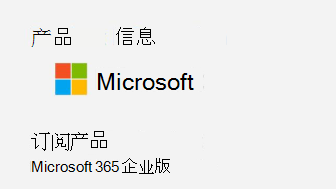

# <a name="determine-if-centralized-deployment-of-add-ins-works-for-your-organization"></a>确定加载项的集中部署是否适用于你的组织

集中部署是大多数客户将 Office 外接程序部署到组织内的用户和组的建议功能和功能最丰富的方法。 如果您是管理员，请使用本指南来确定您的组织和用户是否满足要求，以便您可以使用集中部署。

集中部署有以下优点：
  
- 全局管理员可以将外接程序直接分配给用户，也可以通过组或组织中的所有人将其分配给多个用户。
    
- 当相关的 Office 应用程序启动时，加载项会自动下载。 如果外接程序支持外接程序命令，则外接程序将自动显示在 Office 应用程序中的功能区上。
    
- 如果管理员关闭或删除加载项，或者从 Azure Active Directory 或将外接程序分配到的组中删除了用户，则不再向用户显示外接程序。

集中部署支持三个桌面平台 Windows、Mac 和 Online Office 应用。 集中部署还支持仅) 的 iOS 和 Android (Outlook 移动外接程序。

加载项最长可能需要24小时才能为所有用户显示客户端。
  
## <a name="requirements"></a>Requirements

集中部署加载项需要用户使用 Microsoft 365 应用程序企业版或 Microsoft 365 商业高级 (，并使用组织 ID) 登录 Office，并拥有 Exchange Online 和活动 Exchange Online 邮箱。 你的订阅目录必须位于或联合到 Azure Active Directory 中。
您可以查看以下 Office 和 Exchange 的特定要求，或使用[集中部署兼容性检查器](#centralized-deployment-compatibility-checker)。

集中部署不支持以下内容：
  
- 针对 Office 2013 中 Word、Excel 或 PowerPoint 的加载项 
- 本地目录服务
- 外接程序部署到本地邮箱的 Exchange
- 部署到 SharePoint 的加载项  
- 团队应用程序
- 组件对象模型 (COM) 或 Visual Studio Tools for Office (VSTO) 的加载项的部署
- 不包括 Exchange （如 Microsoft 365 商业应用程序）的 Microsoft 365 部署

### <a name="office-requirements"></a>Office 要求

- 对于 Word、Excel 和 PowerPoint 外接程序，您的用户必须使用下列项之一：
  - 在 Windows 设备上，Microsoft 365 应用程序的版本1704或更高版本或 Microsoft 365 商业高级版。
  - 在 Mac 上，版本15.34 或更高版本。

- 对于 Outlook，您的用户必须使用以下各项之一： 
  - Microsoft 365 应用程序的版本1701或更高版本，或 Microsoft 365 Business Premium。
  - Office Professional Plus 2019 或 Office Standard 2019 的版本1808或更高版本。
  - 版本16.0.4494.1000 或更高版本的 Office Professional Plus 2016 (MSI) 或 Office Standard 2016 (MSI) \*
  - 版本15.0.4937.1000 或更高版本的 Office Professional Plus 2013 (MSI) 或 Office Standard 2013 (MSI) \*
  - 版本16.0.9318.1000 或更高版本的 Office 2016 for Mac 
- 版本2.75.0 或更高版本的 Outlook mobile for iOS 
- 适用于 Android 的 Outlook mobile 版本2.2.145 或更高版本 
    
    * MSI 版本的 Outlook 在相应的 Outlook 功能区中显示管理员安装的加载项，而不是 "我的外接程序" 部分。
    

#### <a name="find-out-if-microsoft-365-apps-for-enterprise-is-installed"></a>了解是否已安装适用于企业的 Microsoft 365 应用程序

若要将 Microsoft 365 应用程序用于企业版，用户必须拥有 Microsoft 365 帐户，并且必须已分配许可证。 有关详细信息，请参阅 [适用于企业的 Microsoft 365 应用概述](https://go.microsoft.com/fwlink/p/?linkid=846328)。

检测用户是否已安装 Microsoft 365 应用程序并最近是否使用它的最简单方法是使用 Microsoft Office 激活报告，该报告在 Microsoft 365 管理中心中提供。 该报告提供了一个列表，其中列出了在过去7天、30天、90天或180天内为企业激活 Microsoft 365 应用程序的所有用户。 出于集中部署目的，Windows 或 Mac 的桌面激活是报表中的重要列。 可将报表导出至 Excel。 有关报告的详细信息，请参阅 [管理中心内的 microsoft 365 报表-Microsoft Office 激活](../activity-reports/microsoft-office-activations.md)。
  
如果不想使用激活报告，可以让用户在其计算机上打开 Office 应用程序（如 Word），然后选择 " **文件** \> **帐户**"。 在 " **产品信息**" 下，您应看到 " **订阅产品** " 和 " **microsoft 365 For enterprise**" 或 "microsoft 365 商业高级版"，类似于下图中所示内容。


  
若要获取适用于企业的 Microsoft 365 应用的帮助，请参阅 [适用于企业的 microsoft 365 应用的故障排除提示](https://go.microsoft.com/fwlink/p/?linkid=846339)。


### <a name="exchange-online-requirements"></a>Exchange Online 要求

Microsoft Exchange 存储组织的租户中的加载项清单。 部署外接程序的管理员和接收这些外接程序的用户必须是支持 OAuth 身份验证的 Exchange Online 版本。
  
请与组织的 Exchange 管理员联系，了解正在使用哪个配置。可使用 [Test-OAuthConnectivity](https://go.microsoft.com/fwlink/p/?linkid=846351) PowerShell cmdlet 验证每个用户的 OAuth 连接。 


### <a name="centralized-deployment-compatibility-checker"></a>集中部署兼容性检查器

使用集中部署兼容性检查器，可以验证是否已将租户上的用户设置为使用 Word、Excel 和 PowerPoint 的集中部署。 Outlook 支持不需要兼容性检查器。 在[此处](https://aka.ms/officeaddindeploymentorgcompatibilitychecker)下载兼容性检查器。
  
#### <a name="run-the-compatibility-checker"></a>运行兼容性检查器
  
1. 启动提升的 PowerShell.exe 窗口。
    
2. 运行以下命令：

   ```powershell
   Import-Module O365CompatibilityChecker
   ```
    
3. 运行 **CompatabilityCheck** 命令：

   ```powershell
   Invoke-CompatibilityCheck
   ```
   此命令将提示您输入  *_TenantDomain_* (例如， *TailspinToysIncorporated。 </span>com*) 和  *_TenantAdmin_* 凭据 (使用您的全局管理员凭据) ，然后请求许可。
    
   > [!NOTE]
   > 检查器可能需要数分钟或数小时时间来完成检查，具体取决于租户中的用户数。 
  
工具运行完毕后，会生成逗号分隔格式的输出文件 (.csv)。 默认情况下，该文件保存到 **C:\windows\system32** 。 输出文件包含以下信息：
  
- 用户名
    
- 用户 ID（用户的电子邮件地址）
    
- 集中部署准备就绪 - 如果剩余的项为 true
    
- Office plan-授权的 Office 计划
    
- Office 已激活 - 如果已激活 Office
    
- 支持的邮箱 - 如果使用已启用 OAuth 的邮箱


  
## <a name="user-and-group-assignments"></a>用户和组分配

集中部署功能当前支持 Azure Active Directory 支持的大多数组，包括 Microsoft 365 组、通讯组列表和安全组。
  
> [!NOTE]
> 当前不支持未启用邮件的安全组。 
  
集中部署支持对租户中的单个用户、组和每个人的工作分配。 集中部署支持顶级组或没有父组的组中的用户，但不支持嵌套组或有父组的组中的用户。
   
请查看以下示例，在这里，柏隼、康霓以及销售部门组被分配了加载项。由于西海岸销售部门是嵌套组，赵强和熊飞未被分配加载项。
  


   
### <a name="find-out-if-a-group-contains-nested-groups"></a>找出一个组是否包含嵌套组

若要找出一个组是否包含嵌套组，最简单的方法是查看 Outlook 内的组联系人卡片。 如果您在电子邮件的 " **To** " 字段中输入组名称，然后在解析时选择组名称，将显示它是否包含用户或嵌套组。 在以下示例中，测试组 Outlook 联系人卡片的" **成员**"选项卡显示没有用户且只有两个子组。 
  

  
可以解析某个组，查看该组是否是任何组的成员，从而进行反向查询。在以下示例中，可以在 Outlook 联系人卡片的" **成员身份**"选项卡下看到子组 1 是测试组的成员。 
  

  
或者，可以使用 Azure Active Directory 图形 API 运行查询，查找组内的组列表。有关详细信息，请参阅 [Operations on groups | Graph API reference](https://go.microsoft.com/fwlink/p/?linkid=846342)（组操作 | 图形 API 参考）。
  
### <a name="contacting-microsoft-for-support"></a>联系 Microsoft 以获取支持

如果您或您的用户在使用 Office 应用程序时加载加载项时遇到问题 (Word、Excel 等 ) （已集中部署），您可能需要联系 Microsoft 支持部门 ([了解](../contact-support-for-business-products.md)) 。 在支持票证中提供有关你的 Microsoft 365 环境的以下信息。
  
|**平台**|**调式信息**|
|:-----|:-----|
|Office  <br/> | Charles/Fiddler 日志  <br/>  租户 ID（ [了解如何操作](https://docs.microsoft.com/onedrive/find-your-office-365-tenant-id.aspx)）  <br/>  CorrelationID. 查看其中一个 office 页面的来源，查找相关 ID 值并将其发送给支持人员：  <br/>`<input name=" **wdCorrelationId**" type="hidden" value=" **{BC17079E-505F-3000-C177-26A8E27EB623}**">`  <br/>  `<input name="user_id" type="hidden" value="1003bffd96933623"></form>`  <br/> |
|丰富的客户端（Windows、Mac）  <br/> | Charles/Fiddler 日志  <br/>  客户端应用程序的内部版本号 (最好是从 **文件/帐户**) 中的屏幕截图  <br/> |
   

