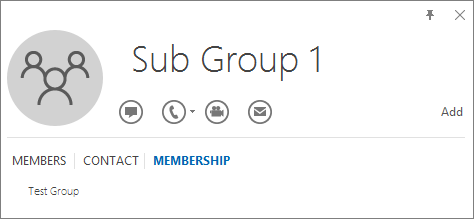

# <a name="determine-if-centralized-deployment-of-add-ins-works-for-your-organization"></a><span data-ttu-id="6f88d-103">确定外接程序的集中部署是否适用于您的组织</span><span class="sxs-lookup"><span data-stu-id="6f88d-103">Determine if Centralized Deployment of add-ins works for your organization</span></span>

<span data-ttu-id="6f88d-104">对于大多数客户来说，集中部署是推荐且功能最丰富的方法Office向组织内的用户和组部署外接程序。</span><span class="sxs-lookup"><span data-stu-id="6f88d-104">Centralized Deployment is the recommended and most feature-rich way for most customers to deploy Office add-ins to users and groups within your organization.</span></span> <span data-ttu-id="6f88d-105">如果你是管理员，请使用本指南确定组织和用户是否满足要求，以便可以使用集中部署。</span><span class="sxs-lookup"><span data-stu-id="6f88d-105">If you're an admin, use this guidance to determine if your organization and users meet the requirements so that you can use Centralized Deployment.</span></span>

<span data-ttu-id="6f88d-106">集中部署有以下优点：</span><span class="sxs-lookup"><span data-stu-id="6f88d-106">Centralized Deployment provides the following benefits:</span></span>
  
- <span data-ttu-id="6f88d-107">全局管理员可以将外接程序直接分配给用户、通过组分配给多个用户或分配给组织中的每个人。</span><span class="sxs-lookup"><span data-stu-id="6f88d-107">A Global admin can assign an add-in directly to a user, to multiple users via a group, or to everyone in the organization.</span></span>
    
- <span data-ttu-id="6f88d-108">当相关Office应用程序启动时，外接程序将自动下载。</span><span class="sxs-lookup"><span data-stu-id="6f88d-108">When the relevant Office application starts, the add-in automatically downloads.</span></span> <span data-ttu-id="6f88d-109">如果外接程序支持外接程序命令，则外接程序会自动显示在应用程序内的功能Office中。</span><span class="sxs-lookup"><span data-stu-id="6f88d-109">If the add-in supports add-in commands, the add-in automatically appears in the ribbon within the Office application.</span></span>
    
- <span data-ttu-id="6f88d-110">如果管理员关闭或删除外接程序，或者如果用户从 Azure Active Directory 或外接程序分配到的组中删除，则用户将不再显示外接程序。</span><span class="sxs-lookup"><span data-stu-id="6f88d-110">Add-ins no longer appear for users if the admin turns off or deletes the add-in, or if the user is removed from Azure Active Directory or from a group that the add-in is assigned to.</span></span>

<span data-ttu-id="6f88d-111">集中部署支持三个桌面Windows、Mac 和 Online Office应用。</span><span class="sxs-lookup"><span data-stu-id="6f88d-111">Centralized Deployment supports three desktop platforms Windows, Mac and Online Office apps.</span></span> <span data-ttu-id="6f88d-112">集中部署还支持 iOS 和 Android (Outlook移动外接程序仅) 。</span><span class="sxs-lookup"><span data-stu-id="6f88d-112">Centralized Deployment also supports iOS and Android (Outlook Mobile Add-ins Only).</span></span>

<span data-ttu-id="6f88d-113">外接程序最多可能需要 24 小时才能显示给所有用户的客户端。</span><span class="sxs-lookup"><span data-stu-id="6f88d-113">It can take up to 24 hours for an add-in to show up for client for all users.</span></span>
  
## <a name="before-you-begin"></a><span data-ttu-id="6f88d-114">开始之前</span><span class="sxs-lookup"><span data-stu-id="6f88d-114">Before you begin</span></span>

<span data-ttu-id="6f88d-115">外接程序的集中部署要求用户使用 Microsoft 365 企业版 SKUS：E3/E5/F3 或业务 SK：Business Basic、Business Standard、Business 高级版 (，并且使用其组织 ID) 登录 Office，并且具有 Exchange Online 和活动的 Exchange Online 邮箱。</span><span class="sxs-lookup"><span data-stu-id="6f88d-115">Centralized deployment of add-ins requires that the users are using Microsoft 365 Enterprise SKUs: E3/E5/F3 or Business SKUs: Business Basic, Business Standard, Business Premium (and are signed into Office using their organizational ID), and have Exchange Online and active Exchange Online mailboxes.</span></span> <span data-ttu-id="6f88d-116">订阅目录必须位于 中，或已联合Azure Active Directory。</span><span class="sxs-lookup"><span data-stu-id="6f88d-116">Your subscription directory must either be in, or federated to Azure Active Directory.</span></span>
<span data-ttu-id="6f88d-117">可以查看下面的特定要求Office Exchange，或使用集中部署[兼容性检查器](#centralized-deployment-compatibility-checker)。</span><span class="sxs-lookup"><span data-stu-id="6f88d-117">You can view specific requirements for Office and Exchange below, or use the [Centralized Deployment Compatibility Checker](#centralized-deployment-compatibility-checker).</span></span>

<span data-ttu-id="6f88d-118">集中部署不支持以下内容：</span><span class="sxs-lookup"><span data-stu-id="6f88d-118">Centralized Deployment doesn't support the following:</span></span>
  
- <span data-ttu-id="6f88d-119">针对 Office 2013 中 Word、Excel 或 PowerPoint 的加载项</span><span class="sxs-lookup"><span data-stu-id="6f88d-119">Add-ins that target Word, Excel, or PowerPoint in Office 2013</span></span> 
- <span data-ttu-id="6f88d-120">本地目录服务</span><span class="sxs-lookup"><span data-stu-id="6f88d-120">An on-premises directory service</span></span>
- <span data-ttu-id="6f88d-121">部署到内部部署Exchange的外接程序部署</span><span class="sxs-lookup"><span data-stu-id="6f88d-121">Add-in Deployment to an Exchange On-Prem Mailbox</span></span>
- <span data-ttu-id="6f88d-122">部署到 SharePoint 的加载项</span><span class="sxs-lookup"><span data-stu-id="6f88d-122">Add-in deployment to SharePoint</span></span>  
- <span data-ttu-id="6f88d-123">Teams应用</span><span class="sxs-lookup"><span data-stu-id="6f88d-123">Teams apps</span></span>
- <span data-ttu-id="6f88d-124">部署组件对象模型 (COM) 或Visual Studio Tools for Office (VSTO) 加载项。</span><span class="sxs-lookup"><span data-stu-id="6f88d-124">Deployment of Component Object Model (COM) or Visual Studio Tools for Office (VSTO) add-ins.</span></span>
- <span data-ttu-id="6f88d-125">不包含Microsoft 365 SKUS Exchange Online：Microsoft 365 应用版 for Business 和 Microsoft 365 应用版 for Enterprise。</span><span class="sxs-lookup"><span data-stu-id="6f88d-125">Deployments of Microsoft 365 that do not include Exchange Online such as SKUs: Microsoft 365 Apps for Business and Microsoft 365 Apps for Enterprise.</span></span>

### <a name="office-requirements"></a><span data-ttu-id="6f88d-126">Office要求</span><span class="sxs-lookup"><span data-stu-id="6f88d-126">Office Requirements</span></span>

- <span data-ttu-id="6f88d-127">对于 Word、Excel 和 PowerPoint 加载项，用户必须使用下列加载项之一：</span><span class="sxs-lookup"><span data-stu-id="6f88d-127">For Word, Excel, and PowerPoint add-ins, your users must be using one of the following:</span></span>
  - <span data-ttu-id="6f88d-128">在 Windows 设备上，版本 1704 或更高版本的 Microsoft 365 企业版 SK：E3/E5/F3 或 Business SKUs：Business Basic、Business Standard、Business 高级版。</span><span class="sxs-lookup"><span data-stu-id="6f88d-128">On a Windows device, Version 1704 or later of Microsoft 365 Enterprise SKUs: E3/E5/F3 or Business SKUs: Business Basic, Business Standard, Business Premium.</span></span>
  - <span data-ttu-id="6f88d-129">在 Mac 版本 15.34 或更高版本上。</span><span class="sxs-lookup"><span data-stu-id="6f88d-129">On a Mac, Version 15.34 or later.</span></span>

- <span data-ttu-id="6f88d-130">对于Outlook，用户必须使用下列方法之一：</span><span class="sxs-lookup"><span data-stu-id="6f88d-130">For Outlook, your users must be using one of the following:</span></span> 
  - <span data-ttu-id="6f88d-131">SKUS 的版本 1701 或Microsoft 365 企业版：E3/E5/F3 或 Business SKUs：Business Basic、Business Standard、Business 高级版。</span><span class="sxs-lookup"><span data-stu-id="6f88d-131">Version 1701 or later of Microsoft 365 Enterprise SKUs: E3/E5/F3 or Business SKUs: Business Basic, Business Standard, Business Premium.</span></span>
  - <span data-ttu-id="6f88d-132">2019 年 Office 专业增强版 2019 Office Standard 版本 1808 或更高版本。</span><span class="sxs-lookup"><span data-stu-id="6f88d-132">Version 1808 or later of Office Professional Plus 2019 or Office Standard 2019.</span></span>
  - <span data-ttu-id="6f88d-133">MSI 版本 16.0.4494.1000 或更高版本OFFICE 专业增强版 2016 (MSI) 或 Office 标准版 2016 (MSI) \*</span><span class="sxs-lookup"><span data-stu-id="6f88d-133">Version 16.0.4494.1000 or later of Office Professional Plus 2016 (MSI) or Office Standard 2016 (MSI)\*</span></span>
  - <span data-ttu-id="6f88d-134">MS) I 2013 (2013 或 Office Professional Plus Office Standard 2013 (2013 版本 15.0.4937.1000 () \*</span><span class="sxs-lookup"><span data-stu-id="6f88d-134">Version 15.0.4937.1000 or later of Office Professional Plus 2013 (MSI) or Office Standard 2013 (MSI)\*</span></span>
  - <span data-ttu-id="6f88d-135">版本 16.0.9318.1000 或更高版本Office 2016 for Mac</span><span class="sxs-lookup"><span data-stu-id="6f88d-135">Version 16.0.9318.1000 or later of Office 2016 for Mac</span></span> 
- <span data-ttu-id="6f88d-136">适用于 iOS 的 Outlook 2.75.0 版或更高版本</span><span class="sxs-lookup"><span data-stu-id="6f88d-136">Version 2.75.0 or later of Outlook mobile for iOS</span></span> 
- <span data-ttu-id="6f88d-137">Android 移动版 2.2.145 Outlook更高版本</span><span class="sxs-lookup"><span data-stu-id="6f88d-137">Version 2.2.145 or later of Outlook mobile for Android</span></span> 
    
    <span data-ttu-id="6f88d-138">\*MSI 版本的 Outlook在相应的 Outlook 功能区中显示管理员安装的外接程序，而不是"我的外接程序"部分。</span><span class="sxs-lookup"><span data-stu-id="6f88d-138">\*MSI versions of Outlook show admin-installed add-ins in the appropriate Outlook ribbon, not the "My add-ins" section.</span></span>

### <a name="exchange-online-requirements"></a><span data-ttu-id="6f88d-139">Exchange Online要求</span><span class="sxs-lookup"><span data-stu-id="6f88d-139">Exchange Online requirements</span></span>

<span data-ttu-id="6f88d-140">Microsoft Exchange 存储组织的租户中的加载项清单。</span><span class="sxs-lookup"><span data-stu-id="6f88d-140">Microsoft Exchange stores the add-in manifests within your organization's tenant.</span></span> <span data-ttu-id="6f88d-141">部署外接程序的管理员和接收这些外接程序的用户必须位于支持 OAuth 身份验证的 Exchange Online 版本上。</span><span class="sxs-lookup"><span data-stu-id="6f88d-141">The admin deploying add-ins and the users receiving those add-ins must be on a version of Exchange Online that supports OAuth authentication.</span></span>
  
<span data-ttu-id="6f88d-p106">请与组织的 Exchange 管理员联系，了解正在使用哪个配置。可使用 [Test-OAuthConnectivity](/powershell/module/exchange/test-oauthconnectivity) PowerShell cmdlet 验证每个用户的 OAuth 连接。</span><span class="sxs-lookup"><span data-stu-id="6f88d-p106">Check with your organization's Exchange admin to find out which configuration is in use. OAuth connectivity per user can be verified by using the [Test-OAuthConnectivity](/powershell/module/exchange/test-oauthconnectivity) PowerShell cmdlet.</span></span> 


### <a name="centralized-deployment-compatibility-checker"></a><span data-ttu-id="6f88d-144">集中部署兼容性检查器</span><span class="sxs-lookup"><span data-stu-id="6f88d-144">Centralized Deployment Compatibility Checker</span></span>

<span data-ttu-id="6f88d-145">使用集中部署兼容性检查器，可以验证租户上的用户是否设置为使用 Word、Excel 和 PowerPoint 的集中部署。</span><span class="sxs-lookup"><span data-stu-id="6f88d-145">Using the Centralized Deployment Compatibility Checker, you can verify whether the users on your tenant are set up to use Centralized Deployment for Word, Excel and PowerPoint.</span></span> <span data-ttu-id="6f88d-146">Outlook 支持不需要兼容性检查器。</span><span class="sxs-lookup"><span data-stu-id="6f88d-146">The Compatibility Checker is not required for Outlook support.</span></span> <span data-ttu-id="6f88d-147">下载 [兼容性检查器](https://aka.ms/officeaddindeploymentorgcompatibilitychecker)。</span><span class="sxs-lookup"><span data-stu-id="6f88d-147">Download the [compatibility checker](https://aka.ms/officeaddindeploymentorgcompatibilitychecker).</span></span>
  
#### <a name="run-the-compatibility-checker"></a><span data-ttu-id="6f88d-148">运行兼容性检查器</span><span class="sxs-lookup"><span data-stu-id="6f88d-148">Run the compatibility checker</span></span>
  
1. <span data-ttu-id="6f88d-149">启动提升的PowerShell.exe窗口。</span><span class="sxs-lookup"><span data-stu-id="6f88d-149">Start an elevated PowerShell.exe window.</span></span>
    
2. <span data-ttu-id="6f88d-150">运行以下命令：</span><span class="sxs-lookup"><span data-stu-id="6f88d-150">Run the following command:</span></span>

   ```powershell
   Import-Module O365CompatibilityChecker
   ```
    
3. <span data-ttu-id="6f88d-151">运行 **Invoke-CompatabilityCheck** 命令：</span><span class="sxs-lookup"><span data-stu-id="6f88d-151">Run the **Invoke-CompatabilityCheck** command:</span></span>

   ```powershell
   Invoke-CompatibilityCheck
   ```
   <span data-ttu-id="6f88d-152">此命令会提示您输入  *_TenantDomain_* (例如 *TailspinToysIncorporated.onmicrosoft。 </span>com*) 和  *_TenantAdmin_* (使用全局管理员凭据) ，然后请求同意。</span><span class="sxs-lookup"><span data-stu-id="6f88d-152">This command prompts you for  *_TenantDomain_* (for example, *TailspinToysIncorporated.onmicrosoft.</span>com*) and  *_TenantAdmin_* credentials (use your global admin credentials), and then requests consent.</span></span>
    
   > [!NOTE]
   > <span data-ttu-id="6f88d-153">检查器可能需要数分钟或数小时时间来完成检查，具体取决于租户中的用户数。</span><span class="sxs-lookup"><span data-stu-id="6f88d-153">Depending on the number of users in your tenant, the checker could complete in minutes or hours.</span></span> 
  
<span data-ttu-id="6f88d-154">工具运行完毕后，会生成逗号分隔格式的输出文件 (.csv)。</span><span class="sxs-lookup"><span data-stu-id="6f88d-154">When the tool finishes running, it produces an output file in comma-separated (.csv) format.</span></span> <span data-ttu-id="6f88d-155">默认情况下，该文件将保存到 **C：\windows\system32。**</span><span class="sxs-lookup"><span data-stu-id="6f88d-155">The file is saved to **C:\windows\system32** by default.</span></span> <span data-ttu-id="6f88d-156">输出文件包含以下信息：</span><span class="sxs-lookup"><span data-stu-id="6f88d-156">The output file contains the following information:</span></span>
  
- <span data-ttu-id="6f88d-157">用户名</span><span class="sxs-lookup"><span data-stu-id="6f88d-157">User Name</span></span>
    
- <span data-ttu-id="6f88d-158">用户 ID（用户的电子邮件地址）</span><span class="sxs-lookup"><span data-stu-id="6f88d-158">User ID (User's email address)</span></span>
    
- <span data-ttu-id="6f88d-159">集中部署准备就绪 - 如果剩余的项为 true</span><span class="sxs-lookup"><span data-stu-id="6f88d-159">Centralized Deployment ready - If the remaining items are true</span></span>
    
- <span data-ttu-id="6f88d-160">Office计划 - Office许可的用户计划</span><span class="sxs-lookup"><span data-stu-id="6f88d-160">Office plan - The plan of Office they are licensed for</span></span>
    
- <span data-ttu-id="6f88d-161">Office 已激活 - 如果已激活 Office</span><span class="sxs-lookup"><span data-stu-id="6f88d-161">Office Activated - If they have activated Office</span></span>
    
- <span data-ttu-id="6f88d-162">支持的邮箱 - 如果使用已启用 OAuth 的邮箱</span><span class="sxs-lookup"><span data-stu-id="6f88d-162">Supported Mailbox - If they are on an OAuth-enabled mailbox</span></span>

> [!NOTE]
> <span data-ttu-id="6f88d-163">使用中央部署 PowerShell 模块时不支持多重身份验证。</span><span class="sxs-lookup"><span data-stu-id="6f88d-163">Multifactor authentication is not supported when using the Central Deployment PowerShell module.</span></span>
  
## <a name="user-and-group-assignments"></a><span data-ttu-id="6f88d-164">用户和组分配</span><span class="sxs-lookup"><span data-stu-id="6f88d-164">User and group assignments</span></span>

<span data-ttu-id="6f88d-165">集中部署功能当前支持大多数受 Azure Active Directory组，Microsoft 365组、通讯组列表和安全组。</span><span class="sxs-lookup"><span data-stu-id="6f88d-165">The Centralized Deployment feature currently supports the majority of groups supported by Azure Active Directory, including Microsoft 365 groups, distribution lists, and security groups.</span></span>
  
> [!NOTE]
> <span data-ttu-id="6f88d-166">当前不支持未启用邮件的安全组。</span><span class="sxs-lookup"><span data-stu-id="6f88d-166">Non-mail enabled security groups are not currently supported.</span></span> 
  
<span data-ttu-id="6f88d-167">集中部署支持向租户中的单个用户、组和每个人分配工作。</span><span class="sxs-lookup"><span data-stu-id="6f88d-167">Centralized Deployment supports assignments to individual users, groups, and everyone in the tenant.</span></span> <span data-ttu-id="6f88d-168">集中部署支持顶级组或没有父组的组中的用户，但不支持嵌套组或有父组的组中的用户。</span><span class="sxs-lookup"><span data-stu-id="6f88d-168">Centralized Deployment supports users in top-level groups or groups without parent groups, but not users in nested groups or groups that have parent groups.</span></span>
   
<span data-ttu-id="6f88d-p110">请查看以下示例，在这里，柏隼、康霓以及销售部门组被分配了加载项。由于西海岸销售部门是嵌套组，赵强和熊飞未被分配加载项。</span><span class="sxs-lookup"><span data-stu-id="6f88d-p110">Take a look at the following example where Sandra, Sheila, and the Sales Department group are assigned to an add-in. Because the West Coast Sales Department is a nested group, Bert and Fred aren't assigned to an add-in.</span></span>
  


   
### <a name="find-out-if-a-group-contains-nested-groups"></a><span data-ttu-id="6f88d-172">找出一个组是否包含嵌套组</span><span class="sxs-lookup"><span data-stu-id="6f88d-172">Find out if a group contains nested groups</span></span>

<span data-ttu-id="6f88d-173">若要找出一个组是否包含嵌套组，最简单的方法是查看 Outlook 内的组联系人卡片。</span><span class="sxs-lookup"><span data-stu-id="6f88d-173">The easiest way to detect if a group contains nested groups is to view the group contact card within Outlook.</span></span> <span data-ttu-id="6f88d-174">如果在电子邮件的"到"字段中输入组名称，然后在解析时选择组名称，它将显示该组是否包含用户或嵌套组。</span><span class="sxs-lookup"><span data-stu-id="6f88d-174">If you enter the group name within the **To** field of an email and then select the group name when it resolves, it will show you if it contains users or nested groups.</span></span> <span data-ttu-id="6f88d-175">在以下示例中，测试组 Outlook 联系人卡片的" **成员**"选项卡显示没有用户且只有两个子组。</span><span class="sxs-lookup"><span data-stu-id="6f88d-175">In the example below, the **Members** tab of the Outlook contact card for the Test Group shows no users and only two sub groups.</span></span> 
  

  
<span data-ttu-id="6f88d-p112">可以解析某个组，查看该组是否是任何组的成员，从而进行反向查询。在以下示例中，可以在 Outlook 联系人卡片的" **成员身份**"选项卡下看到子组 1 是测试组的成员。</span><span class="sxs-lookup"><span data-stu-id="6f88d-p112">You can do the opposite query by resolving the group to see if it's a member of any group. In the example below, you can see under the **Membership** tab of the Outlook contact card that Sub Group 1 is a member of the Test Group.</span></span> 
  

  
<span data-ttu-id="6f88d-p113">或者，可以使用 Azure Active Directory 图形 API 运行查询，查找组内的组列表。有关详细信息，请参阅 [Operations on groups | Graph API reference](/previous-versions/azure/ad/graph/api/groups-operations)（组操作 | 图形 API 参考）。</span><span class="sxs-lookup"><span data-stu-id="6f88d-p113">Alternately, you can use the Azure Active Directory Graph API to run queries to find the list of groups within a group. For more information, see [Operations on groups | Graph API reference](/previous-versions/azure/ad/graph/api/groups-operations).</span></span>
  
### <a name="contacting-microsoft-for-support"></a><span data-ttu-id="6f88d-182">联系 Microsoft 以获取支持</span><span class="sxs-lookup"><span data-stu-id="6f88d-182">Contacting Microsoft for support</span></span>

<span data-ttu-id="6f88d-183">如果你或你的用户在使用已集中部署的 Office Web (Word、Excel 等 ) 应用时遇到加载加载项的问题，你可能需要联系 Microsoft 支持人员 (了解如何) 。 [](../../business-video/get-help-support.md)</span><span class="sxs-lookup"><span data-stu-id="6f88d-183">If you or your users encounter problems loading the add-in while using Office apps for the web (Word, Excel, etc.), which were centrally deployed, you may need to contact Microsoft support ([learn how](../../business-video/get-help-support.md)).</span></span> <span data-ttu-id="6f88d-184">在支持票证中提供有关Microsoft 365环境的信息。</span><span class="sxs-lookup"><span data-stu-id="6f88d-184">Provide the following information about your Microsoft 365 environment in the support ticket.</span></span>
  
|<span data-ttu-id="6f88d-185">**平台**</span><span class="sxs-lookup"><span data-stu-id="6f88d-185">**Platform**</span></span>|<span data-ttu-id="6f88d-186">**调式信息**</span><span class="sxs-lookup"><span data-stu-id="6f88d-186">**Debug information**</span></span>|
|:-----|:-----|
|<span data-ttu-id="6f88d-187">Office</span><span class="sxs-lookup"><span data-stu-id="6f88d-187">Office</span></span>  <br/> | <span data-ttu-id="6f88d-188">Charles/Fiddler 日志</span><span class="sxs-lookup"><span data-stu-id="6f88d-188">Charles/Fiddler logs</span></span>  <br/>  <span data-ttu-id="6f88d-189">租户 ID（ [了解如何操作](/onedrive/find-your-office-365-tenant-id)）</span><span class="sxs-lookup"><span data-stu-id="6f88d-189">Tenant ID ( [learn how](/onedrive/find-your-office-365-tenant-id))</span></span>  <br/>  <span data-ttu-id="6f88d-190">CorrelationID。</span><span class="sxs-lookup"><span data-stu-id="6f88d-190">CorrelationID.</span></span> <span data-ttu-id="6f88d-191">查看其中一个 Office 页面的源并查找相关 ID 值并将其发送给支持人员：</span><span class="sxs-lookup"><span data-stu-id="6f88d-191">View the source of one of the office pages and look for the Correlation ID value and send it to support:</span></span>  <br/>`<input name=" **wdCorrelationId**" type="hidden" value=" **{BC17079E-505F-3000-C177-26A8E27EB623}**">`  <br/>  `<input name="user_id" type="hidden" value="1003bffd96933623"></form>`  <br/> |
|<span data-ttu-id="6f88d-192">丰富的客户端（Windows、Mac）</span><span class="sxs-lookup"><span data-stu-id="6f88d-192">Rich clients (Windows, Mac)</span></span>  <br/> | <span data-ttu-id="6f88d-193">Charles/Fiddler 日志</span><span class="sxs-lookup"><span data-stu-id="6f88d-193">Charles/Fiddler logs</span></span>  <br/>  <span data-ttu-id="6f88d-194">最好将客户端应用 (生成号作为文件 **/帐户设置中的**) </span><span class="sxs-lookup"><span data-stu-id="6f88d-194">Build numbers of the client app (preferably as a screenshot from **File/Account**)</span></span>  <br/> |

## <a name="related-content"></a><span data-ttu-id="6f88d-195">相关内容</span><span class="sxs-lookup"><span data-stu-id="6f88d-195">Related content</span></span>

<span data-ttu-id="6f88d-196">[在管理中心部署外接程序 (](../manage/manage-deployment-of-add-ins.md) 文章) </span><span class="sxs-lookup"><span data-stu-id="6f88d-196">[Deploy add-ins in the admin center](../manage/manage-deployment-of-add-ins.md) (article)</span></span>\
<span data-ttu-id="6f88d-197">[管理中心中的外接程序 (](manage-addins-in-the-admin-center.md) 文章) </span><span class="sxs-lookup"><span data-stu-id="6f88d-197">[Manage add-ins in the admin center](manage-addins-in-the-admin-center.md) (article)</span></span>\
<span data-ttu-id="6f88d-198">[集中部署常见问题](../manage/centralized-deployment-faq.md) (文章) </span><span class="sxs-lookup"><span data-stu-id="6f88d-198">[Centralized Deployment FAQ](../manage/centralized-deployment-faq.md) (article)</span></span>\
<span data-ttu-id="6f88d-199">[将业务Microsoft 365升级到](../setup/upgrade-users-to-latest-office-client.md)最新 Office 客户端 (文章) </span><span class="sxs-lookup"><span data-stu-id="6f88d-199">[Upgrade your Microsoft 365 for business users to the latest Office client](../setup/upgrade-users-to-latest-office-client.md) (article)</span></span>
 