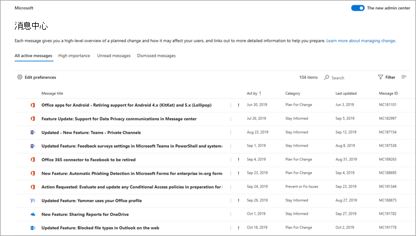
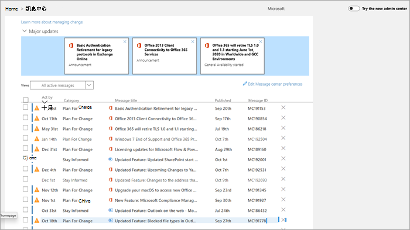

# 管理邮件中心中的邮件

消息中心发布是有关新功能和已更改功能的重要公告。 本文提供了有关您可以对邮件执行的操作的详细信息，以帮助您的组织中进行更改管理。
  
## 阅读邮件

若要转到 "信息中心"，请转到 "[管理中心](https://go.microsoft.com/fwlink/p/?linkid=2024339)"，然后选择 "**运行状况** > **消息中心**"。 

选择邮件标题以在阅读窗格中打开它。 每封邮件都包含更改的摘要、更改可能对您有何影响的说明、有关如何为更改准备组织的信息，以及（在大多数情况下），您可以在其中了解详细信息的其他信息链接。 其他信息仍然可用，即使在邮件过期后也是如此。

::: moniker range="o365-worldwide"
 
> [!NOTE]
> 如果未使用新的 Microsoft 365 管理中心，可通过选择“**试用新的管理中心**”切换按钮（位于主页顶部）将其打开。

::: moniker-end

## 筛选和排序

::: moniker range="o365-worldwide"

使用 "**筛选器**" 下拉菜单选择邮件的筛选视图。

您可以选择任何列标题以按升序或降序对邮件进行排序。 例如，在此图中，将**按日期对邮件进行排序**。

::: moniker-end

::: moniker range="o365-germany"

使用 "**视图**" 下拉菜单选择邮件的筛选视图。 
 
您可以选择任何列标题以按升序或降序对邮件进行排序。 例如，在此图中，邮件按日期对**行为**进行排序。

::: moniker-end

::: moniker range="o365-21vianet"

使用 "**视图**" 下拉菜单选择邮件的筛选视图。 
 
您可以选择任何列标题以按升序或降序对邮件进行排序。 例如，在此图中，邮件按日期对**行为**进行排序。

::: moniker-end

## 提供有关帖子的反馈

在邮件中心中，可以选择一条消息以查看详细信息。

如果要提供对邮件的反馈，请选择 "**喜欢**" 或 "不**喜欢**" 图标，并在出现的文本框中提供反馈。 请勿提供任何个人信息。 您可以选择 **"确定"，以便与我联系以了解此反馈**，然后选择 "**发送**"。

## 共享邮件

查看其他人需要操作的消息？ 您可以通过电子邮件与任何用户共享邮件的内容：
  
1. 选择要打开的邮件，然后选择 "**共享**"。
  
2. 若要共享邮件，请输入两个由冒号分隔的电子邮件地址。 您可以发送给个人和组电子邮件地址。 （可选）您可以选择通过电子邮件接收邮件的副本（邮件将转到 Office 365 中的主电子邮件地址），或添加个人邮件以提供具有更多上下文的收件人。
  
3. 选择 "**共享**" 以发送电子邮件。
    
## 获取链接

需要与另一位管理员进行跟进以确保他们了解更改并采取措施？ 您可以生成在电子邮件或即时消息中共享的链接，例如，它会将用户直接连接到该邮件。 您与之共享链接的用户必须是组织在 Office 365 中的管理员，否则他们将无法访问链接的邮件。

::: moniker range="o365-worldwide"

1. 选择邮件以将其打开。

2. 选择 "**将链接复制到剪贴板**（链接）" 图标。

3. 允许网页访问你的剪贴板。 将直接链接复制到剪贴板。

4. 使用 Ctrl + V 或右键单击并选择 "**粘贴**" 以插入链接。

::: moniker-end

::: moniker range="o365-germany"

1. 选择邮件以将其打开。

2. 从操作栏中选择 "**更多** \> **获取链接**"。

3. 允许网页访问你的剪贴板。 将直接链接复制到剪贴板。

4. 使用 Ctrl + V 或右键单击并选择 "**粘贴**" 以插入链接。

::: moniker-end

::: moniker range="o365-21vianet"

1. 选择邮件以将其打开。

2. 从操作栏中选择 "**更多** \> **获取链接**"。

3. 允许网页访问你的剪贴板。 将直接链接复制到剪贴板。

4. 使用 Ctrl + V 或右键单击并选择 "**粘贴**" 以插入链接。

::: moniker-end

## 已读和未读状态

未读邮件中心中的任何邮件都将以粗体显示。 打开邮件将其标记为已读。 您可以将邮件标记为 "未读"。

::: moniker range="o365-worldwide"

1. 在邮件中心的主页上，选择一封邮件。

2. 选择邮件顶部的 "**标记为未读**（信封）" 图标。
  
::: moniker-end

::: moniker range="o365-germany"

1. 选择邮件以将其打开。

2. 选择 "**更多** \> **标记为未读**"。

3. 关闭邮件。

::: moniker-end

::: moniker range="o365-21vianet"

1. 选择邮件以将其打开。

2. 选择 "**更多** \> **标记为未读**"。

3. 关闭邮件。

::: moniker-end

## 取消和还原

如果您看到一条不适合您的消息，或者您已对其进行处理，则可以关闭该消息以将其从 "消息中心" 视图中删除。 您在邮件中心中看到的视图特定于您的用户帐户，因此将其从视图中消除不会影响其他管理员。

::: moniker range="o365-worldwide"

- 在邮件中心的主页上，选择一封邮件，然后选择邮件列表上方的 "**放弃**"。

- 打开邮件，然后在邮件底部选择 "**取消**"。

是否需要重新获取已消除的邮件？ 没关系。
  
1. 选择邮件中心顶部的 "**消除的邮件**" 选项卡。 将显示已清除的邮件的列表。 

2. 选择 "邮件"，选择 "**还原**"，并将邮件还原到活动邮件中。

::: moniker-end

::: moniker range="o365-germany"

有两种方法可以消除邮件。
  
- 选择显示在邮件 ID 右侧的 X。 将从列表中删除该邮件。 或者，

- 打开邮件，然后选择邮件顶部的 "**取消**"。

是否需要重新获取已消除的邮件？ 没关系。
  
1. 从 "**视图**" 下拉菜单中选择 "**消除的邮件**" 筛选器。 将显示已清除的邮件的列表。

2. 选择邮件 ID 右侧的 "**还原**"，并将邮件还原为 "活动邮件"。

::: moniker-end

::: moniker range="o365-21vianet"

有两种方法可以消除邮件。
  
- 选择显示在邮件 ID 右侧的 X。 将从列表中删除该邮件。 或者，

- 打开邮件，然后选择邮件顶部的 "**取消**"。

是否需要重新获取已消除的邮件？ 没关系。
  
1. 从 "**视图**" 下拉菜单中选择 "**消除的邮件**" 筛选器。 将显示已清除的邮件的列表。

2. 选择邮件 ID 右侧的 "**还原**"，并将邮件还原为 "活动邮件"。

::: moniker-end

有关消息中心的概述，请参阅[在 Office 365 中的消息中心](message-center.md)。 或者，若要了解如何设置语言首选项以启用邮件中心的机器翻译，请参阅[邮件中心发布的语言翻译](language-translation-for-message-center-posts.md)。 如果您想要使用替代方法来获取实时服务运行状况信息和邮件中心通信，请参阅[Office 365 服务通信 API 概述](https://go.microsoft.com/fwlink/p/?linkid=848507)。
  
