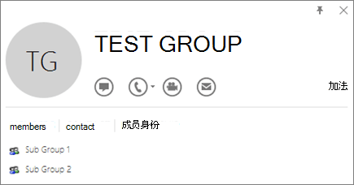
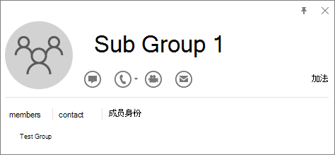

# 在集成Microsoft 365 应用版门户中测试并部署合作伙伴部署的应用

利用Microsoft 365 管理中心，你可以灵活地从单个位置部署单个应用商店应用、自定义业务线应用Microsoft 365合作伙伴应用。 可以在 Microsoft 管理中心设置中，在集成应用中访问该位置。 通过集成应用门户查找、测试和完全部署由 Microsoft 合作伙伴购买和许可的应用，可为组织保持业务服务的定期更新和高效运行带来便利和好处。

有关从组织的合作伙伴购买和Microsoft 365应用的其他信息，请参阅从 Microsoft 365 应用版 管理和部署[Microsoft 365 管理中心。](https://techcommunity.microsoft.com/t5/microsoft-365-blog/manage-and-deploy-microsoft-365-apps-from-the-microsoft-365/ba-p/1194324)

若要详细了解合作伙伴如何创建这些应用，请参阅如何为商业市场规划 [SaaS 产品](https://go.microsoft.com/fwlink/?linkid=2158277)

集成应用门户仅可供全局管理员访问，并且仅适用于全球客户。 此功能在自主云和政府云中不可用。

集成应用门户显示应用列表，其中包括单个应用Microsoft 365部署你的组织的合作伙伴提供的应用。 仅列出了 web SPFx、Office、Teams和外接程序。 对于 Web 应用，你可以看到两种类型的应用。

- SaaS 应用在 appsource.microsoft.com 中提供，并且由管理员代表组织同意部署。
- 与 Office 加载项链接的 SAML 库应用。

## 在集成应用门户中管理应用

你可以管理从合作伙伴处购买和Microsoft 365 应用版部署的测试和部署。

1. 在管理中心中，选择 **"设置"，** 然后选择"集成 **应用"。**

2. 选择"状态 **"** 为 **"更多应用"的应用，** 以打开 **"管理"** 窗格。 通过 **更多可用应用** 的状态，你可以知道来自 ISV 的更多集成尚未部署。

3. 在"**概述"选项卡** 上，选择"部署 **"。** 某些应用要求你先添加用户，然后才能选择部署。

4. 选择 **"用户**"，选择 **"这是测试部署**"，然后选择"整个组织 **"、"特定用户/组**"或"**只有我"。**  如果你想要等待将 **应用部署到** 整个组织，还可以选择测试部署。 特定用户或组可以是Microsoft 365组、安全组或通讯组。

5. 选择 **"更新**"，然后选择"**完成"。** 现在，可以在"概述"选项卡上选择"部署"。

6. 查看应用信息，然后选择部署 **。**

7. 在 **"** 部署已完成"页上选择"完成"，并查看"概述"选项卡上的测试或完整 **部署** 的详细信息。

8. 如果应用程序的状态为"更新挂起 **"，** 你可以单击该应用程序以打开"管理"窗格并更新应用程序。

## 查找已发布的应用以进行测试和完整部署

你可以查找、测试和完全部署未显示在"集成应用"页上的列表中的已发布应用。 通过从管理中心购买和许可应用，你可以从单个位置将 Microsoft 和 Microsoft 合作伙伴应用添加到你的列表中。

1. 在管理中心的左侧导航中，选择 **"设置"，** 然后选择"集成 <a href="https://go.microsoft.com/fwlink/p/?linkid=2125823" target="_blank">**应用"。**</a>

2. 选择 **"获取** 应用"，获取应用的视图。

3. On the **Microsoft 365 应用版** published apps page， select the app you want to deploy by choosing **Get it now**. 显示的应用主要是 Word、PowerPoint、Excel、Outlook 加载项、Teams 应用和 SharePoint 应用 (基于 SharePoint 框架 技术) 。 接受权限，然后选择"继续 **"。**

5. 选择 **页面** 顶部引用等待部署的消息旁边的"部署"。

    如果所选应用由 ISV 链接到 SaaS 产品/服务，则属于此链接优惠的所有其他应用将显示在"配置"页面上。 如果选择部署所有应用，请选择"下一 **步"。** 否则， **请选择"编辑**"，然后选择要部署的应用。 某些应用要求你先添加用户， **然后才能选择部署**。

6. 选择 **"添加用户"，** 选择 **"这是测试部署**"，然后选择 **"整个** 组织"或"**特定用户/组**"或"**只有我"。**

    特定用户/组可以是Microsoft 365组、安全组或分布式组。 如果你想要等待将 **应用部署到** 整个组织，还可以选择测试部署。

7. 选择 **"下** 一步"以进入 **"接受权限请求"** 页。 列出了每个应用的应用功能和权限。 如果应用需要同意，请选择 **"接受权限"。** 只有全局管理员可以同意。

8. 选择 **"下** 一步"查看部署，然后选择"**完成部署"。** You can view the deployment from the **Overview** tab by choosing **View this deployment**. 在Microsoft 365 管理中心中，你可以看到每个已部署应用的状态和部署应用的日期。

> [!NOTE]
> 如果应用以前从集成应用门户外的其他位置部署，则 **部署类型为****自定义。**

## 不支持的方案

对于以下方案，你无法从集成应用门户Microsoft 365 应用版部署单个应用商店应用或由合作伙伴部署。

- 同一外接程序链接到多个 SaaS 产品。
- SaaS 产品链接到加载项，但它不与 Microsoft Graph，也不提供 AAD 应用 ID。
- SaaS 产品链接到外接程序，但为 Microsoft Graph提供的 AAD 应用 ID 在多个 SaaS 产品/服务之间共享。

## Upload自定义业务线应用进行测试和完整部署

1. 在管理中心的左侧导航中，选择"设置"**集成****应用"。**

2. 选择 **Upload应用"。** 仅支持 Word、PowerPoint、Excel 和 Outlook 应用的自定义行。

3. Upload设备添加清单文件或添加 URL 链接。 某些应用要求你先添加用户，然后才能选择部署。

4. 选择 **"添加用户"，** 选择 **"这是测试部署**"，**然后选择"整个** 组织"或"**特定用户/组**"或"**只有我"。**

    特定用户/组可以是Microsoft 365组、安全组或分布式组。 如果你想要等待将 **应用** 部署到整个组织，还可以选择测试部署。

5. 选择 **"下** 一步"以进入 **"接受权限请求"** 页。 列出了应用的功能和权限。 如果应用需要同意，请选择 **"接受权限"。** 只有全局管理员可以同意。

6. 选择 **"下** 一步"查看部署，然后选择"**完成部署"。** You can view the deployment from the **Overview** tab by choosing **View this deployment**.

## 准备在集成应用中部署外接程序

Office加载项有助于个性化设置文档，并简化访问 Web 上信息 (请参阅开始使用 Office 加载项) 。 

外接程序具有以下优点： 

- 当相关Office应用程序启动时，外接程序将自动下载。 如果外接程序支持外接程序命令，则外接程序会自动显示在应用程序内的功能Office中。 

- 如果管理员关闭或删除外接程序，或者如果用户从 Azure Active Directory 或外接程序分配到的组中删除，则用户将不再显示外接程序。 

外接程序在三个桌面平台（如 Windows、Mac 和 Online Office支持。 它还在 iOS 和 Android (Outlook仅移动外接程序中) 。 

外接程序最多可能需要 24 小时才能显示给所有用户的客户端。 

现在Exchange管理员和全局管理员都可以从集成应用部署外接程序。   

### 准备工作

部署外接程序要求用户使用 Microsoft 365 企业版 许可证 (E3/E5/F3) 或 Microsoft 365 Business (Business Basic、Business Standard、Business 高级版) 。 用户还需要使用其组织 ID Office登录到) ，Exchange Online活动Exchange Online邮箱。 你的订阅目录必须位于 中，或联合到 Azure Active Directory。 

部署不支持以下内容： 

- 针对 Office 2013 中 Word、Excel 或 PowerPoint 的加载项 
- 本地目录服务 
- 部署到内部部署Exchange的外接程序部署 
- 部署组件对象模型 (COM) 或Visual Studio Tools for Office (VSTO) 加载项。 
- 不包含Microsoft 365的 Exchange Online（如 Microsoft 365 应用版 for Business 和 Microsoft 365 应用版 for Enterprise）。  

### Office要求 

对于 Word、Excel 和 PowerPoint 加载项，用户必须使用下列加载项之一： 
- 在 Windows 设备上，Microsoft 365 企业版 许可证版本 1704 或更高版本 (E3/E5/F3) 或 Microsoft 365 Business 许可证 (Business Basic、Business Standard、Business 高级版) 。 
- 在 Mac 版本 15.34 或更高版本上。 

对于Outlook，用户必须使用下列方法之一： 
- 版本 1701 或更高版本的 Microsoft 365 企业版 许可证 (E3/E5/F3) 或 Microsoft 365 Business (Business Basic、Business Standard、Business 高级版) 。 
- 2019 年 Office 专业增强版 2019 Office Standard 版本 1808 或更高版本。 
- MSI 版本 16.0.4494.1000 或更高版本Office 专业增强版 2016 (MSI) 或 Office 标准版 2016 (MSI) 。
    > [!NOTE]
    > MSI 版本的 Outlook在相应的"加载项"功能Outlook显示管理员安装的加载项，而不是"我的加载项"部分。  
- MSI 2013 或 Office Professional Plus 2013 版本 15.0.4937.1000 或更高版本 (MSI) 或 Office Standard 2013 (MSI) 。
- 版本 16.0.9318.1000 或更高版本Office 2016 for Mac。 
- 适用于 iOS 的移动版 2.75.0 Outlook更高版本。 
- Android 移动版 2.2.145 Outlook更高版本。 

### Exchange Online要求 
Microsoft Exchange 存储组织的租户中的加载项清单。 部署外接程序的管理员和接收这些外接程序的用户必须位于支持 OAuth 身份验证的 Exchange Online 版本上。 

请与组织的 Exchange 管理员联系，了解正在使用哪个配置。 可以使用 [Test-OAuthConnectivity](/powershell/module/exchange/test-oauthconnectivity)   PowerShell cmdlet 验证每个用户的 OAuth 连接。 

### 用户和组分配
外接程序部署当前受外接程序支持的大多数组Azure Active Directory，Microsoft 365组、通讯组列表和安全组。 部署支持顶级组或没有父组的组的用户，但支持嵌套组或具有父组的组的用户。 

> [!NOTE]
> 当前不支持未启用邮件的安全组。 

在下面的示例中，将 Sandra、Sheila 和 Sales Department 组分配给外接程序。 由于西海岸销售部门是嵌套组，赵强和熊飞未被分配加载项。 

### 找出一个组是否包含嵌套组

若要找出一个组是否包含嵌套组，最简单的方法是查看 Outlook 内的组联系人卡片。 如果在电子邮件的"到"字段中输入 **** 组名称，然后在解析时选择组名称，它将显示该组是否包含用户或   嵌套组。 在下面的示例中，"测试 **** 组"Outlook"联系人卡片的"成员"选项卡不会显示任何用户，而   只显示两个子组。 

可以解析某个组，查看该组是否是任何组的成员，从而进行反向查询。 在下面的示例中，可以在联系人卡片的"成员身份 <b></b>"选项卡Outlook子组 1 是测试组   的成员。 

请注意，可以使用 Azure Active Directory Graph API 运行查询以查找组内的组列表。 有关详细信息，请参阅对组 [和组|GraphAPI 参考](/previous-versions/azure/ad/graph/api/groups-operations)。 

## 部署 Office 加载项的推荐方法 
若要使用分阶段方法推出加载项，建议采用以下方法： 
1. 向小部分业务利益干系人和 IT 部门成员推出加载项。 你可以打开标志 **"这是否一个测试部署"。** 如果部署成功，请移至步骤 2。 

2. 向企业中的更多个人推出外接程序。 同样，评估结果，如果成功，则继续完整部署。 

3. 向所有用户执行全面推出。 关闭"这是否测试 **部署"中的标记**。 

根据目标访问群体的规模，可以添加或删除推出步骤。  

## 使用管理中心部署 Office 加载项 

1. 在管理中心中，选择 **"设置"，** 然后选择"**集成应用"。** 

2. 选择 **页面顶部的** "获取应用"。 AppSource 将采用嵌入格式加载。 搜索外接程序，或者通过单击左侧导航导航上的"产品"找到它。  如果外接程序已被 ISV 链接到 SaaS 应用或其他应用和外接程序，并且 SaaS 应用是付费应用，则将显示一个对话框，用于购买许可证或部署。 无论你是否已购买许可证，都可以继续部署。 选择“**部署**”。  

3. 你将看到" **配置"** 页，其中列出了所有应用。 如果你没有部署应用的权限或权限，将突出显示相应的信息。 可以选择要部署的应用。 通过选择 **"下** 一步"，你将查看 **"用户"** 页。 如果外接程序尚未由 ISV 链接，您将被路由到"用户"页面。 

4. 选择 **"每个人** **"、"** 特定用户/ **** 组"或"只有我"以指定外接程序   将部署到的用户。 使用"搜索"框查找特定用户或组。 如果要测试外接程序，请选择"**这是否测试部署"。** 

5. 选择“**下一步**”。 如果应用已认证，则所有应用功能和权限都显示在单个窗格中以及Microsoft 365信息。 选择认证徽标可使用户查看有关认证的更多详细信息。  

6. 查看，然后选择"完成 **部署"。**  

7. 部署外接程序时，将显示一个绿色"刻度线"图标。 按照页面上的说明测试外接程序。 

> [!NOTE]
> 用户可能需要重新启动Office，以查看应用程序功能区上的外接程序图标。 Outlook外接程序最多可能需要 24 小时才能显示在应用程序功能区上。 

最佳做法是通知用户和组已部署的外接程序可用。 请考虑发送描述何时以及如何使用外接程序的电子邮件。 包含或链接以帮助用户在加载项出现问题时可能帮助的内容或常见问题解答。 

## 为用户和组分配加载项时的注意事项 

全局管理员Exchange管理员可以将外接程序分配给每个人或特定用户和组。 每个选项都有含义： 

- **所有人**  此选项将外接程序分配给组织的每个用户。 请谨慎使用此选项，且仅应用于真正在组织中通用的加载项。 

- **用户**  如果将加载项分配给单个用户，然后将加载项部署到新用户，则必须先添加新用户。 

- **组**  如果将外接程序分配给组，则会自动为添加到该组的用户分配外接程序。 从组中删除用户时，用户将失去对外接程序的访问权限。 在任一情况下，管理员无需执行任何其他操作。 

- **只有我**  如果您仅将外接程序分配给自己，则仅将外接程序分配给您的帐户，这是测试外接程序的理想帐户。 

适合贵组织的选项取决于您的配置。 但是，我们建议使用组进行分配。 作为管理员，您可能会发现使用组并控制这些组的成员身份（而不是每次分配单个用户）可以更轻松地管理外接程序。 在某些情况下，您可能希望通过手动分配用户来向特定用户分配分配，从而限制对一小组用户的访问权限。 

### 有关Office加载项安全性 
Office 加载项结合了一个包含加载项相关元数据的 XML 清单文件，但最重要的是它指向包含所有代码和逻辑的 Web 应用程序。加载项的功能范围很广。例如，加载项可以：
- 显示数据。 
- 读取用户文档以提供上下文服务。 
- 从用户文档读取数据并向用户文档写入数据，以便向该用户提供价值。  

有关外接程序的类型和功能Office，请参阅 [Office 外接程序](/office/dev/add-ins/overview/office-add-ins)平台概述，尤其是"Office 外接程序剖析"一节。 

若要与用户文档进行交互，外接程序需要在清单中声明所需的权限。 五级 JavaScript API 访问权限模型为任务窗格加载项用户的隐私和安全性提供了基础。Office Store 中的大多数加载项都是 ReadWriteDocument 级别，几乎所有加载项都至少支持 ReadDocument 级别。 有关权限级别的详细信息，请参阅S [requesting permissions for API use in content and task pane add-ins。](/office/dev/add-ins/develop/requesting-permissions-for-api-use-in-content-and-task-pane-add-ins) 

更新清单时，通常更改加载项的图标和文本。有时会更改加载项命令。但是，不会更改加载项的权限。Web 应用程序（加载项的所有代码和逻辑在其中运行）可以随时更改，这是 Web 应用程序的特性。 

加载项更新的情况如下： 
- **业务线** 外接程序：在这种情况下，如果管理员显式上载了清单，则外接程序要求管理员上载新的清单文件以支持元数据更改。 相关 Office 应用程序下次启动时，该加载项会更新。 Web 应用程序可以随时更改。 

- **Office** 应用商店外接程序：当管理员从 Office 应用商店选择外接程序时，如果 Office 应用商店中的外接程序更新，则下次相关 Office 应用程序启动时，外接程序将更新。 Web 应用程序可以随时更改。 

> [!NOTE]
> 对于 Word、Excel 和 PowerPoint 使用 [SharePoint](https://dev.office.com/docs/add-ins/publish/publish-task-pane-and-content-add-ins-to-an-add-in-catalog)应用程序目录向本地环境中的用户部署外接程序，无需连接到 Microsoft 365 和/或支持   所需的 SharePoint 外接程序。 For Outlook use Exchange control panel to deploy in an on-premises environment without a connection to Microsoft 365.  

## 加载项状态
加载项可以"开"或"关 ****    **"**   状态。 

| 状态 | 此状态如何出现 | 影响 |
|:-----|:-----|:-----|
|**活动**    |管理员已上载外接程序并将其分配给用户或组。    |分配了加载项的用户和组可在相关客户端中看到它。    |
|**已禁用**    |管理员已禁用加载项。    |分配了外接程序的用户和组无法再访问它。    如果外接程序的状态更改为"可用"，则用户和组将再次有权访问它。    |
|**已删除**    |管理员已删除加载项。    |分配了加载项的用户和组无法再访问它。    |
 
如果没有人再使用加载项，请考虑将其删除。 例如，如果外接程序仅在一年的特定时间使用，则关闭外接程序可能有意义。 

## 使用Office管理中心管理加载项

部署后，管理员还可以管理用户对外接程序的访问权限。 

1. 在管理中心中，选择 **"设置"，** 然后选择"**集成应用"。** 
2. 在"集成应用"页面上，它将显示应用列表，这些应用可能是单个加载项，或者是已与其他应用链接的加载项。 
3. 选择"状态 **"**   为 **"更多可用应用"的应用**   以打开 **"管理"**   窗格。 通过 **更多可用应用** 的状态，你可以知道来自 ISV 的更多集成   尚未部署。 
4. 在" **概述"选项卡**   上，选择"部署 **"。** 某些应用要求你先添加用户，然后才能选择部署。 
5. 选择 **"用户**"，选择 **"这是测试部署**"， **然后选择"整个** 组织"、" **特定用户/组**"   或" **只有我"。** 如果你想要 **等待将应用** 部署到整个组织，也可以选择测试   部署。 特定用户或组可以是Microsoft 365组、安全组或通讯组。 
6. 选择  **"更新**   "，然后选择"完成 **"。** 现在，可以在"概述 **"选项卡** 上选择" **部署** "。 
7. 查看应用信息，然后选择部署 **。**
8. 选择 **"** 部署已完成"页上的"完成"，然后查看"概述"选项卡上的测试或   完整 **部署**   的详细信息。 
9. 如果应用程序的状态为"更新挂起  **"，** 你可以单击该应用程序以打开"管理 **"窗格并** 更新应用程序。 
10. 若要仅更新用户，请选择" **用户"** 选项卡，然后进行相应的更改。 进行更改 **后** ，选择"更新"。  

## 删除加载项

您还可以删除已部署的外接程序。

1. 在管理中心中，选择 **"设置"，** 然后选择"**集成应用"。**
2. 选择任意行以显示管理窗格。 
3. 选择" **配置"** 选项卡。 
4. 选择要删除的外接程序，然后选择"删除 **"。**  

> [!NOTE]
>  如果加载项已由另一个管理员部署，则"删除"按钮将被禁用。 只有已部署应用的管理员或全局管理员才能删除加载项。

## 管理员Exchange加载项的方案 

有两种情况Exchange管理员无法部署外接程序：
- 如果加载项需要 MS 权限Graph API，并且需要获得全局管理员同意。
- 如果外接程序链接到两个或多个外接程序和 webapp，并且至少有一个外接程序由另一个管理员 (exchange/global) 部署，并且用户分配不统一。 只有当所有已部署的应用的用户分配相同时，我们才允许部署外接程序。  

## 常见问题解答

### 我需要哪个管理员角色才能访问集成应用？

只有全局管理员可以访问集成应用。 集成应用不会在其他管理员的左侧导航中显示。

### 为什么在"设置"而非"集成应用"下的左侧导航中会看到外接程序？

可能有几个原因：

- 登录的管理员是Exchange管理员。
- 客户位于独立云中，集成应用体验还可供独立云客户使用。

### 可以从集成应用部署哪些应用？

集成应用允许部署 Web 应用、Teams 应用、Excel、PowerPoint、Word、Outlook 加载项SPFx应用程序。 对于外接程序，集成应用支持部署到Exchange邮箱，而不是本地Exchange邮箱。

### 管理员能否删除或删除应用？

是。 全局管理员可以删除或删除应用。

- 从列表视图中选择应用。 在" **配置"** 选项卡上，选择要删除的应用。  

### 集成应用在自主云中是否可用？

不需要。 集成应用对独立云客户不可用。

### 集成应用在政府云中是否可用？

不需要。 集成应用不适用于政府云客户。
