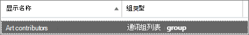
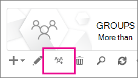

# <a name="upgrade-distribution-lists-to-microsoft-365-groups-in-outlook"></a>在 Outlook 中将通讯组列表升级为 Microsoft 365 组

可以将通讯组列表升级到Microsoft 365组Outlook。 这是为组织的通讯组列表提供组组的所有特性Microsoft 365一种方法。 [为什么应将通讯组列表升级至 Outlook 中的组](https://support.microsoft.com/office/7fb3d880-593b-4909-aafa-950dd50ce188)

可以一次升级一个 DLL，也可以同时升级多个 DLS。

## <a name="upgrade-one-or-many-distribution-list-groups-to-microsoft-365-groups-in-outlook"></a>将一个或多个通讯组列表组升级到Microsoft 365组Outlook

您必须是全局管理员或Exchange才能升级通讯组列表组。 若要升级到Microsoft 365组，通讯组列表组必须具有具有邮箱的所有者。

### <a name="use-the-new-eac-to-upgrade-one-or-many-distribution-list-groups-to-microsoft-365-groups-in-outlook"></a>使用新的 EAC 将一个或多个通讯组列表组升级到Microsoft 365组Outlook

1. 转到"收件人Exchange组的新>**管理中心** \> <a href="https://go.microsoft.com/fwlink/?linkid=2183233" target="_blank">"</a> 。

2. Select the distribution list group (also called a **distribution group**) that you want to upgrade to Microsoft 365 group from the **Groups** page.

3. 从 **工具栏中选择"升级** 通讯组"。

4. 在"准备升级 **？"对话框中，单击**"升级 **"**。 该过程立即开始。 根据要升级的通讯组列表组的大小和数量，此过程可能需要几分钟或数小时。

> [!NOTE]
> 顶部的横幅表示升级，例如，通讯组 (*升级) 通讯组。需要 5 分钟才能反映更改。按Microsoft 365组筛选，以查看已升级 ()*。

### <a name="use-the-classic-eac-to-upgrade-one-or-many-distribution-list-groups-to-microsoft-365-groups-in-outlook"></a>使用经典 EAC 将一个或多个通讯组列表组升级到Microsoft 365组Outlook

1. 转到收件人Exchange管理>**中心** \> <a href="https://go.microsoft.com/fwlink/?linkid=2183233" target="_blank">**。**</a><br/>你将看到一条通知，指示你拥有一些 (也称为"通讯组) 有资格升级到"Microsoft 365组"。<br/> 

1. Select one or more distribution lists (called a **distribution group)** from the **groups** page.<br/>

1. 选择升级图标。<br/>

1. 在信息对话框中，选择 **"是** "以确认升级。 该过程立即开始。 根据您升级的 DLL 的大小和数量，此过程可能需要几分钟或数小时。<br/>如果通讯组列表无法升级，则会出现一个对话框，显示此对话框。 请参阅 [哪些通讯组列表无法升级？](#which-distribution-lists-cant-be-upgraded)。

1. 如果要升级多个通讯组列表，请使用下拉列表筛选已升级的通讯组列表。 如果列表不完整，请稍等一会，然后选择"刷新"以查看已成功升级哪些项。<br/>不会发出通知，告知您所选所有 DLL 的升级过程何时完成。 您可以通过查看"可用于升级或升级的 DLL"下列出的 **项来****了解这一点**。

1. 如果选择 DL 进行升级，但仍在页面上显示"可供升级"，则升级失败。 请参阅 [升级不起作用时要执行哪些操作](#what-to-do-if-the-upgrade-doesnt-work)。

> [!NOTE]
> 如果您收到组摘要电子邮件，您可能会在底部注意到，有时它将提供，用于升级您作为所有者的任何符合条件的通讯组列表。 有关[摘要电子邮件Outlook](https://support.microsoft.com/office/a0482e24-a769-4e39-a5ba-a7c56e828b22)请参阅在电子邮件中设置群组对话。

## <a name="what-to-do-if-the-upgrade-doesnt-work"></a>升级不起作用时要执行哪些操作

无法升级的通讯组列表保持不变。

如果一个或多个 **符合条件的通讯** 组列表无法升级， 

1. 使用此[脚本](https://aka.ms/DLToM365Group)可扫描可能阻止通讯组列表升级到 Microsoft 365 组的问题，修复脚本报告的任何问题，并再次尝试升级通讯组列表。 

2. 如果上述脚本没有帮助或问题仍然存在，请打开支持 [票证](../../business-video/get-help-support.md)。 需要将问题上报给组工程团队，让他们找出问题。

## <a name="how-to-use-powershell-to-upgrade-several-distribution-lists-at-the-same-time"></a>如何使用 PowerShell 同时升级多个通讯组列表

如果你在使用 PowerShell 方面有经验的，你可能希望转到此路由，而不是使用 UI。 我们有一组 cmdlet，可帮助您升级通讯组列表。 请参阅下文。

### <a name="upgrade-a-single-dl"></a>升级单个 DL

若要升级单个 DL，请运行以下命令：

```PowerShell
Upgrade-DistributionGroup -DlIdentities <Dl SMTP address>
```

例如，如果要升级 SMTP 地址为 dl1@contoso.com，请运行以下命令：

```PowerShell
Upgrade-DistributionGroup -DlIdentities dl1@contoso.com
```

> [!NOTE]
> 您还可以使用 [New-UnifiedGroup](/powershell/module/exchange/new-unifiedgroup) PowerShell cmdlet 将单个通讯组列表Microsoft 365组

### <a name="upgrade-multiple-dls-in-a-batch"></a>在一个批次中升级多个 DLL

还可以将多个 DLL 作为批处理传递，并一起升级它们：

```PowerShell
Upgrade-DistributionGroup -DlIdentities <DL SMTP address1>, <DL SMTP address2>,
<DL SMTP address3>, <DL SMTP address4>
```

例如，如果要升级五个 SMTP 地址为 、、 和 的 DLL `dl1@contoso.com` `dl4@contoso.com` `dl2@contoso.com``dl3@contoso.com``dl5@contoso.com`，请运行以下命令：

`Upgrade-DistributionGroup -DlIdentities dl1@contoso.com, dl2@contoso.com, dl3@contoso.com, dl4@contoso.com, dl5@contoso.com`

### <a name="upgrade-all-eligible-dls"></a>升级所有符合条件的 DLL

有两种方法可以升级所有符合条件的 DLL。

> [!NOTE]
> Upgrade-DistributionGroup cmdlet 不会从管道接收数据，因此，需要使用"foreach-object{}"运算符才能成功运行。

1. 获取租户中符合条件的 DLL，然后使用升级命令升级它们：

```PowerShell
Get-EligibleDistributionGroupForMigration | Foreach-Object{
    Upgrade-DistributionGroup -DlIdentities $_.PrimarySMTPAddress
}
```

2. 获取所有 DLL 的列表，并仅升级符合条件的 DLL：

```PowerShell
Get-DistributionGroup| Foreach-Object{
    Upgrade-DistributionGroup -DlIdentities $_.PrimarySMTPAddress
}
```

## <a name="faq-about-upgrading-distribution-lists-to-microsoft-365-groups-in-outlook"></a>有关将通讯组列表升级到 Microsoft 365 组的常见问题Outlook

### <a name="which-distribution-lists-cant-be-upgraded"></a>哪些通讯组列表无法升级？

只能升级云托管的简单非嵌套通讯组列表。 下表列出了无法升级 **的** 通讯组列表。

|**属性**|**符合条件的？**|
|:-----|:-----|
|本地托管通讯组列表。  <br/> |否  <br/> |
|嵌套通讯组列表。 通讯组列表有子组，或者是另一个组的成员。  <br/> |否  <br/> |
|具有成员 **RecipientTypeDetails** 而非 **UserMailbox**、 **SharedMailbox**、 **TeamMailbox**、 **MailUser 的通讯组列表**  <br/> |否  <br/> |
|拥有 100 多个所有者的通讯组列表  <br/> |否  <br/> |
|仅包含成员但没有所有者的通讯组列表  <br/> |否  <br/> |
|别名包含特殊字符的通讯组列表  <br/> |否  <br/> |
|如果通讯组列表配置为共享邮箱的转发地址  <br/> |否  <br/> |
|如果 DL 是其他 DL **中的发件人限制** 的一部分。  <br/> |否  <br/> |
|安全组  <br/> |否  <br/> |
|动态通讯组列表  <br/> |否  <br/> |
|已转换为 **RoomLists 的通讯组列表**  <br/> |否  <br/> |

### <a name="check-which-dls-are-eligible-for-upgrade"></a>检查哪些 DLL 有资格升级

如果要检查 DL 是否符合条件，可以运行以下命令：

`Get-DistributionGroup <DL SMTP address> | Get-EligibleDistributionGroupForMigration`

如果要检查哪些 DLL 符合升级条件，只需运行以下命令：

`Get-EligibleDistributionGroupForMigration`

### <a name="who-can-run-the-upgrade-scripts"></a>Who可以运行升级脚本吗？

具有全局管理员或Exchange管理员权限的用户。

### <a name="why-is-the-contact-card-still-showing-a-distribution-list-what-should-i-do-to-prevent-an-upgraded-distribution-list-from-showing-up-in-my-auto-suggest-list"></a>为什么联系人卡片仍显示通讯组列表？ 我应该如何阻止升级的通讯组列表显示在我的自动建议列表中？

- 例如Outlook：当有人尝试在 Outlook 中通过迁移后键入 Microsoft 365 组名称来发送电子邮件时，收件人将解析为通讯组列表而不是组。 收件人的联系人卡片将是通讯组列表联系人卡片。 这是因为收件人缓存或名称缓存位于Outlook。 电子邮件将成功发送到组，但可能会导致发件人混淆。<br/>可以执行本文中有关自动完成Outlook[重置](/outlook/troubleshoot/contacts/information-about-the-outlook-autocomplete-list)缓存的信息中的步骤，这将修复此问题。

- 例如Outlook 网页版：如果Outlook 网页版，通讯组列表收件人仍将保留在缓存中。 你可以按照从自动完成列表中[](https://support.microsoft.com/office/9E1419D9-E88F-445B-B07F-F558B8A37C58)删除建议的名称或电子邮件地址中的步骤刷新缓存以查看组联系人卡片。

### <a name="do-new-group-members-get-a-welcome-email-in-their-inbox"></a>新组的成员是否收到收件箱中的欢迎电子邮件？

否。 默认情况下，启用欢迎消息的设置设置为 false。 此设置会影响在迁移完成后可加入的现有和新的组的成员。 如果组所有者稍后允许来宾用户，则来宾用户不会在收件箱中收到欢迎电子邮件。 来宾成员可以继续使用组。

### <a name="what-if-one-or-some-of-the-dls-are-not-upgraded"></a>如果未升级一个或多个 DLL，将如何？

在某些情况下，虽然 DL 符合条件，但无法升级。 DL 不会升级，仍保持为 DL。

- 如果 **管理员为组织中** 各组应用了组电子邮件地址策略，并且他们尝试升级不满足条件的 DLL，则 DLL 将不会升级

- **MemberJoinRestriction 或** **MemberDepartRestriction** 设置为 **Closed** 的 DLL 无法升级

- 使用Microsoft 365中的步骤，仅允许少数用户[创建组。](/microsoft-365/solutions/manage-creation-of-groups) 在这种情况下，如果不允许通讯组列表的所有者创建Microsoft 365组，则通讯组列表将不会升级到 Microsoft 365 组。 解决方法：对以上方案使用以下解决方法之一：
1)  确保允许作为 DL 所有者提及的所有用户创建 M365 组，即是允许 M365 组使用的安全组的成员。
或
2)  暂时将不允许创建 M365 组的 DL 的所有者替换为允许创建 M365 组的用户

### <a name="what-happens-to-the-dl-if-the-upgrade-from-eac-fails"></a>如果从 EAC 升级失败，DL 会发生什么情况？

只有在将呼叫提交到服务器时，才能进行升级。 如果升级失败，DLL 将保持不变。 他们将像以前一样工作。

### <a name="what-happens-to-message-approval-moderation-settings-on-distribution-groups-after-upgrading"></a>升级后，通讯 (对) 邮件审批和审核设置会发生什么情况？

邮件审批 (将) 组升级到通讯组后继续正常工作，Microsoft 365组。

## <a name="related-content"></a>相关内容

[比较组](../create-groups/compare-groups.md) (文章) \
[向Microsoft 365解释组 (](../create-groups/explain-groups-knowledge-worker.md)文章) \
[使用管理中心在Microsoft 365组中添加或删除成员](../create-groups/add-or-remove-members-from-groups.md)
