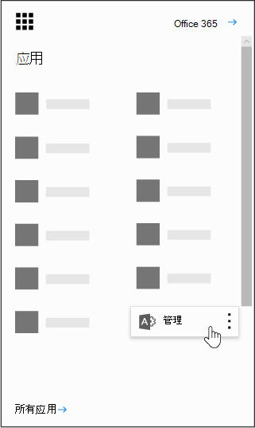

# 您的组织中的 Power BI

本页面介绍组织中的用户可以如何使用 Power BI，以及您可以如何控制组织获取此服务的方式。

## 什么是 Power BI？

Microsoft Power BI 使用户能够以全新的直观方法可视化数据、共享发现、开展协作。 若要了解详细信息，请参阅 [Power BI 网站](https://powerbi.microsoft.com/en-us/)。
  
## 是否Power BI符合国家、区域和行业特定的合规性要求？

若要了解有关合规性Power BI，请参阅[Microsoft 信任中心](https://go.microsoft.com/fwlink/?LinkId=785324)。
  
## 用户如何注册 Power BI？

作为管理员，您可以通过 Power BI 网站注册Power BI[应用程序](https://powerbi.microsoft.com/en-us/)。 您还可以通过 Microsoft 365 管理中心 上的"购买服务"页进行注册。 当管理员注册订阅Power BI，他们可以将用户订阅许可证分配给应具有访问权限的用户。
  
此外，您的组织中的个人用户可以通过 [Power BI 网站](https://powerbi.microsoft.com/en-us/)注册 Power BI。 当您的组织中的用户注册 Power BI 时，将自动为该用户分配 Power BI 许可证。
  
## 我的组织内的个人用户如何注册？

有三种方案可能适用于您的组织内的用户：
  
### 方案 1：你的组织已有Microsoft 365环境，注册此环境Power BI已拥有Microsoft 365帐户。

在此方案中，如果用户已经在租户（例如，contoso.com）中拥有工作或学校帐户但没有 Power BI，Microsoft 只会为该帐户激活计划，系统将自动通知用户如何使用 Power BI 服务。
  
### 方案 2：组织具有现有Microsoft 365环境，并且注册 Power BI的用户没有Microsoft 365帐户。

在此方案中，用户在组织的域域中具有电子邮件地址 (例如，contoso.com) 但没有 Microsoft 365 帐户。 在这种情况下，用户可以注册 Power BI，并将自动获得帐户。 这使用户能够访问 Power BI 服务。 例如，如果名为 Nancy 的员工使用她的工作电子邮件地址 (例如 Nancy@contoso.com) 注册，Microsoft 将自动将 Nancy 添加为 Contoso Microsoft 365 环境中的用户，并激活该帐户的 Power BI。
  
### 方案 3：您的组织没有连接到Microsoft 365域的邮箱环境。

贵组织无需执行任何管理操作来利用Power BI。
  
> [!IMPORTANT]
> 如果您的组织具有多个电子邮件域，并且您喜欢所有电子邮件地址扩展名都在同一租户中，则在任何用户创建主租户之前，先向该租户添加所有电子邮件地址域，然后再创建主租户。 创建用户后，没有自动机制跨租户移动用户。 有关此过程详细信息，请参阅本文稍后介绍的"如果我有多个域，我能否控制用户添加到的租户[？"](#if-i-have-multiple-domains-can-i-control-the-tenant-that-users-are-added-to)和"将域添加到 Office 365 [Online"。](../setup/add-domain.md)
  
## 这将如何更改我目前管理组织中用户的身份的方式？

如果组织已有现有Microsoft 365，并且组织中所有用户均拥有Microsoft 365帐户，则身份管理不会更改。
  
如果组织已有 Microsoft 365 环境，但并非组织中所有用户都有 Microsoft 365 帐户，我们将在租户中创建用户，并基于用户的工作或学校电子邮件地址分配许可证。 这意味着，您在任何特定时间管理的用户数量将随着您的组织内的用户注册服务而增长。
  
如果您是在本地管理目录并使用 Active Directory 联合身份验证服务 (AD FS)，Microsoft 不会将用户添加到您的租户，并且任何尝试加入您的租户的用户将收到一条消息，指示他们联系其组织的管理员。
  
如果你的组织没有连接到Microsoft 365域的邮箱环境，则管理标识不会发生变化。 用户将被添加到新的仅限云用户目录，您可以选择作为租户管理员接管并管理他们。
  
## 管理 Microsoft 为我的用户创建的租户应遵循什么过程？

如果租户是由 Microsoft 创建的，您可以通过执行下列步骤来申请和管理该租户：
  
1. 通过使用与您要管理的租户域相匹配的电子邮件地址域[注册 Power BI](https://go.microsoft.com/fwlink/?LinkId=522448) 来加入租户。例如，如果 Microsoft 创建了 contoso.edu 租户，那么您需要使用以 @contoso.edu 结尾的电子邮件地址加入租户。

1. 通过验证域所有权来申请管理员控制：一旦您位于租户中，您可以通过验证域所有权来将自己提升为管理员角色。为此，请执行以下步骤：

::: moniker range="o365-worldwide"

3. 转到 <a href="https://admin.microsoft.com" target="_blank">https://admin.microsoft.com</a>。

::: moniker-end

::: moniker range="o365-21vianet"

3. 转到 <a href="https://portal.partner.microsoftonline.cn" target="_blank">https://portal.partner.microsoftonline.cn</a>。

::: moniker-end

4. 选择左上角的应用启动器图标，然后选择“**管理员**”。

    
  
5. 阅读成为管理员 **页面上** 的说明，然后选择是 **，我想成为管理员**。

    > [!NOTE]
    >  如果未显示此选项，则已有管理员。
  
## 如果我有多个域，我能否控制将用户添加到的租户？

如果您不执行任何操作，则将为每个用户电子邮件域和子域创建一个租户。
  
如果您希望所有用户都位于同一个租户中，而不考虑其电子邮件地址扩展名：
  
- 事先创建一个目标租户或使用现有租户，并添加希望在该租户中整合的所有现有域和子域。然后，电子邮件地址以这些域和子域结尾的所有用户在注册时将自动加入目标租户。

> [!IMPORTANT]
> 创建用户后，不提供在租户中移动用户的受支持的自动化机制。 若要了解如何向单个租户Microsoft 365域，请参阅将域[添加到Office 365。](../setup/add-domain.md)

> [!IMPORTANT]
> 有关管理租户的信息和指导，请参阅什么是Power BI[管理？。](/power-bi/service-admin-administering-power-bi-in-your-organization)
  
## 如何阻止用户加入我的现有租户？

作为管理员，你可以采取一些步骤来防止用户加入现有租户。 如果阻止用户加入租户，则用户登录尝试将失败，并且将被定向到联系其组织的管理员。如果在 (之前已禁用自动许可证分发，则无需重复此过程Office 365 教育版学生、教职员工和教职员工) 。
  
以下步骤需要使用 Windows PowerShell。要开始使用 Windows PowerShell，请参阅 [PowerShell 入门指南](/powershell/scripting/overview)。
  
若要执行以下步骤，必须安装最新版本的[Azure Active Directory V2 PowerShell 模块](https://www.powershellgallery.com/packages/AzureADPreview/2.0.2.5)。
  
单击该链接后，选择 **“运行”** 以运行安装程序包。
  
**禁用自动租户加入**：使用此 Windows PowerShell 命令可防止新用户加入托管租户：
  
要禁用新用户的自动租户加入，请执行下列操作： `Set-MsolCompanySettings -AllowEmailVerifiedUsers $false`
  
要启用新用户的自动租户加入，请执行下列操作： `Set-MsolCompanySettings -AllowEmailVerifiedUsers $true`
  
> [!NOTE]
> 此阻止可防止组织中新用户注册Power BI。 在禁用组织的新Power BI注册之前注册用户仍将保留其许可证。 请参阅[如何删除Power BI用户的访问权限？，](#how-do-i-remove-power-bi-for-users-that-already-signed-up)了解如何为之前已注册服务的用户删除对 Power BI 的访问权限。
  
## 如何允许用户加入我的现有租户？

若要允许用户加入你的租户，请运行相反的命令，如上面的问题中所述：  `Set-MsolCompanySettings -AllowEmailVerifiedUsers $true`
  
## 如何验证是否在租户中设置了阻止？

使用下列 PowerShell 脚本： `Get-MsolCompanyInformation | fl allow*`
  
## 如何防止现有用户开始使用 Power BI？

**禁用自动许可证分发：** 使用此 Windows PowerShell 脚本可禁用现有用户的自动许可证分发。 如果在 (之前已禁用自动许可证分发，则无需重复此过程Office 365 教育版学生、教职员工和教职员工) 。
  
要禁用现有用户的自动许可证分发，请执行下列操作： `Set-MsolCompanySettings -AllowAdHocSubscriptions $false`
  
要启用现有用户的自动许可证分发，请执行下列操作： `Set-MsolCompanySettings -AllowAdHocSubscriptions $true`
  
> [!NOTE]
> *AllowAdHocSubscriptions* 标志用于控制组织中多个用户功能，包括用户注册 Azure 权限管理服务的功能。 更改此标志将影响所有这些功能。
  
## 如何允许我的现有用户注册 Power BI？

若要允许你的现有用户注册 Power BI，请运行相反命令，如上面的问题中所述：  `Set-MsolCompanySettings -AllowAdHocSubscriptions $true`
  
## 如何为已注册的用户删除 Power BI？

如果用户注册了 Power BI，但您不再希望他们有权访问 Power BI，您可以删除该用户Power BI许可证。
  
::: moniker range="o365-worldwide"

1. 在管理中心，转到“**用户**\><a href="https://go.microsoft.com/fwlink/p/?linkid=834822" target="_blank">活动用户</a>”页面。

::: moniker-end

::: moniker range="o365-21vianet"

 1. 在管理中心，转到“**用户**\><a href="https://go.microsoft.com/fwlink/p/?linkid=850628" target="_blank">活动用户</a>”页面。

::: moniker-end

2. 查找要删除其许可证的用户，然后选择其名称。

3. 在"**许可证和应用"** 选项卡上，清除 **"Microsoft Power BI"** 复选框。

4. 选择“**保存更改**”。

## 我如何知道新用户何时加入我的租户？

作为此计划的一部分加入您的租户的用户将被分配一个唯一许可证，您可以在管理仪表板的活动用户窗格中对其进行筛选。
  
若要创建新视图，在管理中心，请按照创建自定义用户视图中 [的步骤操作](../add-users/create-edit-or-delete-a-custom-user-view.md#create-a-custom-user-view)。 在 **"分配的产品许可证"下**，选择 **"Microsoft Power BI"。** 创建新视图后，你将能够查看租户中已注册此计划的所有用户。
  
## 我应准备其他任何内容吗？

你可能会遭遇密码重置请求不断增加的情形。有关此过程的信息，请参阅[重置用户密码](../add-users/reset-passwords.md)。
  
可以通过管理中心中的标准流程从租户中删除用户。 但是，如果用户仍使用您的组织中的活动电子邮件地址，则除非您阻止所有用户加入，否则他们仍能重新加入。
  
## 为什么在我的租户中显示 100 万个 microsoft Power BI许可证？

作为一个合格的组织，您组织中的用户有资格使用 Microsoft Power BI 服务，这些许可证代表您的租户中新的 Power BI 用户的可用容量。 这些许可证是免费的。 如果你已选择允许用户自行注册Power BI，当他们完成注册过程时，他们将被分配其中一个可用的免费许可证。 您还可以选择通过管理中心向用户自己分配这些许可证。
  
## 这是免费的吗？ 我应支付这些许可证的费用吗？

这些许可证适用于 Power BI 的免费版本。 如果你希望了解其他功能，请查看 Power BI Pro 版本。
  
## 为什么有一百万个许可证？

我们选择了一个足够大的数量，以便大多数组织有足够的许可证来向用户提供此权益，而不会延迟。
  
## 如果需要一百万个以上的许可证，该怎么办？

如果需要获取附加许可证，请与您的 Microsoft 客户代表联系以了解更多信息。